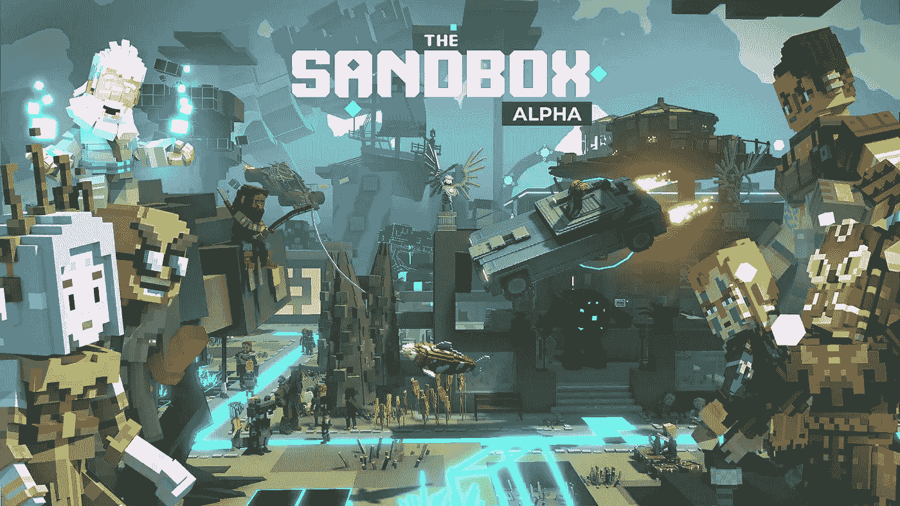
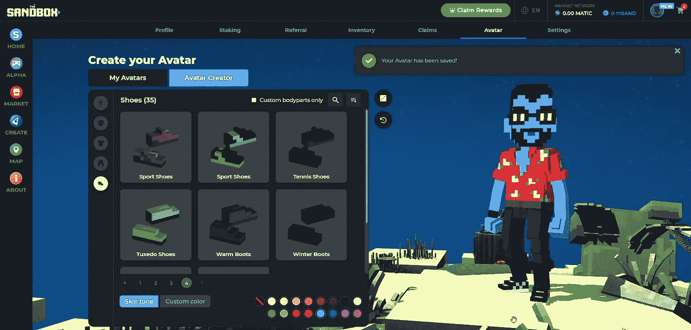
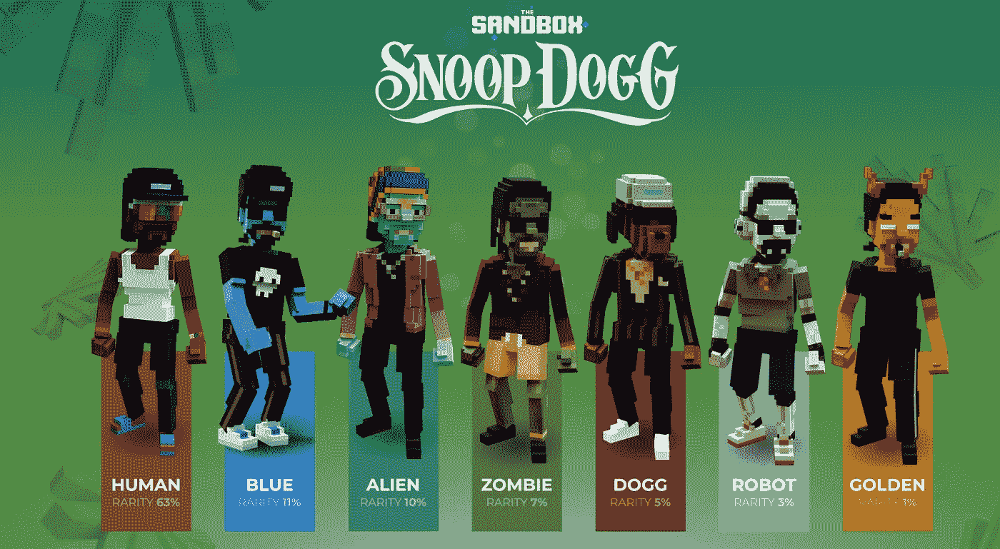
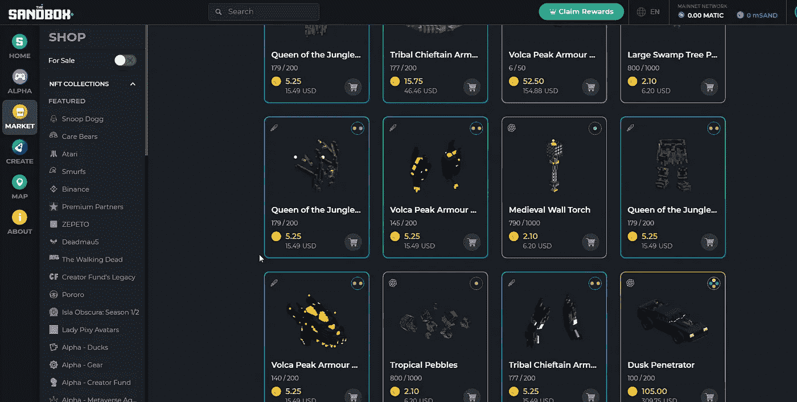
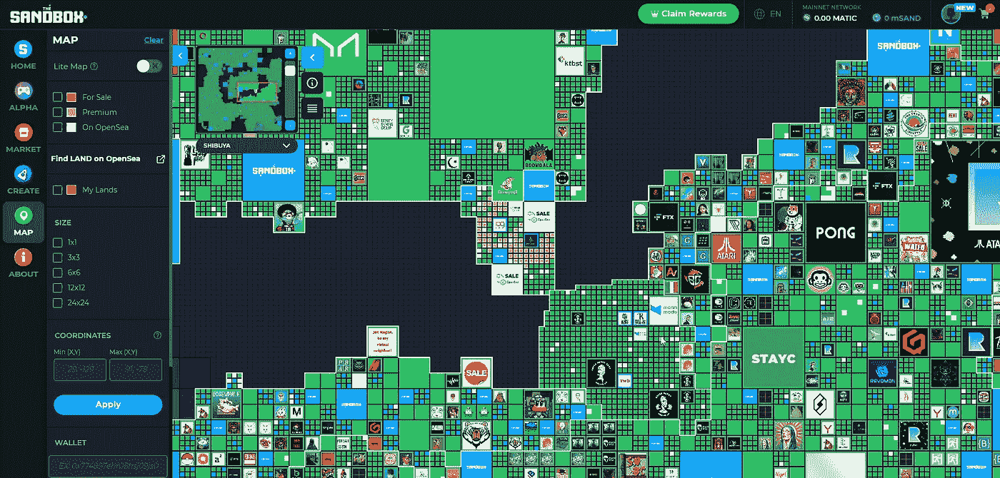
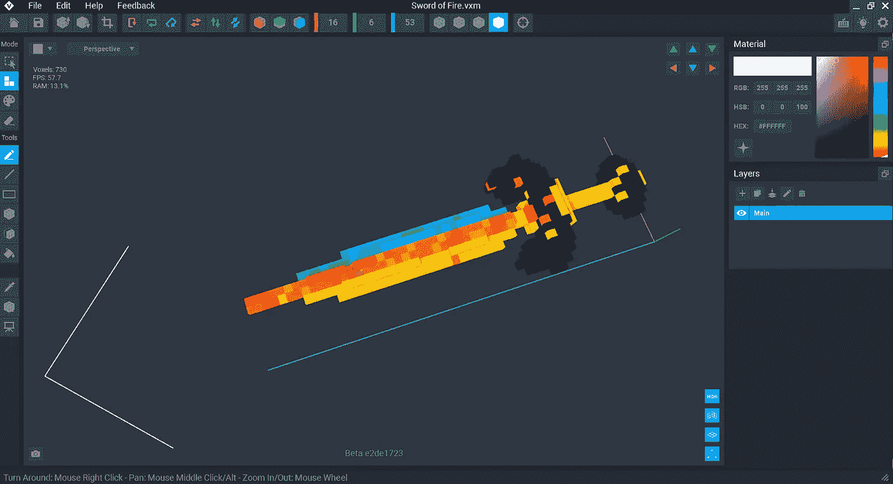
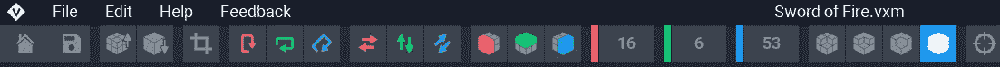
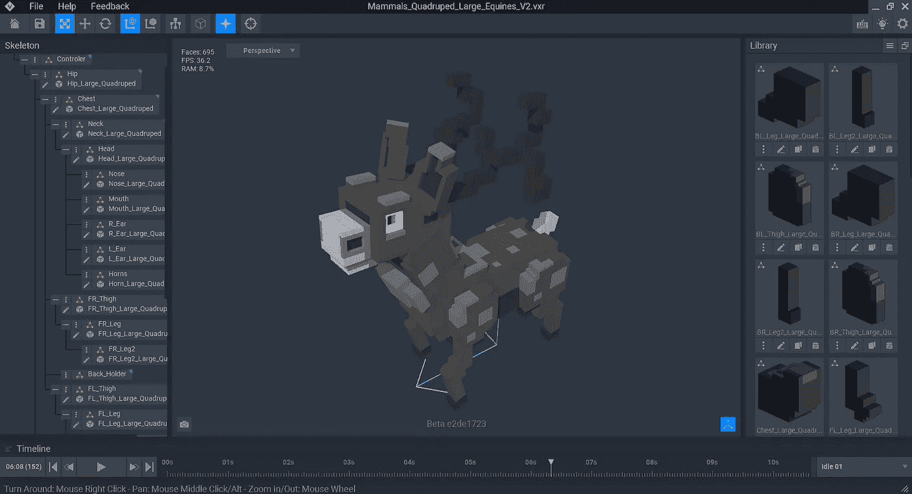
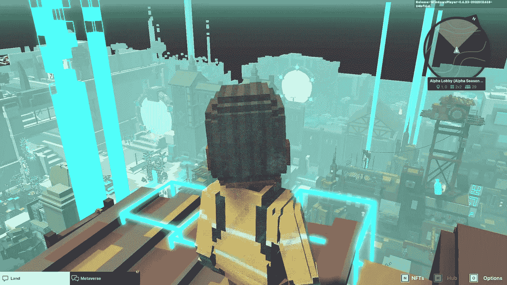

# 沙盒游戏赚取元宇宙区块链游戏-创建，玩，投资(初学者指南)

> 原文：<https://medium.com/coinmonks/the-sandbox-play-to-earn-metaverse-blockchain-game-create-play-invest-beginners-guide-2867f9ca2901?source=collection_archive---------15----------------------->

## 沙盒是一个社区驱动的元宇宙，允许玩家赚取和创作者货币化 3D 体素模型(资产)和他们在区块链上的独特游戏体验。

The Sandbox Game Maker — Screenshot

沙盒是一个虚拟的([元宇宙](https://www.mugabiimran.com/post/what-is-the-metaverse-and-web3))开放世界在线多人游戏，在区块链网络上，你可以工作，创造，玩，赚取或货币化你的 3D 模型(游戏资产和体验)。就像在现实世界中一样，你可以在元宇宙拥有自己的办公室或做广告来推广你的业务。

任何有加密钱包的人都准备好跳进沙盒元宇宙，拥有一个 Snoop Dogg 头像，沙盒生态系统中的$SAND(原生公用令牌(数字货币)，$LAND(虚拟地块——元宇宙的一部分),并通过 VoxEdit 免费的 Voxel 艺术制作软件和游戏制造商赚钱。

沙盒的创造者 Pixowl 自 2011 年以来一直在为手机(iOS、Android)和微软 Windows 开发游戏。他们在 2012 年推出了第一款游戏，并在 2016 年推出了另一款游戏(沙盒进化)。这些游戏拥有数百万用户，而且还在增长。

Pixowl 在 2018 年决定将这种(UGC)用户生成的内容游戏带到区块链，颠覆现有的游戏制造商，如《我的世界》和 Roblox。

## 什么是玩即赚游戏？

“玩赚”游戏是一种在线游戏，玩家可以通过完成任务(任务)、与其他玩家战斗以及通过各种游戏关卡来获得具有真实世界价值的奖励。这些奖励可以是游戏内资产的形式，如加密代币、虚拟土地、武器或[不可替代代币](https://www.mugabiimran.com/post/cryptocurrency-still-illegal-in-uganda) (NFTs)。

*“不可替代代币(NFT)是区块链为数字稀缺性、安全性和真实性铸造的虚拟代币。它们是独一无二的、不可见的、不可互换的——允许对游戏中的资产拥有真正的数字所有权。”* [*VoxEdit.io*](https://www.voxedit.io/)

The Sandbox Game Season 2 Alpha

## 什么是沙子(SAND)？

SAND 是沙盒游戏或元宇宙中用于买卖 NFT 的工具令牌或本地货币，也是交易和互动的基础。这是在[以太坊](https://www.wired.com/2016/06/the-uncanny-mind-that-built-ethereum/)区块链上建造的 ERC-20 实用令牌。

玩家可以通过用 VoxEdit 体素 NFT 制作工具完成由其他玩家和艺术家通过创作者基金创作的游戏中的任务或探索来赚取 SAND。

$AND 还用于 [staking](https://www.coindesk.com/learn/crypto-staking-101-what-is-staking/) 在 Polygon 的沙盒网络上，staking 意味着$AND 令牌的持有者可以通过暂时存放和锁定他们的令牌来参与验证网络上的交易。

***推荐帖:*** [什么是元宇宙和 Web3.0？](https://www.mugabiimran.com/post/what-is-the-metaverse-and-web3)

## 沙盒游戏如何入门？

让我们看看如何开始在元宇宙，这些步骤并不仅限于沙盒游戏。这篇文章中的大部分提示可以应用到其他“玩赚”(P2E)游戏中，比如分散之地、Axie Infinity、ZedRun、Theta Arena 等等。

## 步骤 1:创建加密钱包

类似于许多其他游戏，如 [Axie Infinity](https://restofworld.org/2021/axie-infinity/) 、分散之地、Crypto Kitties、Pegaxy，你需要一个加密钱包才能开始。这个钱包将作为你的头像在区块链上的[身份](https://www.sandbox.game/en/users/cryptojungle/05fd1085-cab7-4073-8bda-e2def3249e0d/)，并存储你的游戏资产以及完成游戏任务和通过各种关卡获得的奖励。

Rarible & MetaMask NFT Tutorial — How to Sell NFTs on Rarible NFT marketplace

幸运的是，在我们的上一个视频中，我们看到了 Metamask 钱包，这是除了 Crypto.com 的[比特币基地](https://bit.ly/CoinbaseNewAccount)、[币安链钱包](https://bit.ly/BinanceAccountLogin)、 [Nexo](https://bit.ly/NexoAccount) 和 Trust wallet 之外，你可以在 Rarible 和 Open Sea 等其他市场上购买和销售非功能性票据的最好的 [web3.0](https://www.mugabiimran.com/post/what-is-the-metaverse-and-web3) 钱包之一。

## 步骤 2:创建或选择一个头像

The Sandbox Game Avatar NFT Maker — Screenshot

连接钱包后，你要做的第一件事就是创建一个头像。你可以用预先设计好的头像轻松上手。

所有的虚拟角色都有特定的属性来定义他们在沙盒游戏中的能力:力量，防御，速度和魔法。你可以通过装备来提升你的头像。装备是可以在沙盒市场交易的代币。例如武器、头盔。

有趣的是，你可以随意定制你的头像。

Snoop Dogg Avatars — The Doggies NFT Collection (The Sandbox Website Screenshot)

你也可以从沙盒市场购买定制的头像。[沙盒游戏](https://bit.ly/EnterSandboxMetaverse)给你一个免费的游戏角色。沙盒市场还收集了 [10，000 个史努比狗狗化身](https://www.sandbox.game/en/snoopdogg/)(狗狗)，你可以从公海购买并在元宇宙使用。10，000 个史努比狗狗化身 NFT 被分成七个稀有等级——人类、蓝色、外星人、僵尸、狗狗、机器人和金色。黄金是最稀有和最昂贵的。

## 什么是沙盒 NFT 市场？

市场是您发现和收集沙盒元宇宙中使用的 NFT(也称为实体)的地方。实体可以是你在沙盒游戏中看到的任何东西，如武器、鳄鱼、树木、房子、乐器、史努比狗狗化身或僵尸角色和门户。

The Sandbox Game NFT Marketplace (Screenshot)

赛事门票或比赛入场券也作为 NFT 在市场上出售。例如，Snoop Dogg 家庭派对的私人派对通行证在公海上的价格高达 0.29 eth(Polygon 上的一个非汽油市场)。

*查看* [*我的 YouTube*](https://bit.ly/MugabiImranYouTube) *了解更多关于 NFT 以及如何销售它们的信息。*

OpenSea 是世界上第一个也是最大的数字市场，在这里你可以发现、购买和出售独家的数字物品、加密收藏品和不可替换的令牌(NFT)。

但是你可以在市场上买卖数字物品或游戏资产。区块链技术使之成为可能。其他市场包括 Rarible、Foundation、Sorare、NiftyGateway 等。

记住，这些市场使用各种各样的区块链类型，如以太坊、索拉纳、多边形，这样的例子不胜枚举。

## 第三步:选择游戏体验或购买土地(可选)

一旦有了头像，就可以开始探索沙盒游戏了。你可以玩游戏，完成任务，并在收集体素(Sanbox 游戏[中闪亮的立方体](https://bit.ly/EnterSandboxMetaverse))和赢得$SAND 的过程中通过关卡。

例如，1000 万美元的沙子在 Alpha 第二季的沙盒中分发，同时还有许多其他礼物，如 NFT 和其他 Alpha 通行证。

另一种方式，你可以赚取$SAND 作为被动收入，是购买土地，并通过在沙盒游戏中创建游戏或租赁土地来货币化。

## 投资者和创作者如何使用沙盒游戏

## 什么是土地？

The Sandbox Game LAND Map (Screenshot)

元宇宙中的虚拟土地，就像物理土地一样，在这种情况下，沙盒元宇宙土地允许您使用资产建立体验，举办活动，并邀请朋友加入您的家庭聚会。土地允许你有你自己的元宇宙像史努比狗狗元宇宙(Snoopverse)在那里你需要一只小狗(NFT)参加私人聚会。

## 什么是 VoxEdit？

VoxEdit 是领先的软件，允许您创建、装配和动画制作您自己的基于体素的游戏资产。VoxEdit 是一款能够将资产导出到沙盒市场的软件，因此您的资产可以非常快速轻松地转换为 NFTs。

如果你想创建一个不需要编码技能的游戏，你可以从 [VoxEdit](http://voxedit.io) 开始。在沙盒元宇宙中启动你的游戏体验的过程相当简单。

*   在 VoxEdit 中创建您的模型(游戏资源)
*   使用 VoxEdit 软件中的动画师进行装配和动画制作
*   在 Sandbox Game maker 中测试您的装备，并将它们导出到市场进行销售或用于其他人的游戏中。

## VoxEdit 软件由 3 部分组成

1.  **建模师**
2.  **动画师**
3.  **游戏制作者**

要开始使用 VoxEdit，首先，您需要一个创建者帐户。你可以通过创造者基金得到一个。

VoxEdit Software Interface Screenshot

## 1.体编辑建模器

这些是 VoxEdit 软件中强大的工具集，具有用户友好的界面，允许从初学者到专家的任何人进行惊人的 3D 创作。界面和按钮很容易在很短的时间内掌握，特别是如果你曾经使用过任何 3D 软件或应用程序。

## 如何使用体编辑建模器

VoxEdit 更酷，使用起来也更有趣。你所要做的就是使用钢笔工具、面工具、线工具、框工具等工具从 3 种模式中进行选择。你甚至可以使用枢轴工具移动 3D 锚点，或者使用拾色器(我称之为滴管)工具更快地选取颜色。

*   **创建者模式** —基于所选工具，持续点击以添加或移除体素。在沙盒元宇宙环境中，体素为 2x2。
*   **绘画模式** —持续点击以根据选择的颜色进行绘画。
*   **擦除模式—** 根据所选工具，持续点击擦除您已构建的内容。通过在面工具、框工具或笔工具之间进行选择，可以擦除面或单个体素。

这还不够简单，在 VoxEdit 的底部，你可以找到关于所选工具的信息和提示。每当你把鼠标放在工具或按钮上时，这些提示就会出现。

VoxEdit Software Screen of Top menu buttons

其余的按钮包括旋转，用于以任何角度翻转模型，裁剪，用于删除模型外部的多余空间，以及其他酷的 VoxEdit 功能。

## 2.鼓舞者

通过易于使用的关键帧模式，VoxEdit Animator 允许您使用非常易于使用的时间轴来装配和制作任何想要的动画。可以通过改变游戏资产(模型)的旋转、缩放或移动来制作关键帧。

VoxEdit Animator Screenshot

如果出于任何原因，您需要对模型进行更改，您可以单击铅笔图标，并在 Modeler 中进行编辑，这将立即反映在 Animator 中。

## 3.沙盒游戏制作人是什么？

沙盒游戏制作工具是一个可视化的脚本工具箱，允许任何人完全自由地构建 3D 游戏。但是在你在游戏环境中使用游戏资产之前，你必须将它们发布到市场上。

你也可以从市场上买到模型。发布沙盒游戏资源需要一个创建者帐户。通过[游戏创客基金](https://www.sandbox.game/fund/en/)申请即可获得一个。

## 沙盒游戏制作是免费的吗？如何下载沙盒游戏制作？

是的。沙盒游戏制作人可以从沙盒网站免费下载。一旦你在网站上，点击“创建”按钮，并在游戏制作标签下，点击“下载”按钮，并按照安装程序。

这是一个免费的 NFT 制造商，允许您在沙盒市场上出售、交易和购买 VoxEdit 资产，并将您的创作货币化。

一旦你下载并安装了它，登录，你就可以查看模板，看看其他艺术家在创作什么。现在，您可以开始使用 VoxEdit 社区制作的数千个体素模型(NFT)免费创建令人惊叹的 3D 游戏。

***提示:*** *跟随* [*沙盒 Gam*](https://bit.ly/EnterSandboxMetaverse) *e 上* [*推特*](https://twitter.com/thesandboxgame) *参加每周创作者大赛*

The Sandbox Game Alpha Lobby — Screenshot

## 什么是沙盒游戏创客基金？

沙盒游戏制作人基金是一项支持沙盒元宇宙中所有人才和创作者(游戏设计者)的倡议，奖励他们使用沙盒游戏制作人(实现您的想象力所需的工具箱)制作独特的游戏体验。游戏制作者基金的目标是创造令人敬畏的游戏和创新的体验。

## 沙盒游戏创客基金有什么好处？

*   您保留游戏的全部所有权和版权。
*   以每场比赛为基础获得报酬。
*   在每个项目阶段获得支持和咨询。
*   为您的项目获得免费推广
*   利用沙盒原生加密货币 SAND 将您的内容货币化。
*   在你的虚拟土地上创建一个游戏。

## 沙盒游戏里怎么赚？

*   玩沙盒游戏，通过关卡和完成任务来赢取$和奖励以及其他礼物。多亏了先玩后赚的模式。
*   使用游戏制作工具制作游戏，并在你的土地上赚钱。
*   创建沙盒游戏资产，并在市场上出售。95%的交易都流向了创造者。

## 沙盒游戏制作系统要求

还非常有趣的是，沙盒游戏制作者系统要求对于每个级别的用户设备都是公平的。Sandbox game maker 和 VoxEdit 软件应该可以在一台相当强大的机器上流畅地运行，该机器具有标准的 4gb RAM。

*   需要 64 位处理器和操作系统
*   操作系统:Windows 7 及更高版本
*   处理器:双核 2GHz
*   内存:4 GB 内存
*   显卡:512 MB VRAM
*   DirectX:版本 11
*   存储:2 GB 可用空间

一如既往，更好的显卡，如 [AMD](https://amzn.to/3m0Kgx9) 或 [NVidia](https://amzn.to/3x4UMcX) 以及更多处理器，如[英特尔酷睿](https://amzn.to/3GHG0ft) i7 或更高，让您的工作更快、更有趣。

## 结论

这并不是沙盒游戏，但至少它让你开始在这个游戏赚取区块链元宇宙几乎每个月都有新的合作伙伴。从阿迪达斯，雅达利，Animoca Brands，南华早报，蓝精灵，史努比狗狗，布朗迪什，行尸走肉，关怀熊，名单超级长。随意阅读更多关于 [***沙盒游戏网站***](https://bit.ly/EnterSandboxMetaverse) 。

你也可以在我的网站上了解更多关于元宇宙的信息。

或者使用下面的官方链接关注我的社交活动。

**在 YouTube 上订阅**——[https://bit.ly/MugabiImranYouTube](https://bit.ly/MugabiImranYouTube)

https://twitter.com/mugabiimran 的推特——

**领英**——[https://linkedin.com/in/mugabiimran](https://twitter.com/mugabiimran)

**insta gram**——[https://instagram.com/mugabiimran](https://twitter.com/mugabiimran)

**https://facebook.com/mugabiimran**——[脸书](https://twitter.com/mugabiimran)