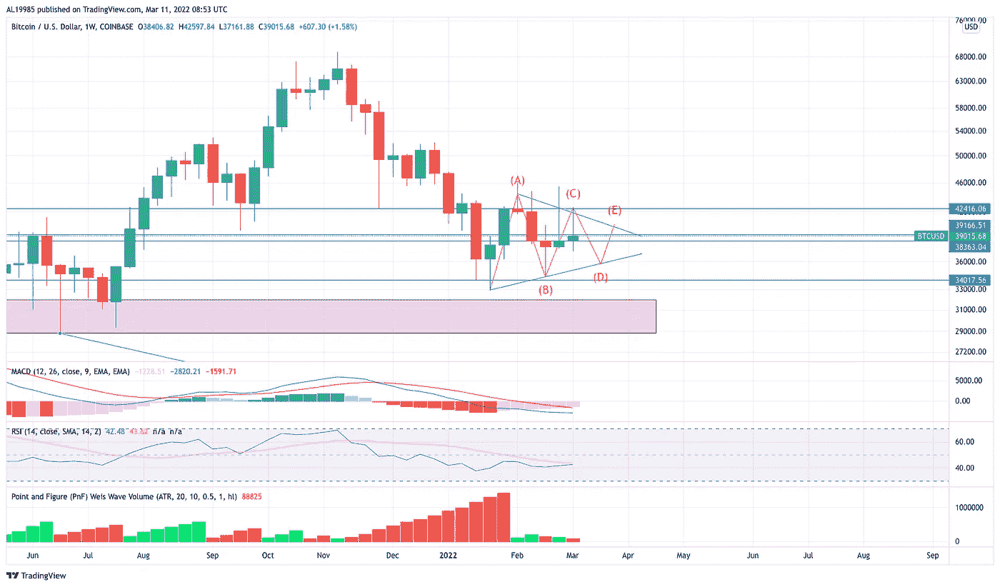
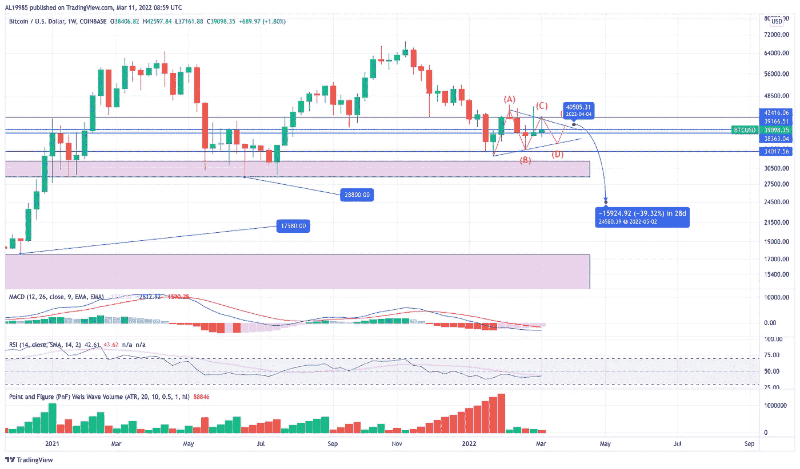

# 底部的气味@蹩脚的交易者笔记#9

> 原文：<https://medium.com/coinmonks/the-scent-of-the-bottom-crappy-trader-notes-9-a810316a2eaf?source=collection_archive---------70----------------------->

一些分析师说，BTCUSD 价格行为完全是随机的或被操纵的。他们已经厌倦了长达 7 周的不稳定行动。但是如果你足够仔细地观察，你可以看到即将到来的底部最有可能的价格结构是什么。这就是我们今天要分享的内容，所以你可以从中受益。

# 让我们再说一遍——底部近在咫尺，但修正自有妙招

让我们首先提醒一下，我们目前的工作假设，在[前几期的蹩脚交易者笔记](https://yentenobserver.medium.com/bottom-is-in-scenarios-crappy-trader-notes-8-9fc2dc4cf017)中解释过，是我们正在经历一波大一度的 C 浪修正中的第 4 浪修正。

这是摘自上一篇文章的一段视频

这意味着我们几乎处于 2021 年 4 月开始的调整的临界点。但是**仍然有一个地方**给矫正波 5。这意味着在不久的将来还会有更多的下跌。我们仍然需要走低才能找到真正的底部。

直到今天，我们还不确定第四波修正的结构会是什么样子。坦率地说，前几周，我们怀疑是所谓的平坦修正，这在第 4 波位置很常见。然而，前两周发生的**价格波动**正在**向我们暗示**更有趣的假设。

# 某种三角假说

因此，今天，我们专门为我们的读者，提出了更详细的预测什么是最有可能的底部场景。下面显示的三角形在这个预测中起着重要的作用。

如果价格正在形成一个三角形呢？所以让我们假设一下，我们确实有一个**三角形修正**。这意味着我们应该看到更多的价格波动和横盘，最终将达到顶点，接近 40-41，000 BTC 美元的价格水平。如你所见，我们可能处于五向三角形结构的 D 波。因此，我们应该会看到更低的水平，然后很有可能是三角形顶点。

当三角形完成并完全构建后，我们发现很有可能出现明显的下移。人们可能期望**目标点在 25–28k BTC USD**水平，如下图所示。

因此，这是我们在[上一篇文章](https://yentenobserver.medium.com/bottom-is-in-scenarios-crappy-trader-notes-8-9fc2dc4cf017)中预测的最有可能的扩展扁平场景的一个更不稳定的版本。在我们看来，底部价格将在 28-30k BTC SD 水平发生，但一些灯芯可能触及 25k BTCUSD 水平。

# 真的吗？你不是陷入了永久错误吗？

嗯，我们可能有。交易是一门科学，不是必然的。尽管我们在预测底部真实外观和感觉时可能是错误的，但有多个**指标**指向这些价格水平。其中包括:

*   第 5 波斐波那契计数—假设 40–41k BTC USD 是第 4 波结束级别
*   点数和图形计算——将 35k-45k BTC SD 范围视为一个大的再分配区域，这是根据威科夫理论向下移动的原因
*   1 月 21 日和 6 月 21 日的价格水平——作为一个巨大的需求区域和最终的双顶颈线价格水平
*   在三角形校正中应用的特定技术，允许在退出三角形时预测移动宽度
*   技术指标显示还有进一步下跌的空间

毫无疑问，这将是一个动荡和危险的时期，因为接近底部和逆转是一条崎岖不平的道路。

因此，一如既往地保持安全和流动性。谨慎交易，妥善管理风险。

伟大的购买机会就在眼前，所以保持观望，等待一个完美的购买时机并不是一个愚蠢的想法。

# 更多阅读

如果你想知道我是如何得出当前预测的，我推荐你阅读博客的前几章。因此，你可以理解我的推理，看看我的话有多真实。

*   2022 年 2 月下旬阐述最可能的底部情景— [底部在情景中@蹩脚交易者笔记#8](https://yentenobserver.medium.com/bottom-is-in-scenarios-crappy-trader-notes-8-9fc2dc4cf017)
*   2022 年 2 月反弹被揭穿— [下一站 30k BTCUSD @蹩脚交易者笔记#7](https://yentenobserver.medium.com/next-station-30k-btcusd-crappy-trader-notes-7-204ea6d157cc)
*   2022 年 1 月熊市情景解释— [BTCUSD 熊市在控制中@蹩脚交易者笔记#6](https://yentenobserver.medium.com/btcusd-bears-are-in-control-crappy-trader-notes-6-50507d28179a)
*   2021 年 12 月下旬 C 波情景的有力证实—[BTC C 波放大@蹩脚交易者笔记#5](https://yentenobserver.medium.com/btc-wave-c-zoom-in-crappy-trader-notes-5-2cd5ccfc6a8a)
*   2021 年 12 月初可能下跌的预警—[BTC C 波风暴来了？@ CrappyTrader 笔记#4](https://yentenobserver.medium.com/wave-c-storm-is-coming-crappytrader-notes-4-d71eee69f4ff)
*   2021 年 11 月下旬对可能的熊市前景的悲观展望— [我们是否处于 C 浪之中？@ CrappyTrader 笔记#3](https://yentenobserver.medium.com/are-we-in-a-c-wave-crappytrader-notes-3-2eecee27ca45?source=your_stories_page----------------------------------------)
*   2021 年 11 月 11 日价格走势有两种选择——[BTC 突破还是牛市陷阱？@ CrappyTrader 笔记#2](https://yentenobserver.medium.com/a-btc-breakout-or-bull-trap-crappytrader-notes-2-f49c476a4c0)

# 你觉得我的工作有价值吗？

如果是，那么您可以通过以下方式支持我的努力:

*   在推特上关注我
*   跟随我的媒体档案