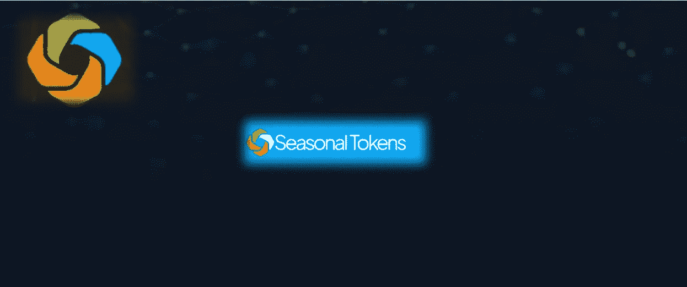
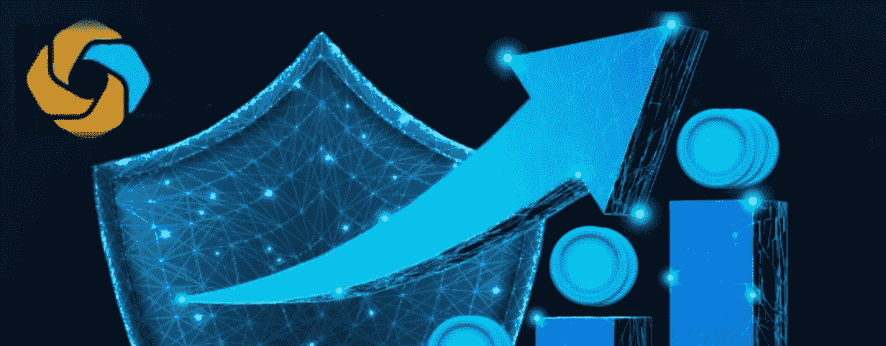
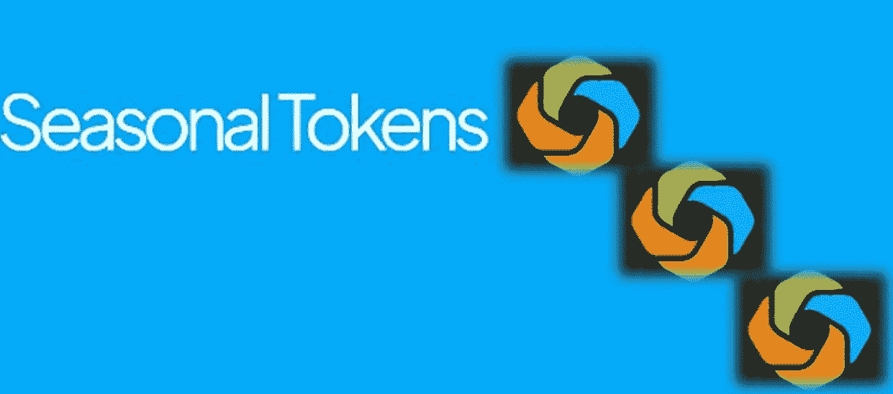

# 季节性平台让您可以访问季节性生态系统中的 4 种不同的代币，这些代币可以相互交易。

> 原文：<https://medium.com/coinmonks/the-seasonal-platform-gives-you-access-to-4-different-tokens-within-the-seasonal-ecosystem-which-6fcf74616d00?source=collection_archive---------29----------------------->

[季节性](https://seasonaltokens.org/)平台为您提供季节性生态系统中的 4 种不同代币，这些代币可以相互交易。是的，这是很有可能的！
我会很快给你一些关于它如何工作的亮点，好处，包括如何购买 4 种季节性本地货币等等。

**什么是季节性？**
[季节性是一个多加密货币](https://seasonaltokens.org/)相关平台，采用工作证明(PoW)构建，旨在为投资者提供稳定性，并在季节性期间监控他们的投资，该平台完全部署在以太坊主网上，以在全球及其生态系统中最大限度地采用季节性令牌，以监控投资者投资中的资产。在其生态系统中，季节性令牌由 4 个季节性令牌控制，这仅仅意味着拥有 4 个季节性令牌的投资者可以相互交易，以实现投资的稳定性。
作为平台用户你将能够拥有这个好处；随着时间的推移，在不花费太多的情况下增加你的持有量，减少经济对你的投资的影响，并且感到安全，不用担心地毯拉。

**四大季节性标志是什么？**
四季令牌包括；分别为#春、#夏、#秋和#冬。这些代币被完全配置为在季节性安排中互相增加和控制价格。春季代币的价格不断上涨，接着是夏季、秋季、冬季，然后又是春季。关于这些代币的一个主要关键事实是，价格与其他价格相关，也与供给需求相关，包括采矿供给和农业需求。每九个月，代币的生产速度减半，生产成本翻倍。它先是生产成本最低，也是最贵的，然后是对农业最没有价值，也是最珍贵的。

**你作为投资者或平台用户的好处✔** 快速增加你的代币:作为投资者或用户，参与 3 个春季代币换 5 个夏季代币的交易，在执行交易后，总共会有更多的代币。因此，定期相互交易代币，您拥有的交易代币总数将在其平台或交易所的每次交易中同时增加。

**从价格变化中获利✔**
如果其中一个季节性代币的价格暴跌，你就有机会将其转换或交易为其他季节性代币，并增加你拥有代币的机会，通过交易代币获得更多代币，你可以将价格操纵转化为利益。这听起来很棒，对吧？是的，它是如此的可爱💋。

**你不需要将你的代币委托给任何人✔** 这 4 个代币是用工作证明挖掘构建的，就像比特币的一种形式。它们是商品。所以完全不用担心。更多优惠请[点击此处](https://seasonaltokens.org/)接受更多教育

**如何购买 4 个亲戚的季节性代币✔** 4 个季节性代币可以从 Uniswap 购买。但在继续之前，请确保用以太坊来充实你的钱包，你可以从[币安](https://coinmarketcap.com/exchanges/binance/)、[火币](https://coinmarketcap.com/exchanges/huobi-global/)、[比特币基地](https://coinmarketcap.com/exchanges/coinbase-exchange/)和更有信誉的交易所购买以太坊。之后，将您的元掩码切换到以太坊主网络，并连接您的钱包，开始购买您的令牌

**我使用什么钱包购买季节性代币？**
1。信任钱包
2。喏
3。元掩码以及任何具有私钥或种子短语的 wallet 0x wallet。

**4 季代币合同地址✔**
春合同 addy:[0x f 04 af 3 f 4 e 4929 f 7 CD 25 a 751 e 6149 a 3318373 D4 Fe](https://etherscan.io/token/0xf04aF3f4E4929F7CD25A751E6149A3318373d4FE)
夏合同 addy:[0x 4d 4 f 3715050571 a 447 fffa 2 CD 4 cf 091 c 7014 ca 5 c](https://etherscan.io/token/0x4D4f3715050571A447FfFa2Cd4Cf091C7014CA5c)
秋合同 Addy: [0x4c3bAe16c 这个伟大的权利？是的，非常可爱💖。](https://etherscan.io/token/0x4c3bAe16c79c30eEB1004Fb03C878d89695e3a99)

现在，我希望您访问该网站，了解更多详细信息和更新，包括如何与团队成员保持联系以获得资金和合作。

[推特](https://twitter.com/Seasonal_Tokens) | [不和](https://discord.gg/Q8XZgJEDD3)|[Reddit](https://www.reddit.com/r/SeasonalTokens/)|[POA](https://bitcointalk.org/index.php?topic=5390603.msg59604011#msg59604011)|用户:[rig money](https://bitcointalk.org/index.php?action=profile;u=3380226)
[#季节性令牌](https://twitter.com/hashtag/SeasonalTokens?src=hashtag_click)[#周期性投资](https://twitter.com/hashtag/CyclicalInvesting?src=hashtag_click)[#密码开采](https://twitter.com/hashtag/CryptoMining?src=hashtag_click) [#YieldFarm](https://twitter.com/hashtag/YieldFarm?src=hashtag_click)

> 加入 Coinmonks [电报频道](https://t.me/coincodecap)和 [Youtube 频道](https://www.youtube.com/c/coinmonks/videos)了解加密交易和投资

# 另外，阅读

*   [八大加密附属计划](https://coincodecap.com/crypto-affiliate-programs) | [eToro vs 比特币基地](https://coincodecap.com/etoro-vs-coinbase)
*   [最佳以太坊钱包](https://coincodecap.com/best-ethereum-wallets) | [电报上的加密货币机器人](https://coincodecap.com/telegram-crypto-bots)
*   [交易杠杆代币的最佳交易所](https://coincodecap.com/leveraged-token-exchanges) | [购买 Floki](https://coincodecap.com/buy-floki-inu-token)
*   [3Commas 对 Pionex 对 Cryptohopper](https://coincodecap.com/3commas-vs-pionex-vs-cryptohopper) | [Bingbon 评论](https://coincodecap.com/bingbon-review)