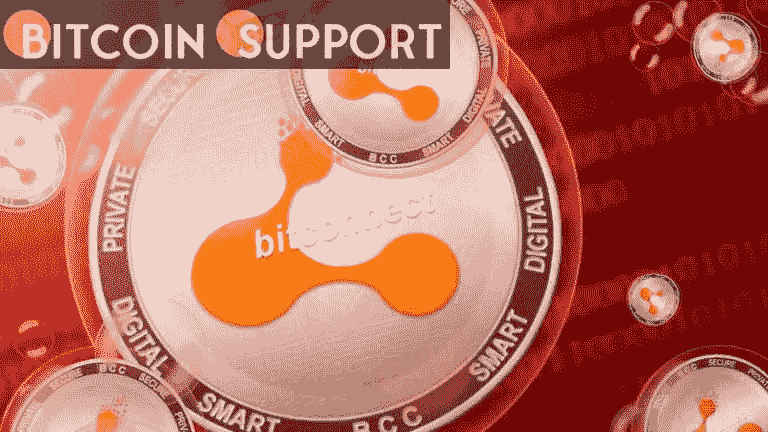

# 美国证券交易委员会一直无法找到在 24 亿美元欺诈案中被定罪的 BitConnect 创始人

> 原文：<https://medium.com/coinmonks/the-sec-has-been-unable-to-locate-bitconnect-founder-convicted-in-2-4-billion-fraud-case-fb2b7984f5d7?source=collection_archive---------82----------------------->

**Visit our website:-** [**https://bitcoinsupports.com/**](https://bitcoinsupports.com/)

BitConnect 的创始人因非法集资和诈骗美国投资者超过 20 亿美元而被起诉。在被美国司法部以 24 亿美元的庞氏骗局定罪后，BitConnect 创始人 Satish Kumbhani 失踪了。美国证券交易委员会在周一的一份法庭声明中称，库姆巴尼下落不明。根据 SEC 的说法，Kumbhani 最后一次为人所知的行踪是在他的家乡印度，但自从他的 BitConnect 庞氏骗局的发起人被 SEC 指控诈骗美国投资者超过 20 亿美元后，他就失踪了。美国证券交易委员会在声明中表示，被定罪的创始人很可能已经逃到了另一个国家，而且“库姆巴尼的下落仍然不明，委员会也无法确定何时能够成功找到他。”电信诈骗，经营未注册的汇款业务，以及对创始人的三项指控:电信诈骗，商品价格操纵和国际洗钱。BitConnect 的传奇可以追溯到 ICO 时代，它是当时最受关注和讨论的计划之一。到 2017 年年中，加密项目已经从全球投资者那里筹集了数十亿美元，使其成为全球轰动事件。该项目声称基于专有的“交易机器人”和“波动性软件”的贷款计划将奖励投资者 10%的 BCC 令牌投资回报。司法部指控 Kumbhani 通过 BitConnect 的贷款业务经营庞氏骗局，成功从投资者那里骗取了 24 亿美元。在 2017 年 12 月市场狂热的顶峰时期，Bitconnect 的原生令牌 BCC 创下了 463.31 美元的历史最高交易价格，使其市值达到 34 亿美元。到 2018 年 1 月，该项目的创始人已经将地毯从地毯下拽了出来，使象征性的价格跌至接近零，并给投资者造成了巨大损失。

DOJ 还指控 Kumbhani 夸大了 BCC 的市场需求，以吸引更多不谨慎的投资者。这个项目，就像 ICO 狂潮期间的许多其他项目一样，被证明是一个巨大的金字塔计划，设计者用早期的现金偿还老投资者，然后在由于大肆宣传和 ICO 狂热而赚了数十亿美元后逃离。在澳大利亚和美国，几个项目支持者已经被定罪，面临牢狱之灾。

**访问我们的网站:-**[**https://bitcoinsupports.com/**](https://bitcoinsupports.com/)

**免责声明:以上为作者观点，不应视为投资建议。读者应该自己做研究。**

> 加入 Coinmonks [电报频道](https://t.me/coincodecap)和 [Youtube 频道](https://www.youtube.com/c/coinmonks/videos)了解加密交易和投资

# 另外，阅读

*   [区块链 vs 比特币基地](https://coincodecap.com/blockfi-vs-coinbase) | [比特坎评论](https://coincodecap.com/bitkan-review) | [币安评论](/coinmonks/binance-review-ee10d3bf3b6e)
*   [Coldcard 评论](https://coincodecap.com/coldcard-review) | [BOXtradEX 评论](https://coincodecap.com/boxtradex-review)|[uni swap 指南](https://coincodecap.com/uniswap)
*   [阿联酋 5 大最佳加密交易所](https://coincodecap.com/best-crypto-exchanges-in-uae) | [SimpleSwap 评论](https://coincodecap.com/simpleswap-review)
*   [最佳加密分析或链上数据](https://coincodecap.com/blockchain-analytics) | [Bexplus 评论](https://coincodecap.com/bexplus-review)
*   [NFT 十大市场造币集锦](https://coincodecap.com/nft-marketplaces)
*   [7 大副本交易平台](https://coincodecap.com/copy-trading-platforms) | [BuyCoins 点评](https://coincodecap.com/buycoins-review)
*   [XT.COM 评论](https://coincodecap.com/profittradingapp-for-binance) | [币安评论](https://coincodecap.com/xt-com-review)
*   [SmithBot 评论](https://coincodecap.com/smithbot-review) | [4 款最佳免费开源交易机器人](https://coincodecap.com/free-open-source-trading-bots)