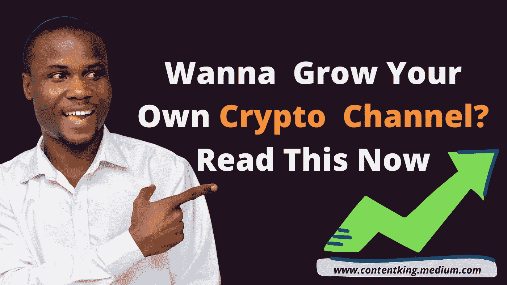
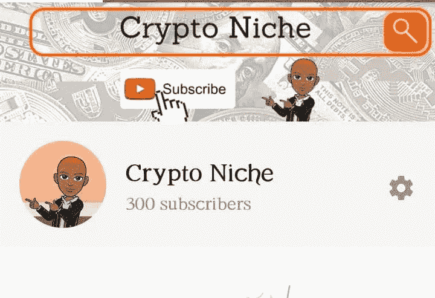
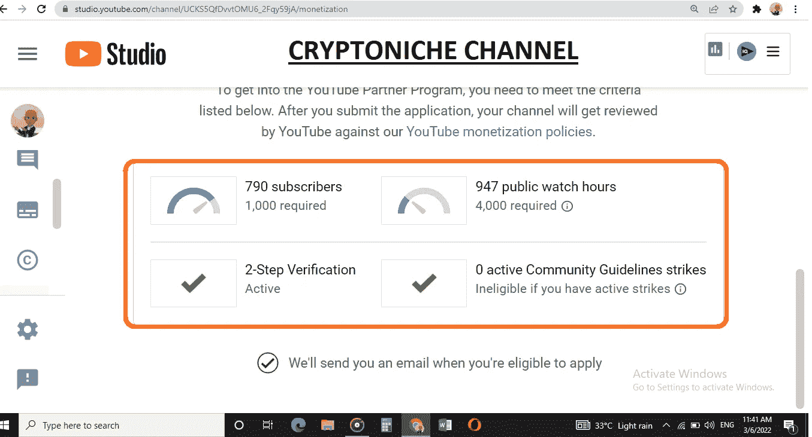
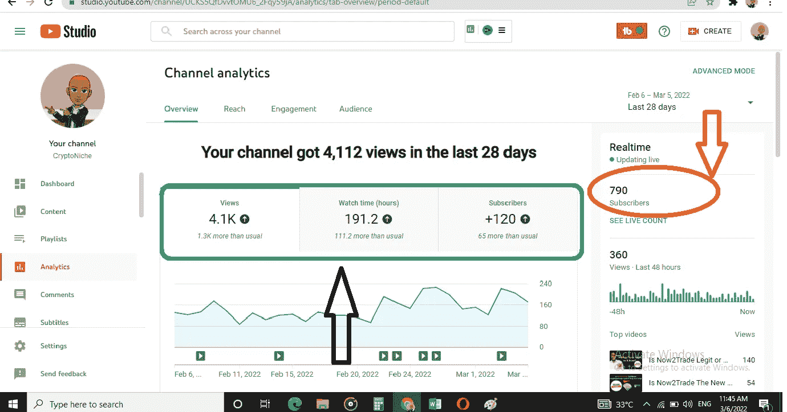
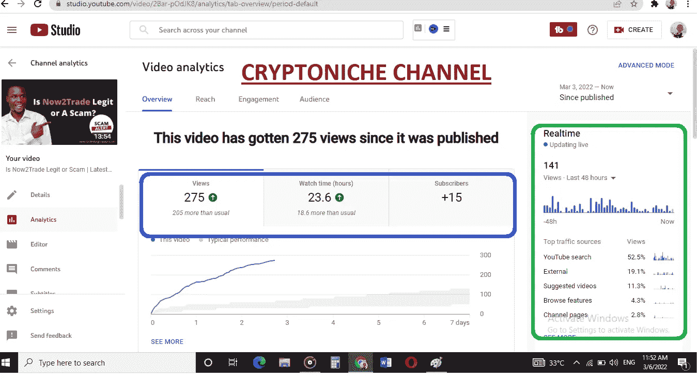

# 如何用 Tubebuddy 有机地发展你的加密 Youtube 频道的秘密

> 原文：<https://medium.com/coinmonks/the-secret-of-how-to-grow-your-crypto-youtube-channel-organically-with-tubebuddy-3e3fa51d8088?source=collection_archive---------7----------------------->

我在 28 天内获得了超过 4000 次浏览，120 个订阅者，以及许多参与。该频道开始有了真正的增长，我现在感到很兴奋。在过去的几周里，Tubebuddy 已经成为了游戏规则的改变者。但事情并不是这样开始的，我有一个故事要和你分享。希望你能从中挑选一些技巧，并应用到你的渠道中。我希望看到你用 [**Tubebuddy 更快地发展你的加密货币 youtube 频道。**](https://www.tubebuddy.com/abimbola)

**Designed by me:)**

> 观看此视频，并应用课程。

***不想看长文？没问题，我理解你可能很忙，这就是为什么我制作了这个主题的视频教程。***

# 我是如何创建隐壁龛频道的

大约 1 年零 5 个月前，我开始认真对待 ***vlogging*** ，因为我意识到我学到了很多东西，是时候开始回馈社区了。这可以通过在 Youtube 上创建加密货币和区块链内容来轻松实现。因此，我在 2020 年 11 月开始有机地发展 CryptoNiche youtube 频道。

毫无疑问，这项任务并不容易，因为我觉得我开始得太晚了，因为我的许多同事已经发展了他们的渠道，拥有相当数量的追随者。一些人拥有超过 1 万名用户，他们的渠道自 2019 年以来一直在货币化。

作为加密货币交易商或服务提供商，发展一个包含有价值内容的加密货币 youtube 频道是你建立影响力的方式之一。不管你现在在加密货币/区块链行业中扮演什么样的角色，有人正在寻找进入这个行业的机会，他需要很多建议。给世界一个利用你经验的机会。

这很艰难，但我最终还是试了一试。我继续上传有价值的内容。但这是一个巨大的挑战，我的浏览量很低，没有参与度，一个月只有 40 个订户。然后我开始有一种感觉，加密 Youtube 不会为我工作。见鬼。

**Before**

很大程度上，我理解的是中等 SEO。我在 CryptoNiche Telegram 和 WhatsApp group 里教过很多人这个秘密。出于某些原因，我还没有掌握 Youtube SEO 的诀窍。不知道如何在 Youtube 首页排名，让 Youtube 在浏览功能上显示你的视频，会让你的频道很难赚钱。

每个月都有成千上万的人在 medium 上阅读我的文章，因为它们在 Google、Bings 和其他搜索引擎上排名第一。流量巨大，联系深厚。

当我能够在 Youtube 上复制这个的时候，我会发现一个蜜罐，毫无疑问:)

所以我一直在寻找正确的知识，我想我找到了。在我继续之前，你需要知道一些关于 YouTube 货币化的事情。

# 关于 Youtube 货币化政策的快速提醒

**Youtube Monetization Criteria**

## 你一定有；

*   零活动社区指导方针罢工
*   两步-验证
*   1000 名订户
*   4000 个观察小时

当你看上面的标准时，你会注意到我现在接近拥有 1000 名订户，是吗？借助 [***Tubebuddy 工具***](https://www.tubebuddy.com/abimbola) ，该频道将在月底前达到 1000 名有机订户。

我没有违反任何指导原则，所以我是安全的。而且通道是用 2FA 验证的，爽。

现在，另一个挑战是 4000 小时的手表，这必须在一年内实现。老实说，这是一项艰巨的任务。但这是可以实现的。

# Tubebuddy 是骗局吗？现在就找出答案

渠道增长有些缓慢，令人沮丧。尽管如此，我在很短的时间内从 300 名订户发展到 790 名有机订户。事实上，根据 Youtube 的数据，在过去的 28 天里，我多了 120 个用户。我会让你知道这是怎么发生的。

Youtube 说，我比平时多了 1300 次观看，比平时多了 111.2 个小时的观看时间，比平时多了 68 个订户。

我知道在这段旅程中我需要填补知识空白，所以我参加了 3 门关于 Youtube SEO 和 Youtube 货币化的不同课程。我在 Udemy 上买了两个课程，最后一个是在勇气天使买的。我整个周末都在向这些人学习。是的，我很看好向成功人士学习。

学习之后，我创建了一个行动计划。记住，我没有记下要点，因为记是给拖延者准备的。我制定了一个我将遵循的计划，并在同一天开始采取行动。

[**我在我的 chrome 浏览器上下载安装了 Tubebuddy**](https://www.tubebuddy.com/abimbola) ，我想让你现在也做同样的事情，不要拖。事实上，现在就做，然后回到这篇文章。

安装后，它给了我一天中应该让我的视频上线的正确时间的见解。这在交战中起了很大的作用。

如果你看了下面的截图，你会发现我的点击率提高了。你的点击率越高，就有越多的 Youtube 算法向更多的人展示你的视频。

***能看出来吗？52%的流量来自 Youtube 搜索，19%来自外部，11.3%来自推荐视频，4.3%来自 broswse 功能。***

这令人印象深刻，因为 YouTube 很好地分发了我的内容。

# 最终想法

用 [**Tubebuddy**](https://www.tubebuddy.com/abimbola) 有机地发展你的加密货币 youtube 频道是可能的，这不是火箭科学。在过去的几周里，我看到了令人难以置信的结果，我的一些视频可能会很快传播开来，CryptoNiche 频道将在 4 周内实现货币化。

未来 4 个月的货币化之旅已经开始，我将在 CryptoNiche 社区为大家更新。

安装正确的工具，学习如何使用它，制作对你的观众有益的内容。不断检查你的 YouTube 分析，寻找你可以改进的地方。使用吸引注意力的缩略图来提高你的点击率，这会很有帮助。

别忘了在 Medium 上关注我，订阅我的时事通讯。

老实说，我不喜欢 1 拍手，如果你打算为这篇文章鼓掌，给我 50 拍手，我会很感激:)

最后，永远不要放弃。

干杯！

如果这篇文章对你有帮助，请在这里 给我买一杯[咖啡](https://ko-fi.com/ojeniyiayobami)

[**Source**](https://tenor.com/view/coffee-gif-23439328)

# 关于作者

**Ojeniyi Ayobami Abimbola** 自 2015 年以来一直从事加密货币交易，他是区块链的内容创作者，也是 Cryptoniche 的加密教练。你可以和他联系:[https://t.me/cryptoniche_hangout](https://t.me/cryptoniche_hangout)

**Tubebuddy 附属链接:**[https://www.tubebuddy.com/abimbola](https://www.tubebuddy.com/abimbola)

注意:如果你注册了会员链接，我会从中获得小额佣金，这也是从经济上支持这个博客的一种方式。

**或者加入隐壁龛电报频道:【https://t.me/cryptoniche_hangouts】T22**

**在推特上和他连线:**[https://mobile.twitter.com/ojeniyi_ayobami](https://mobile.twitter.com/ojeniyi_ayobami)

你想一辈子被动收入？看他上一篇文章 [**这里！！！**](https://contentking.medium.com/this-undoubtly-the-best-way-to-earn-passive-income-through-cryptocurrency-7ce547cedbe)

我有一个免费的礼物给你:“如何在年底前成为密码百万富翁。”C [**点击这里下载**](https://ojeniyiayobami.crd.co/) 。

为你制作的几十个加密内容， [**现在就订阅**](https://www.youtube.com/c/CryptoNiche/videos)