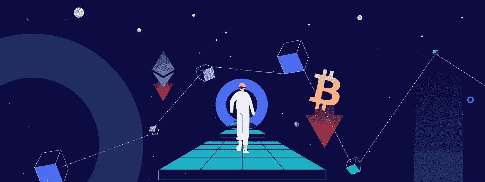

# 熊市繁荣的秘诀

> 原文：<https://medium.com/coinmonks/the-secrets-to-flourishing-in-a-bear-market-eb19c6bcd769?source=collection_archive---------14----------------------->

从历史上看，平均每 3 年，就会有一个持续 12 个月左右的秘密熊市。熊市是正常的，但没有牛市频繁。例如，比特币历史上最糟糕的两次熊市发生在 2014 年和 2017 年，分别持续了 59 周和 52 周。

# HODL 加密货币

消化秘密熊市是痛苦的，但如果你相信区块链技术及其颠覆许多行业的潜力，有一个简单而有效的策略——又名霍德林。另一个更有效的策略是美元成本平均法，但我们稍后会谈到这一点。

霍德林已被证明是最有利可图的战略，产生了巨大的长期收益。简单来说，HODL 是“hold on for dear life”的首字母缩写，指的是购买加密货币并持有它，无论市场状况如何都拒绝出售的做法。

有时候，最好的投资策略是袖手旁观，让市场自行其是，因为把握市场时机几乎是不可能的。很多时候，投资者要么太早，要么太晚。

作为最后一个想法，确保你只负责可靠的加密项目，并且具有真正的适用性，有可能彻底改变世界。

# 用机器人解决问题(DCA)

一个更好的选择是在使用交易机器人时持有。但你可能会问，这可能吗？没错，就是用 DCA！

DCA 代表美元成本平均，它包括进入一个位置，然后在它下跌时继续买入，从而降低你的平均买入价格。

例如，假设你以 50，000 美元购买了 0.05 BTC。然后价格下降到 45，000 美元，然后你的投资减少三倍，购买 0.1 BTC，从而使你的平均价格下降到(((50，000 美元* 1)+(45，000 美元* 2))/3 = 46，666 美元。然后，价格继续下跌 40，000 美元，再次下跌，使平均价格达到(($50，000*1)+($45，000*2)+($40，000 * 6))/9 = 42，222 美元。

在这种情况下，当比特币反弹到差不多 45000 美元时，你本可以获利。在 Cryptohopper 上，我们提供了一个高级 DCA，您可以定制您的资金的百分比以及您希望使用的 DCA 和级别。您甚至可以随时手动对某个位置进行 DCA。

# DCA 高级提示

在使用 DCA 时，只投资你有信心会再次上涨并且在过去已经证明了这一点的硬币是很关键的，比如比特币和以太坊。相反，你应该非常小心，不要在你没有 100%把握的加密货币上使用 DCA，因为你有失去所有资金的风险。

关于 DCA，需要记住的一点是，你应该很好地分配你的资金。例如，如果你计划做四次 DCA，你应该在此基础上计算你的初始仓位大小，这样你还有资金做剩下的 4 次 DCA。如果你计划三倍下注，做 4 DCAs，你的初始仓位不能超过你账户的 1.23%，如下图所示:

*   初始位置= 1.23%
*   1，2 *当前位置= 2.46%
*   2，2 *当前位置= 7.38%
*   3，2 *当前位置= 22.14%
*   4，2 *当前位置= 66.42%
*   总计= 99.63%

如你所见，如果你的资金超过总账户的 1.23%，你就没有足够的钱支付所有的 DCA。如果你使用更多的硬币，这个值显然会更低。

**底线:** DCA 是一个强大的工具，如果使用得当，可以带来巨大的成果。为了从该工具中获得最大收益，您应该仅在证明了自身价值的加密货币上使用它，并计算初始头寸规模，以便您有足够的资金用于所有 DCA 条目。

*最初发表于*[T5【https://www.cryptohopper.com】](https://www.cryptohopper.com/blog/5179-the-secrets-to-flourishing-in-a-bear-market)*。*

> 加入 Coinmonks [电报频道](https://t.me/coincodecap)和 [Youtube 频道](https://www.youtube.com/c/coinmonks/videos)了解加密交易和投资

## 另外，阅读

*   [币安 vs 比特邮票](https://coincodecap.com/binance-vs-bitstamp) | [比特熊猫 vs 比特币基地 vs Coinsbit](https://coincodecap.com/bitpanda-coinbase-coinsbit)
*   [如何购买 Ripple (XRP)](https://coincodecap.com/buy-ripple-india) | [非洲最好的加密交易所](https://coincodecap.com/crypto-exchange-africa)
*   [非洲最佳加密交易所](https://coincodecap.com/crypto-exchange-africa) | [晤交易所评论](https://coincodecap.com/hoo-exchange-review)
*   [eToro vs robin hood](https://coincodecap.com/etoro-robinhood)|[MoonXBT vs by bit vs Bityard](https://coincodecap.com/bybit-bityard-moonxbt)
*   [Stormgain 评论](https://coincodecap.com/stormgain-review) | [Probit 评论](https://coincodecap.com/probit-review) | [北海巨妖评论](/coinmonks/kraken-review-6165fc1056ac)
*   [如何在势不可挡的域名上购买域名？](https://coincodecap.com/buy-domain-on-unstoppable-domains)
*   [印度的秘密税](https://coincodecap.com/crypto-tax-india) | [altFINS 审查](https://coincodecap.com/altfins-review) | [Prokey 审查](/coinmonks/prokey-review-26611173c13c)
*   [区块链 vs 比特币基地](https://coincodecap.com/blockfi-vs-coinbase) | [BitKan 评论](https://coincodecap.com/bitkan-review) | [期货交易机器人](/coinmonks/futures-trading-bots-5a282ccee3f5)
*   [南非的加密交易所](https://coincodecap.com/crypto-exchanges-in-south-africa) | [BitMEX 加密信号](https://coincodecap.com/bitmex-crypto-signals)