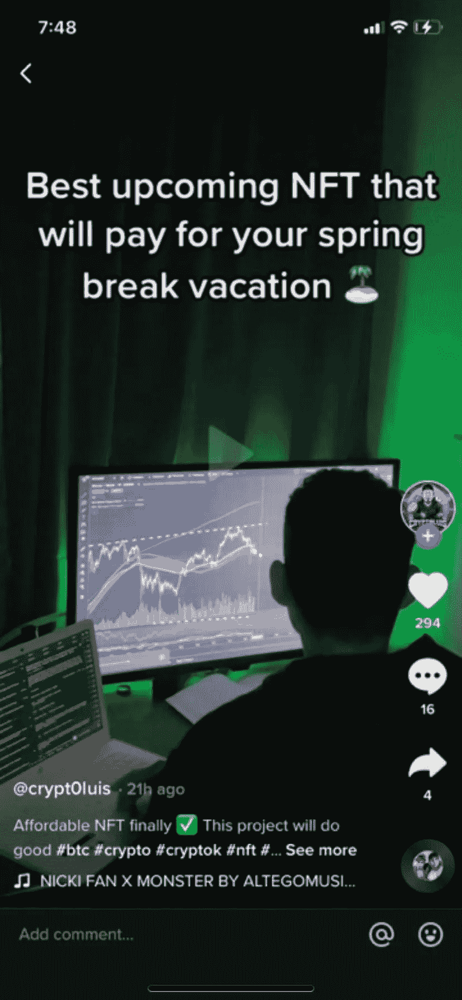

# NFT 翻转市场的大起大落

> 原文：<https://medium.com/coinmonks/the-sharp-rise-and-fall-of-the-nft-flipping-market-ce30cc9c222e?source=collection_archive---------22----------------------->

Open Sea Daily Volume

从一月初到二月底，NFT 市场经历了有史以来最疯狂的牛市。1 月份，Opensea 的月交易量为 56 亿美元，2 月份为 49 亿美元。NFT·德根一家到处都是项目，利润不断增加，一切都很好。对密码毫无经验的新市场参与者正在加入并创造 alpha。每个人都赢了。二月底即将来临。现在街上血流成河。

**NFT 市场背景**

*   目前 NFT 的市值约为 170.2 亿美元
*   NFT 市场大致由 10 个板块组成:
*   PFP(个人资料图片)、收藏品、艺术、游戏、公用事业、元宇宙、土地、知识产权和音乐
*   资料图片/头像 NFT 称霸市场
*   目前占 54.71%的市场份额
*   PFP 项目的例子:Bored Ape 游艇俱乐部和 Cryptopunks

**NFT 的买家和卖家**

这一轮 NFT 牛市是对一种投机性极强的资产的高需求的完美风暴，供应并不短缺。需求是个人资料图片集。简档图片集合的元是通过算法生成 X 数量的具有不同稀有度和属性的 NFT(10，000，999，777 等)。要获得这些非功能性食物，购买者必须铸造它们。铸造价格可以从 0.05 eth 到 3th 不等，取决于收藏。卖家的目标是卖出他们的收藏品。以 05 eth 的铸造价格售出 10，000 个非功能性纺织品，是一个不错的 500 ETH 发薪日。

那么买方呢？从局外人的角度来看，我发现了两类 NFT 买家:艺术品爱好者和追求利润的市场参与者。这篇博文关注的是 95%追求利润的买家。

在 NFTs 中有两种盈利方式:持有和转手。持有人是认为他们刚刚铸造的 NFT 是下一个 BAYC 的参与者。99.99%的情况都是以他们丢了一个包而告终。

在这轮牛市中，大多数追求利润最大化的参与者把自己塑造成“NFT 鳍手”。NFT 在翻转什么？NFT 翻转是铸造 NFT 在其造币价格，并立即以更高的价格出售。如果你以 0.05 Eth 的价格铸造 NFT，然后以 1 eth 的价格卖出，那就是 0.05 Eth 的利润。翻转心态是 NFT 牛市的唯一驱动力。为了理解为什么我们需要知道是什么驱动了供给和需求。

**NFT 的供求翻转**

如果你认为交易密码是堕落者的事，那你就错了。我认为这是一种加密技术，但是这些过滤器把它带到了一个新的高度。就像任何市场一样，游戏的名字是供给和需求。没有需求的收藏是没有价值的。需求高的收藏让你赚了点钱。

那么，NFT 藏品是如何估值的呢？这些 NFT 项目的 95%是基于“炒作”，换句话说就是投机。是什么决定了 NFT 有没有炒作？Twitter 追随者、不和谐用户和口碑。在 NFT·弗利普斯看来，如果一个项目有很多追随者，那它就是炒作(很多项目追随者是假的，但我们将在后面深入探讨)。

我们来介绍一下白名单。一般来说，铸造 NFTs 发生在公共场合。但是对于一个非常“炒作”的项目，当你试图铸造他们的 NFT 时，他们可能已经卖完了。不管外界需求如何，白名单保证你有 NFT 可赚。白名单是项目开发人员创建社区参与的重要工具。在 NFT 项目中，你会看到大量的白名单赠品。无论是喜欢和转发推文，还是不和谐地发送 10，000 条消息，都有大量的方法来获得白名单。更多详情[此处](https://nftska.com/what-is-whitelisting-nft-terminology/)。

在一个理想的世界里，NFT 脚蹼将赢得“炒作”项目的白名单。在造币日，他们将铸造他们的 NFT，翻转它，并预订利润。

**公牛和熊**

在 1 月和 2 月期间，NFT 市场非常火爆。我完全把这归功于脚蹼。我看到了前所未有的对 NFT 的大肆宣传/需求。在 NFT 牛市的早期阶段，新的市场参与者大量涌入，许多人只知道翻转 NFT，没有加密经验。我在抖音上发布加密内容。这款应用的开发者都在推广 NFT 翻转的生活方式。“这是最简单的赚钱方法”，“这是我如何支付我的假期”等。

将 NFT 翻转式生活方式的推广与 NFT 惊人数量的未公开推广结合起来，你就有了一个牛市的配方。当你周围的每个人都告诉你，NFT 翻转是如何最容易的方式，使狗屎吨钱 FOMO 开始建设。

市场参与者表现良好。似乎每天都有新的 NFT 项目落下。更多的人加入进来。几个糟糕的演员和几个地毯拉在这里和那里，但没有人在乎，因为他们赚了这么多钱。最终，在俄罗斯入侵乌克兰后，市场走向了相反的方向。

市场参与者从风险资产重新配置到无风险资产。牛市不会永远持续。在这个只涨不跌的市场中，我告诉所有人最终会发生什么。现在，成千上万的人被困在每天崩溃的 NFT 中。目前，Opensea 容量下降了 80%。那个本该为你的假期买单的项目现在一文不值了。最糟糕的部分？很多人连卖都不会。这就是我们预见到这一点的原因:

**等待破裂的泡沫**

*   这是一个教科书式的泡沫。类似于 2017 年的 ICO，网络泡沫，或者任何你能想到的泡沫。项目只是根据推测来估价的。当市场只涨不跌，所有人都被它蒙蔽时，你的投机赌博会有回报。每个人都在赚钱，反馈回路只会变得更强。当它倒下的时候呢？那些坐拥巨额利润、准备赌一把的参与者现在犹豫了。

**黑幕影响者营销**

*   最糟糕的是，所有未公开的促销活动都在进行。就像我说的，我是抖音的内容创作者。“这个 NFT 项目会让你变得富有”或“这个项目会让你退休”NFT 促销的金额是疯狂的。我个人认识两个大创作者，他们创造了一个“阿尔法小组”。本质上，它是一个私人团体，创作者由 NFT 项目支付报酬来推广他们的项目。NFT 项目将为创作者提供 50 个白名单位置和资金，以在抖音和他们的小组中推广他们的项目。这些项目被证明毫无价值
*   许多有影响力的人心甘情愿地为骗局做广告。这次竞选中最大的营销噱头之一就是“实用性”。影响者只会投资有效用的项目。项目“utility”通常被列入其他垃圾项目的白名单。*这些影响者删除了他们的推广视频

**零和游戏**

*   NFT 翻转是一个零和游戏。零和游戏是一种经济游戏理论，为了让一个人赢，另一个人必须输。如果你抛一枚硬币，它正面朝上，那就不可能是反面。
*   这个游戏是在影响者和他们的社区之间进行的。有影响力的人将获得免费的薄荷糖和他们阿尔法小组的白名单，并将他们的项目推广到他们的社区。
*   在造币那天，在所有的项目宣传之后，他们会把他们的 NFT 转给其他 NFT 人(通常是他们的社区)。这些项目中的大多数在一天后变得毫无价值，给有影响力的人留下了利润，给他们的社区留下了一堆没有流动性的垃圾

**非金融资产流动性差**

*   一旦熊市开始，许多鳍手意识到他们的非金融资产缺乏流动性
*   流动性被定义为将一项资产转换为现金的能力，在本例中为密码。在高流动性市场中，你可以很容易地转换你的资产。在流动性差的市场，你不能。
*   NFTs，特别是熊市中的垃圾项目，是你能持有的流动性最差的资产之一
*   你不能卖掉你的 NFT。你必须把它列在市场上，希望有人会买。在残酷的熊市中，没有人想买垃圾，贬值的 Jpeg

**分析**

对于完整读完这篇文章的人，一声谢谢。第二，我知道这是一个关于 NFTs 的非常悲观的博客，但我实际上非常看好这项技术。我总是说，“我不看好 1 万个算法生成的 NFT，但看好 NFT 技术”。目前，头像/pfp 主导市场。未来，我预计他们的市场份额会被 NFT 博彩和收藏品公司抢走。我不知道我们是否会再次看到像这样的 NFT 翻转牛市，但如果我们看到，我不会感到惊讶。

本(男子名)

***推特:*** *@ben_kaplan23*

***Tiktok:***@ crypto _ Kaplan

***信标:****[beacons.ai/cryptokaplan](https://www.tiktok.com/link/v2?aid=1988&lang=en&scene=bio_url&target=http%3A%2F%2Fbeacons.ai%2Fcryptokaplan)*