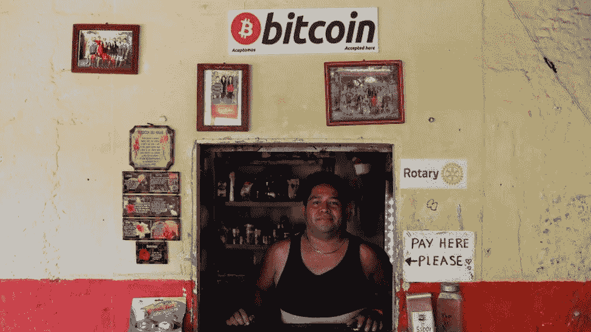
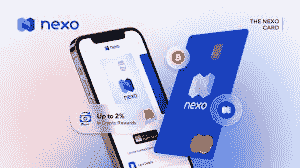
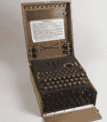
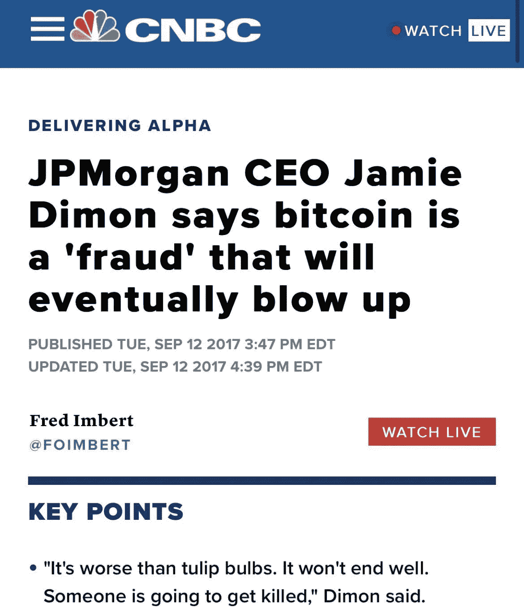
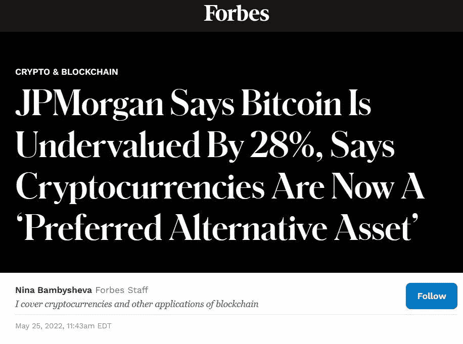
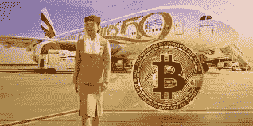

# 阿联酋加密应用的转变

> 原文：<https://medium.com/coinmonks/the-shift-in-uaes-crypto-adoption-9a0450d6c407?source=collection_archive---------23----------------------->

您知道吗？在阿联酋，您很快就可以用密码预订机票、购买房产、支付学费、享受居家度假、送货上门以及支付体育赛事费用。

对许多人来说，这毫无意义，但对于那些拥有加密资产的人来说，这在地区采用方面是一个突破。

对我来说，上个月是一个里程碑式的时刻，(不，不是因为我是 Luna holder，庆祝我的生日，或者在一场拳击比赛中担任我的体育偶像之一弗洛伊德·梅威瑟的裁判)，而是我第一次能够在阿联酋当地使用加密借记卡(Nexo Wallet)。(Yippie)

是的，你可能认为刷借记卡算不上什么成就，但对于地区加密资产持有者来说，这一直是个挑战。事实上，申请加密借记卡并被接受就像试图破解英格玛密码一样，这让我想起了零售消费者面临的地区性挑战。回想几年前——在 BitOasis 和 Rain 出现之前，试图将资金引入交易所就像进入了一层黑暗的网络。这总是让加密资产持有者感到沮丧，尤其是当生活在一个以创新、技术和未来为荣的城市时。

快进到今天，我们看到阿联酋(以及全球)在态度、采用和监管框架方面发生了翻天覆地的变化。这种对数字资产和加密货币的新关注意味着阿联酋可以利用该行业的大规模增长，成为世界领先的全球加密中心之一。这在全球范围内得到了回应，积极的采用，比以前更少的阻力和进入壁垒-只需看看 JP 摩根的分析中的以下对比就可以支持这一点:

2017 年——摩根大通首席执行官杰米·戴蒙(Jamie Dimon)表示，比特币是一个最终会爆炸的“骗局”。

2022 年——摩根大通表示，比特币被低估了 28%，加密货币现在是一种“首选替代资产”

具体来说，自今年年初以来，我们已经看到以下在阿联酋的采用情况(带有支持链接)；

迪拜成立首个数字资产管理局，阿联酋迎来加密交易所。

12 月/3 月—币安宣布计划开设迪拜办事处，并获得在迪拜运营的许可

[https://coin telegraph . com/news/it-s-official-币安-secures-a-license-to-operate-in-Dubai](https://cointelegraph.com/news/it-s-official-binance-secures-a-license-to-operate-in-dubai)

3 月—迪拜宣布成立首个虚拟资产监管机构[https://www . Reuters . com/world/middle-east/Dubai-adoptes-first-law-governing-Virtual-assets-ruler-2022-03-09/](https://www.reuters.com/world/middle-east/dubai-adopts-first-law-governing-virtual-assets-ruler-2022-03-09/)

*VARA —通过沙盒总部进入元宇宙

 [## 迪拜虚拟资产监管机构带着沙盒总部进入元宇宙

### 迪拜虚拟资产监管局(VARA)宣布进入元宇宙，成立…

gulfbusiness.com](https://gulfbusiness.com/dubais-virtual-assets-regulatory-authority-enters-the-metaverse-with-sandbox-hq/) 

3 月—Crypto.com 和 Bybit 计划在迪拜开展业务

[https://gulf business . com/crypto-com-by bit-announce-plans-to-set-up-operations-in-Dubai/](https://gulfbusiness.com/crypto-com-bybit-announce-plans-to-set-up-operations-in-dubai/)

4 月—北海巨妖从 ADGM 获得了在阿布扎比运营虚拟资产的许可

 [## 北海巨妖加密交易所获得 ADGM 在阿布达比运营的许可证

### 北海巨妖，世界上最大的加密货币交易所之一，获得了阿布扎比全球…

www.thenationalnews.com](https://www.thenationalnews.com/business/technology/2022/04/25/crypto-exchange-kraken-secures-adgm-licence-to-operate-in-abu-dhabi/) 

商家采纳和接受

3 月—迪拜公民学校(教育)-[https://www . Arabian business . com/industries/Education/du Bais-citizens-School-accepts-tutory-fees-in-bit coin-and-ether eum-payments-as-crypto-entries-middle-east-Education-sector](https://www.arabianbusiness.com/industries/education/dubais-citizens-school-accepts-tuition-fees-in-bitcoin-and-ethereum-payments-as-crypto-enters-middle-east-education-sector)

4 月— Damac(房地产)—[https://www . Damac properties . com/en/news/Damac/du Bais-developer-Damac-says-will-accept-cryptocurrences-bit coin-and-ether eum](https://www.damacproperties.com/en/news/damac/dubais-developer-damac-says-will-accept-cryptocurrencies-bitcoin-and-ethereum)

4 月— Nakheel(房地产)—[https://www . Arabian business . com/money/wealth/money-wealth-Real-Estate/nak heel-accepts-crypto-payments-for-rent-service-fees-and-Real-Estate-purchases-in-partnership-with-hayvn](https://www.arabianbusiness.com/money/wealth/money-wealth-real-estate/nakheel-accepts-crypto-payments-for-rent-service-fees-and-real-estate-purchases-in-partnership-with-hayvn)

4 月—yalamarmarket(杂货交付)[https://www . khaleejtimes . com/cryptocurrency/UAE-Delivery-firm-now-accepts-cryptocurrency-as-payment](https://www.khaleejtimes.com/cryptocurrency/uae-delivery-firm-now-accepts-cryptocurrency-as-payment)

4 月— Bake and More(零售咖啡馆)—[https://globalcioforum . com/Bake-n-More-cafe-accepting-six-crypto-payments-through-mixin-network/](https://globalcioforum.com/bake-n-more-cafe-accepting-six-crypto-payments-through-mixin-network/)

5 月—阿联酋航空公司(航空)—[https://block works . co/Emirates-airline-to-accept-bit coin-payments-and-launch-NFT-collection/](https://blockworks.co/emirates-airline-to-accept-bitcoin-payments-and-launch-nft-collection/)

5 月— MAF(零售集团)—[https://gulf news . com/business/Retail/majid-al-futtaim-ties-up-with-币安-for-NFT-listings-crypto-payments-1.88262171](https://gulfnews.com/business/retail/majid-al-futtaim-ties-up-with-binance-for-nft-listings-crypto-payments-1.88262171)

5 月——Ashish & Metha Associates 律师和法律顾问(律师事务所)——[https://cryptoslate . com/Dubai-based-Law-firm-school-to-start-accepting-crypto-payments/](https://cryptoslate.com/dubai-based-law-firm-school-to-start-accepting-crypto-payments/)

5 月—阿尔庄园酒店(酒店)—[https://gulf news . com/business/tourism/Dubai-hotel-now-allows-guests-pay-using-crypto-currency-after-币安-tie-1.163889210909](https://gulfnews.com/business/tourism/dubai-hotel-now-allows-guests-to-pay-using-crypto-currency-after-binance-tie-up-1.1653889210909)

体育赛事

5 月—弗洛伊德·梅威瑟—全球巨人赛事-[https://English . alarabiya . net/News/gulf/2022/04/21/Dubai-to-host-world-s-first-Dubai-pay-per-view-sports-event-for-May weather-fight-in-May](https://english.alarabiya.net/News/gulf/2022/04/21/Dubai-to-host-world-s-first-NFT-pay-per-view-sports-event-for-Mayweather-fight-in-May)

我有幸担任拳击裁判和官员。(*特别感谢阿布扎比在如此短的时间内接手这项活动，并上演了一场精彩的演出**)。

这就是你们看到的，自 2022 年初以来，我们在阿联酋看到了十多项重要的加密采用计划，我必须说，这非常令人鼓舞。此外，随着正在进行的许可审批，以及主要交易所在该地区(Crypto.com 币安、北海巨妖和 ByBit)设立办事处，我可以预见商家采用、消费者支付选项和其他与加密相关的商业合作伙伴关系将发生巨大变化。

> 加入 Coinmonks [电报频道](https://t.me/coincodecap)和 [Youtube 频道](https://www.youtube.com/c/coinmonks/videos)了解加密交易和投资

# 另外，阅读

*   [印度的加密交易所](/coinmonks/bitcoin-exchange-in-india-7f1fe79715c9) | [比特币储蓄账户](/coinmonks/bitcoin-savings-account-e65b13f92451)
*   [OKEx vs KuCoin](https://coincodecap.com/okex-kucoin) | [摄氏替代度](https://coincodecap.com/celsius-alternatives) | [如何购买 VeChain](https://coincodecap.com/buy-vechain)
*   [币安期货交易](https://coincodecap.com/binance-futures-trading)|[3 commas vs Mudrex vs eToro](https://coincodecap.com/mudrex-3commas-etoro)
*   [如何购买 Monero](https://coincodecap.com/buy-monero) | [IDEX 评论](https://coincodecap.com/idex-review) | [BitKan 交易机器人](https://coincodecap.com/bitkan-trading-bot)
*   [CoinDCX 评论](/coinmonks/coindcx-review-8444db3621a2) | [加密保证金交易交易所](https://coincodecap.com/crypto-margin-trading-exchanges)