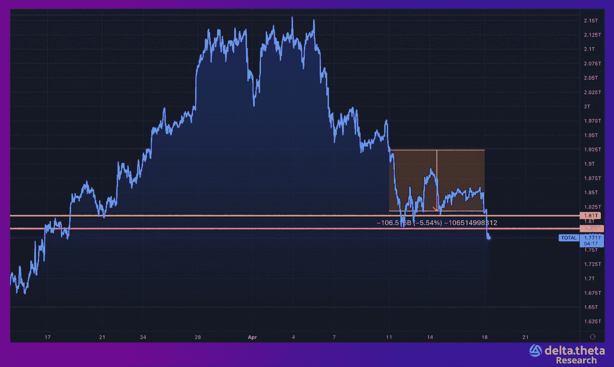
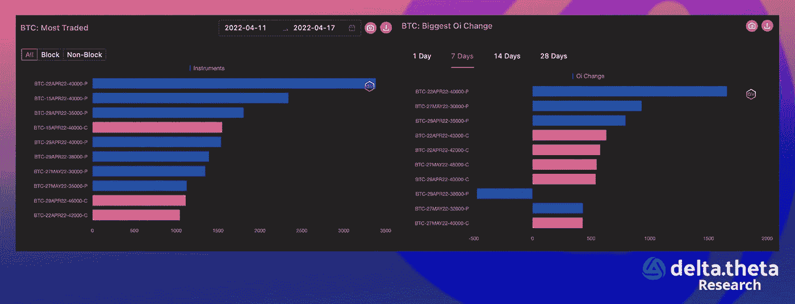
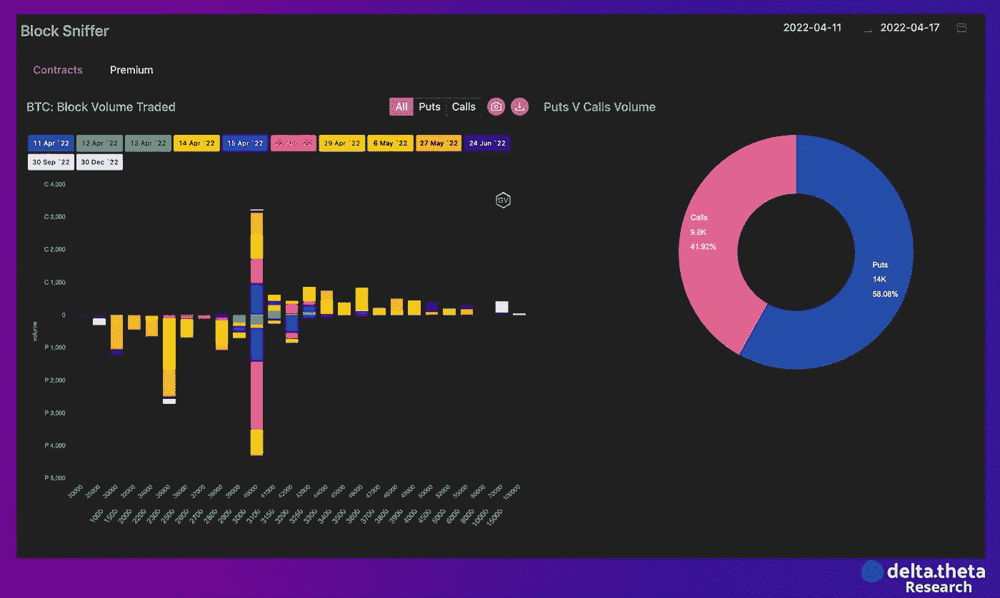

# 加密货币市场的形势预计不会乐观——每周 4 月 19 日评论

> 原文：<https://medium.com/coinmonks/the-situation-in-the-cryptocurrency-market-is-not-expected-to-be-rosy-weekly-april-19-review-f94e48135ef?source=collection_archive---------34----------------------->

4 月 11 日至 18 日这一周，加密市场继续下跌。因此，加密货币总市值指数在过去一周内从 1.922 万亿美元降至 1.818 万亿美元(降幅为 5.4%)。在此期间，还形成了 4 月份的低点——1.81 吨和 1.787 吨，我们可以在其完成后立即看到其“崩溃”(在 4 月 18 日上午，该指数跌至 1.771 万亿美元)。这为市场进一步下跌铺平了道路。

一个相当明显且绝对正确的假设是，在上周，比特币价格的轨迹与整体市场几乎相似。跌幅由 42 350 开始，至 38 900 结束(整体跌幅为 8.1%)。在这种情况下，我们可以看到 40 000 点心理水平的“突破”及其下方的价格固定。

以太坊在过去一周从 3185 点跌至 2890 点(下跌 9.3%)。该资产还在 3000 点的心理关口下方盘整，在市场高度不确定性和来自宏观经济因素的额外压力的背景下，这可能导致进一步下跌。在以太坊的情况下，网络在 DeFi 和 NFT 部分的活动减少应单独强调。

# 新闻

加密货币交易平台 Fasset [在 a 轮投资中筹集了](https://www.theblockcrypto.com/linked/142067/fasset-raises-22-million-plans-expansion-in-indonesia-pakistan)2200 万美元。该公司将利用这笔资金开发新产品，并在亚洲扩展其基于数字资产的转账服务。这轮投资由纽约的 Liberty City Ventures 和巴基斯坦的 Fatima Gobi Ventures 牵头。Soma Capital 和 MyAsiaVC 也参加了这轮投资。

美国总统乔·拜登[表示](https://www.nytimes.com/2022/04/15/business/economy/michael-barr-federal-reserve.html)他计划提名迈克尔·巴尔为下一任美联储监管副主席。巴尔之前在奥巴马总统的财政部工作，帮助制定金融机构的监管框架。巴尔后来成为分布式计算技术公司 Ripple 的顾问。他目前是密歇根大学的教员。

周日早上，基于以太坊的稳定币信用协议[beanstalk](https://www.theblockcrypto.com/linked/142272/ethereum-based-stablecoin-protocol-beanstalk-loses-more-than-80-million-to-exploit)遭到黑客攻击。根据区块链安全公司 PeckShield 的调查结果，该协议在各种加密资产中损失了约 1.82 亿美元。黑客提取了 8000 万美元，然后通过龙卷风现金“洗钱”。

Uniswap Labs 是最大的去中心化加密货币交易所的主要开发商，[希望通过引入允许其界面嵌入任何网站的代码来发展](https://www.bloomberg.com/news/articles/2022-04-14/crypto-s-top-decentralized-spot-market-eyes-way-to-dominate-web3?srnd=technology-vp)。这个小工具可以通过插入一行代码来添加，例如，它将允许 OpenSea 用户在不离开运行它的网站的情况下交换各种令牌，并且最初也可以在其他一些平台上使用。早些时候，该公司[成立了一个风险投资部门](https://www.theblockcrypto.com/post/141485/uniswap-labs-launches-venture-unit-to-invest-in-web3-projects)来投资 web3 初创企业。

# 市场形势

过去一周，看跌期权交易仍是交易活动和溢价的主要来源。相对于市场增长时期，当时每份看跌合约有三个看涨期权，现在这一比例已经稳定下来，最近看跌期权的交易甚至更加频繁。这种变化可能是市场进一步下跌的间接信号。特别重要的交易量来自短期(最长 30 天)期权——交易员预计，随着美国美联储立场变得更加强硬，资本市场将在不久的将来重新评估。随着大多数地区储备银行行长支持立即加息 0.5%并进一步收紧货币政策，以及加密货币市场仍与纳斯达克科技指数高度相关，市场形势将不会是最光明的。这些担忧反映在交易策略和期权类型中。

在比特币的大宗期权交易中，一个主要的执行交易位于 40 000 点水平。在美联储 5 月份召开下一次会议之前，这些交易也大多是短期的。第二大看跌期权交易量为 35 000 点，如果市场继续下跌，这可能是一个目标。

目前，市场正在积极对冲各国央行大幅加息和货币政策变化的可能性。短期而言，加密货币相对于传统资本市场仍然疲软，传统资本市场反过来越来越缺乏交易理念，也缺乏强劲的增长和下行趋势逆转驱动力。

1️⃣ [如何通过 dex 购买$ dlta】](https://optiondeltatheta.medium.com/how-to-buy-dlta-through-dexs-27184213b93a)

2️⃣ [如何使用 ChainPort 在网络间移动 DLTA 令牌](https://optiondeltatheta.medium.com/how-to-transfer-dlta-tokens-between-networks-using-chainport-851e30ab4bbd)

3️⃣ [专业版指南](https://optiondeltatheta.medium.com/pro-version-guide-32e843713ba8)

4️⃣ [基本术语摘要](https://optiondeltatheta.medium.com/basic-options-terminology-step-by-step-digest-part-1-4700d0bd63a3)

DOT/MATIC/AAVE 和其他 [deltatheta.tech](https://app.deltatheta.tech/terminal/DOT-BUSD) 上的交易选项

[电报聊天](https://t.me/deltatheta) // [交易场外聊天](https://t.me/deltatheta_TradingGroup)

> 加入 Coinmonks [电报频道](https://t.me/coincodecap)和 [Youtube 频道](https://www.youtube.com/c/coinmonks/videos)了解加密交易和投资

# 另外，阅读

*   [Bookmap 评论](https://coincodecap.com/bookmap-review-2021-best-trading-software) | [美国 5 大最佳加密交易所](https://coincodecap.com/crypto-exchange-usa)
*   最佳加密[硬件钱包](/coinmonks/hardware-wallets-dfa1211730c6) | [Bitbns 评论](/coinmonks/bitbns-review-38256a07e161)
*   [新加坡十大最佳加密交易所](https://coincodecap.com/crypto-exchange-in-singapore) | [购买 AXS](https://coincodecap.com/buy-axs-token)
*   [红狗赌场评论](https://coincodecap.com/red-dog-casino-review) | [Swyftx 评论](https://coincodecap.com/swyftx-review) | [CoinGate 评论](https://coincodecap.com/coingate-review)
*   [投资印度的最佳密码](https://coincodecap.com/best-crypto-to-invest-in-india-in-2021)|[WazirX P2P](https://coincodecap.com/wazirx-p2p)|[Hi Dollar Review](https://coincodecap.com/hi-dollar-review)
*   [加拿大最佳加密交易机器人](https://coincodecap.com/5-best-crypto-trading-bots-in-canada) | [库币评论](https://coincodecap.com/kucoin-review)