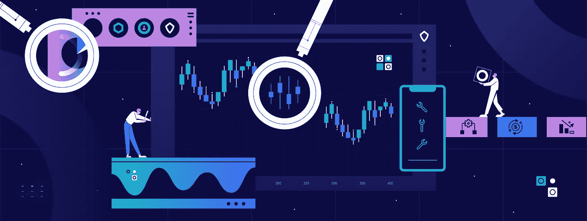

# 2022 年尝试的六种最佳加密技术工具

> 原文：<https://medium.com/coinmonks/the-six-best-crypto-technical-tools-to-try-in-2022-82e8ff8e2bbb?source=collection_archive---------6----------------------->

The Six Best Crypto Technical Tools to Try in 2022

顶级加密货币技术工具帮助 2022 年导航加密市场

在过去的几年里，密码交易行业呈指数级增长。这个市场很年轻，如今已经成为最受欢迎的投资平台之一。

不用说，crypto 也容易受市场变化的影响，这使得它成为风险最大的投资资产之一。有经验的投资者可以利用这个漏洞获利。然而，许多新投资者在没有任何知识或教育的情况下投入市场。技术工具是弥补这一差距的好方法，它为各种类型的投资者提供了做出更好交易决策的信息。

# 2022 年最佳加密技术分析工具

技术[工具](https://www.cryptohopper.com/blog/1395-best-cryptocurrency-trading-tools-for-beginners)可以帮助投资者分析市场状况，做出更好的投资决策。这里有一些最好的加密技术工具，可以帮助分析市场。

# 交易视图

[TradingView](https://www.tradingview.com) 是使用最广泛的图表工具之一。它是一个基于云的平台，可以很容易地下载到你的手机上。这个工具在传统市场非常受欢迎，现在它也已经成为密码交易员的趋势图表工具之一。

通过 TradingView，用户可以扫描市场，并从比特币基地、币安、Bitfinex 和 Bittrex 等加密交易所收集数据。该工具允许您登录不同的加密交易所，并查看和比较它们的实时价格图表。

TradingView 的好处之一就是它是一个基于社区的平台。他们的社交网络相当活跃。你可以分享和发表你的想法，并从社区中其他交易者分享的交易策略中学习。

随着 TradingView 应用程序越来越受欢迎，许多加密交易所正在将它们的价格图表与它们集成在一起。TradingView 基本计划提供免费服务，您可以在其中绘制各种加密货币和替代硬币。

# Coinigy

[Coinigy](https://www.coinigy.com) 于 2014 年首次投入运营。它与 TradingView 非常相似，可以映射来自超过 45 个加密交换平台的加密图表。你可以跨交易所交易，并在手机上接收短信提醒。用户还可以通过 API 从他们的 Coinigy 账户进行 24 小时交易。

与 TradingView 不同，Coinigy 没有免费的基本计划。用户可以登录并试用 30 天试用版，看看效果如何。他们每月收取 15 美元的费用，但没有隐藏费用或交易佣金。

通过基本计划，客户可以使用超过 75 种技术工具和指标，可以根据自己选择的交易所进行交易，并在市场变化时获得即时短信提醒。

# 玻璃节点

Glassnode 是一款在线数据和市场情报区块链分析工具。这是一个基于 API 的网络应用程序，让你了解市场。

Glassnode 为投资者提供加密交易数据、指标、矿工数据、钱包持有量、盈利/亏损等相关信息。该工具允许您查看市场详情、成功交易、硬币价格数据和有效地址。

客户可以从应用程序中获得提醒和下载市场数据。他们的免费基本计划每天更新。付费版本的年费分别为每月 29 美元和 799 美元。这些层级经常更新，并带有额外的指标。

# 硬币度量

[Coin Metrics](https://coinmetrics.io) 成立于 2017 年，是一款线上和线下均可使用的加密市场数据分析工具。它帮助投资者、分析师和研究人员了解加密市场动态。Coin Metrics 提供市场可视化工具、数据馈送、指数、价格参考利率和指标。客户还可以查看 Twitter 上的信息，了解市场情绪。

该平台涵盖 100 多种加密资产。您也可以注册他们的每周简讯，并获得大量的报告和密码市场的话题。

# 共同市场

想知道密码市场的动向吗？注册并通过加密货币日历 [CoinMarketCal](https://coinmarketcal.com/en/) 了解最新事件和新闻。

CoinMarketCal 是一个研究工具，它向用户更新与不同加密货币相关的市场即将发生的事件。这是一个社区驱动的社交平台。在这里，用户提供关于加密事件的见解和基于研究的新闻。

用户提交后，该新闻将由平台上的其他用户进行验证。正确的新闻被投票支持，虚假的新闻被投票反对。想要了解特定事件或硬币信息的用户只需点击链接，进入相关页面。

# 隐景

[CryptoView](https://www.cryptoview.com) 允许您跨多个交换平台、冷库和第三方钱包跟踪加密货币持有情况。它是一个一体化的交易解决方案，提供实时数据，简化交易策略，并允许客户通过多个交易账户在多个交易交易所进行操作。

CryptoView 帮助客户通过单一界面管理多个投资组合。用户可以查看加密货币的价格，并通过分析多个交易所的统计数据和交易历史来评估其性能。他们还可以通过 singer 用户界面跟踪交易历史。

CryptoView 加载了一些功能。它有超过 75 个绘图工具，85 个技术指标和屏幕布局。该工具允许用户通过与 TradingView 图表工具的集成来配置交易对和绘制图表。

客户可以通过电子邮件或短信获得关于最新加密新闻和事件日历的提醒和通知。CryptoView 提供 30 天的免费试用期。订阅计划每月从 13 美元到 19 美元不等，他们为订阅一年计划的用户提供 30%的折扣。

# 外卖食品

加密技术工具是帮助用户更好地驾驭市场的宝贵资产。许多工具都提供免费试用期，在此期间你可以尝试并决定哪一个最适合你。熟悉这些工具有助于你跟踪价格的变动，并占据上风。

*最初发表于*[*【https://www.cryptohopper.com】*](https://www.cryptohopper.com/blog/5287-the-six-best-crypto-technical-tools-to-try-in-2022)*。*

> *加入 Coinmonks* [*电报频道*](https://t.me/coincodecap) *和* [*Youtube 频道*](https://www.youtube.com/c/coinmonks/videos) *了解加密交易和投资*

# 另外，阅读

*   [Bookmap 评论](https://coincodecap.com/bookmap-review-2021-best-trading-software) | [美国 5 大最佳加密交易所](https://coincodecap.com/crypto-exchange-usa)
*   最佳加密[硬件钱包](/coinmonks/hardware-wallets-dfa1211730c6) | [Bitbns 评论](/coinmonks/bitbns-review-38256a07e161)
*   [新加坡十大最佳加密交易所](https://coincodecap.com/crypto-exchange-in-singapore) | [购买 AXS](https://coincodecap.com/buy-axs-token)
*   [红狗赌场评论](https://coincodecap.com/red-dog-casino-review) | [Swyftx 评论](https://coincodecap.com/swyftx-review) | [造币厂评论](https://coincodecap.com/coingate-review)
*   [投资印度的最佳密码](https://coincodecap.com/best-crypto-to-invest-in-india-in-2021)|[WazirX P2P](https://coincodecap.com/wazirx-p2p)|[Hi Dollar Review](https://coincodecap.com/hi-dollar-review)
*   [加拿大最佳加密交易机器人](https://coincodecap.com/5-best-crypto-trading-bots-in-canada) | [库币评论](https://coincodecap.com/kucoin-review)
*   [火币加密交易信号](https://coincodecap.com/huobi-crypto-trading-signals) | [HitBTC 审核](/coinmonks/hitbtc-review-c5143c5d53c2)
*   [如何在 FTX 交易所交易期货](https://coincodecap.com/ftx-futures-trading) | [OKEx vs 币安](https://coincodecap.com/okex-vs-binance)
*   [OKEx vs KuCoin](https://coincodecap.com/okex-kucoin) | [摄氏替代品](https://coincodecap.com/celsius-alternatives) | [如何购买 VeChain](https://coincodecap.com/buy-vechain)