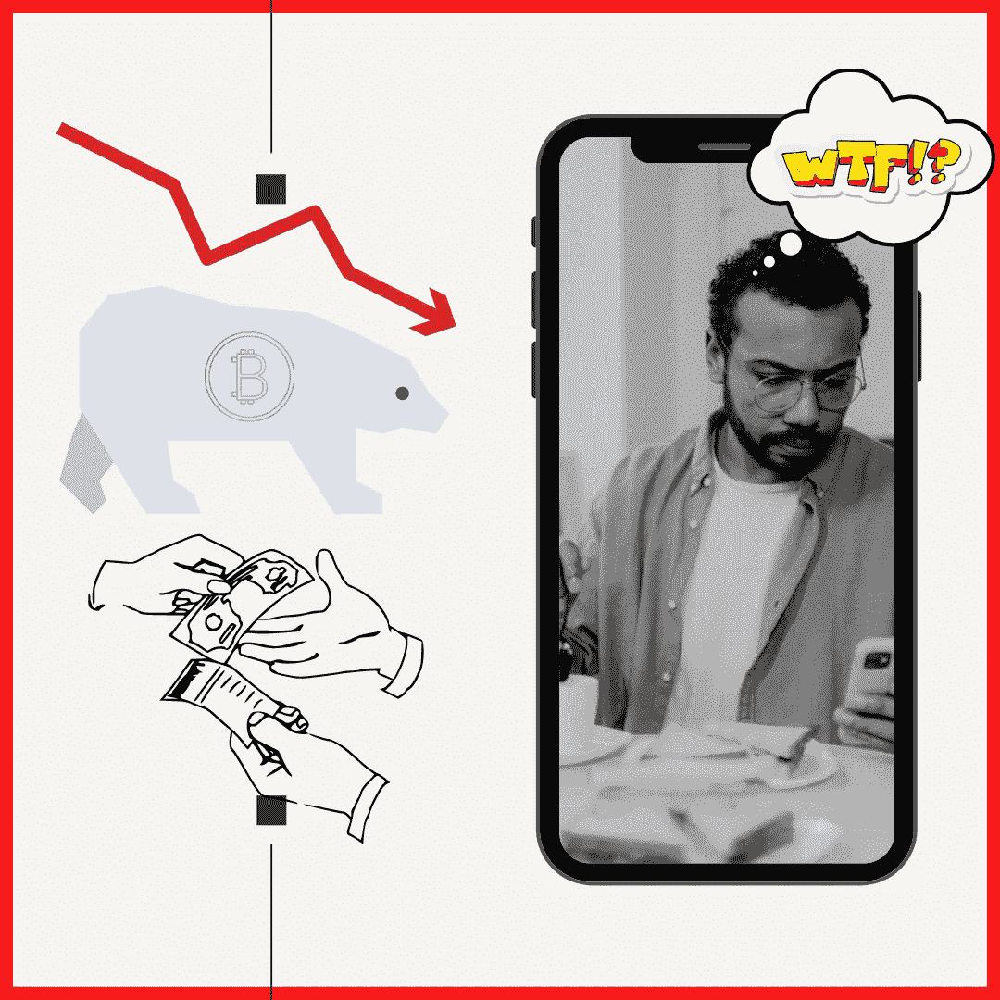

# 当别人都失去利润时，我保留秘密利润的六种方法

> 原文：<https://medium.com/coinmonks/the-six-ways-i-kept-my-crypto-profits-while-everyone-else-lost-them-254214dc10f7?source=collection_archive---------7----------------------->

## 赔钱是痛苦的。开始一场比赛以最后一名结束真糟糕。欢迎来到霍德勒现场。

Source: Self Created Image with [Canva](http://www.canva.com).

**长期想法**

我认为数字资产对我们的社会有着持久的影响。创建分散式分类帐，以执行不可信的…