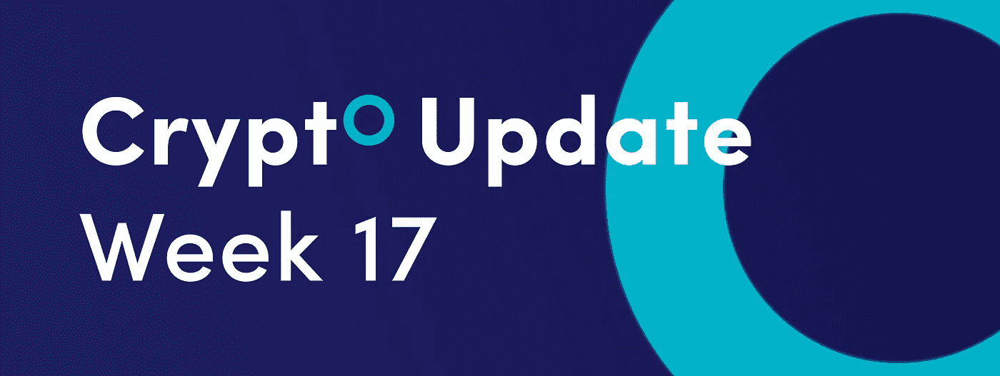
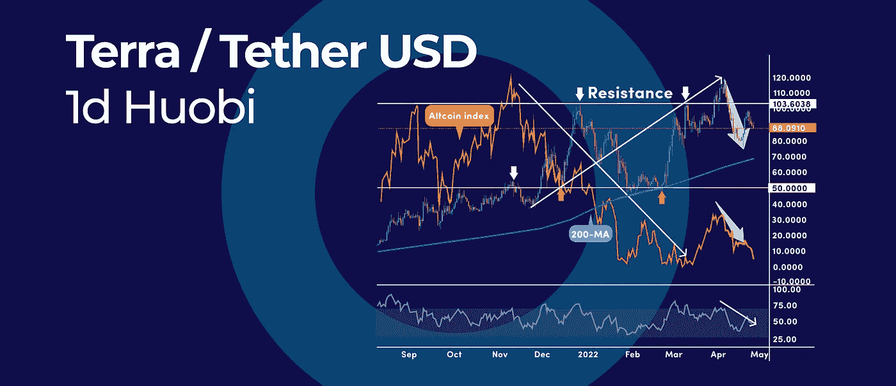
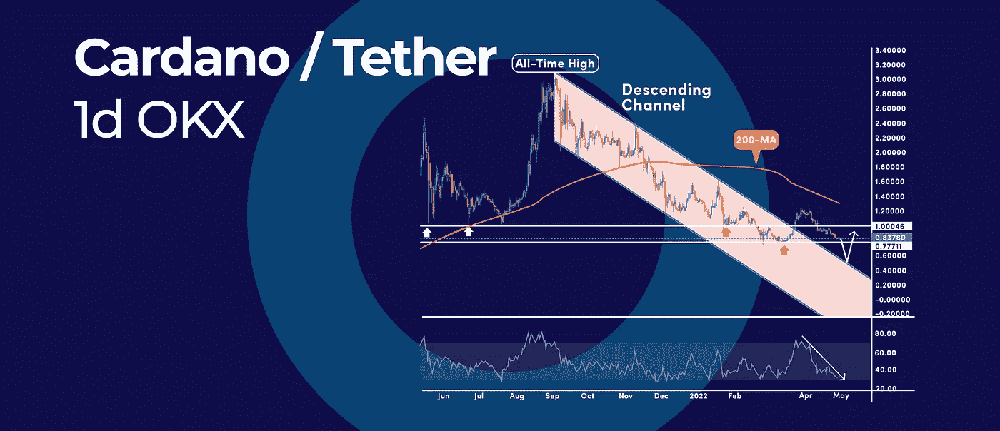
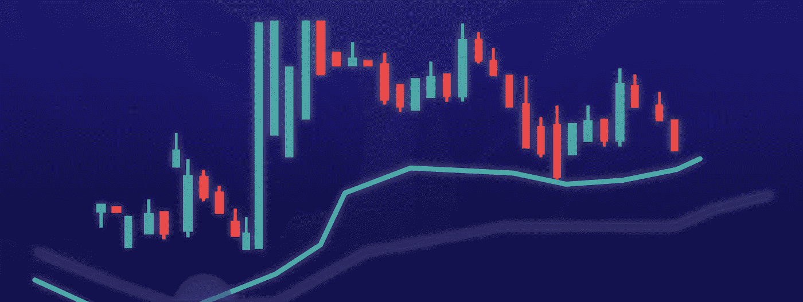

# 聪明的方法结合指标加密交易|和更多在本周加密更新。

> 原文：<https://medium.com/coinmonks/the-smart-way-to-combine-indicators-for-crypto-trading-and-more-in-this-weeks-crypto-update-7b5f3149efc0?source=collection_archive---------26----------------------->

*   这就是 LUNA 上升趋势放缓的原因
*   Cardano 在触底前跌到 50 美分的理由
*   组合密码交易指标的聪明方法

# 这就是 LUNA 上升趋势放缓的原因

在十大加密货币中，Terra (LUNA)的上升趋势最为明显。然而，短期来看，加密货币已经从 119.51 美元的历史高点回落，交易回到 100 美元的大心理水平以下。

# Altcoin 指数比较

相比之下，追踪 10 大另类硬币表现的另类硬币指数一直在稳步走低。然而，LUNA 没有理会加密市场的看跌势头，反而走高。

短期来看，我们可以看到 LUNA 价格开始跟踪整体市场表现，并与 ALTcoin 指数同步走低。这可能是上升趋势可能放缓的早期信号。

从技术上讲，我们仍处于强劲的上升趋势中，因为 LUNA price 的交易价格远高于关键的 200 天移动平均线。但随着势头转向下行，很有可能再次测试 200 毫安。

RSI 振荡指标上的看涨势头开始消退。跌破 50 这一中级水平表明市场更加悲观。

展望未来，LUNA price 可能会被困在 100 美元的高心理水平和 50 美元的重要回合数和关键支撑位之间的大区间内。

# Cardano 在触底前跌到 50 美分的理由

卡尔达诺(ADA)有可能恢复走低，跌至 0.5 美元。这种熊市情景的主要原因是 ADA 的下降通道，熊市可能会再次尝试标记。这将是一个经典的突破和重新测试价格结构。

# 下行通道

在 ADA 的日线图上形成了下降通道模式，价格从 3.09 美元的历史高点开始下跌。向上突破已经失去了动力，现在我们有 3 个看跌因素，要求更多的下跌:

1.  首先，在最初的失败反弹后，空头收复了 1.00 美元的心理数字。
2.  第二，RSI 读数也指向更低，因为振荡器回到 50 的中级水平以下，表明熊市势头。
3.  最后，ADA 的价格远低于其 200 天简单移动平均线，这表明我们处于熊市。

**展望**:下行的下一个主要支撑位接近当前年内低点 0.74 美元。如果日线跌破这个价位，ADA 的价格将有机会测试 0.50 美元，随后是下降通道的上倾斜趋势线。

# 组合密码交易指标的聪明方法

以有意义的方式结合技术指标，可以帮助加密货币交易者更准确地进行交易。然而，有这么多的技术指标供你使用，正确使用它们可能会令人生畏，充满挑战。

# 技术指标的类型

在技术分析中，指标可以分为三大类:

1.  趋势跟踪指标，如移动平均线、抛物线 SAR、MESA 等。
2.  像 RSI，随机指标等动力指标。
3.  OBV、资金流动指数等交易量指标。

一个有用的经验法则是结合技术指标，为我们提供不同的市场信号。但是不幸的是，即使是季节交易者也犯了一个常见的错误，他们使用广义的指标来给我们提供相同的信号。

例如，RSI 和随机指标都是动量指标，提供相同类型的市场信息。然而，如果我们比较这两个指标，我们注意到它们往往会同步上升和下降。

结合这两个指标可能会适得其反，因为它可能会误导交易者相信他们有一个融合的信号。这只是同样的信号，但从另一个角度来看。

# 如何结合技术指标

结合指标分析加密货币的聪明方法是使用属于不同类别的指标。例如，您可以将趋势跟踪指标(如移动平均线)和动量指标(如 RSI 指标)连接起来。

这种组合非常强大，因为均线显示趋势的方向，而 RSI 显示趋势有多强。因此，举例来说，如果价格高于移动平均线，RSI 也高于 50 的中间水平，我们有一个更可靠的信号，表明我们处于上升趋势，在趋势背后，我们有强大的看涨势头。

# 隐翅虫的综合指标

其他在隐头蝠上表现良好的指标尤其是台地和 MACD。台面是一个自适应移动平均线，是 Cryptohopper 的粘着指标。意思是只要台面显示看涨势头，就会发出继续发出“买入”的信号。相反，当台面显示看跌势头时，它会发出继续“卖出”的信号。

另一方面，MACD 发出单一的买入或卖出信号。在这种情况下，台面可以作为一个过滤器，就像我们上面的移动平均线的例子一样。因此，MACD 将成为该战略的入口和出口。

抛物面 SAR 是另一种指示器，其工作方式与台面一样，通过粘附信号工作。但是其他均线都不是 Cryptohopper 上的粘着信号做的。这意味着他们将只发送一个买入/卖出信号。因此，它们不适合用作抛物线 SAR 或 MESA 之类的滤波器。

订阅我们的媒体每周博客和更新。
在[推特上关注我们](https://twitter.com/cryptohopper) | [脸书](https://www.facebook.com/cryptohopper)|[Reddit](https://www.reddit.com/r/CryptoHopper/)|[insta gram](https://www.instagram.com/cryptohopper/?hl=nl)

在 [Cryptohopper](https://www.cryptohopper.com/) 开始交易！

> 加入 Coinmonks [电报频道](https://t.me/coincodecap)和 [Youtube 频道](https://www.youtube.com/c/coinmonks/videos)了解加密交易和投资

# 另外，阅读

*   [Cloudbet 赌场评论](https://coincodecap.com/cloudbet-casino-review) | [点火赌场评论](https://coincodecap.com/ignition-casino-review)
*   [加密套利](/coinmonks/crypto-arbitrage-guide-how-to-make-money-as-a-beginner-62bfe5c868f6)指南| [如何做空比特币](/coinmonks/how-to-short-bitcoin-568a2d0b4ae5)
*   [如何在加拿大购买加密货币？](https://coincodecap.com/how-to-buy-cryptocurrency-in-canada)
*   [无聊猿游艇俱乐部(BAYC)回顾](https://coincodecap.com/bored-ape-yacht-club-bayc-review) | [拜比特 vs 比特币基地](https://coincodecap.com/bybit-vs-coinbase)
*   [5 款最佳加密交易终端](https://coincodecap.com/crypto-trading-terminals) | [最佳 DeFi 应用](https://coincodecap.com/best-defi-apps)