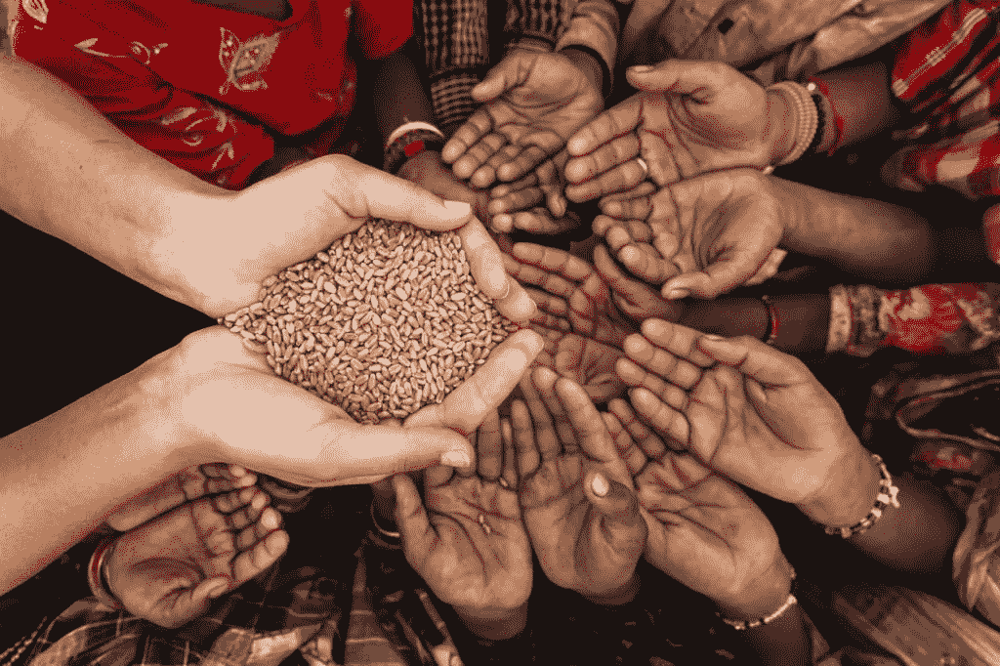
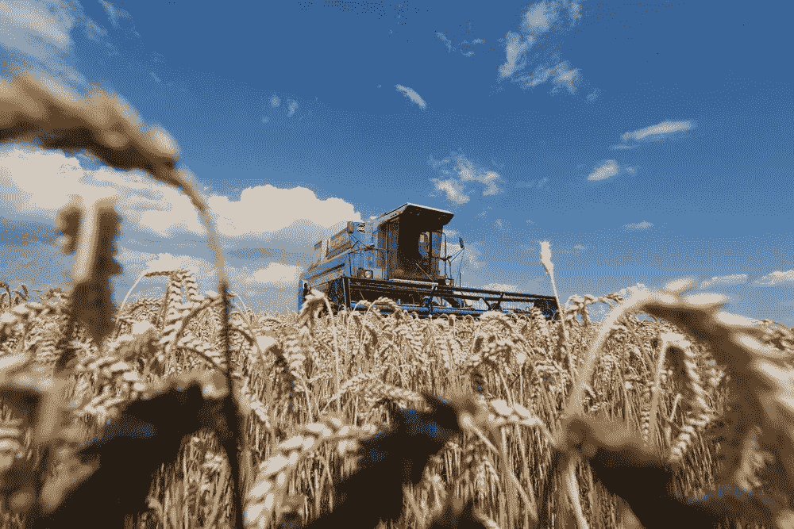
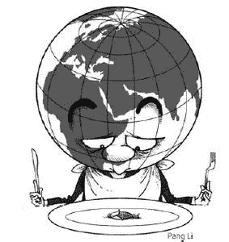
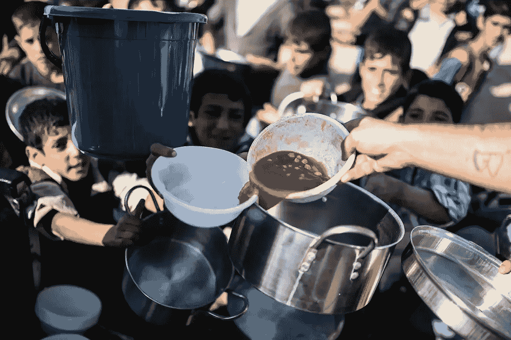
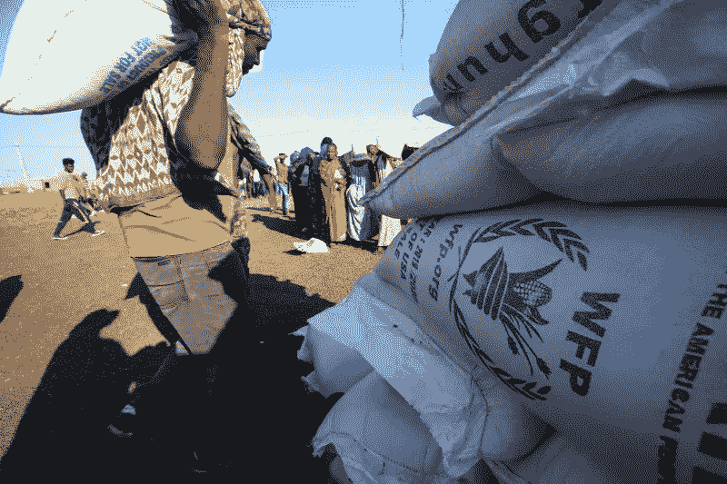
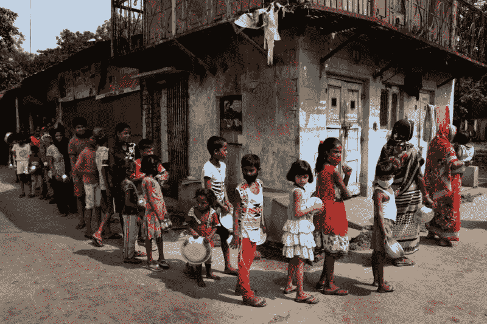
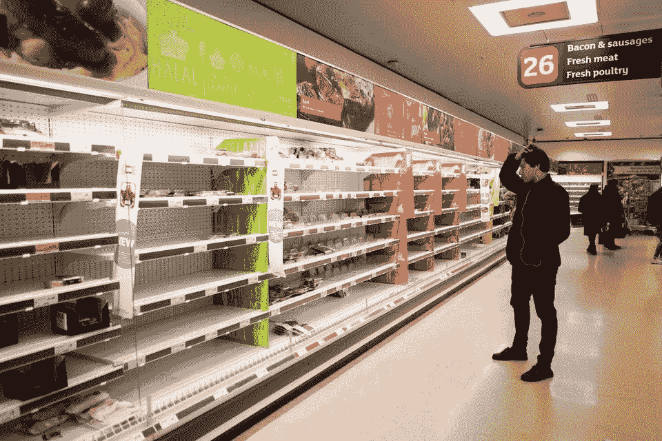

# 全球粮食危机的幽灵:现在会发生什么？

> 原文：<https://medium.com/coinmonks/the-specter-of-a-global-food-crisis-what-can-happen-now-c77f3e14987f?source=collection_archive---------15----------------------->

继新冠肺炎战争、疫情战争、T2 战争和 T3 战争之后，全球范围内的重大事件也在加速发展，T4 的粮食危机也不例外。

最近几个月，由于地缘政治紧张局势、金融投机和供求比例危机的综合影响，食品价格上涨的阴影正在世界各地聚集。这场战争就像一个引爆器，引发了已经一触即发的局势，市场动荡一周接一周地加剧，在全球粮食市场的一个关键点上爆发，进一步加剧了波动。

总部设在罗马的联合国粮农组织 T21 的报告“世界粮食安全和营养状况”估计，2021 年，34.8%的世界人口面临饥饿问题，其中 8.9%营养不良，25.9%营养不良

## 随着战争的爆发，情况可能会恶化

# 战争扰乱了食品市场

在***俄乌危机*** 的中心尤其是粮食市场:这场冲突也是一场**小麦争夺战**，因为*俄罗斯*和*乌克兰*占据了全球**小麦**(**35%**)**大麦**(**25%**)

价格动态证明了这一趋势，因为小麦期货价格*在 2 月初为每蒲式耳 764 美元，在 3 月 7 日战争最激烈的时候涨到了 1258 美元，涨幅约为 40% 。*

**

***小麦连续合约(W00)** 随后下跌，但稳定在远高于**每蒲式耳 1000 美元** ( *数量与约 35 升*数量相比)。*

*小麦期货的繁荣与衡量下列市场价格的人齐头并进:**黄豆芽【T12 月份**+8.27%**)**牛奶** ( **+7.35 %** )和**玉米**(**+15%**)**粮农组织的世界价格指数**在 2 月份的月度调查中创下历史新高。***

* [## 粮农组织粮食价格指数|世界粮食形势|联合国粮食及农业组织…

### “2022 年 4 月，粮农组织粮食价格指数* (FFPI)平均为 158.5 点，比历史最高水平下降 1.2 点(0.8%)

www.fao.org](https://www.fao.org/worldfoodsituation/foodpricesindex/en/) 

**粮农组织**还回顾说，由 ***【弗拉基米尔·普京】*** 牵头的国家也是 2021 年**世界** **最大的氮肥出口国**和**钾肥和磷肥市场的第二大供应国**农业和功能性牲畜饲料作物的主要产品类别。* 

# *危机前线*

**

*因此，随着 2021 年留给我们的是严重的饥荒问题和处于崩溃边缘的国家，其他热点并不缺乏:*

*   *塔利班已经重新掌权；*
*   *[战火纷飞**也门**](https://www.cfr.org/global-conflict-tracker/conflict/war-yemen)；*
*   **提格雷地区—* 埃塞俄比亚**内战的主要战场；***
*   ***撒哈拉以南非洲国家**被*沙漠化围困；**
*   *马达加斯加正在与半个世纪以来最严重的干旱作斗争*
*   *T42 的食品短缺和飞涨的通货膨胀正困扰着这个国家，斯里兰卡正处于完全无政府状态的边缘。*

*这些只是受气候变化和政治危机影响的几个主要地区。*

## *后 Covid 时代全球范围内的复苏和战争“大爆炸”之后的通胀上升的动力完成了剩下的部分。*

*这是因为随着战争而来的是引发完美风暴的三重理想问题。 ***首先是*** ，**地缘政治和经济的不确定性**导致粮食商品以及对获取这些商品至关重要的产品(如化肥)的期货和价格上涨。第二个 ，它导致了全球供应链的**去结构化**和贸易份额损失的风险，这在敖德萨一个例子中显而易见，这个城市接近被围困，从它的港口运出足够养活 4 亿人的食品原料。 ***最后*** ，**保护主义措施的鼓励和对粮食主权的保护增加了不稳定性。***

**

*A protester in Sri Lanka as the country struggles to replenish its supplies due to skyrocketing inflation*

*一场" ***真正的混乱"****——主要是全球粮食供应链*脱节——的迫在眉睫的风险，这种现象在西方将以一波**食品涨价**的形式表现出来，从**谷物**产品到**肉类**，或者从 ***匈牙利*** 的举动，到总理*维克多·欧尔班**

* [## 匈牙利禁止谷物出口，担心俄罗斯入侵将引发“严重”短缺

### 黑海地区是全球谷物出口的主要供应商。乌克兰——通常被称为“的粮仓”

www.telegraph.co.uk](https://www.telegraph.co.uk/world-news/2022/03/05/hungary-bans-grain-exports-amid-fears-russian-invasion-will/) 

但是，在全球价格飙升的背景下，这将特别影响那些已经受到人道主义危机困扰的地区。从*中东*到*北非*，国家如*刚果民主共和国、苏丹、利比亚和也门*。

所有这些因素进一步加强了**武器和**饥饿之间的联系，这对于 [***世界粮食计划***](https://www.wfp.org/) 来说是粮食危机的主要原因之一。

## 粮食不安全变成了地缘政治不安全和资源竞争。

后者加剧了紧张局势，并在环境不稳定的背景下，也凸显了诸如争夺**食品原料**和**水**等重要问题，我们注意到，即使在俄罗斯-乌克兰冲突中，这一因素也不是次要的。* 

# *一个全球性的问题*

**

*Ashraf Shazly — AFP/ Getty Images*

> *“现在谈论的不是是否会有全球粮食危机，而是它会有多广泛，”*

*国际化肥分销巨头 Yara 的负责人 Svein Tore Holsether 告诉 BBC，他指出*

> *“即使在战争爆发之前，我们就已经处于北半球的一个非常微妙的时期，每年的这个时候，原材料必须开始转移到它们将被加工的地方。”*

* [## 乌克兰战争“对全球粮食是灾难性的”

### BBC 新闻商务记者艾玛·辛普森报道乌克兰战争将给全球供应和成本带来冲击…

www.bbc.com](https://www.bbc.com/news/business-60623941) 

这可能是一个**[**gribusiness***【莱曼兄弟】*](https://www.ft.com/content/02095093-329b-4b66-9f80-13d07350014c) 的时刻，俄罗斯和乌克兰对世界市场(尤其是发展中市场)至关重要的供应中断，威胁到未来时期的稳定和增长。**

**来自**联合国**的相关报告指出，作为欧洲*【粮仓】的乌克兰，大约三分之一的可耕地今年可能不适合耕种，俄罗斯的出口也因该国被排除在国际市场之外以及 **Swift 系统**而受到损害。***

***农业危机称之为*(例如*西班牙*从乌克兰进口五分之一的牲畜饲料)，****

**** [## 西班牙农业部长:欧盟农村地区面临“本世纪最困难的时刻”

### 西班牙农业 Luis Planas 告诉 EURACTIV 的记者，欧盟农村正面临本世纪最困难的时刻

www.euractiv.com](https://www.euractiv.com/section/agriculture-food/news/spanish-agri-minister-eus-rural-areas-face-most-difficult-moment-of-the-century/) 

能源危机影响全面，新的市场壁垒影响其余的。所有这些都是在气候变化的背景下发生的，气候变化加剧了自然灾害，对粮食安全产生了影响。**** 

# ****令人担忧的画面****

********

******粮农组织**首席经济学家马克西莫·托雷罗·卡伦 去年 12 月在接受*华盛顿邮报*采访时指出，在当前的粮食危机中:****

> ****"我们仍然有食物供应，但问题是获取途径."****

**** [## 分析|在干旱、冲突和飞涨的价格中，一场全球粮食危机可能正在逼近…

### Placeholder 当文章操作加载时，您正在阅读今天的 WorldView 时事通讯的摘录。注册以获得…

www.washingtonpost.com](https://www.washingtonpost.com/world/2021/12/15/global-food-crisis-pandemic/) 

严峻的现实是，占主导地位的经济体系已经将许多国家，尤其是 T2 的发展中国家推向了大规模的专业化和 T4 的经济模式，这种模式的基础是生产一些主要用于出口的产品，然后不得不进口所有其他产品，这是 T6 体系的关键结构，T8 造成了依赖。

这个问题在我们面临的地方产生了反响:

*   快速变化的全球化，俄罗斯和西方日益脱钩；
*   与**地缘政治竞争相关的**贸易普遍不安全；
*   通货膨胀和能源危机使几乎所有商品和日用品的价格普遍上涨。

这是全球体系的一部分，当市场受到冲击时， ***力量相互关联有*** 内爆的风险，并能困住地球上最脆弱的国家。2010 年至 2011 年全球食品价格上涨的教训可以帮助我们理解可能的后果，尤其是在一个不断恶化的体系中。

 [## 2010-2012 年世界粮食价格危机-维基百科

### 继 2007-2008 年世界粮食价格危机和 2009 年高价格的短暂平静之后，世界各地的粮食价格…

en.wikipedia.org](https://en.wikipedia.org/wiki/2010%E2%80%932012_world_food_price_crisis) 

简而言之，全球粮食危机可能会导致局势进一步紧张，因为对餐桌上找不到面包的恐惧一直是自古以来最大动荡背后的驱动力…

## ..不要忘记，这个教训甚至在全球化时代也适用。

> 第 1 部分结束

*更新&最新消息和分析—关注我的* ***推特*** *@FilandroMi*

> 额外来源:

*   [https://www . Washington post . com/world/2021/12/15/global-food-crisis-疫情/](https://www.washingtonpost.com/world/2021/12/15/global-food-crisis-pandemic/)
*   【https://www.fao.org/3/cb4474en/cb4474en.pdf】粮食安全&营养—粮农组织报告:

*   [https://time.com/5820381/coronavirus-food-shortages-hunger/](https://time.com/5820381/coronavirus-food-shortages-hunger/)
*   [https://www . thenewhumanitarian . org/analysis/2022/03/02/how-russias-invasion-will-decrease-global-hunger](https://www.thenewhumanitarian.org/analysis/2022/03/02/how-russias-invasion-will-worsen-global-hunger)

> 加入 Coinmonks [电报频道](https://t.me/coincodecap)和 [Youtube 频道](https://www.youtube.com/c/coinmonks/videos)了解加密交易和投资

# 另外，阅读

*   [如何在印度购买比特币？](/coinmonks/buy-bitcoin-in-india-feb50ddfef94) | [WazirX 评论](/coinmonks/wazirx-review-5c811b074f5b)
*   [CryptoHopper 替代品](/coinmonks/cryptohopper-alternatives-d67287b16d27) | [HitBTC 审查](/coinmonks/hitbtc-review-c5143c5d53c2)
*   [CBET 评论](https://coincodecap.com/cbet-casino-review) | [库科恩 vs 比特币基地](https://coincodecap.com/kucoin-vs-coinbase)
*   [折叠 App 审核](https://coincodecap.com/fold-app-review) | [Kucoin 交易机器人](/coinmonks/kucoin-trading-bot-automate-your-trades-8cf0ca2138e0) | [Probit 审核](https://coincodecap.com/probit-review)
*   [如何匿名购买比特币](https://coincodecap.com/buy-bitcoin-anonymously) | [比特币现金钱包](https://coincodecap.com/bitcoin-cash-wallets)
*   [币安 vs FTX](https://coincodecap.com/binance-vs-ftx) | [最佳(SOL)索拉纳钱包](https://coincodecap.com/solana-wallets)*****