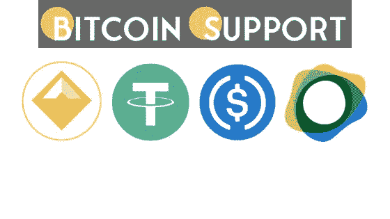
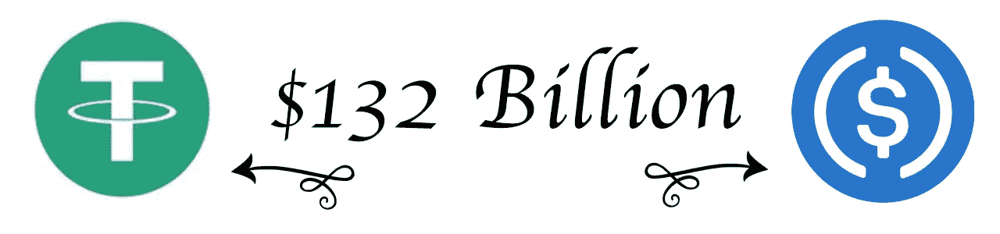
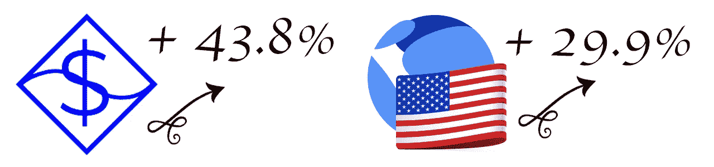

# 稳定的货币经济接近 2000 亿美元，UST 供应量增加，美元在 30 天内上涨了 43%

> 原文：<https://medium.com/coinmonks/the-stablecoin-economy-is-approaching-200-billion-ust-supply-is-increasing-and-usdn-is-up-43-2064ee6d1498?source=collection_archive---------108----------------------->

**Visit our website:-** [**https://bitcoinsupports.com/**](https://bitcoinsupports.com/)

稳定的货币经济在过去 12 个月中得到了大规模发展，其目前的估值距离 2000 亿美元的关口仅差 130 亿美元。Terra 的 UST 本月上涨 29.9%，中微子协议的 USDN 上涨 43.8%，是 30 天发行中涨幅最大的两家。

**stable coins 的市值持续上升，Tether 突破 800 亿美元大关。根据月度数据，市值最大的稳定币**

Tether (USDT)本月上涨 2%，突破 800 亿美元大关。与加密经济中的其他稳定币相比，USDT 是巨大的，占今天 1870 亿美元稳定币市场的 42.78%。Tether 800 亿美元的市值相当于整个 1.83 万亿美元加密生态系统的 4.46%。按市值计算，第二大稳定货币美元硬币(USDC)上个月仅上涨了 0.3%。

USDC 目前价值 523 亿美元，占密码市场的 2.92%，稳定币市场的 27.96%。根据截至 2022 年 3 月 14 日的指标，USDC 和 USDT 的总市值占整个 stablecoin 生态系统的 70%以上。

**Visit our website:-** [**https://bitcoinsupports.com/**](https://bitcoinsupports.com/)

美元(占今天交易的 42.16%)和土耳其里拉(占 tether 交易的 17.41%)是与 tether (USDT)交易的主要资产。欧元、世界银行和 HUSD 都在尝试。USDC 和 tether 经常交易，USDT 占周一所有 tether 互换的 64.18%。紧随 Tether 之后的是 BUSD、美元、欧元和 WETH，它们是使用美元硬币(USDC)的最受欢迎的交易配对。

**根据 USDN，UST 和 FRAX 30 天发行上升，稳定的货币控制了整个加密经济净值的 10%。**

虽然 USDT 和 USDC 的 30 天发行利率在最近几个月没有显著变化，但 UST、FRAX 和美国国债的 30 天发行利率却发生了变化。Terra 的 UST 增长了 29.8%，截至本文撰写时，stablecoin 的市值约为 147 亿美元。

**Visit our website:-** [**https://bitcoinsupports.com/**](https://bitcoinsupports.com/)

Frax (FRAX)的 30 天发行利率增长了 9.6%，而同月中微子协议的 USDN 增长了 43.8%。FRAX 的市值为 29 亿美元，而 USDN 的市值为 6.38 亿美元。Makerdao 的稳定币 DAI 上个月的发行水平下降了 4.6%，而 magic internet money (MIM)则下降了 0.2%。基于以太坊的 DAI 市值为 93 亿美元，而基于雪崩的 MIM 市值为 27 亿美元。

总体而言，稳定的货币经济只需要增长 130 亿美元就能达到 2000 亿美元大关。在撰写本文时，1，870 亿美元的稳定货币经济几乎占 1.83 万亿美元加密经济的 10%。
**访问我们的网站:-**[**https://bitcoinsupports.com/**](https://bitcoinsupports.com/)

**免责声明:以上为作者观点，不应视为投资建议。读者应该自己做研究。**

> 加入 Coinmonks [电报频道](https://t.me/coincodecap)和 [Youtube 频道](https://www.youtube.com/c/coinmonks/videos)了解加密交易和投资

# 另外，阅读

*   [3 商业评论](/coinmonks/3commas-review-an-excellent-crypto-trading-bot-2020-1313a58bec92) | [Pionex 评论](https://coincodecap.com/pionex-review-exchange-with-crypto-trading-bot) | [Coinrule 评论](/coinmonks/coinrule-review-2021-a-beginner-friendly-crypto-trading-bot-daf0504848ba)
*   [莱杰 vs n rave](/coinmonks/ledger-vs-ngrave-zero-7e40f0c1d694)|[莱杰 nano s vs x](/coinmonks/ledger-nano-s-vs-x-battery-hardware-price-storage-59a6663fe3b0) | [币安评论](/coinmonks/binance-review-ee10d3bf3b6e)
*   [Bybit Exchange 审查](/coinmonks/bybit-exchange-review-dbd570019b71) | [Bityard 审查](https://coincodecap.com/bityard-reivew) | [Jet-Bot 审查](https://coincodecap.com/jet-bot-review)
*   [3 commas vs crypto hopper](/coinmonks/3commas-vs-pionex-vs-cryptohopper-best-crypto-bot-6a98d2baa203)|[赚取加密利息](/coinmonks/earn-crypto-interest-b10b810fdda3)
*   最好的比特币[硬件钱包](/coinmonks/hardware-wallets-dfa1211730c6) | [BitBox02 回顾](/coinmonks/bitbox02-review-your-swiss-bitcoin-hardware-wallet-c36c88fff29)