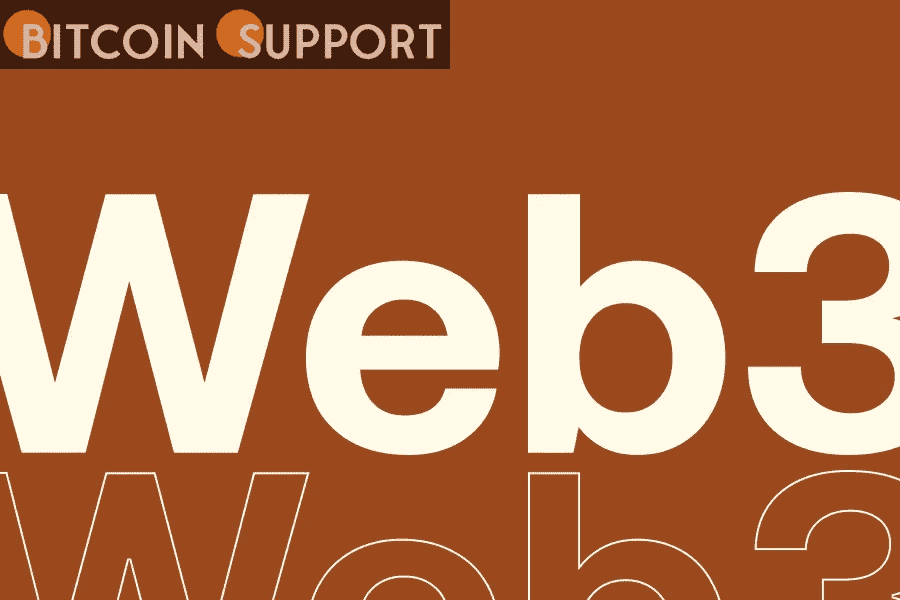
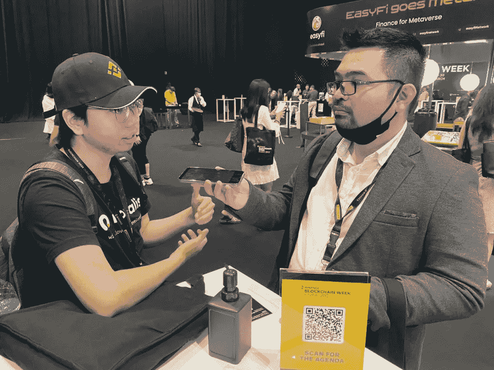

# Web3 的现状:社区讨论全球机遇

> 原文：<https://medium.com/coinmonks/the-state-of-web3-the-community-discusses-global-opportunities-cd45575eb3f1?source=collection_archive---------76----------------------->

**Visit our website:-** [**https://bitcoinsupports.com/**](https://bitcoinsupports.com/)

Web3 给印度尼西亚带来了“无尽的”机会，改变了尼日利亚人的生活，粉碎了印度的资格障碍，改变了菲律宾怀疑论者的思想，现在正扩展到乌拉圭。

在币安区块链周上，代表们讨论了自己的 Web3 体验以及 Web3 在当地社区的发展潜力。

最近的会议聚集了来自世界各地的加密社区成员，分享他们的激情，与志同道合的人联系，从社区领袖的主题演讲中学习，并给出他们对 Web3 状态的想法。讨论的话题之一是对网络 3 人才需求的增加。随着互联网从 Web2 过渡到 Web3，报告表明，对 Web3 领域专业知识的需求正在迅速扩大，行业内出现了大量机会。

虽然数据至关重要，但直接来自观察行业发展的人的见解也同样重要。

**为印尼提供“无限”的机会**

乔科·克鲁比，一位伪装的印尼加密战士，表达了他对 Web3 现在对他的国家所做的事情的看法。根据 Joko 的说法，人们对 Web3 欣喜若狂，机会在这个领域“总是挥之不去”。在印度尼西亚这样的国家，围绕着网络 3 工作机会的议论是永恒的。前景无限，从做‘自由职业者’到成为 Telegram 的付费管理员。”

此外，这位未透露姓名的加密货币传播者认为，同样的事情正在全球发生。与此同时，印度尼西亚 Web3 开发者 Yoseph Soenggoro 同意蒙面十字军的观点。“对我们这一代人来说，这无疑是一个价值 1 万亿美元的机会，”Soenggoro 说。

**Visit our website:-** [**https://bitcoinsupports.com/**](https://bitcoinsupports.com/)

据开发者称，他们本地 Web3 环境中最成熟的计划是目前的集中交换。然而，Soenggoro 预测，随着时间的推移，印度尼西亚将建立更多的分散化财务协议，从而产生过多的“Web3 工人的可能职业”

**尼日利亚人的生活方式正在改变**

“加密改变了我的生活，”奇克·奥康科沃解释道，他提到了自己在尼日利亚的亲身经历。奥康科沃于 2016 年开始了他的 Web3 体验，现在是区块链一个游戏项目的高管。据奥康科沃说，为了挣钱，他在学生时代尝试过一些不同的事情。然而，加密货币的影响最大，给他提供了无数的机会。“我不仅从加密货币交易中获利，还从与加密货币初创公司的合作中获利，”他解释道。奥康科沃表示，区块链为“我们非洲和世界其他地区提供了许多机会”他认为，通过帮助个人解决问题，它使个人能够创造能够产生重大影响的解决方案。

**“我让越来越多的人，尤其是年轻人接触到这个行业，因为它有可能从经济上改变他们的生活。”除了奥康科沃之外，另一位尼日利亚人 Ukeme Okuku 在他的当地社区表达了他对 Web3 的看法。虽然在设计和社区管理方面有许多活跃的非洲人，但奥库说，目前“最紧迫的问题”是意识。

**“由于加密货币和区块链，太空仍然是一个利基市场。只有少数人意识到这一点。”**

**拆除印度的资格限制**

从印度的角度，一位要求匿名的代表表达了对 Web3 在该国工作的想法。据他说，人们在印度面临困难。他说:“他们需要上一所受人尊敬的学校，然后申请工作。没有这些强有力的凭证，你将无法申请任何职位。”然而，这位代表说，对于一个没有良好学术背景的人来说，进入 Web3 是非常容易的。他认为，在 Web3 上，“一个人所需要的只是拥有能力。”这位代表指出，在他的国家里，有许多地方的民众没有得到足够的帮助。然而，由于互联网的出现，当涉及到 Web3 时，这些限制就放松了。“你可以上网；你有权力，”他解释道。

**改变菲律宾怀疑论者的想法**

Jene Dizon，一位来自菲律宾的 Web3 开发者，认为现在菲律宾人在 Web3 行业有几个机会。作为一个在 crypto 工作了五年多的人，Dizon 认为该地区急需 Web3 人才。他观察到:

**“菲律宾人在 Web3 有无数的前景。Web3 的使用不仅限于发达国家，也包括贫穷国家。尽管我认为它需要大约 2-3 年的时间才能完全融入社会。”除此之外，Dizon 还将互联网的出现与目前 Web3 在中国的推出相提并论。“当互联网首次引入我们国家时，有许多反对者。然而，现在所有的东西都可以在网上找到，”他解释道。“我预计当他们回家时，同样的事情也会发生在 Web3 身上，”迪松说。虽然仍有许多怀疑者，但他表示，他们正在逐渐改变想法，并研究这项技术，最终将用于所有行业。

**乌拉圭正在发展**

乌拉圭技术内容制作人 Alexis Martinovic 也参加了会议，以了解更多有关 Web3 的信息并建立自己的网络。Martinovic 认为，Web3 的采用在他的国家才刚刚开始，不久，他将见证 Web3 项目。

**“当时，当地还没有 Web3 项目。然而，我相信我们将很快开始看到它们。自然，每个国家都在朝着这个方向前进。”Martinovic 还强调了 Web3 的最小进入壁垒。他解释说:“直接跳到 Web3，你甚至不需要银行账户。”。因此，即使是不发达地区也有机会参与。

**访问我们的网站:-**[**https://bitcoinsupports.com/**](https://bitcoinsupports.com/)

**免责声明:以上为作者观点，不应视为投资建议。读者应该自己做研究。********

> 加入 Coinmonks [电报频道](https://t.me/coincodecap)和 [Youtube 频道](https://www.youtube.com/c/coinmonks/videos)了解加密交易和投资

# 另外，阅读

*   [交易信号是什么？](https://coincodecap.com/trading-signal) | [Bitstamp vs 比特币基地](https://coincodecap.com/bitstamp-coinbase) | [买索拉纳](https://coincodecap.com/buy-solana)
*   [ProfitFarmers 回顾](https://coincodecap.com/profitfarmers-review) | [如何使用 Cornix Trading Bot](https://coincodecap.com/cornix-trading-bot)
*   [十大最佳加密货币博客](https://coincodecap.com/best-cryptocurrency-blogs) | [YouHodler 评论](https://coincodecap.com/youhodler-review)
*   [my constant Review](https://coincodecap.com/myconstant-review)|[8 款最佳摇摆交易机器人](https://coincodecap.com/best-swing-trading-bots)
*   [MXC 交易所评论](/coinmonks/mxc-exchange-review-3af0ec1cba8c) | [Pionex vs 币安](https://coincodecap.com/pionex-vs-binance) | [Pionex 套利机器人](https://coincodecap.com/pionex-arbitrage-bot)