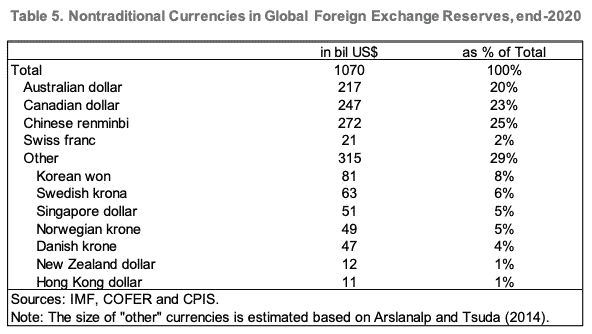

# IMF 报告非传统储备货币崛起…比特币？

> 原文：<https://medium.com/coinmonks/the-stealth-erosion-of-dollar-dominance-the-rise-of-bitcoin-d529f3d8be08?source=collection_archive---------28----------------------->

2022 年 3 月 24 日 IMF 发表了一篇论文《美元主导地位的隐形侵蚀:积极的多元化和非传统储备货币的崛起》。

这篇论文研究了美元作为储备资产的“隐形侵蚀”,以及过去几十年来，美元在央行储备货币中所占的百分比是如何越来越小的。

这篇论文解释说，央行行长通常会调整储备货币比率，以应对利率或汇率波动；并且通常对其他主要货币(欧元、日元、CNY)进行兑换。

美元最初成为全球储备货币是在 1944 年布雷顿森林协定之后，当时有 44 个国家同意将其货币与美元挂钩。这主要是因为美元由美联储的黄金储备担保——任何美元都可以兑换等量的黄金——并且它对国际贸易很有用。

然而，自从美元不再与黄金挂钩以来——见[https://wtfhappenedin1971.com](https://wtfhappenedin1971.com/)——大多数国家继续使用美元，因为没有其他明显的替代品，也因为它已经确立了自己作为国际贸易首选交换媒介的地位。

同样在 1944 年布雷顿森林会议上成立的国际货币基金组织在报告中说:

> “美元的外流有两个方向:四分之一流入中国的人民币，四分之三流入较小国家的货币，这些国家作为储备货币的作用较为有限。”

该文件的结论是:

> “如果美元的主导地位终结(一种情景，而非预测)，那么美元可能不会被美元的主要竞争对手击倒，而是被一大群替代货币击倒”

请参见报告中的非传统货币列表:

很明显，比特币在技术上不被央行视为非传统货币；它甚至还不被认为是一种货币…

然而，比特币将获得其作为货币的“官方”地位的原因有很多，央行行长们将开始考虑将其作为潜在储备货币的原因甚至更多:

1.  比特币拥有健全货币的所有属性(稀缺性、可接受性、可分性、持久性、便携性和可替代性)
2.  比特币市值(近 1 万亿美元)接近 M1 澳元和加元的货币供应量(各近 2 万亿美元)——几年后就会达到这个水平
3.  加密/区块链行业正在构建和创新支付网络和货币管理技术。有些人会说，这是央行效仿的榜样
4.  比特币是抗审查的，因为没有一个实体有能力撤销比特币交易或阻止特定钱包访问网络
5.  随着越来越多的国家将比特币作为法定货币，或认为其在零售和国际贸易中可行，比特币的采用呈指数级增长

所有的事情都必须结束，随着美元通过通胀、量化宽松和过度借贷贬值，非传统货币将继续在央行资产负债表中占据更大份额。

比特币作为可靠货币的特征、其受欢迎程度以及它可以保持政治中立，意味着它有很强的理由成为国际储备货币的首选。目前它还没有太多强有力的竞争对手，如果继续使用的话，在未来十年它将是一个强有力的竞争者。

> 加入 Coinmonks [电报频道](https://t.me/coincodecap)和 [Youtube 频道](https://www.youtube.com/c/coinmonks/videos)了解加密交易和投资

# 另外，阅读

*   [CoinFLEX 评论](https://coincodecap.com/coinflex-review) | [AEX 交易所评论](https://coincodecap.com/aex-exchange-review) | [UPbit 评论](https://coincodecap.com/upbit-review)
*   [AscendEx 保证金交易](https://coincodecap.com/ascendex-margin-trading) | [Bitfinex 赌注](https://coincodecap.com/bitfinex-staking) | [bitFlyer 审核](https://coincodecap.com/bitflyer-review)
*   [麻雀交换评论](https://coincodecap.com/sparrow-exchange-review) | [纳什交换评论](https://coincodecap.com/nash-exchange-review)
*   [支持卡审核](https://coincodecap.com/uphold-card-review) | [信任钱包 vs MetaMask](https://coincodecap.com/trust-wallet-vs-metamask)
*   [Exness 回顾](https://coincodecap.com/exness-review)|[moon xbt Vs bit get Vs Bingbon](https://coincodecap.com/bingbon-vs-bitget-vs-moonxbt)