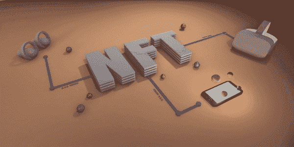

# 打造 NFT | NFT 发展服务公司的步骤

> 原文：<https://medium.com/coinmonks/the-steps-involved-in-minting-an-nft-nft-development-services-1fecfc4805c5?source=collection_archive---------19----------------------->

NFT Development Guide

不可替换令牌或 NFT 是一种新型的数字资产。他们是现在的热门话题，每个人都不能停止谈论他们。许多人认为 NFTs 是一个革命性的新想法，它改变了我们看待数字内容的方式。许多专家看到了它颠覆行业的潜力以及它们给用户带来的好处。因此，越来越需要 NFT 的发展和与 NFT 发展公司合作。这篇文章解释了如何参与 NFT 开发服务，开发 NFT 的*过程，以及如何在领先的 NFT 市场上销售它们。*

## 了解 NFTs

不可替换的令牌是独特的可收集的加密资产。NFTs 的想法是受 2012 年进入市场的彩色硬币的启发。NFT 可以代表几乎任何真实的或数字的项目。这个列表包括艺术品、音乐、收藏品、视频游戏中的虚拟物品、虚拟土地、视频和虚拟化的实物资产。

NFT 近年来人气飙升，并在 2021 年成为主流成功。NFT 的崛起促使公司和企业参与 NFT 的发展。这种方法导致更多的非功能性测试进入行业，并为用户带来更多的好处。

## 各种区块链网络

创建 NFT 的过程非常简单。最初，NFT 开发要求您对区块链技术有广泛的了解。然而，该行业的几项发展提高了可访问性，并确保任何人都可以创建 NFT。

 [## 最佳 NFT 发展公司|最佳 NFT 发展服务| NFT 发展公司解决方案|…

### 我们的 NFT 开发公司用强大的技术帮助您创建您的 NFT 平台。我们的 NFT 开发流程…

bit.ly](https://bit.ly/3yBCIIE) 

NFT 发展的第一步*是决定你想向什么样的区块链发放你的非贸易优惠待遇。目前，以太坊是发行 NFT 的领先区块链服务。也就是说，以太坊并不是业内唯一的网络。其他区块链网络正在涌现，其中一些提供了更多的好处。 ***下面列出的是最受欢迎的网络。****

***币安智能链或 BSC
**以太坊
**多边形
**卡尔达诺
**索拉纳
**和谐
**雪崩
**阿斯塔*****************

*******每个区块链网络都有其 NFT 令牌标准和兼容的钱包服务。例如，在币安智能链上创建 NFT 意味着您只能在支持 BSC 网络的平台上销售 NFT。你不能在 VIV3 或 OpenSea 等网站上出售 NFT。这些平台分别在流量和以太坊网络上运行。*******

## *******[NFT 市场发展](https://bit.ly/3NapDKs)*******

**************

*******NFT Marketplace Development Services*******

*******因此，最好在以太坊区块链开发一个 NFT。以太坊拥有最大的 NFT 生态系统，这使得它成为 NFT 发展的首选。这也是一家 NFT 开发公司在这个网络上创建代币的原因。这里有一些在以太坊上开发 NFT 的必要条件。*******

*******1.支持 ERC721 令牌标准的以太坊钱包。您可以使用 MetaMask、比特币基地或 Trust Wallet 等数字钱包。*******

*******2.大约一百美元。您可以使用美元或英镑从该平台购买乙醚。购买以太网的另一种方式是去加密货币交易所购买。*******

*******完成这些要求意味着您拥有 NFT 开发所需的一切。现在，你可以搜索一个[***【NFT 市场】***](https://bit.ly/3NapDKs) ，在那里你可以连接数字钱包，上传所需的文件，然后把它变成一个 NFT。本文假设你使用过以太坊，并且可以在以太坊 NFT 市场上开发一个 NFT。最著名的平台有:*******

*****OpenSea*****

*****可铸造的*****

*****稀有的*****

*****这些平台在首页有一个“创建”按钮。这样，用户几乎可以立即开发他们的 NFT。*****

***** [## NFT 市场开发|不可替代代币市场|白标 NFT 市场|…

### NFT 市场的发展正在塑造即将到来的创业公司的未来，以在竞争中胜出。构建您自己的…

bit.ly](https://bit.ly/3NapDKs) 

## 创建您的第一个 NFT

本文假设您正在使用 OpenSea 进行 NFT 开发。

您要做的第一件事是选择 create 按钮。然后，该网站会将你带到另一个屏幕，要求你连接你的数字钱包。现在，连接钱包，并在需要时输入密码。完成这个过程将钱包连接到市场。一些平台可能会要求您通过对消息进行数字签名来证明所有权。但是，如有必要，您可以跳过这些过程。

现在，是开发 NFT 的时候了。选择右上角的“创建”按钮，然后选择“我的选择”选项。之后，选择蓝色的 Create 按钮继续。该站点现在会打开一个小窗口，您可以在其中创建文件夹。这个文件夹是站点在创建 NFT 后存储它们的地方。给它一个合适的名字，然后继续这个过程。

网站上传图片，你可以在个人资料中查看。下一步要求您上传文件夹的封面图像。您可以通过选择页面右上角的铅笔图标来完成此操作。这样做，网站会要求你上传一张图片。现在，你选择“添加新项目”按钮，网站会要求你对你的钱包进行数字签名。

NFT 发展的下一步是网站向你展示一个新的窗口。在这里，您可以将音频、视频、GIF 或图像文件上传到网站。几个 NFT 市场给你选择添加一些特征到 NFT。这些特征增加了文件的独特性和稀缺性。此外，您可以包含仅在购买 NFT 后出现的可解锁内容。可解锁的内容是为购买的 NFT 增加额外价值的东西。最常见的可解锁内容形式包括高分辨率图像、全长视频、艺术品的实体副本等。

决定要添加到 NFT 的属性。接下来，单击“创建”按钮，在钱包中签署另一封邮件。这个网站然后创建 NFT，它出现在你的收藏。

## 开发 NFT 的成本

OpenSea 对 NFT 开发收取最低费用。这里收取的费用叫燃气费。天然气的价格因网络堵塞而异。在某些情况下，几个用户同时交易，这增加了燃气费。相反，有些时候很少有用户交易，这降低了汽油费。

## 如何赚 NFTs 的钱？

你可以在 NFT 市场上出售 NFT 并赚取利润。每天，成千上万的 NFT 被铸造出来并在市场上上市。在一个饱和的市场中脱颖而出是很难做到的。因此，许多艺术家转向 NFT 开发公司来解决这个问题。这些公司专门从事 NFT 开发和 NFT 营销。他们可以提高对一个项目的认识，吸引更多的注意力。这样，当 NFT 上市时，就会有很多人对它感兴趣。

## 结论

非功能性测试不是一种过时的趋势。他们会留在这里。现在最重要的是与 NFT 发展解决方案提供商合作。这样就可以马上上手 [***NFT 开发***](https://bit.ly/3yBCIIE) 了。

> 加入 Coinmonks [电报频道](https://t.me/coincodecap)和 [Youtube 频道](https://www.youtube.com/c/coinmonks/videos)了解加密交易和投资

# 另外，阅读

*   [如何在 Uniswap 上交换加密？](https://coincodecap.com/swap-crypto-on-uniswap) | [A-Ads 审查](https://coincodecap.com/a-ads-review)
*   [加密货币储蓄账户](/coinmonks/cryptocurrency-savings-accounts-be3bc0feffbf) | [YoBit 审核](/coinmonks/yobit-review-175464162c62)
*   [Botsfolio vs nap bots vs Mudrex](/coinmonks/botsfolio-vs-napbots-vs-mudrex-c81344970c02)|[gate . io 交流回顾](/coinmonks/gate-io-exchange-review-61bf87b7078f)
*   [CoinFLEX 评论](https://coincodecap.com/coinflex-review) | [AEX 交易所评论](https://coincodecap.com/aex-exchange-review) | [UPbit 评论](https://coincodecap.com/upbit-review)
*   [AscendEx 保证金交易](https://coincodecap.com/ascendex-margin-trading) | [Bitfinex 赌注](https://coincodecap.com/bitfinex-staking) | [bitFlyer 审核](https://coincodecap.com/bitflyer-review)
*   [Bitget 回顾](https://coincodecap.com/bitget-review)|[Gemini vs block fi](https://coincodecap.com/gemini-vs-blockfi)cmd |[OKEx 期货交易](https://coincodecap.com/okex-futures-trading)*****