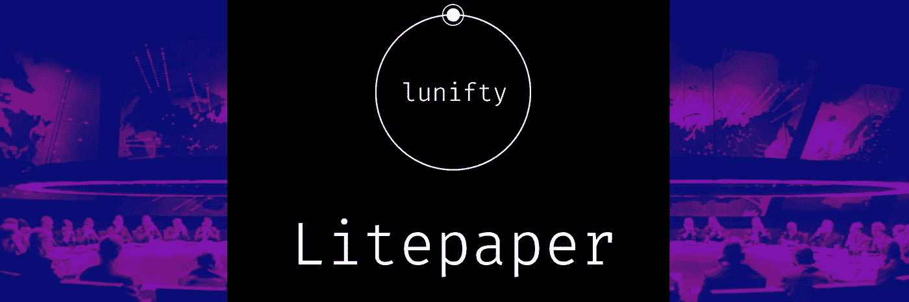

# 奇怪的信纸

> 原文：<https://medium.com/coinmonks/the-strange-litepaper-7233f4f7d811?source=collection_archive---------36----------------------->

[Find it Here](https://my.visme.co/view/kky8mwq0-voql9kyork362x1w)

## 或者:我是如何不再担心，做了一份 [Litepaper](https://my.visme.co/view/kky8mwq0-voql9kyork362x1w)

首先是拼错了，并不是说我曾经喜欢过很多英文单词中不发音的“gh”，是没用字母的夏令时。作为一个团体，我们接受没有积极方面的任务的恶化，因为我们是一个太大太复杂而无法改变的系统的一部分。

**欢迎来到** [**白皮书**](https://www.modeapp.com/bitcoin-whitepaper) **和 Litepapers 的世界。**

如果你是一家试图利用兴趣、投资者或巩固目标的企业；白皮书是商业计划的文章版本，而 litepaper 是白皮书的短篇版本。

如果你想让你的观众知道你在做什么，你打算去哪里，你可以打赌他们不想研究你的 15 页(最少)商业计划。毕竟，商业计划应该尽可能精确到真实的资源和可实现的目标。Litepaper 更多的是关于创造性写作，事实上，我大胆地推测，大多数白皮书和 lite paper 都外包给了那些为了听起来合法而不得不谷歌技术细节的作者。商业太重要了，不能留给首席执行官们。

在区块链，白皮书是一个大游戏，自从 2009 年比特币和革命性的区块链技术一起发布白皮书以来，这是一项要求。如果你在开始营销的时候还没有准备好，那就做好被争论、被取笑和被称为“地毯”的准备吧根据记录，Lunifty 不需要投资者，也不在区块链。Lunifty 在区块链有东西，就像在储物柜里有东西并不意味着你住在储物柜里。

Protector of the Rug

作为投资者，报纸能保护你吗？或者它是一张安抚毯，让你对自己对新游戏、元宇宙、NFT 套装、能量饮料或色情平台的冲动投资感觉更好？拥有一份报纸只意味着公司足够关心去写一份报纸，但是你可以写任何你想写的东西。这在商业上相当于喝啤酒时的大力推销。

你可以承诺通过地理标记和区块链卫星，结合对猎杀偷猎者的象征性奖励，来拯救世界大象数量。

一份报纸可以详细描述一个过程，通过这个过程来排序和 NFT 你自己的遗传密码，以防止像 23andMe 这样的公司从用你宝贵的生命精华设计的药物中攫取所有利润。

一个创意可以通过**市场创造活动**或**首次发行硬币**获得数百万的投资，因为数百万的启动成本被用于营销。项目可能会拖投资者几个月，直到不可避免的时刻，所有的流动性，支持资金，被抽干，幕后的匿名团队**地毯拉**找到另一个项目炒作。报纸阻止了这一切吗？

全球定位系统能在车祸中保护你吗？

使用 GPS 总比不知道自己要去哪里好。全球定位系统帮助你保持在正确的轨道上，但不会阻止你像白痴一样开车，保持道路畅通或保持其他司机的清醒。

当有人问我要去哪里时，我可以截图并发送给他们我的地图。我不需要跟着它，我甚至不需要去我说要去的地方，我可以偏离道路，换辆车，烧掉我的指纹，在一个掩体里开始新的生活，但是，我可能不会。我可能会尽最大努力去我说要去的地方，因为我分享了我的路线，我对我的朋友们负责，尽管我的朋友们觉得有义务确保我不会迷路。

一份 litepaper 给你的团队和观众提供了一些可以遵循或仔细检查的东西，这是一个计划的基本纲要，随着环境和财务压力或意外之财开辟了新的道路和机会，该计划可能会发生变化。一份写得好的报纸是吸引投资者的营销工具，有助于决定你是上涨还是下跌。这是一个与商业世界的其他人交流你在做什么以及你打算如何实现的工具。

如果你保守秘密，那就失去了做生意的全部意义。

[**不和谐**](https://discord.gg/gzQ2EWNWFk)

[**推特**](https://twitter.com/lunifty)

[**Instagram**](https://www.instagram.com/luniftyart/)

# 另外，阅读

*   [阿联酋 5 大最佳加密交易所](https://coincodecap.com/best-crypto-exchanges-in-uae) | [SimpleSwap 评论](https://coincodecap.com/simpleswap-review)
*   购买 Dogecoin 的 7 种最佳方式
*   [最佳期货交易信号](https://coincodecap.com/futures-trading-signals) | [期交所评论](https://coincodecap.com/liquid-exchange-review)
*   [用于 Huobi 的加密交易信号](https://coincodecap.com/huobi-crypto-trading-signals) | [Swapzone 审查](/coinmonks/swapzone-review-crypto-exchange-data-aggregator-e0ad78e55ed7)
*   最佳[密码交易机器人](https://coincodecap.com/best-crypto-trading-bots) | [购买索拉纳](https://coincodecap.com/buy-solana) | [矩阵导出评论](https://coincodecap.com/matrixport-review)
*   [Coldcard 评论](https://coincodecap.com/coldcard-review) | [BOXtradEX 评论](https://coincodecap.com/boxtradex-review)|[uni swap 指南](https://coincodecap.com/uniswap)
*   [比特币基地评论](/coinmonks/coinbase-review-6ef4e0f56064) | [德里比特评论](/coinmonks/deribit-review-options-fees-apis-and-testnet-2ca16c4bbdb2) | [FTX 评论](/coinmonks/ftx-crypto-exchange-review-53664ac1198f)
*   [联合国硬币评论](https://coincodecap.com/unocoin-review) | [最佳加密赌注硬币](https://coincodecap.com/best-crypto-staking-coins)