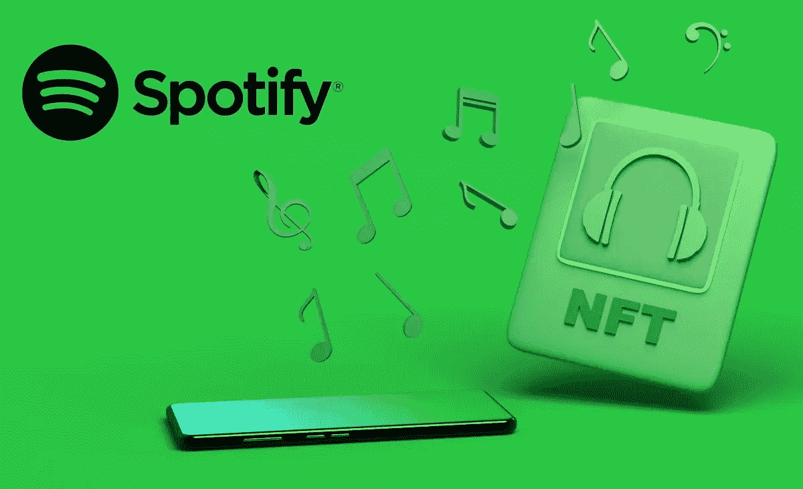

# 流媒体巨头 Spotify 已经开始测试不可替代的令牌！

> 原文：<https://medium.com/coinmonks/the-streaming-giant-spotify-has-started-to-test-non-fungible-tokens-be1e1c9aaf81?source=collection_archive---------29----------------------->

音乐流媒体领域的传奇人物 Spotify 已经认真尝试在艺术家页面上列出顶级品牌的 NFT。是的，流媒体巨头已经开始在顶级艺术家的页面上尝试不可替代的象征性画廊**。**

根据该报告，流媒体平台已经对一些安卓用户进行了测试。现在，他们已经包括了像**袋鼠乐队和史蒂夫·青木这样的艺术家的 NFT 预展。**

## 有什么新闻？

一位发言人表示，音乐流媒体巨头正在进行测试，可以帮助小艺术家推广现有的第三方产品。

他们定期进行测试，以改善艺术家和粉丝的体验。这些测试获得了更广泛的经验，其他的只是作为一个重要的学习。

> **当他们向 Spotify 寻求官方声明时发生了什么？**

他们没有立即回应。然而，报告也提供了一些重要的细节。

W那是什么？

根据这个故事，[**Spotify**](https://www.spotify.com/in-en/)**也将允许听众“看得更多”，这将带他们到 NFT 的网站上 [**OpenSea**](https://opensea.io/) ，在那里他们可以购买。然而，Spotify 似乎不接受电影或 gif 格式的非功能性文件。**

**最重要的是，Spotify 只会在应用程序中发布静态图像，而不是视频。它不包括任何声音。**

**唯一的选择是访问 NFT 在 OpenSea 上的页面，如果是视频或 GIF，用户可以听或看。然而，据音乐联盟称，Spotify 不会从通过该应用程序实现的任何 NFT 销售额中收取任何百分比，并且只是在测试连接。**

**Spotify 正致力于测试非功能性网络服务，这对那些试图获得选择加入机会的人来说是一个巨大的商机。他们只是试图测试可能的结果，他们并没有要求从他们那里得到任何佣金。张贴一张图片，可能会导致 **Opensea** ，如果用户想查看或购买 NFTs 是他们的愿望。**

> **加入 Coinmonks [电报频道](https://t.me/coincodecap)和 [Youtube 频道](https://www.youtube.com/c/coinmonks/videos)了解加密交易和投资**

# **另外，阅读**

*   **[德国最佳加密交易所](https://coincodecap.com/crypto-exchanges-in-germany) | [Arbitrum:第二层解决方案](https://coincodecap.com/arbitrum)**
*   **[币安交易机器人](/coinmonks/binance-trading-bots-d0d57bb62c4c) | [OKEx 评论](/coinmonks/okex-review-6b369304110f) | [阿塔尼评论](https://coincodecap.com/atani-review)**
*   **[最佳加密交易信号电报](/coinmonks/best-crypto-signals-telegram-5785cdbc4b2b) | [MoonXBT 评论](/coinmonks/moonxbt-review-6e4ab26d037)**
*   **[如何在 Bitbns 上购买柴犬(SHIB)币？](https://coincodecap.com/buy-shiba-bitbns) | [购买弗洛基](https://coincodecap.com/buy-floki-inu-token)**
*   **[CoinFLEX 评论](https://coincodecap.com/coinflex-review) | [AEX 交易所评论](https://coincodecap.com/aex-exchange-review) | [UPbit 评论](https://coincodecap.com/upbit-review)**
*   **[十大最佳加密货币博客](https://coincodecap.com/best-cryptocurrency-blogs) | [YouHodler 评论](https://coincodecap.com/youhodler-review)**