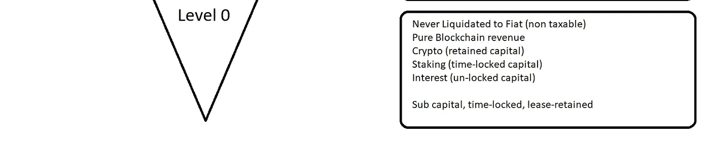

# DeFi 的 Sub0 DAO 组件

> 原文：<https://medium.com/coinmonks/the-sub0-dao-component-of-defi-941492471708?source=collection_archive---------66----------------------->

~dwulf

# **一刀三种收入模式**

Greenwitch DAO 的 Sub0 组件在我上一篇关于 Greenwitch DAO 的文章中有简要的说明。

Polkadot para-chain winners、Acala 和 Astar 构成了它的核心，Cosmos 与它一起被添加和管理。大多数情况下，产品的赌注和流动性池，当桥梁完成，全面 Polkadex 的实施。

Sub0 是模型中的最佳位置，主要是因为 DAO 到 DAO 的交易，没有 KYC，纯人工智能软件代理，协调 Greenwitch DAO 交换。

人工智能软件代理商背后的想法是授予他们各自加密钱包的所有权，不受约束地进行交易，并基于丰厚利润交易产生基线收入模式。

所有权意味着纳税义务，因此 Sub0 层的所有所有权都严格掌握在人工智能软件代理手中，其唯一目的是增加 DAO 资本底线。

**阿卡拉**

阿卡拉，管理刀的 DeFi 部分。作为一名大众贷款投资者，我对基于 Substrate 的 Acala 平台充满信心，该平台将推出更多托盘(托盘是 Substrate 软件模块的另一个名称)。

点 LDOT 赌注和 ACA 赌注是很好的收入驱动因素，但流动性池是大多数 DAO 获得稳定收入流的地方。

**阿斯塔**

Astar 更侧重于智能合同和其链上的 EVM/WASM 互操作。有一个赌注其他 dapp 的水平，我几乎所有的 ASTAR 硬币代币支持几个 dapp，利息约为 9%，ASTAR 的价格也在上升。

**宇宙**

是的，Cosmos 不是 Polkadot，但我生活在 crypto，所以 ATOM 是 DAO 的亚军。巨大的收入来自 ATOM-OSMO 流动性对，启用了超级流体赌注，收益率约为 60%。宇宙系统对我很有吸引力，我知道桥梁已经在工作中。

**Nodle(荣誉提名)**

这是更多关于 Sub0 的挖掘池，物联网组件提供了一个有趣的收入模式，通过检测低能耗蓝牙的位置证明进行挖掘，产生 NODL。目前没有价格，也没有列出，但 NODL 硬币/代币可以下注或与稳定的硬币(澳大利亚元、UST 元等)配对。).

**更多 Sub0 即将到来**

在这个级别，将更多的区块链项目添加到 0 级的 DAO 就是游戏。建立在效用多于价值的基础上，因为价格是主观的。由于菲亚特笨拙的天性和监管负担，谨慎的深谋远虑是不可避免的。

将收入和银行业务保持在 0 级是所有资本的主要部分，只有在税收策略被剔除后，才能分散到 1 级和 2 级。这是律师、会计师和税务顾问的话题。

**结论**

有了 Sub0 和 Level0 的布局，更容易分配到可能招致监管和税负阻力的 level 1 和 level 2 运营。道是组织这种货币系统的最佳方式，因为它抽象了所有人与公民身份和监管机构的联系。

将由人工智能软件代理拥有和管理，但由用户控制的收入流分离是运营 DAO 的最佳方式，这就是为什么对 DAO 的治理如此重要。

合成硬币/代币将是另一个 Sub0 组件，但需要从这种类型的硬币/代币发展出更多的成熟度，因为我担心苍蝇离监管太阳太近。但是随着更分散的合成项目的出现，我看到一只凤凰飞向太阳。

> 加入 Coinmonks [电报频道](https://t.me/coincodecap)和 [Youtube 频道](https://www.youtube.com/c/coinmonks/videos)了解加密交易和投资

# 另外，阅读

*   [Bookmap 点评](https://coincodecap.com/bookmap-review-2021-best-trading-software) | [美国 5 大最佳加密交易所](https://coincodecap.com/crypto-exchange-usa)
*   [如何在 FTX 交易所交易期货](https://coincodecap.com/ftx-futures-trading) | [OKEx vs 币安](https://coincodecap.com/okex-vs-binance)
*   [CoinLoan 审查](https://coincodecap.com/coinloan-review) | [YouHodler 审查](/coinmonks/youhodler-4-easy-ways-to-make-money-98969b9689f2) | [BlockFi 审查](https://coincodecap.com/blockfi-review)
*   XT.COM 评论[币安评论](https://coincodecap.com/profittradingapp-for-binance) |
*   [SmithBot 评论](https://coincodecap.com/smithbot-review) | [4 款最佳免费开源交易机器人](https://coincodecap.com/free-open-source-trading-bots)