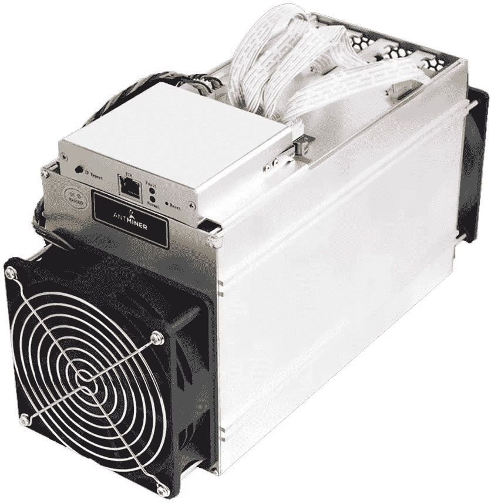
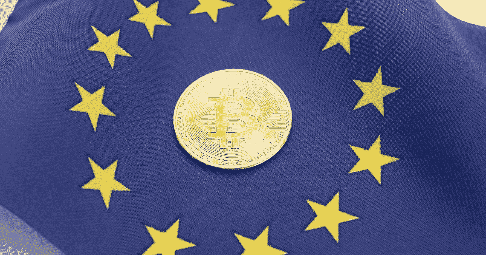
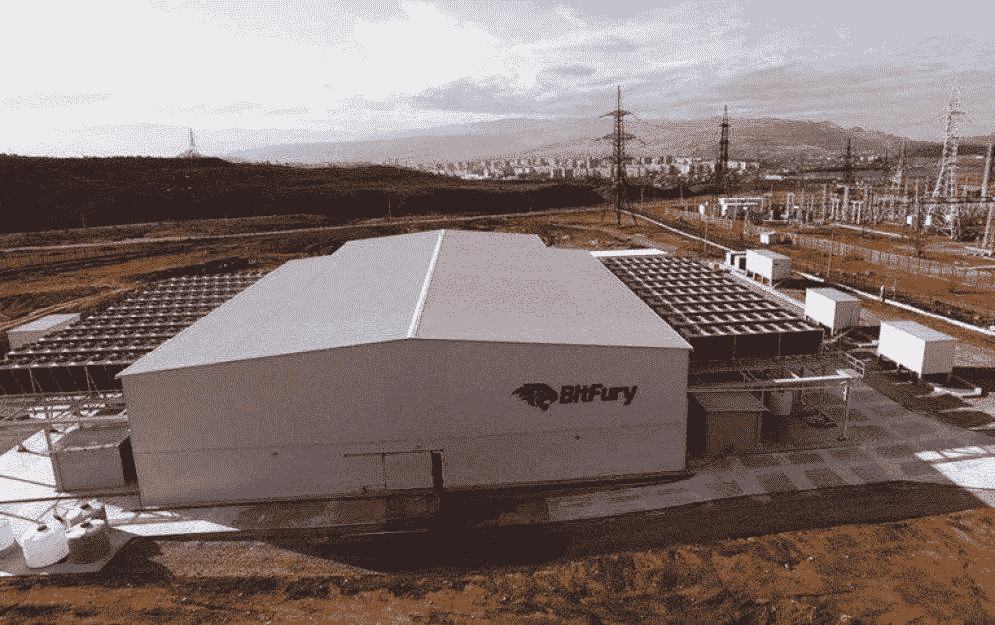

# 比特币的可持续性

> 原文：<https://medium.com/coinmonks/the-sustainability-of-bitcoin-4ed04f05a775?source=collection_archive---------25----------------------->

随着时间的推移，比特币的诋毁者和后来的机构开始谈论比特币对环境的影响。
如你所知，比特币的区块链使用 PoW 算法。PoW 算法要求计算单元能够解决所需的操作，并为矿工赚取百分比。
最初，采矿是由个人进行的，随着时间的推移，采矿公司接管了采矿业务，这些公司可能拥有大量资金来开发他们的采矿场。
正如比特币代码预测的那样，随着时间的推移，挖掘比特币将变得越来越困难。
在继续分析比特币的环境成本之前，我想强调的是，除了 ASIC 领域，采矿也给 GPU 领域带来了经济增长。鉴于其架构，专用集成电路仍然是最好的破坏手段。

# **机构对使用 PoW 的比特币和加密货币的批评**

随着时间的推移，全球机构开始对加密货币产生兴趣，在这种情况下，比特币也是如此。甚至最近欧盟委员会投票禁止使用 PoW 的加密货币，幸运的是，这项法律没有通过。甚至在发展中国家被多次提出的问题是“比特币是能源密集型的，因此它将大量能源用于更有用的活动”，另一种批评是“比特币消耗大量能源，它不是用清洁能源生产的，BTC 是实现气候目标的障碍”

在深入分析这些不一致的理论之前，我要说，我对所有这些句子的回答本质上都是否定的。比特币需要一只手来提高挖掘效率，加密货币可以像其他任何技术一样成为一个技术产业。限制其发展是没有意义的，相反，我们应该听取建议并找到解决办法，而不是将它们抛弃。迄今为止，现代社会在应对气候变化的斗争中几乎没有做出什么努力，通常一些协议仅仅是为了形象。

# **比特币的能源开发**

(数据摘自比特币矿业理事会报告)

全球产生的能量约为 154，750 TWh，比特币消耗 247 TWh。产生的能量的很小一部分。
全球大约产生 34.8 BMT 的二氧化碳，整个 BTC 采矿业产生 0.03 BMT。
比特币采矿拥有世界上最高的可持续能源组合。

说到其他行业，住宅建设的能源支出为 26，481 太瓦时。这是一个非常高的数字，可以通过使用更多的生态可持续材料和应用更好的运输过程来降低。

在过去的 8 年里，采矿过程的效率提高了 58 倍。令人难以置信的增长，这一结果之所以成为可能，是因为随着时间的推移，ASICs 的使用降低了能耗。

在我看来，我回答一些可能的批评

当然，就技术力量而言，采矿过程是一项非常复杂的活动，但这并不意味着我们无法实现能效等其他目标。ASIC 的发展还会继续，巨大的资金会改善行业。

大公司的采矿场可以与机构合作，将采矿厂设在有可能安装可再生能源解决方案的地方附近。我的想法是，来自采矿的利润的%可以被指定用于为拥有采矿农场的国家建立可再生能源解决方案。Satoshi 会为这样的事情感到骄傲，因为采矿可以帮助人类。

一些人可能会对这句话提出异议，“但如果比特币在一个发展中小国如此慷慨地消费，我们应该做些什么？

这是一个值得进一步调查的合理问题。

我们可以为采矿场建设制定一份具有以下特征的国际伦理文件:

1)根据地理位置，采矿场必须考虑当地的能源消耗，以采用不与当地居民的日常生活相冲突的解决方案。

2)每个采矿场必须尽可能采用最高效的可再生能源方法。除了寻找地理位置的解决方案外，还有可能同时采用多种可再生解决方案的地方。

3) 3)建立一个与比特币社区相关联的国际基金，任何人都可以为抗击气候变化捐款。例如，在自愿的基础上，一个采矿农场或一家上市的矿业公司可以将%的利润捐给慈善机构以应对气候变化。这对金融机构来说是一个好信号。

总之，我认为 BTC 在能源方面走在一条很好的道路上，但它仍然可以做得更多。建立我所说的文件将会很有趣，也很好，因为我们可以向继续说比特币坏话的人类发出一个新的信号。

> 加入 Coinmonks [电报频道](https://t.me/coincodecap)和 [Youtube 频道](https://www.youtube.com/c/coinmonks/videos)了解加密交易和投资

# 另外，阅读

*   《XT.COM 评论》|
*   [SmithBot 评论](https://coincodecap.com/smithbot-review) | [4 款最佳免费开源交易机器人](https://coincodecap.com/free-open-source-trading-bots)
*   [比特币基地僵尸程序](/coinmonks/coinbase-bots-ac6359e897f3) | [AscendEX 审查](/coinmonks/ascendex-review-53e829cf75fa) | [OKEx 交易僵尸程序](/coinmonks/okex-trading-bots-234920f61e60)
*   [如何在印度购买比特币？](/coinmonks/buy-bitcoin-in-india-feb50ddfef94) | [WazirX 评论](/coinmonks/wazirx-review-5c811b074f5b)
*   [CryptoHopper 替代品](/coinmonks/cryptohopper-alternatives-d67287b16d27) | [HitBTC 审查](/coinmonks/hitbtc-review-c5143c5d53c2)
*   [CBET 评论](https://coincodecap.com/cbet-casino-review) | [库科恩 vs 比特币基地](https://coincodecap.com/kucoin-vs-coinbase)