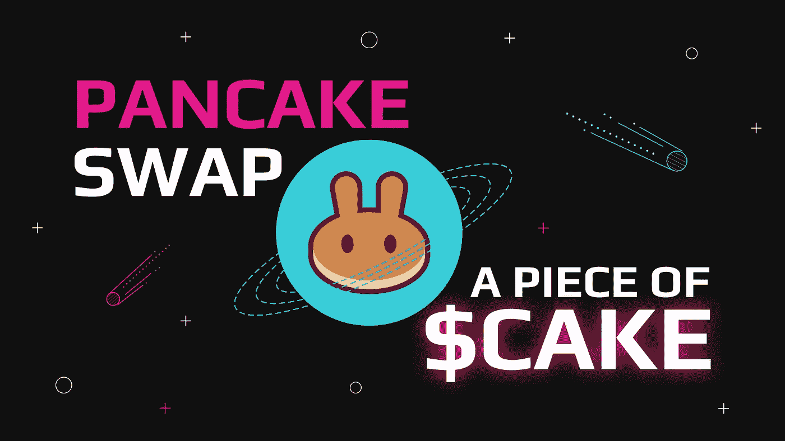
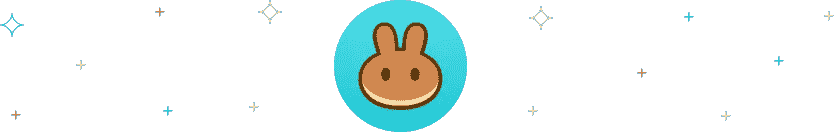
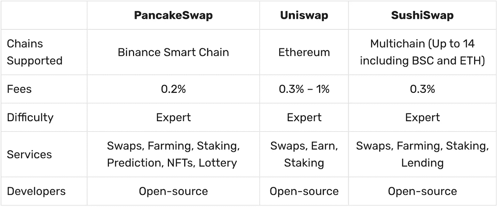

# 最甜蜜的交换:一块 20 美元的蛋糕

> 原文：<https://medium.com/coinmonks/the-sweetest-swap-a-piece-of-cake-e192d6a1d6a4?source=collection_archive---------42----------------------->

自 2015 年以太坊推出以来，几个寻求颠覆传统金融体系的去中心化金融应用不断涌现。例如，分散式金融应用之一是分散式交易所(通常称为 dex)。这些交易所为对集中托管交易所持怀疑态度的更老练的交易员提供了一个安全的通道。值得注意的是，DEXes 生态系统中快速崛起的行业领导者之一是 [PancakeSwap](https://swapzone.io/currencies/pancakeswap) 。在这篇文章中，你将了解什么是 PancakeSwap。了解更多关于蛋糕代币交换以及如何用密码购买蛋糕币的方法！

# 什么是 PancakeSwap？

[PancakeSwap](https://swapzone.io/currencies/pancakeswap) 是一个基于币安智能链协议运行的分散式交换机。尽管与流行的集中式交换币安密切相关，但 PancakeSwap 协议是分散的。其目标是成为领先的分散式自动化做市商应用程序。因此，PancakeSwap 利用流动性池来提供流动性，同时奖励贡献资产的用户和提供商。

凭借其闪电般的交易速度和币安智能链的低成本，该项目吸引了老练的交易员。今天，PancakeSwap 在分散市场中拥有最高的交易量。准确地说，它覆盖了超过 5100 万笔交易，每月为超过 300 万名交易者提供服务。

自 2020 年推出以来，PancakeSwap 及其相关的蛋糕币发展迅猛。这就是为什么他们现在与其他主要的分散式交易所竞争，如 Uniswap 和 SushiSwap。

## **了解更多:** [**什么是 Uniswap？**](https://swapzone.io/blog/uniswap)

## **了解更多:** [**SushiSwap 和$SUSHI Review**](https://swapzone.io/blog/sushiswap)

# PancakeSwap 的主要特点

PancakeSwap 的快速崛起得益于其用户获得的各种高效服务和功能。这些特征对于处在 DEFI 前沿的有经验的和更老练的交易者来说是 PancakeSwap 交换和 PancakeSwap 硬币的吸引力的关键。

# 1.低费用

首先，PancakeSwap 为密码交易者提供了市场上最低的交易费率。由于该协议运行在 BNB 智能链上，其交易费用远低于其他运行在以太坊区块链或其他协议上的去中心化交易所。

# 2.交换和标桩

其次，PancakeSwap 是一个自动做市商(AMM)。因此，其流动性池掉期是最受欢迎的服务。除了代币交换之外，PancakeSwap 还允许更复杂的交换服务，如产量农业、糖浆池、V2 彩票、初始农场产品和预测。一方面， [Yield Farming](https://docs.pancakeswap.finance/products/yield-farming) 允许其提供流动性的用户通过将其 LP 令牌锁定在智能合约中来赚取蛋糕奖励。另一方面，[初始农场优惠](https://docs.pancakeswap.finance/products/ifo-initial-farm-offering)是让用户购买限时优惠，以较低价格购买新代币的活动。

# 3.NFT 市场和简介系统

最近，由于 DEFI 爱好者对 NFT 产品的需求不断增加，PancakeSwap 成立了 NFT 分部。从其 300 万美元的首日交易量来看，这一举措得到了回报。它的一些服务包括一个专门的 [NFT 市场](https://pancakeswap.finance/nfts)和一个 [NFT 档案服务](https://docs.pancakeswap.finance/products/nft-profile-system)支持用户的个性化档案。因此，使用 PancakeSwap 的 NFT 服务，用户可以选择一个名字，加入一个团队，并从他们的收藏中选择一个个人资料显示图片。

# 4.用蛋糕硬币投票

最后，这是 PancakeSwap 生态系统的另一个特征。投票允许成员和令牌持有者决定社区的方向和发展，以及其未来的项目。

> 加入 Coinmonks [Telegram group](https://t.me/joinchat/Trz8jaxd6xEsBI4p) 并了解加密交易和投资

# 蛋糕硬币

蛋糕币是兑换蛋糕的代币。它是 PancakeSwap 生态系统的核心，其功能是奖励令牌，激励平台上提供的所有服务。

# 蛋糕令牌组学

CAKE coin 的市值为 18 亿美元，总供应量超过 2.72 亿枚代币。分配公式如下:75%给农民，另外 25%给糖浆库的代币持有者。

由于其通货膨胀的性质，每天排放超过 1，152，000 个蛋糕，PancakeSwap 提供了许多通缩机制。例如，每周有 787，600 的燃烧率。这就是为什么 PancakeSwap 允许爱好者确认流通蛋糕供应的数量以及定期燃烧并从区块链永久移除的蛋糕令牌的总量。

# PancakeSwap 产品:交易、赚取、赢得

PancakeSwap 为用户提供了各种赚取蛋糕代币的方法。它包括从农业和赌注池中获得的收入，到更复杂的交易服务，如交易竞争、预测和彩票。然而，要访问这些服务，用户需要有一个连接到 BSC 协议的元掩码钱包。

# 路标

自 2020 年推出以来，PancakeSwap 平台和 CAKE token 已成为 DEFI 市场的顶级创新者和流动性提供商。虽然 PancakeSwap 开发者并不承诺公开的时间表，但是他们根据市场变化和开发者资源来组织他们的开发优先级。此外，他们在这个[专用网页](https://docs.pancakeswap.finance/roadmap)上提供了一个定期更新的综合列表，列出了他们已完成、正在进行和即将进行的任务。

# SushiSwap vs PancakeSwap vs uni swap

PancakeSwap 是 DEFI 生态系统中成熟交易者无需中介即可执行交易的几种 dex 之一。SushiSwap vs PancakeSwap 和 PancakeSwap vs UniSwap 的争论一直困扰着分散加密社区。基于以太坊的 Uniswap 和多链 Sushiswap 是目前最接近 PancakeSwap 协议的竞争者。这些分散的交易所有不同的好处、服务和特点。因此，宣称一个是更好的交换可能会产生误导。所以，我们只能根据它们更为显著的差异进行比较和取舍。

# 蛋糕交易所:如何用 Crypto 购买蛋糕币？

你对购买蛋糕代币感兴趣吗？还是想知道蛋糕币怎么买？Swapzone 提供市场上最好的蛋糕汇率。由于与我们的一些贸易伙伴积极合作，我们确保您获得最佳汇率报价，没有任何隐藏费用。

下面是一个简单易懂的教程，教你如何在 Swapzone 上用 BNB 和[购买蛋糕币:](https://swapzone.io/exchange/bnbbsc/cake)

1.  前往 [Swapzone](https://swapzone.io/) 网站。
2.  选择合适的一对(BNB 对蛋糕)。
3.  输入你想换蛋糕的 BNB 数量，聚合器会为你找到最好的交易。
4.  点击**“交换”**按钮，进入交换平台。键入您要将蛋糕硬币发送到的地址。
5.  使用生成的 BTC 地址发送您的 BNB 存款。
6.  前往**‘继续交易’。**如果您愿意，可以留下您选择的服务的评论，以执行您的换货流程。
7.  等待存款被处理和蛋糕交换完成。

