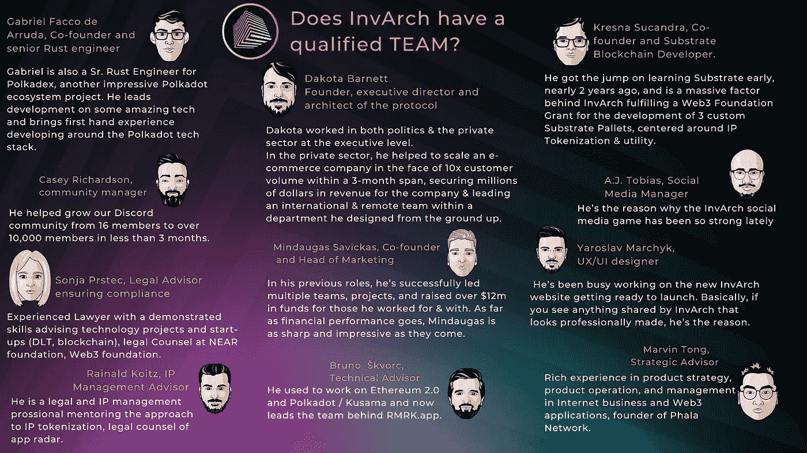

# 因瓦奇背后的团队

> 原文：<https://medium.com/coinmonks/the-team-behind-invarch-c85e039cf3e1?source=collection_archive---------15----------------------->

在加密领域，许多人认为对于任何加密项目，1%的成功来自于想法本身，99%来自于执行。事实上，许多项目失败的原因是缺乏技能和对加密领域如何工作的理解。这就是为什么这篇文章会回答 InvArch 是否有一个合格的团队来达成它所有的目标。

总的来说，我们可以开始说 InvArch 协议背后的团队是完全远程的、国际化的，并且共享许多不同的观点。他在法律知识产权管理、庞大的社区(700 多名大使和 10，000 名 discord 成员)以及 Web3 基金会的支持方面拥有丰富的专业知识。现在让我们仔细看看团队的每个成员。

# 因瓦赫的四个发现

伟大的项目始于伟大的想法，世界上的每一次变革都始于一次一个想法。InvArch 是在 2017 年首次想到的，四名团队成员被认为是该项目的创始人。

**Dakota Barnett 协议的创始人、执行董事和设计师**

他的背景来自行政管理，有在美国从政的经历。他在政界和私营部门的管理层都工作过。在私营部门，他帮助一家电子商务公司在六个月内扩大规模，面对 10 倍的客户量，为公司确保了数百万美元的收入，并在他从头设计的部门内领导一个国际和远程团队。
他自学编码已经有四年了。因瓦奇是他四年前就有的想法。一年多前，当他发现 Polkadot 网络时，他深深地爱上了区块链技术。他看到了 NFT 令人兴奋的功能以及它们目前是如何被使用的，并意识到 NFT 正是 InvArch 所需要的缺失部分。将任何文件标记和存储为知识产权的能力。

**Gabriel Facco de Arruda，联合创始人兼高级防锈工程师**

当他加入 Dakota 的旅程时，他最初的目标是给 NFT 他们应得的效用，但是现在他们已经过了那个阶段。他们真的为区块链工业开创了一个全新的领域！

Gabriel 还是另一个令人印象深刻的 Polkadot 生态系统项目 Polkadex 的高级 Rust 工程师。他领导了一些奇妙技术的开发，并将围绕 Polkadot 技术栈开发的第一手经验带给了 InvArch。

**Kresna Sucandra，联合创始人兼 Substrate 区块链开发者。**

他于 2018 年开始在加密领域工作，自 2020 年以来一直在学习技术。首先学习以太坊的坚固性，然后快进到基板作为波尔卡多区块链生态系统的框架。他爱 NFTs 和 Metavese 就像爱 DAO 一样。所有这些元素都是他和其他创始人一起构想出来的。
他是 InvArch 完成 Web3 基金会资助的一个重要因素，该基金会资助开发了 3 个以 IP 令牌化&实用程序为中心的定制基板托盘。

**明道加斯·萨维卡斯，联合创始人兼营销主管**

在之前的工作中，他成功领导了多个团队和项目，并为他的合作伙伴筹集了超过 1200 万美元的资金。就财务表现而言，明道加斯同样犀利，令人印象深刻。他已经为这个项目做了许多强有力的介绍。

# **营销和管理团队的三名成员**

伟大的想法需要传播，在一个竞争激烈但近乎残酷的秘密空间中，只有专业和稳健营销的想法才能被大众接受并存活下来。这是因瓦奇团队三名成员的第一责任。

**凯西·理查森，社区经理**

在不到三个月的时间里，他帮助我们的 Discord 社区从 16 名成员发展到超过 10，000 名成员。

**社交媒体经理 a . j . Tobias**

他是因瓦奇社交媒体游戏最近如此强劲的原因。

**雅罗斯拉夫·马尔切克，UX/UI 设计师**

他一直忙于新的 InvArch 网站的工作，准备推出。所以基本上，如果你看到因瓦奇分享的任何看起来专业制作的东西，他就是原因。

# 四位顾问

InvArch 是 web 3.0 的一个 IP 所有权、实用程序和认证协议。InvArch 允许用户将他们的文件作为数字资产进行存储和认证，我们称之为知识产权文件(IPF)。他们可以将它们组合成可互换的集合，称为 IP 集。利用与 IP 集挂钩的可替换和可编程的 IP 令牌。InvArch 将这一功能扩展到整个 Polkadot 生态系统，并创建了世界上第一个跨链认证协议。

因此，InvArch 至少有三个主要领域需要专业的法律和技术建议:

*   Web3 部门
*   关于知识产权法的法律部门
*   更具技术性的部门发展非功能性测试

为此，因瓦奇的团队可以依靠四名顾问。

**马文·童，战略顾问**

他在互联网业务和 Web3 应用的产品策略、产品运营和管理方面有着丰富的经验，是 Phala Network 的创始人。

**布鲁诺·斯克沃尔克，技术顾问**

他曾经从事以太坊 2.0 和波尔卡多特/草间弥生的工作，现在领导 RMRK.app 背后的团队。

**Sonja Prstec，法律顾问，确保合规**

她是一名经验丰富的律师，擅长为技术项目和初创企业(区块链 DLT)提供咨询，还是 NEAR foundation、Web3 foundation 的法律顾问。

**Rainald Koitz，知识产权管理顾问**

他是一名法律和知识产权管理专业人士，指导知识产权令牌化方法，是 app radar 的法律顾问。

在我结束之前，下图概括了 InvArch 团队成员的基本背景信息:

# 结论

由于 InvArch 团队的介绍，我们可以肯定地说 InvArch 在其协议背后有一个革命性的想法。它还拥有一个强大的、消息灵通的团队，与 Web3 基金会、Polkadot 生态系统和整个加密空间有许多良好的联系。InvArch 的爱好者和支持者可以放心，InvArch 周围是一个久经考验的赢家团队。

访问因瓦赫官方渠道:
[**网站**](https://invarch.network/)[**推特**](https://twitter.com/InvArchNetwork)[**不和**](https://discord.gg/J5Qwcb7tbN)】[**子社会**](https://app.subsocial.network/5857)】[**中**](https://invarch.medium.com/)[**电报**](https://t.me/InvArch)[**Github**](https://github.com/Invarch)

> 加入 Coinmonks [电报频道](https://t.me/coincodecap)和 [Youtube 频道](https://www.youtube.com/c/coinmonks/videos)了解加密交易和投资

# 另外，阅读

*   [交易杠杆代币的最佳交易所](https://coincodecap.com/leveraged-token-exchanges) | [购买 Floki](https://coincodecap.com/buy-floki-inu-token)
*   [3 commas vs Pionex vs Cryptohopper](https://coincodecap.com/3commas-vs-pionex-vs-cryptohopper)|[bing bon Review](https://coincodecap.com/bingbon-review)
*   [加密拷贝交易平台](/coinmonks/top-10-crypto-copy-trading-platforms-for-beginners-d0c37c7d698c) | [如何在 WazirX](/coinmonks/buy-bitcoin-on-wazirx-2d12b7989af1) 上购买比特币
*   [共贷回顾](https://coincodecap.com/coinloan-review)|[Crypto.com 回顾](/coinmonks/crypto-com-review-f143dca1f74c)
*   [如何在加拿大购买密码货币？](https://coincodecap.com/how-to-buy-cryptocurrency-in-canada)
*   [无聊猿游艇俱乐部(BAYC)点评](https://coincodecap.com/bored-ape-yacht-club-bayc-review)