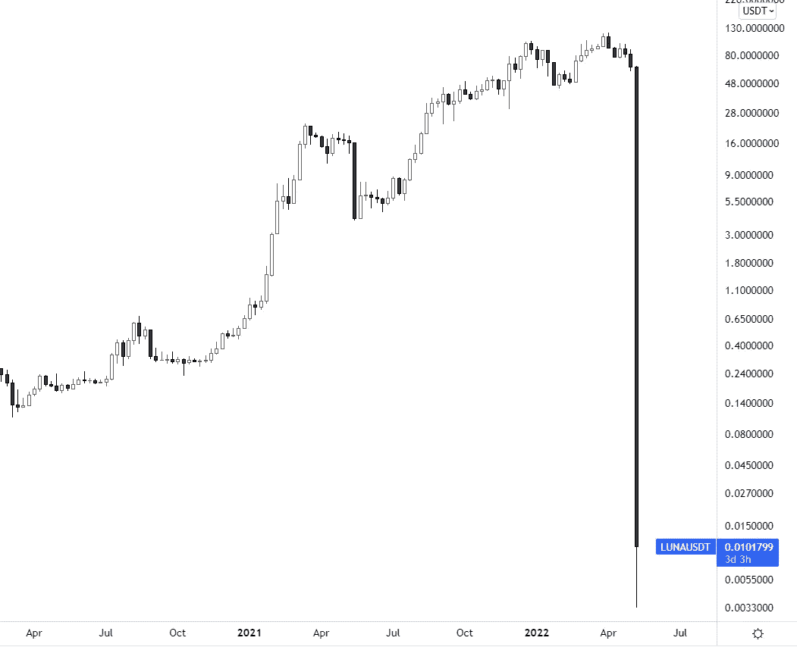
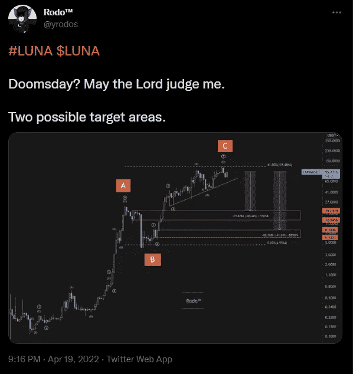
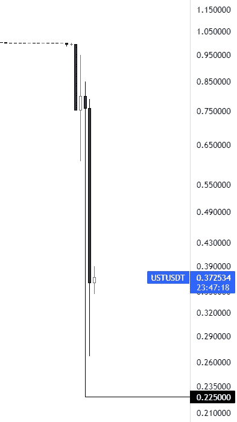

# Terra LUNA 坠毁是不可避免的。原因如下。

> 原文：<https://medium.com/coinmonks/the-terra-luna-crash-was-inevitable-heres-why-7d204ad12165?source=collection_archive---------5----------------------->

## 包括我在内的很多人都预见到了这一点。不需要天才也能想出来。

协同攻击？泡沫？庞氏骗局？露娜和整个 Terra 生态系统发生了什么？

The $LUNA crash. The cryptocurrency fell almost 100% in a couple of days.

很多故事，很多不同的解释。事实是，这是可以预测的，密码开发者只是一直忽略基本的经济规则。

让我通过展示我在 2022 年 4 月 19 日发出的这条推文来证明这是多么可预测。

My prediction for a “Doomsday” for $LUNA, calling for a 90% decline. It surpassed even my most outlandish target.

如果你不相信我，下面是那条推特的链接:[https://twitter.com/yrodos/status/1516571415272689678?s=20&t = ewobsdtdbdbgtouxqfzp 2 njg](https://twitter.com/yrodos/status/1516571415272689678?s=20&t=EWObSdTdBgtoUXQfzp2nJg)

在这个具体案例中，我使用了一种高级形式的艾略特波浪技术分析，称为“谐波”艾略特波浪，但我不打算深入研究，因为事实是，你真的不需要任何花哨的 TA 技能就能知道这最终会发生。

*免责声明:如果你真的想进入这个领域，你可以去我的 Twitter 简历中查看我的 linktree，那里有很多免费的教育资源:@yrodos plus 我推荐阅读我以前的文章《市场不是随机的》。*

在我们开始之前，让我们了解一下整个生态系统是如何工作的。

# stablecoins 怎么保持…稳定？

卢娜存在的主要目的是创造第一个完全分散的稳定币 first”。

你看，大多数其他稳定的货币，像 USDT 和 USDC，都是由中央机构管理的，这些机构支持或者据说支持上述稳定货币和实际美元的全部流通。

这意味着，对于每一个 USDC，都有一个锁定在某个地方的实体美元来支持它。

*   如果您向该机构购买 USDC，您用来购买它的美元将被存储。
*   如果你卖一个 USDC 给这个机构，你会收到你的美元回来，USDC 将被摧毁或“烧毁”。

通过这种方法，这些机构可以保持与美元的“挂钩”,并保持其硬币的价格稳定，固定在 1 美元，这些硬币中的每一个只是一个实物美元的代表。

# 卢娜 LUNA 钉

就 LUNA 而言，开发者们有一个绝妙的主意，创造了一种与它挂钩的“稳定币”，即 UST。问题是，如果你将一项本应稳定的资产与一项不稳定的资产挂钩，那么稳定应该来自哪里？完全正确，哪里也不去。

The $UST “depeg”.

## 算法是如何工作的

为了将 UST 固定在 1 美元的价格，该算法被指控任意铸造(创建)或烧毁(销毁)卢娜& UST 代币。

基本上，每当有人烧了价值 100 美元的月神，就会有 100 UST 被铸造出来。每当有人焚烧 100 UST，就会铸造价值 100 UST 的卢娜。

我希望现在你已经看到问题了。

# 通货紧缩崩溃的情景

## 第一个问题:不防银行挤兑

在金融市场中，崩盘是不可避免的。价格整天都在上涨和下跌，羊群总是从兴奋到恐慌，然后又回来，这就是价格的走势(我推荐阅读我以前的文章“你所知道的关于市场行为的一切都是错的”)。

如果你的系统不是设计来处理恐慌的后果，也就是说，每个人都想从系统中提取或出售他们的资产的银行挤兑，那么所述系统的崩溃是不可避免和迫在眉睫的，因为需求的最终下降是不可避免的。

在泰拉的情况下，这意味着一个 UST 德佩格。

事情就是这样。

这是因为 UST 并不是真正由整个 LUNA 市值支持的，它实际上是由 LUNA 的交易流动性支持的。在流动性耗尽之前，实际交易者在一天中的任何时候都只能提供这么多的退出流动性，如果人们因为恐慌而仍然想出售，如果有必要退出，他们会继续以更低的价格出售。德佩格。

## 第二个问题:需要无限的需求

正如我们已经看到的，当你燃烧一个 UST，你也在月神薄荷等同。这意味着当人们惊慌地从 UST 逃到其他稳定的城市时，大量的露娜被凭空创造出来。

通货膨胀。露娜贬值。

还要记住，所有的购买压力已经被所有在恐慌中抛售 UST 的人吸收了，所以没有购买压力，卢娜的供应过剩被创造出来，没有需求来吸收它，这创造了一个恶性循环，导致更多的恐慌，并最终导致死亡螺旋。

为了防止这样的系统崩溃，你需要一个不断增长的稳定需求。这在定义上是不可能的。

## 第三个问题:算法的速度

即使你以某种方式拥有世界上所有的流动性来支持所有退出稳定币的人(因为 20%的 UST 由比特币储备支持)，你也需要一个极其有效的算法，足够快地执行套利，一瞬间市场卖出数十亿美元。

这不仅仅是困难，在这个系统中不可能实现 100%的效率，这意味着当对硬币的需求突然下降时，不可能保持稳定的硬币至少暂时脱离挂钩。

## 第四个问题:锚协议产生的虚假需求

稳定的 20%年收益率的承诺显然给生态系统带来了大量需求。这正是让露娜没有过早崩溃的原因——锚协议夸大了 UST 的需求。

当人们需要如此多的 UST 时会发生什么？嗯，露娜被烧伤了。

这创造了一种硬币，在非常短的时间内价值爆炸，没有大量的需求，但人为减少了供应。除了猜测，没有人要求卢娜的，他们只是希望 ust 的股份锚。

# 繁荣与萧条

简而言之，泰拉的开发商有意无意地制造了完美的泡沫。一个被制造成指数级快速攀爬抓眉毛，困住所有人，然后突然无处爆发。

这篇文章到此为止，如果你喜欢它，考虑留下一个关注吧！

> 加入 Coinmonks [电报频道](https://t.me/coincodecap)和 [Youtube 频道](https://www.youtube.com/c/coinmonks/videos)了解加密交易和投资

# 另外，阅读

*   [币安 vs FTX](https://coincodecap.com/binance-vs-ftx) | [最佳(SOL)索拉纳钱包](https://coincodecap.com/solana-wallets)
*   [比诺莫评论](https://coincodecap.com/binomo-review) | [斯多葛派 vs 3Commas vs TradeSanta](https://coincodecap.com/stoic-vs-3commas-vs-tradesanta)
*   [Capital.com 评论](https://coincodecap.com/capital-com-review) | [香港的加密借贷平台](https://coincodecap.com/crypto-lending-hong-kong)
*   [如何在 Uniswap 上交换加密？](https://coincodecap.com/swap-crypto-on-uniswap) | [A-Ads 评论](https://coincodecap.com/a-ads-review)
*   [WazirX vs CoinDCX vs bit bns](/coinmonks/wazirx-vs-coindcx-vs-bitbns-149f4f19a2f1)|[block fi vs coin loan vs Nexo](/coinmonks/blockfi-vs-coinloan-vs-nexo-cb624635230d)
*   [本地比特币评论](/coinmonks/localbitcoins-review-6cc001c6ed56) | [加密货币储蓄账户](https://coincodecap.com/cryptocurrency-savings-accounts)
*   [什么是融资融券交易](https://coincodecap.com/margin-trading) | [成本平均法](https://coincodecap.com/dca)