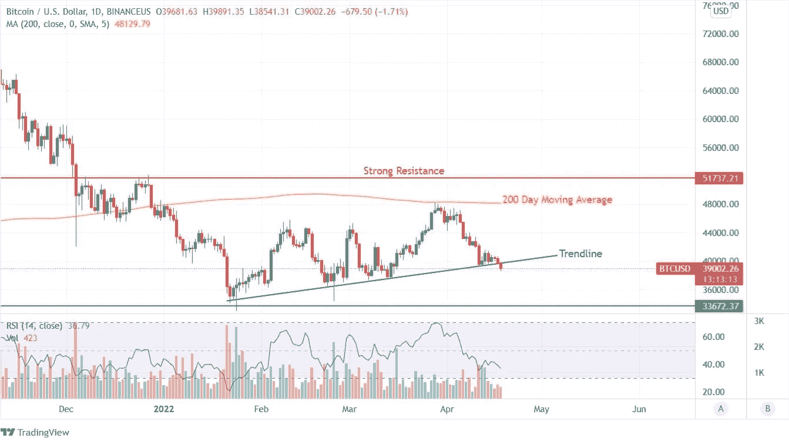

# 比特币(BTC)的三个月趋势线被打破了！

> 原文：<https://medium.com/coinmonks/the-three-month-trendline-of-bitcoin-btc-has-been-broken-9b0a651cfb7f?source=collection_archive---------36----------------------->

Source photo TradingView.com

比特币价值的上升激发了新一代密码开发人员尝试创造令人兴奋的新技术。根据我们的预测，BTC 将在 2022 年保持大约 41%的加密市场份额。比特币不再使用其突出的基于算法的交易证明，这种交易通常需要数小时才能得到验证，而是变得越来越…