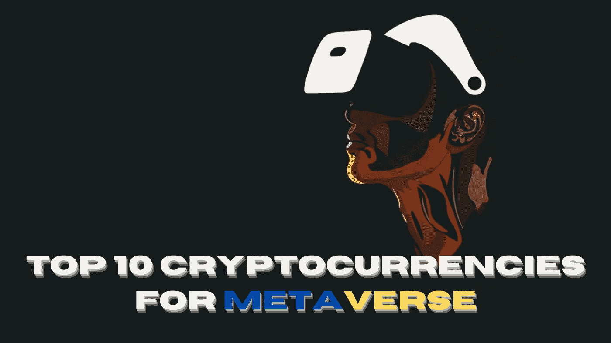

# 元宇宙十大加密货币

> 原文：<https://medium.com/coinmonks/the-top-10-cryptocurrencies-for-metaverse-9dd08c50d73a?source=collection_archive---------41----------------------->

# 加密形式的货币和元宇宙的结合正在淹没发达国家

元宇宙！全球科技市场上人人都在讨论的最闷热的高级开放空间。它围绕着所有意图和目的的联盟，升级的物质和先进的现实。这是友好联合的 3D 虚拟世界的组织。与此同时，对于大量的加密金融支持者来说，数字货币正在全球加密货币市场中蓬勃发展。数字货币和元宇宙的结合给加密钱包带来了足够的好处。这也被称为元宇宙数字货币，具有虚拟游戏的价值。沿着这些思路，我们应该特别关注可以在元宇宙长期使用的十种主要数字货币。

# 2022 年元宇宙十大加密货币

## 无限轴

Axie Infinity 是元宇宙顶级的数字货币之一，将资源放入加密钱包，Axie 是追逐宝藏的野蛮动物。它协助开发一个品种，并使用最先进的技术来奖励玩家的承诺。在这个互联网游戏中，每天有超过 2，800，000 名活跃玩家。

## 金恩

金恩是一种著名的元宇宙数字货币，也是一种基于以太坊的数字货币，以支持尖端的可兑换货币和非兑换货币的价值。秘密金融支持者可以扩大对秘密金融支持者的信任，同时压低股票并扩大价值。有不同的用例，如游戏、工艺和收藏品。

## Meta 平台公司。

Meta Platforms，Inc .是顶级的元宇宙数字货币形式之一，也是 Meta 的 NFT 东西制造商的分散加密货币。加密金融支持者可以在元宇宙发现新大陆，推动加密钱包的收益。

## OpenSea

OpenSea 是元宇宙数字形式的货币加密金融支持者之一，致力于发现和销售卓越的非加密金融工具。这是世界上第一个也是最大的数字货币市场 NFT。加密金融支持者可以建立加密钱包，进行分类，并添加视频、声音、图片等非功能性内容。

## 沙盒

沙盒是一个著名的元宇宙数字货币与 NFTs。这种加密货币是一种虚拟令牌，印在区块链上，代表高级短缺、安全性和可信度。它是独一无二的，不可破解的，也是不兼容的，以推动加密金融支持者的加密钱包的利益。

## 星图

《星图》是元宇宙著名的数字货币形式之一，它提供了一轮惊人的系统调查、地区胜利以及政治控制。它有助于规划方法，提出主张，征服竞争对手，等等。加密金融支持者可以购买东西，并迅速设计它们，以保证元宇宙周围的土地。

## 流量区块链

流区块链是一个主要的元宇宙加密货币，用于未来时代的应用程序、游戏以及影响加密钱包利益的计算机化资源。这种加密货币的核心是通过各种分期付款入口和生物系统，为加密金融支持者和狂热支持者提供标准化的易用性升级。

## 北海巨妖

北海巨妖是著名的加密金融支持者，利用元宇宙购买比特币和其他加密形式的货币。他们可以在几分钟内购买超过 65 种数字形式的货币。它的核心是为数字货币建立一个平滑的比特币交易，同时搁置简单的分期付款和提款。

## 淀积层

Illuvium 是元宇宙著名的加密货币，带有 NFT 动物采集者和汽车骑士游戏。这是基于以太坊区块链以及丰富的图形科幻体验中的游戏获取。同样，它也是围绕着在加密钱包中获得足够的好处来完成 PVE 任务，完成独特的任务，以及赢得奖励。

## 分散土地

分散货币是 2022 年元宇宙使用的顶级数字货币之一。此外，它还有助于熟练地、实际地制作、研究和交换第一个虚拟世界。它以惊人的场景和结构提供了与加密金融支持者的一致遭遇。

> 加入 Coinmonks [电报频道](https://t.me/coincodecap)和 [Youtube 频道](https://www.youtube.com/c/coinmonks/videos)了解加密交易和投资

# 另外，阅读

*   [5 款最佳加密交易终端](https://coincodecap.com/crypto-trading-terminals) | [最佳 DeFi 应用](https://coincodecap.com/best-defi-apps)
*   [比特币基地 vs 瓦济克斯](https://coincodecap.com/coinbase-vs-wazirx) | [比特鲁点评](https://coincodecap.com/bitrue-review) | [波洛涅克斯 vs 比特鲁](https://coincodecap.com/poloniex-vs-bittrex)
*   [德国最佳加密交易所](https://coincodecap.com/crypto-exchanges-in-germany) | [Arbitrum:第二层解决方案](https://coincodecap.com/arbitrum)
*   [币安交易机器人](/coinmonks/binance-trading-bots-d0d57bb62c4c) | [OKEx 审查](/coinmonks/okex-review-6b369304110f) | [阿塔尼审查](https://coincodecap.com/atani-review)
*   [最佳加密交易信号电报](/coinmonks/best-crypto-signals-telegram-5785cdbc4b2b) | [MoonXBT 评论](/coinmonks/moonxbt-review-6e4ab26d037)
*   [如何在 Bitbns 上购买柴犬(SHIB)币？](https://coincodecap.com/buy-shiba-bitbns) | [购买 Floki](https://coincodecap.com/buy-floki-inu-token)