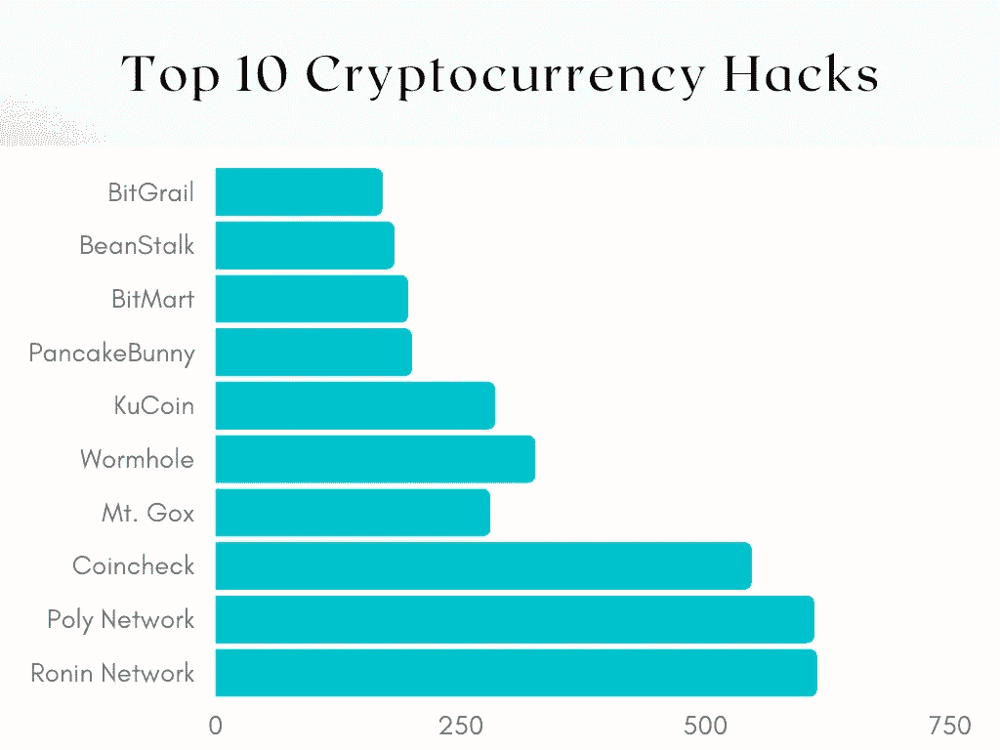

# 有史以来十大加密货币黑客

> 原文：<https://medium.com/coinmonks/the-top-10-cryptocurrency-hacks-of-all-time-34b8d042c548?source=collection_archive---------24----------------------->

加密货币行业是最不稳定的行业之一，近年来发生了大量的诈骗和黑客攻击。由于这些黑客攻击和汇兑损失，我们编制了一份有史以来十大加密货币黑客攻击的列表。这应该让你在购买加密货币或选择使用哪个交易所时有所思考，同时也帮助你避免被未来的攻击所困扰。

Top 10 Cryptocurrency Hacks Graph

# 1.浪人网络(2022 年)——6.14 亿美元

3 月 23 日，为流行的玩到赚游戏 Axie Infinity 打造的以太坊侧链 Ronin 被黑掉了 17.36 万 ETH 和 2550 万 USDC，总价值超过 6 亿美元。Ronin 桥的安全漏洞得到了 Sky Mavis 的证实，这是一款流行的 P2E 游戏的开发公司。

“这是 2021 年 12 月的一次社会工程攻击，结合了人为错误。Sky Mavis tech 是可靠的，我们将很快向 Ronin 网络添加几个新的验证器，以进一步分散网络，”Axie Infinity 联合创始人兼首席运营官 Aleksander Leonard Larsen 说。

在这里阅读更多关于黑客的信息。

# 2.保利网络(2021 年)——6.11 亿美元

分散金融或“DeFi”领域的平台 Poly Network 在 2021 年 8 月遭受了一次重大攻击，黑客窃取了价值超过 6 亿美元的数字令牌。窃贼利用了 Poly Network 代码中的一个漏洞，允许他们将资金转移到自己的账户。

故事以一个奇怪的转折结束，因为保利网络保持了与黑客的通信畅通，并设法取回了所有资金。“我的行为，可能被认为是怪异的，是我以个人风格为保利项目的安全做出的努力，”黑客说。

点击阅读更多关于[的故事。](https://www.cnbc.com/2021/08/23/poly-network-hacker-returns-remaining-cryptocurrency.html)

# 3.硬币支票(2018 年)——5.47 亿美元

2018 年 1 月，黑客闯入一家名为 Coincheck Inc .的加密货币交易所，偷走了近 5 亿美元的数字代币。该交易所没有披露他们的系统是如何被攻破的，只是说这不是内部作案。

点击这里阅读更多关于黑客[的信息。](https://fortune.com/2018/01/31/coincheck-hack-how/)

# 4.戈克山(2014 年)——4.8 亿美元

2014 年 2 月，Mt. Gox 遭受了一次严重的比特币黑客攻击。黑客成功访问并窃取了该交易所客户的 74 万比特币，以及该公司自身的 10 万比特币，当时大约相当于 4.8 亿美元。

黑客攻击很快失去控制，该公司最终在 2014 年 2 月底破产。

在这里阅读更多关于黑客的信息。

# 5.虫洞(2022)——3.26 亿美元

DeFi platform Wormhole 在今年 2 月成为加密货币盗窃的受害者，当时一名攻击者利用一个安全漏洞偷走了近 3.26 亿美元。

攻击似乎是由该项目的 GitHub 库的最近更新引起的，该更新揭示了尚未部署到项目本身的一个 bug 的修复。

在这里阅读更多关于黑客[的内容](https://www.theverge.com/2022/2/3/22916111/wormhole-hack-github-error-325-million-theft-ethereum-solana)。

# 6.库币(2020 年)——2.85 亿美元

2020 年 9 月 25 日，黑客从库币交易所窃取了价值超过 2.75 亿美元的加密货币。然而，在黑客攻击被报道后，Kucoin 立即开始与加密行业的各种参与者合作。这种合作最终导致追回了大量被盗资金。

点击这里阅读更多关于黑客[的信息。](https://news.bitcoin.com/kucoin-boss-on-strategy-after-hack-we-chose-to-act/)

# 7.《熊猫总动员》(2021)——2 亿美元

2021 年 5 月，广受欢迎的基于币安智能链的去中心化金融协议 PancakeBunny 遭受了一次重大攻击，该协议允许黑客携带价值超过 2 亿美元的加密资产逃走。根据 PancakeBunny 团队在攻击后发布的一系列 Twitter 帖子，该协议受到了外部参与者的快速贷款利用。

点击阅读更多关于黑客[的内容。](https://cointelegraph.com/news/pancakebunny-tanks-96-following-200m-flash-loan-exploit)

# 8.比特市场(2021 年)——1.96 亿美元

2021 年 12 月，加密交易平台 Bitmart 经历了“大规模安全漏洞”，导致黑客提取了约 1.96 亿美元的加密货币资产。

点击阅读更多关于黑客[的内容。](https://coinmarketcap.com/alexandria/article/bitmart-hack-one-of-the-most-recent-crypto-hacks)

# 9.豆茎(2022)——1.82 亿美元

2022 年 4 月，基于以太坊的 stablecoin 协议 Beanstalk 成为针对其治理协议的攻击的受害者。攻击者从项目中窃取了 1 . 81 亿美元，但只从窃取的资产中获利 7600 万美元。

点击阅读更多关于黑客[的内容。](https://halborn.com/explained-the-beanstalk-hack-april-2022/)

# 10.《圣杯》( 2018 年)——1.7 亿美元

2018 年 2 月，意大利比特币交易所 BitGrail 向用户发布了一份通知，告知他们黑客已经偷走了 1700 万单位的纳米(XRB)，这种硬币以前被称为 RaiBlocks。当时 Nano 的价值约为 10 美元，BitGrail 指出损失约为 1.7 亿美元。

在这里阅读更多关于黑客的信息。

# 结论

加密货币领域有很多黑客攻击的故事，其中大多数都发生在不久前。从简单的 T2 骗局到大型交易所复杂的代码利用，这些交易所在网络安全上投入了数百万美元。似乎每两周至少会发布一次黑客或骗局的消息。虽然大多数加密货币用户都很小心，并认真对待数据安全，但并不是每个人都这么勤奋。如果你选择投资一个加密货币项目，请确保智能合同由一家声誉良好的公司进行审计，如赛博视和 DYOR。

[*Cyberscope*](https://www.cyberscope.io/) *是密码行业领先的智能合同审计& KYC 公司之一，已经审计了 500 多个区块链项目和 NFT。所有主要发射台的官方合作伙伴。*

…

*最初发布于*[*https://www . cyber scope . io*](https://www.cyberscope.io/)*。*

> 加入 Coinmonks [电报频道](https://t.me/coincodecap)和 [Youtube 频道](https://www.youtube.com/c/coinmonks/videos)了解加密交易和投资

# 另外，阅读

*   [3 商业评论](/coinmonks/3commas-review-an-excellent-crypto-trading-bot-2020-1313a58bec92) | [Pionex 评论](https://coincodecap.com/pionex-review-exchange-with-crypto-trading-bot) | [Coinrule 评论](/coinmonks/coinrule-review-2021-a-beginner-friendly-crypto-trading-bot-daf0504848ba)
*   [莱杰 vs n rave](/coinmonks/ledger-vs-ngrave-zero-7e40f0c1d694)|[莱杰 nano s vs x](/coinmonks/ledger-nano-s-vs-x-battery-hardware-price-storage-59a6663fe3b0) | [币安评论](/coinmonks/binance-review-ee10d3bf3b6e)
*   [Bybit Exchange 审查](/coinmonks/bybit-exchange-review-dbd570019b71) | [Bityard 审查](https://coincodecap.com/bityard-reivew) | [Jet-Bot 审查](https://coincodecap.com/jet-bot-review)
*   [3 commas vs Cryptohopper](/coinmonks/3commas-vs-pionex-vs-cryptohopper-best-crypto-bot-6a98d2baa203)|[赚取加密利息](/coinmonks/earn-crypto-interest-b10b810fdda3)
*   最好的比特币[硬件钱包](/coinmonks/hardware-wallets-dfa1211730c6) | [BitBox02 回顾](/coinmonks/bitbox02-review-your-swiss-bitcoin-hardware-wallet-c36c88fff29)
*   [block fi vs Celsius](/coinmonks/blockfi-vs-celsius-vs-hodlnaut-8a1cc8c26630)|[Hodlnaut 审核](/coinmonks/hodlnaut-review-best-way-to-hodl-is-to-earn-interest-on-your-bitcoin-6658a8c19edf) | [KuCoin 审核](https://coincodecap.com/kucoin-review)