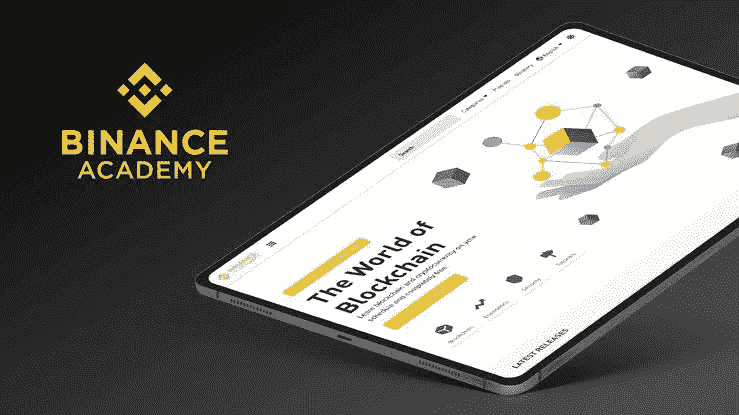
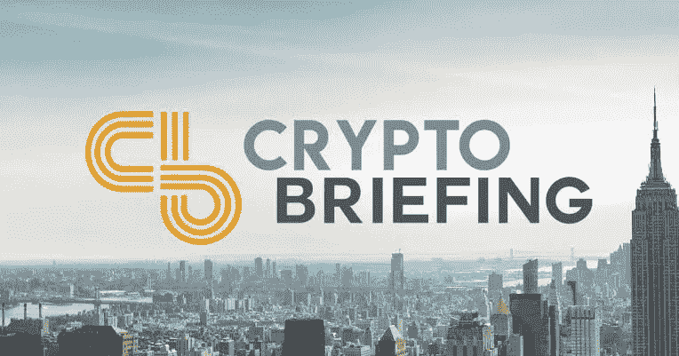
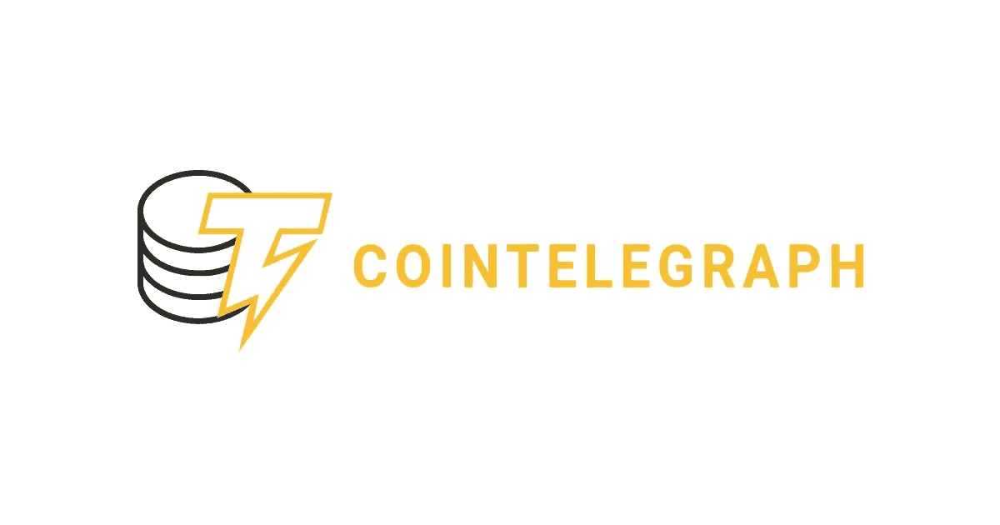
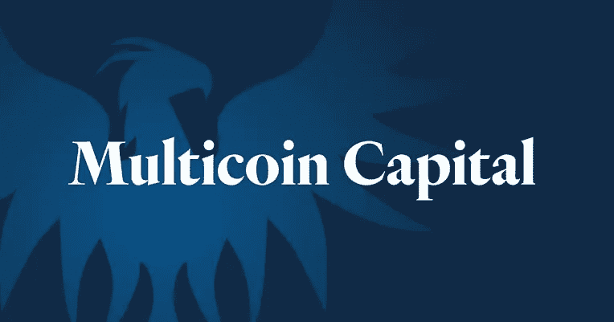
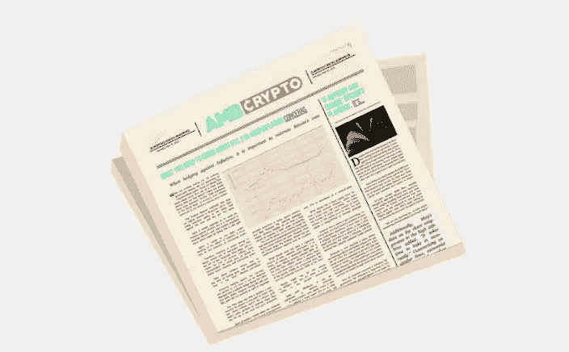
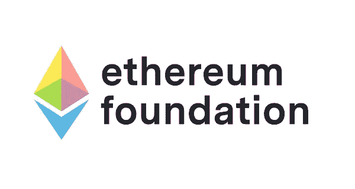
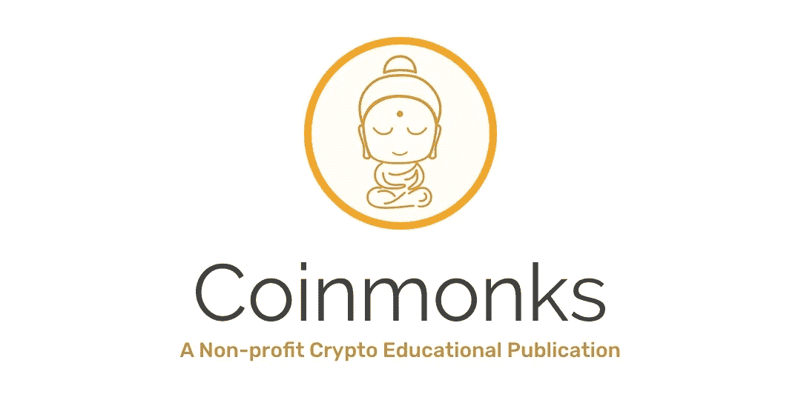
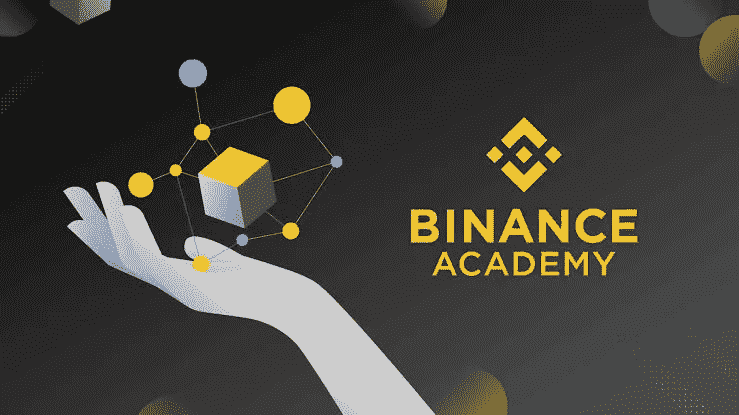

# 你应该知道的 7 大加密货币博客

> 原文：<https://medium.com/coinmonks/the-top-7-cryptocurrency-blogs-you-should-know-38e8c779ec92?source=collection_archive---------19----------------------->

很难找到谁没听说过加密货币。每天都有更多的人加入。有些人是作为投资者来的，有些人是作为交易者来的，还有许多人希望了解更多关于加密货币的知识。

他们经常阅读加密货币、区块链技术和 NFT。这正是加密利基在博客中获得如此大的吸引力的原因。

在这篇文章中，我想分享我对最佳加密博客的建议。在我看来，这些博客设计得很好，包含了高质量的内容。

让我们来看看这些博客以及促成它们流行和价值的因素。

## 七大加密货币博客:

找到所有这些博客并不容易，但我确保尽可能多地查看，以找到能够为您提供优质加密货币内容的最佳博客。

我目前有七个优秀的加密货币博客，它们具有出色的网页设计、强大的利基市场以及大量以博客帖子、新闻文章等形式出现的高质量内容。开始定期阅读和关注这些博客，以获得动力，并可能开始你的博客。

## 1.加密简报:

[Crypto Briefing](https://cryptobriefing.com/) 是加密货币博客的一个极好的例子，它把一切都做对了。这不仅是因为它令人惊叹的设计和持续不断的高质量内容，也是因为它的主要目标。它的创建是为了突出合法的加密货币用户，并帮助消除骗子。

商业、市场、技术、分析和教育是课程的主要内容。

广告、赞助内容和会员是主要的收入形式。

## 2.硬币电报:

[Cointelegraph](https://cointelegraph.com/) 是市场老手，于 2013 年推出。从那以后，这个加密货币博客报道了几个重要的行业发展。你也可以在这个博客上找到关于替代货币和采矿设备的信息。

贸易、采矿、区块链和新闻是报道的主要话题。

广告和赞助帖子是收入的主要来源。

## 3.多核心资本:

[Multicoin Capital](https://multicoin.capital/) 不是你常见的加密货币博客。它由一家投资公司所有，更适合有限但至关重要的加密对冲基金市场。这个博客可能会引起新的和有经验的加密货币投资者的极大兴趣。

投资、研究和对冲基金是课程的主要内容。

联盟营销、赞助内容和投资构成了大部分收入。

## 4.AMBCrypto:

AMBCrypto 主要是一个加密货币新闻和分析网站。它还发表各种其他主题的故事。尽管它于 2018 年推出，但它仍然是最受欢迎的加密货币网站之一。当他们探索每个主题时，内容通常非常简单明了，尤其是在评估时。

新闻、比特币、altcoins、科技是涵盖的主要话题。

广告和赞助帖子是收入的主要来源。

## 5.以太坊基金会博客:

[以太坊基金会博客](https://blog.ethereum.org/)是一个讨论以太坊和以太坊区块链技术的加密货币博客的极好例子。该博客风格独特，似乎是一本未来主义的杂志，展示了其内容的前瞻性。

以太坊，研究，开发，组织，和安全是涵盖的主要议题。

赞助文章和投资是收入的主要来源。

## 6.硬币僧侣:

[Coinmonks](https://medium.com/coinmonks) 是一个托管在 Medium 上的加密货币博客。尽管这个博客很受欢迎，但它没有自己的网站。这个博客涵盖了各种各样的评论文章、方法文章和其他资源。

交易策略、交易机器人、软件、加密新闻、交易所、非功能性交易等等都是课程的主要内容。

广告和会员是收入的主要来源。

## 7.币安学院博客:

[币安学院博客](https://www.binance.com/en/blog/all/start-here-binance-academy-your-way-421499824684901086)是一个学习平台，有无数小时关于区块链、加密货币、加密经济学、安全、NFTs 和其他主题的内容。它实际上是与加密货币相关的一切的一站式商店，可以成为新投资者的有用工具。

密码、区块链、交易、投资和隐私是涵盖的主要主题。

交易费、贷款利息、利差、经纪人项目费、云服务、交易费、采矿服务和投资收益是币安创收的一些方式。

## 结论:

您现在可以访问我收集的最佳加密货币博客示例。如果你正在寻找一个可信的加密货币博客，这些例子应该很好。

如果你是一个密码爱好者，你会在这些博客上找到大量的信息，如果你正在考虑写关于密码的文章，你会找到大量的灵感。

如果你读到这里，说明你喜欢这个内容。你可以在推特 [*上关注我来表示感谢，并为我鼓掌 50 次👏。*](http://twitter.com/bukzofWakanda)

> 加入 Coinmonks [电报频道](https://t.me/coincodecap)和 [Youtube 频道](https://www.youtube.com/c/coinmonks/videos)获取每日[加密新闻](http://coincodecap.com/)

# 另外，阅读

*   [币安 vs FTX](https://coincodecap.com/binance-vs-ftx) | [最佳(SOL)索拉纳钱包](https://coincodecap.com/solana-wallets)
*   [比诺莫评论](https://coincodecap.com/binomo-review) | [斯多葛派 vs 3Commas vs TradeSanta](https://coincodecap.com/stoic-vs-3commas-vs-tradesanta)
*   [Capital.com 评论](https://coincodecap.com/capital-com-review) | [香港的加密借贷平台](https://coincodecap.com/crypto-lending-hong-kong)
*   [如何在 Uniswap 上交换加密？](https://coincodecap.com/swap-crypto-on-uniswap) | [A-Ads 评论](https://coincodecap.com/a-ads-review)
*   [WazirX vs CoinDCX vs bit bns](/coinmonks/wazirx-vs-coindcx-vs-bitbns-149f4f19a2f1)|[block fi vs coin loan vs Nexo](/coinmonks/blockfi-vs-coinloan-vs-nexo-cb624635230d)
*   [本地比特币评论](/coinmonks/localbitcoins-review-6cc001c6ed56) | [加密货币储蓄账户](https://coincodecap.com/cryptocurrency-savings-accounts)