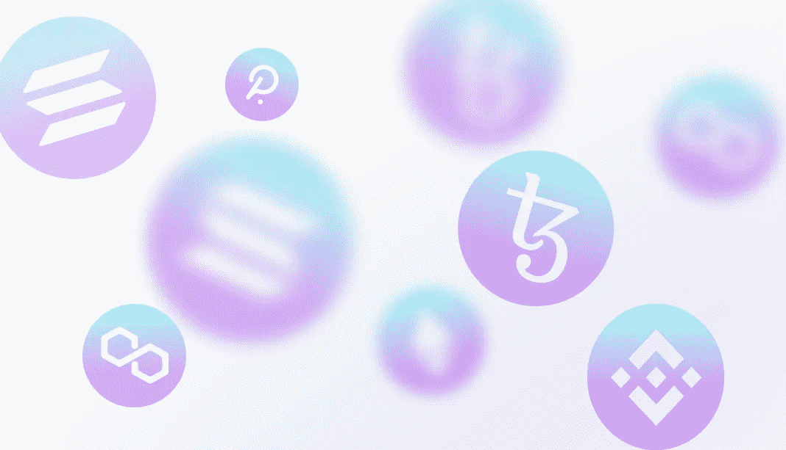

# NFT 发展的顶级区块链

> 原文：<https://medium.com/coinmonks/the-top-blockchains-for-nft-development-fb8aaf2b858a?source=collection_archive---------26----------------------->

一般来说，这是区块链开发者的任务。基于他们的经验，他们将是能够为您的目的选择最佳区块链的人。但是，在本文中，我们会举一些通俗的例子。

# **以太坊**

以太坊是最广泛使用和最流行的非功能性测试区块链。

以太坊包含各种智能合约的标准，目前它正准备切换到利益证明(PoS)共识机制(Eth 2.0)，这将实现更好的网络扩展，提高交易速度(TPS)，同时降低成本。以太坊在平台中的稳定性和可靠性也是众所周知的。

# **索拉纳**

Solana 是加密生态系统中另一个最受欢迎的平台，目前被认为是最快的区块链之一。它基于历史证明(PoH)和利益证明(PoS)共识机制的独特组合。由于这一点，它实现了高水平的可扩展性，吞吐量约为 65，000 TPS，天然气佣金较低。

Solana 目前拥有超过 400 个项目，涵盖 DeFi、NFTs 和 Web3。

# **多边形**

Polygon 基于以太坊协议，可以高效兼容所有区块链网络。

Polygon 允许通过自主智能合约构建更快且可扩展的解决方案。这个稳定的协议允许这个区块链的功能致力于提高 NFTs 的效率。

# **泰佐斯**

Tezos 是一款功能性智能合约区块链。这种区块链交易费用低，速度快。Tezos 仍然是新的，但可以考虑。此外，还有一个用于收集、验证、执行和达成共识的多节点流程架构。

# **币安智能连锁(BSC)**

BSC 为 NFT 提供了一个智能合约平台来管理整个交易流程。这是加密领域中最快的区块链网络之一。与其他区块链平台相比，BSC 的分散化特征是一个极好的优势。

# **波尔卡多特**

Polkadot 是下一代区块链，其网络区块链协议具有多个链，旨在将几个区块链连接成一个统一的网络，使它们能够通过其中继链进行通信。在 Polkadot 上，用户可以将他们的 NFT 资产从一个区块链转移到另一个。

我们专门从事区块链发展。我们已经完成了 100 多个不同的项目，如 NFT、他们的市场和钱包。我们可以创建一个符合您所有要求的强大的 NFT 平台。联系我们，让我们一起开始你的项目！ [https://crypton.studio](https://crypton.studio)

阅读 crypton.studio 上的完整文章以了解更多信息。

> 加入 Coinmonks [电报频道](https://t.me/coincodecap)和 [Youtube 频道](https://www.youtube.com/c/coinmonks/videos)了解加密交易和投资

# 另外，阅读

*   [TraderWagon 回顾](https://coincodecap.com/traderwagon-review) | [北海巨妖 vs 双子星 vs BitYard](https://coincodecap.com/kraken-vs-gemini-vs-bityard)
*   [如何在 FTX 交易所交易期货](https://coincodecap.com/ftx-futures-trading) | [OKEx vs 币安](https://coincodecap.com/okex-vs-binance)
*   [OKEx vs KuCoin](https://coincodecap.com/okex-kucoin) | [摄氏替代品](https://coincodecap.com/celsius-alternatives) | [如何购买 VeChain](https://coincodecap.com/buy-vechain)
*   [ProfitFarmers 点评](https://coincodecap.com/profitfarmers-review) | [如何使用 Cornix 交易机器人](https://coincodecap.com/cornix-trading-bot)
*   [如何匿名购买比特币](https://coincodecap.com/buy-bitcoin-anonymously) | [比特币现金钱包](https://coincodecap.com/bitcoin-cash-wallets)
*   [瓦济里克斯 NFT 评论](https://coincodecap.com/wazirx-nft-review)|[Bitsgap vs Pionex](https://coincodecap.com/bitsgap-vs-pionex)|[坦吉姆评论](https://coincodecap.com/tangem-wallet-review)
*   [如何使用 Solidity 在以太坊上创建 DApp？](https://coincodecap.com/create-a-dapp-on-ethereum-using-solidity)