# 顶级高收益加密货币储蓄账户拥有最佳注册奖金[2022 年 4 月/5 月]

> 原文：<https://medium.com/coinmonks/the-top-high-yield-cryptocurrency-savings-account-for-stablecoins-with-the-best-signup-bonuses-11e297e7f7e1?source=collection_archive---------1----------------------->

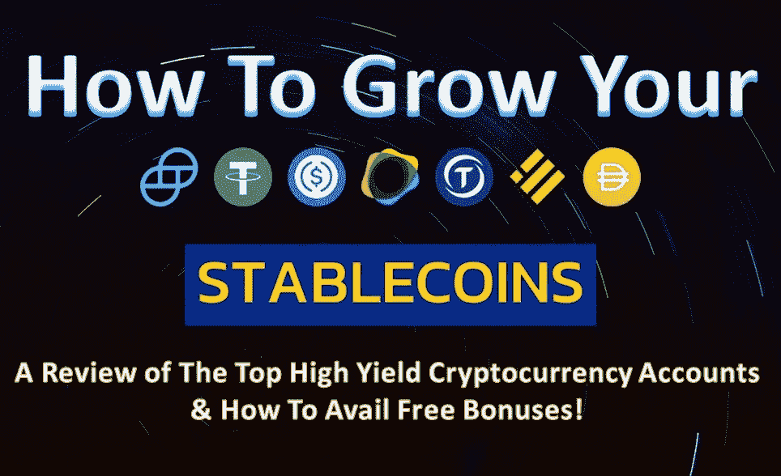

在任何加密货币投资组合中，tablecoins 都是一种无价的资产——它缓冲了加密货币固有的波动性，保持了与法定货币(最常见的是美元)挂钩的稳定价值。泰瑟(USDT)是流通中最受欢迎的稳定币，尽管其他许多国家特别是 USDC 和 UST 也在迅速赶上流行。Stablecoins 有各种各样的用途，从充当加密货币交易的中介，到作为价值转移的稳定工具，再到为寻求高回报同时保本的投资者提供长期持有。对于我们这些有着适度保守偏好的人来说，他们享受着乘坐加密货币市场涨跌的偶尔刺激，但却无法忍受巨额损失，稳定货币提供了一种从复利中产生被动收入的诱人方式，因为高收益加密货币储蓄账户的回报比传统银行机构提供的微不足道的定期存款利率高得多。在本文中，我们将探索提供最佳利率来安全存放您的稳定帐户的顶级加密货币服务提供商，查看他们的 Trustpilot 评级，并比较各种注册奖金和正在进行的促销活动，以便您可以从存储您的数字资产中获得最佳交易！

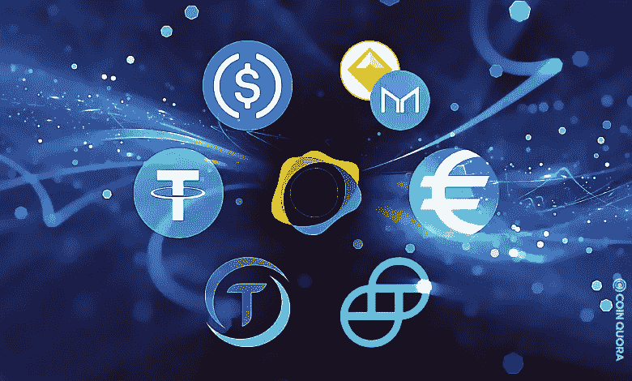

Image taken from Coin Quora

# Nexo

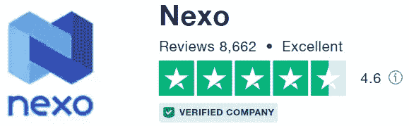

N Nexo 是一家非常透明的金融科技公司，[获得许可并受到监管](https://nexo.io/licenses-and-registrations)，BitGo 和 Ledger Vault 为其托管的数字资产提供了 3.75 亿美元的保险保护。总体而言，它们为各种加密货币提供了极具竞争力的利率；stablecoins 赚取高达 12% APY 的可观利率，在以太坊网络上每月最多可免费取款 5 次，在多边形网络上免费取款次数不限。他们有一个优秀的客户支持团队，和一个充满活力的电报组，可以在这里找到。Nexo 卡是一个令人兴奋的新功能！

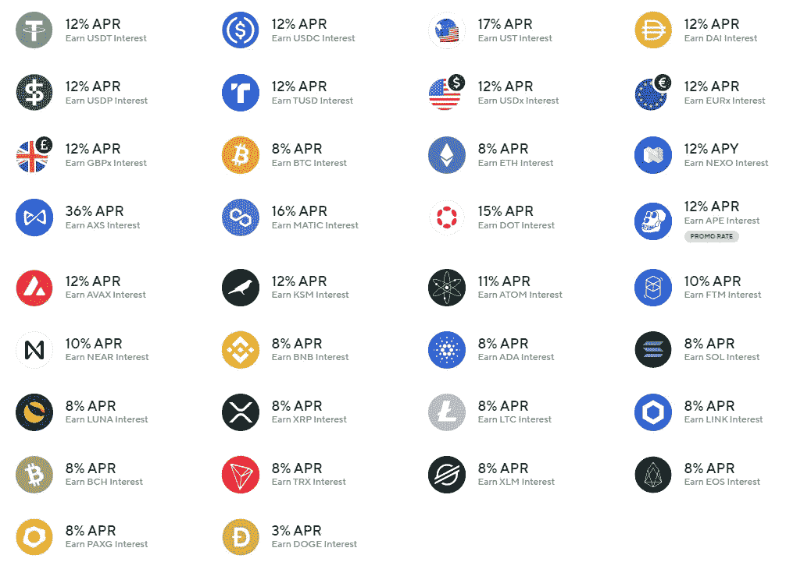

[**报名奖金**](https://nexo.io/ref/hce5cfdt5o?src=android-link) :在 BTC 用 100 美元存款支付 25 美元，保留 1 个月。在这里报名！

想了解更多关于 Nexo 的信息，请点击这里查看我之前的文章。

# 霍德瑙特

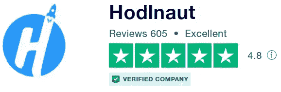

在这个领域，odlnaut 是一个相对较新的参与者，但它已经建立了稳固的声誉。Holdnaut 是一家总部位于新加坡的金融科技公司，最近获得了新加坡金融管理局(MAS)的原则批准，获得了一家主要支付机构的许可证。目前它只支持主流的加密货币硬币，但对稳定的硬币提供相当有吸引力的利率，高达 9.41%(USDT 和 USDC)和 13.86%的 APY(UST)。Hodlnaut 每月提供 1 次免费提现；随后的取款花费 10 美元。

在它的第三个生日之际，Hodlnaut 目前正在进行一些促销活动。在此注册 Holdnaut [，加入](https://www.hodlnaut.com/join/RTbHxuJMX)[**hodlunatics 赠品**](https://www.hodlnaut.com/ust-luna-giveaway) ，您将有机会赢得价值 1000 美元的 UST 和露娜。

所有 HODL 人请注意！Holdnaut 目前还在开展一项从 2022 年 4 月 19 日到 5 月 15 日的**大生日月活动，用户可以通过持有你的数字资产 4 个月在 UST 额外赚取 240 美元。要参加促销活动，[注册](https://www.hodlnaut.com/join/RTbHxuJMX)帐户，激活促销代码“HPYBDY ”,然后在一次合格交易中将受支持的资产转移到平台上。但是请注意，在此期间的任何撤回都将使促销无效。欲了解更多信息，请点击阅读活动机制[。](https://www.hodlnaut.com/crypto-offers/hodlnaut-birthday-month-2022)**

**为了让这笔交易更加甜蜜，Hodlnaut 最近推出了另一项针对新用户的注册促销活动，在现有的 30 美元注册奖金基础上额外增加 20 美元，限时至 2022 年 6 月 26 日！结合大生日月活动，投资者只需一笔合格存款，就有可能获得高达 290 美元的**巨额奖金！在此阅读更多关于如何玩到$290 [的信息。](/coinmonks/hodlnaut-goes-luna-tic-earn-up-to-a-free-290-bonus-2c10e55454f3)****

**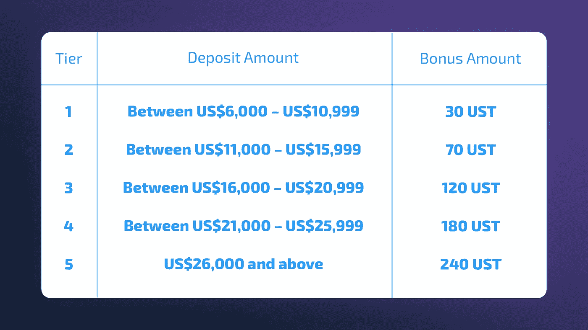**

**Hodlnaut’s Big Birthday Month Campaign**

**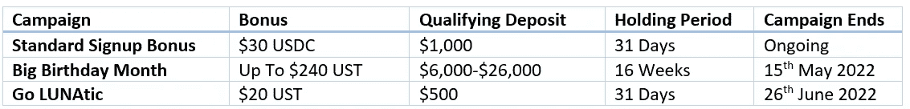**

**Stacking all 3 currently ongoing promotions from Hodlnaut**

**[**报名奖金**](https://www.hodlnaut.com/join/RTbHxuJMX):50 美元，最低存款 1000 美元，连续持有 31 天。或在 UST 最低存款额为 500 美元时存入 20 美元，连续持有 31 天。报名[这里](https://www.hodlnaut.com/join/RTbHxuJMX)！这项注册奖金可与上面的生日月活动叠加使用。**

# **摄氏温标**

**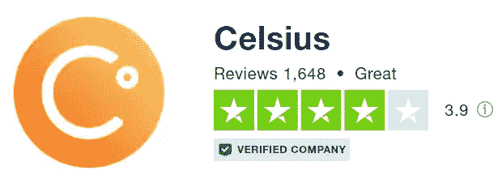**

**C Celsius 在 stablecoins 上提供高达 9.32%的 APY(实物收入和白金等级)。与竞争者相比，他们的利率可能显得相对苍白；然而，我喜欢摄氏无限免费提款！唯一的缺点是只能对白名单中的地址进行撤销，任何添加或更改都有 24 小时的冷却期。**

**Celsius 定期开展促销活动，新用户/现有用户可以使用如下所示的促销代码通过存放数字资产获得奖励。**

**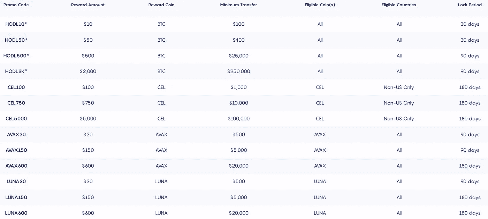**

**[**报名奖金**](https://celsiusnetwork.app.link/174094633e) : [$50 在 BTC](https://celsiusnetwork.app.link/174094633e) 存入$400，有效期 1 个月。报名[这里](https://celsiusnetwork.app.link/174094633e)！**

# **蛋糕 DeFi**

**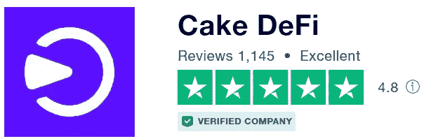**

**C [ake DeFi](https://cakedefi.com/?ref=677920) 是一家位于新加坡的一站式投资平台，提供最好的赌注、贷款和流动性挖掘服务，产生高达 150% APY 的丰厚回报！**

**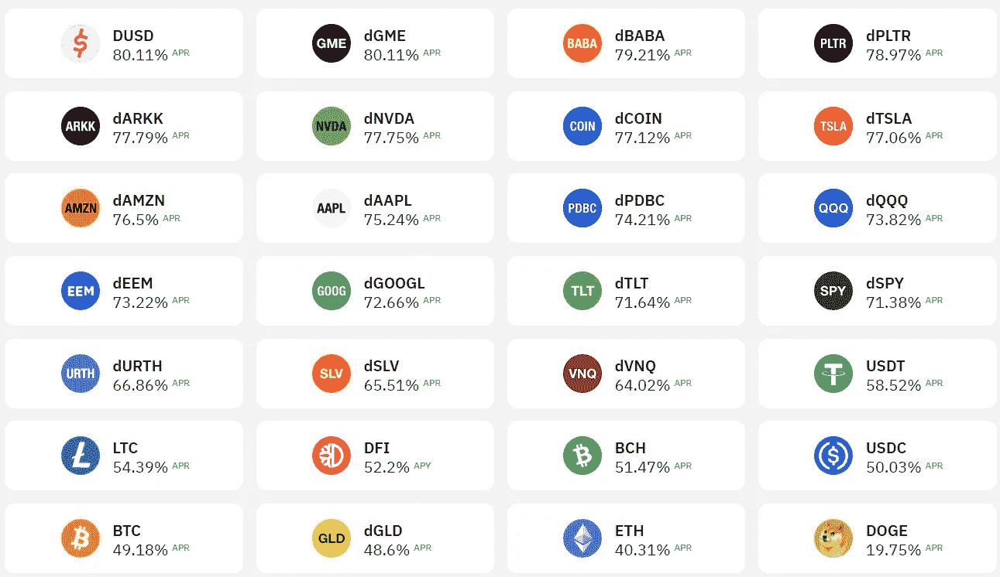**

**稳定的资本可以投资于贷款和流动性挖掘服务。**

****放款** : USDT/ USDC 可以进入放款批次，按月运行。基金被锁定在每月的期限内，获得 6.5%的固定 APY。经过 4 周的锁定期后，您可以选择自动进入下一批(以生成自动复利)，只提取您的回报，或提取您的全部本金和回报回到您的帐户。**

****流动性挖掘** : USDT/ USDC 可以通过与 DFI 配对进入流动性挖掘池，这是 DeFiChain 网络的原生硬币，可以产生高达 60% APR 的诱人回报！DeFiChain 上存在的另一种新型稳定币是 dUSD，它可以与许多其他[分散资产](/coinmonks/invest-in-tesla-google-apple-easily-with-decentralized-assets-cdfe4e58330b)一起添加到流动性挖掘池中，以产生高达 100% APR 的可观回报！奖励主要在 DFI 发放，每天两次。你可以选择自动下注 DFI 奖励，这样利息就可以复利。但是，请注意，当两种资产的价格走向不同时，流动性挖掘中存在非永久性损失的风险。**

****

**Cake DeFi 目前正在开展寻找复活节彩蛋的促销活动，报名奖金从 30 美元增加到 40 美元，截止日期为 2022 年 4 月 25 日！**

**[**签约奖金**](https://cakedefi.com/?ref=677920):40 美元，任何支持资产的最低 50 美元存款，随后投资于冻结 1 个月的贷款/赌注/冻结 1 个月的流动性开采。合格存款的例子包括每批贷款存入 50 美元 USDT；价值 50 美元的 LTC 存款进入流动性挖掘，然后冻结 1 个月(在进入流动性挖掘池后，前往冰柜冻结您的资金)；或者在 DFI 存 50 美元，然后冻结一个月(同样，在下注后，去冰箱冻结你的资金)。您的资本被锁定 1 个月，作为您享受红利的合格交易。合格后(冻结 1 个月/进入 1 个贷款批次)，您的奖励立即反映在您的交易历史中，并锁定 180 天，在冰柜中产生复利。在 1 个月的锁定期后，你的资金可以自由支配。出于获得奖金的目的，我建议存款略高于最低要求的金额，但稳定币除外，以应对转账和存款期间可能出现的价格波动。关于这次促销的更多信息，请点击这里查看我之前的文章[。](/coinmonks/how-to-get-a-free-40-signup-bonus-from-cake-defi-this-easter-7523230c9af)[今天报名](https://cakedefi.com/?ref=677920)！**

***更新:复活节报名奖金已经结束；但是，您仍然可以通过我的会员链接获得标准的 30 美元注册奖金+10 美元的学习&收入+在此* *注册* [*时的独家额外奖金！*](https://cakedefi.com/?ref=677920)**

**要了解更多关于 Cake DeFi 及其各种产品的信息，请点击这里查看我以前的文章。**

** [## 用蛋糕 DeFi 赚取美味的被动现金流！

### 沃伦·巴菲特曾经说过‘如果你在睡觉的时候没有找到赚钱的方法，你会一直工作到死。“的确……

medium.com](/coinmonks/earn-delicious-passive-cash-flow-with-cake-defi-f01fce47e4c6)  [## 如何赚取蛋糕 DeFi 被动收入:教程

### 沃伦·巴菲特曾经说过“如果你在睡觉的时候没有找到赚钱的方法，你会一直工作到死。”这是…

medium.com](/coinmonks/how-to-earn-passive-income-with-cake-defi-a-tutorial-64abe4a01bec)  [## 用分散的资产轻松投资特斯拉、谷歌和苹果！

### 概述

medium.com](/coinmonks/invest-in-tesla-google-apple-easily-with-decentralized-assets-cdfe4e58330b)  [## DFI，一枚被低估的硬币？

### 经过几天的绿色交易后，加密货币市场今天正在经历一些修正，也许…

medium.com](/coinmonks/dfi-an-underrated-coin-7effca02ed3f)  [## 我喜欢用蛋糕 DeFi 的 8 个理由！

### Cake DeFi 是一个加密货币投资平台，从您的数字资产中产生被动收入。立即注册…

medium.com](/coinmonks/8-reasons-why-i-love-using-cake-defi-f6547b9dfc4c) 

# 尤霍德勒

Y [ouhodler](https://track.youhodler.com/click?pid=899&offer_id=2&sub1=Blog) 是一家总部位于欧盟和瑞士的品牌金融科技平台，专注于菲亚特(美元、欧元、瑞士法郎、英镑)、crypto (BTC)和 stablecoin 贷款(USDT、USDC、TUSD、PAX、PAXG、戴、HUSD)、crypto/fiat 和 crypto/crypto 转换，以及高收益加密储蓄账户(crypto-rewards & staking)。该平台支持 BTC、BCH、BNB、ETH、LTC、XLM、XRP、DASH、HT、REP 和其他流行的加密货币和令牌。用户的数字资产通过[账本金库的](https://www.youhodler.com/blog/youhodler-ledger-vault)高级保管和[防火墙](https://www.globenewswire.com/news-release/2021/09/02/2290913/0/en/YouHodler-Integrates-Fireblocks-To-Secure-Its-Crypto-Transactions.html)安全选项得到安全保护。

Youhodler 为稳定债券提供了市场上最高的回报之一，USDT 的固定年利率为 12.3%，APY 为 13.07%，没有任何层级。奖励是复合的，每周发放。

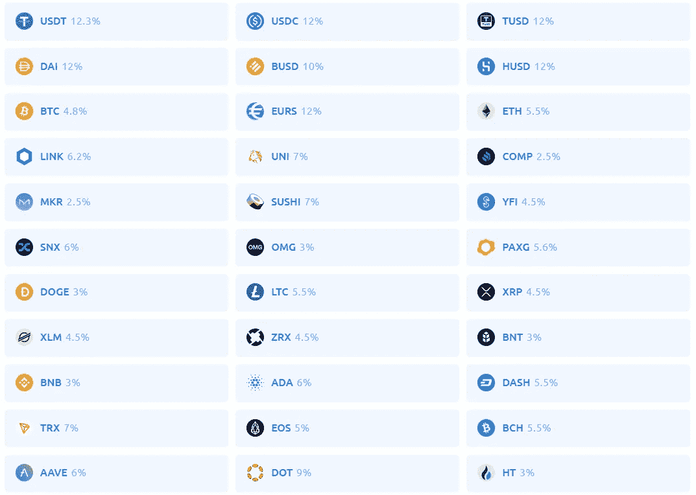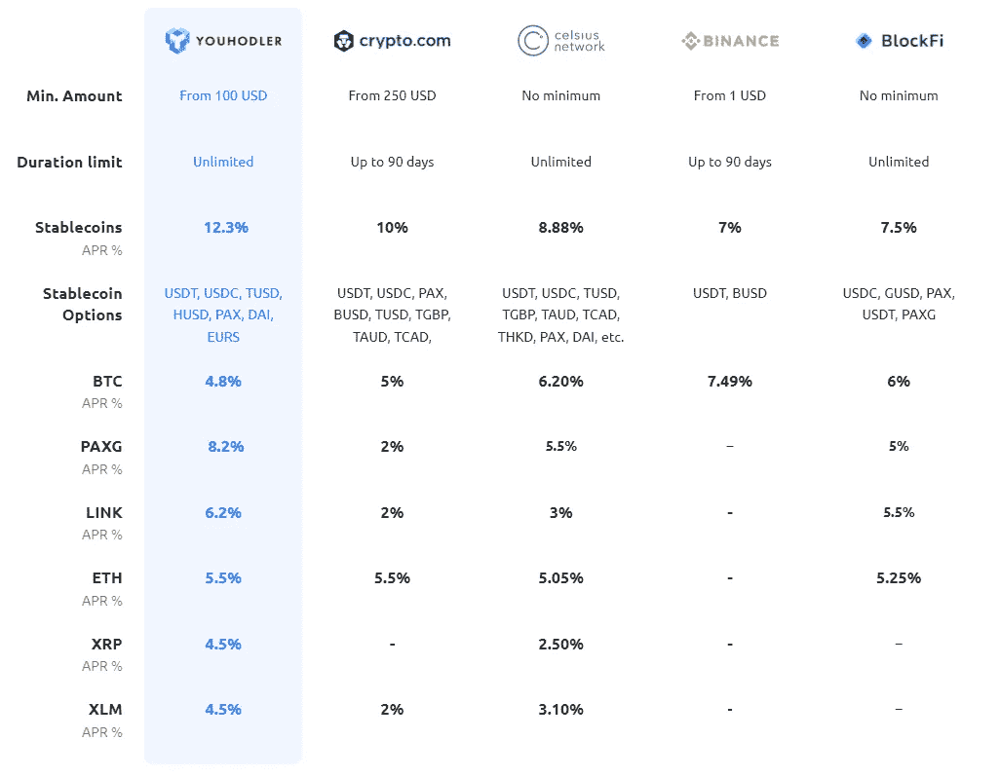

Image taken from the YouHodler website

优霍德勒比其竞争对手更有优势，因为它支持币安智能连锁网络存取稳定的硬币；因此，虽然不提供免费取款，但 USDT 和 USDC 通过 BEP20 网络取款只需 1 美元，而 ERC20 取款需要 20 美元。

[**报名奖金**](https://track.youhodler.com/click?pid=899&offer_id=2&sub1=Blog):50 美元奖金，硬币任选，存款 1000 美元，持有一周。[今天报名](https://track.youhodler.com/click?pid=899&offer_id=2&sub1=Blog)！

# BlockFi

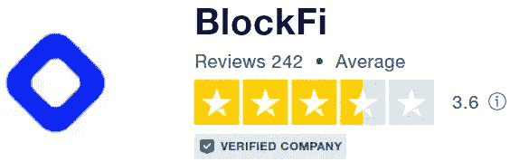

F 成立于 2017 年， [Blockfi](https://blockfi.com/?ref=a16e37fd) 是一个金融科技平台，在全球范围内提供加密货币交易、计息账户和低息贷款，具有机构级收益，得到了包括梵拉风险投资公司、银河数码、富达、阿库纳资本、SoFi 和比特币基地风险投资公司在内的投资者的支持。

BlockFi 为稳定的硬币提供了一个分级利率，最高可达 7.25%的 APY。

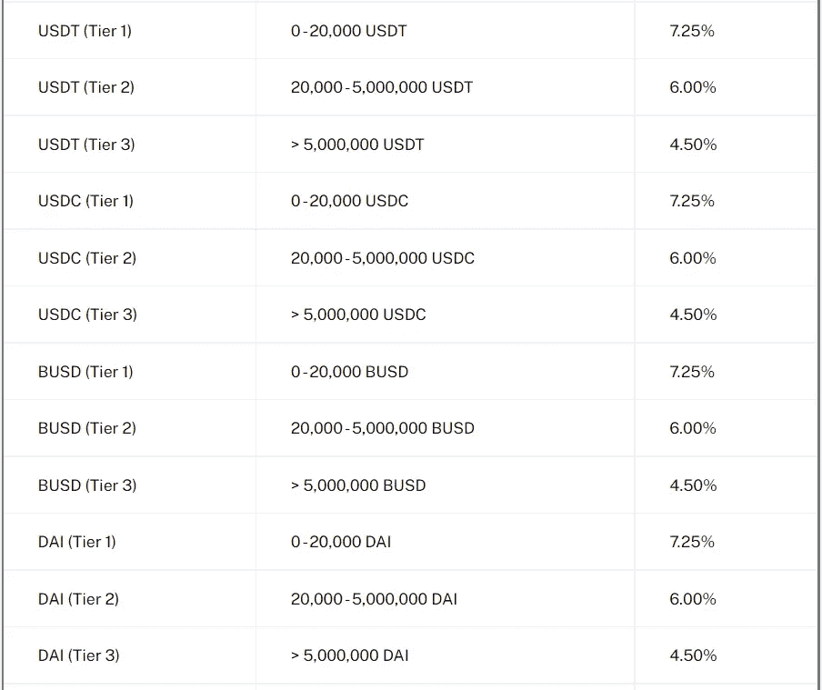

Blockfi 每月提供 1 次免费取款，随后每次取款收费 50 美元。

[签约奖金](https://blockfi.com/?ref=a16e37fd):BTC 10 美元，存款 100 美元，持有一个月。[今天就报名](https://blockfi.com/?ref=a16e37fd)！

# Cabital

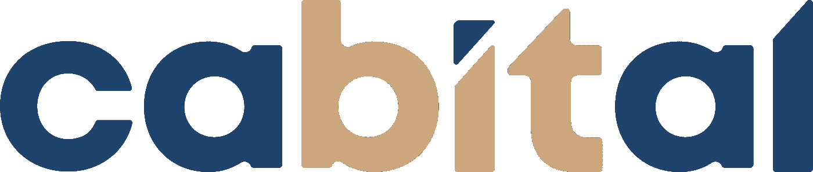

Cabital 成立于 2020 年，是一家相对较新的金融科技初创公司，在立陶宛共和国注册为加密货币交易所运营商和加密货币存管钱包运营商。Cabital 为有限种类的数字资产提供高收益加密货币储蓄账户，USDT 的年利率高达 12%。我个人使用过 Cabital，退出时没有任何问题；USDT 的取款费是固定的 12 美元。

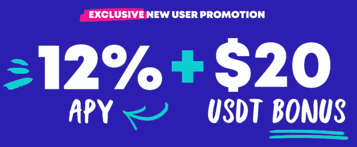

[今天报名](https://invite.cabital.com/7P3UFW)！

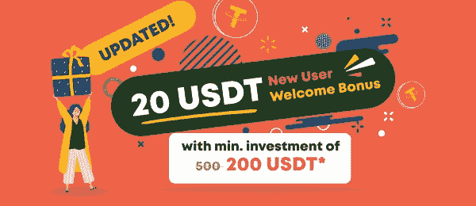

Cabital has recently revised the terms of its signup bonus for new users — simply deposit $200 to avail a $20 USDT bonus after a week!

# 概括起来

总结一下，各种加密货币账户提供商的亮点可以总结在下表中，其中考虑了为稳定账户提供的各种利率、取款特权、注册奖金以及所提供的注册奖金的 ROI(投资回报)(表示为注册奖金除以获得所述奖金所需资本的百分比)。为了便于理解，每个类别中的最高得分者被突出显示。

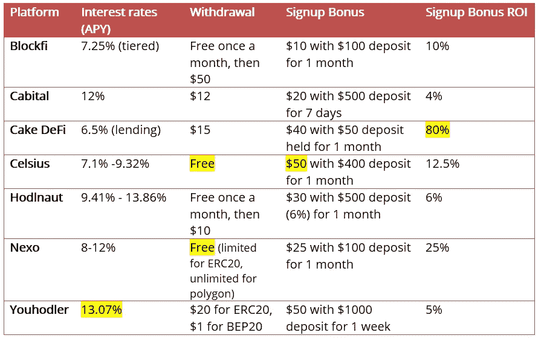

因此，可以得出以下结论:

*   [**you hodler**](https://track.youhodler.com/click?pid=899&offer_id=2&sub1=Blog)**目前为稳定的存款提供最优惠的利率，在 BEP20 网上有诱人的取款费。**
*   ******在不限次数的免费提款方面最为慷慨，也提供最高金额的签约奖金，尽管其利率可能不如其他银行有竞争力。******
*   ******[**Nexo**](https://nexo.io/ref/hce5cfdt5o?src=web-link)**是一个多功能平台，在诱人的收益率、免费提款和诱人的注册奖金之间取得了良好的平衡。********
*   ******[**Cake DeFi**](https://cakedefi.com/?ref=677920) 通过提供一整套服务，如赌注、贷款和流动性挖掘，使产生被动现金流变得容易。就注册奖金而言，它的投资回报率也是最高的，在 DFI，用户只要存入 50 美元，就能立即获得 40 美元的奖金。但是，请注意，40 美元的奖金在自由提取之前会被锁定 180 天，而 50 美元的资本在 1 个月的持有期后可以自由使用，以符合获得奖金的资格。******

****你有什么想法？如果您有任何意见或建议让我在下一篇文章中回顾，请在下面的部分随意评论！请继续关注后续文章，我将在我的评论中包括更多的平台！****

*****一如既往，这不是财务建议！而只是我投资过的，觉得值得分享的投资平台。在投资前做好自己的研究，不要存你输不起的钱。下面有什么问题可以随时问我。*****

*****如果你喜欢这篇文章，* [*关注&订阅*](/@cybery) *！*****

*****查看以下值得信赖的平台！*****

*****🎁*[*honey gain*](https://r.honeygain.me/CYBER577DD)*一款被动收入应用，从你未使用的互联网带宽中赚钱。* [*免费获得 5 美元*](https://r.honeygain.me/CYBER577DD) *，无需投资。*****

*****🎁* [*蛋糕 Defi*](https://cakedefi.com/?ref=677920) *一站式投资平台，以高达 200%的年利率烘焙被动现金流！* [*拿 30 美元*](https://cakedefi.com/?ref=677920) *在 DFI 存 50 美元。*****

*****🎁*[*Nexo*](https://nexo.io/ref/hce5cfdt5o?src=web-link)*全球最先进、受监管的数字资产机构，在 200 多个司法管辖区提供 40 多种法定货币的即时加密贷款、每日资产收益、交换和服务。* [*用 100 美元存款获得 25 美元*](https://nexo.io/ref/hce5cfdt5o?src=web-link) *。*****

*****🎁* [*摄氏度*](https://celsiusnetwork.app.link/174094633e) *一个金融科技平台，提供带息储蓄账户、借贷以及用数字和法定资产进行支付。* [*在 BTC 获得 50 美元*](https://celsiusnetwork.app.link/174094633e) *与 400 美元存款。*****

*****🎁*[*Hodlnaut*](https://www.hodlnaut.com/join/RTbHxuJMX)*一个稳健的新加坡加密借贷平台，成立于 2019 年，从你闲置的加密货币中产生被动现金流。* [*得到 30 美元*](https://www.hodlnaut.com/join/RTbHxuJMX) *在 USDC 有 1000 美元存款。*****

*****🎁*[*cabial*](https://invite.cabital.com/7P3UFW)*赚取高达 12%的加密利率，无需疯狂。*****

*****🎁*[*BlockFi*](https://blockfi.com/?ref=a16e37fd)*一种加密货币交易所和钱包。* [*用 100 美元存款获得 10 美元*](https://blockfi.com/?ref=a16e37fd) *。*****

*****🎁* [*库币*](https://www.kucoin.com/r/af/rJH29LZ) *最大的加密货币交易所之一。*****

*****🎁* [*火币*](https://www.huobi.com/en-us/topic/double-invite/register/?invite_code=5t5jb) *最大的加密货币交易所。*****

*****🎁*[*MEXC*](https://m.mexc.com/auth/signup?inviteCode=1NAJC)*最大的加密货币交易所之一。*****

*****🎁*[*Crypto.com*](https://read.cash/@TraderFX/10-tips-to-maximize-earnings-on-honeygain-an-effortless-free-passive-income-app-68535728#bad-link)*一款基于新加坡的加密货币兑换 app。* [*获得 25 美元*](https://crypto.com/app/fcbsjmf5pb) *在 CRO 赌一张红宝石牌。*****

*****针对马来西亚投资者*****

*****🎁* [*斯塔沙威*](https://www.stashaway.my/referrals/kenleel9jx) *获得 6 个月免费投资！*****

*****🎁Wahed code 'KENLIE1' RM10 注册奖金*****

*****🎁Capbay P2P 代码' 8879c6' RM100 注册奖金*****

*****连接我* [*中*](https://cybery.medium.com/)*|*[*read . cash*](https://read.cash/r/TraderFX)*|*[*Youtube*](https://www.youtube.com/c/SmartInvestingChannel)*|*[*推特*](https://twitter.com/cybertraderfx)|[*Linktree*](https://linktr.ee/trader.fx)****

> ****加入 Coinmonks [电报频道](https://t.me/coincodecap)和 [Youtube 频道](https://www.youtube.com/c/coinmonks/videos)了解加密交易和投资****

# ****另外，阅读****

*   ****[Bookmap 评论](https://coincodecap.com/bookmap-review-2021-best-trading-software) | [美国 5 大最佳加密交易所](https://coincodecap.com/crypto-exchange-usa)****
*   ****最佳加密[硬件钱包](/coinmonks/hardware-wallets-dfa1211730c6) | [Bitbns 评论](/coinmonks/bitbns-review-38256a07e161)****
*   ****[新加坡十大最佳加密交易所](https://coincodecap.com/crypto-exchange-in-singapore) | [购买 AXS](https://coincodecap.com/buy-axs-token)****
*   ****[红狗赌场评论](https://coincodecap.com/red-dog-casino-review) | [Swyftx 评论](https://coincodecap.com/swyftx-review) | [CoinGate 评论](https://coincodecap.com/coingate-review)****
*   ****[投资印度的最佳密码](https://coincodecap.com/best-crypto-to-invest-in-india-in-2021)|[WazirX P2P](https://coincodecap.com/wazirx-p2p)|[Hi Dollar Review](https://coincodecap.com/hi-dollar-review)******