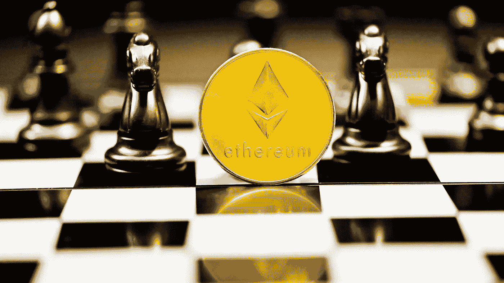

# 2022 年主宰 YouTube 和 Twitter 的 NFT 顶级影响力人物

> 原文：<https://medium.com/coinmonks/the-top-nft-influencers-dominating-youtube-and-twitter-in-2022-9c7efa7b7134?source=collection_archive---------24----------------------->

对于寻求与 NFT 影响者合作的品牌来说，该领域的几位开拓者已经采用社交平台来教育、激励和提升加密社区。所有关于 NFT 和 crypto 的关键和趋势信息首先由 Twitter 和 YouTube 上的 [**crypto 影响者**](https://blog.atisfyreach.com/8-crypto-influencers-you-need-to-collaborate-with/) 分享，这就是为什么我们编制了一个您应该关注的帐户列表，以便进行合作或提高认识。这个列表对新手和经验丰富的 NFT 老手都有意义。

# 1.加里·维

*   [**推特**](https://twitter.com/garyvee) **关注者:3M**
*   [**YouTube**](https://www.youtube.com/channel/UCctXZhXmG-kf3tlIXgVZUlw) **订阅人数:380 万**

# 为什么品牌应该合作/USP:

加里·维纳查克是一位企业家、作家、演说家和互联网名人，他已经上升到 NFT 世界的顶端。他不断地在他的推特和 YouTube 账户上教育他的观众关于 NFT 的趋势，并在元宇宙启动项目。他还是 VaynerMedia 的创始人和 VeeFriends 的发明者，vee friends 是一家以宝贵的知识产权和充满活力的社区为中心的 NFT 企业。仅在 90 天内，他就从 NFT 发起的“v 友”活动中获得了大约 9100 万美元。

# 2.RealMissNFT

*   推特关注者:166K

# 为什么品牌应该合作/USP:

realmissnft 通过其强大的追随者数量和她新建立的网站 [realmissnft.xyz.](https://www.realmissnft.xyz/project-section/rebel-kids-haunted-mansion-story) 一直在强调年轻艺术家的作品，每周，RealMissNFT 都会介绍两位 NFT 新兴艺术家的作品和故事。她每天在推特上发布关于 NFT 的消息，提供 NFT 极具潜力的新项目的最新消息。

图 1: RealMissNFT 在她的网站上展示了 NFT 的艺术家。来源:[**realmissnft . XYZ**](https://www.realmissnft.xyz/project-section/rebel-kids-haunted-mansion-story)

# 3.Deeze

*   推特关注者:203.2K

# 为什么品牌应该合作/USP:

DeezeFi 主持了关于 NFT 定价和“分数星期五”的有趣的 Twitter 空间会谈 Deeze 是 vibes at [Fractional.art](https://fractional.art/) 的主管，在这个网站上，你可以购买、销售和铸造 NFTs 和 NEONDAO 的碎片，帮助支持和建立元宇宙的愿景。

# 4.法罗克

*   [推特](https://twitter.com/farokh)关注者:259.9K

# 为什么品牌应该合作/USP:

Farokh 是 Twitter Spaces 上 [Rug Radio](https://www.rug.fm/) 的创始人，也是一名企业家、投资者、顾问、社区建设者等等。Rug RadioGM 是第一个完全去中心化的媒体平台。自然，该倡议也包括 RUGNFT。这是一个公用事业 NFT，它生成令牌并调节生态系统的节奏和交换。你拥有 NFT 的时间越长，你得到的代币就越多。

Farokh 在社区中是一个真正的灵感，他促进了年轻艺术家和社区的其他成员。他的 Twitter 账户很活跃，充满了想法和有新闻价值的信息，关注起来很有趣。

图 2: RugRadio 是第一个完全去中心化的媒体平台。来源: [**RugRadio**](https://www.rug.fm/)

# 5.OhhShiny

*   推特关注者:13.8 万

# 为什么品牌应该与他们合作/USP:

OhhShiny 是 OhhShiny 节目充满活力和才华的主持人。OhhShiny 展会汇集了元宇宙最新鲜、最好的产品。OhhShiny 每天都在推特上发布智慧和激励的话语，并一直在寻找方法给最需要的人以声音。OhhShiny 的“社区办公时间”节目，每周五东部时间上午 11 点播出，是如何帮助 NFT 新人的一个很好的例子。社区办公时间的特色是元宇宙的项目和创造者，他们正在做一些独特的事情，但需要一些指导才能前进。OhhShiny 和他的同事们表达了这些新的倡议，同时也提供了有意义的建议。

# 6.马蒂 DCL

*   推特关注者:208.6 万
*   YouTube 用户数:21.6 万

# 为什么品牌应该合作/USP:

在 NFT 世界，马蒂 DCL 是一个传奇。他已经从在分散的土地上翻动土地到开始一个媒体渠道，现在他在 NFT 做一个名为“Metakey”的项目。Matty 总是以推文、博客和视频的形式分享教育内容。他还有一个 YouTube 频道，在那里发布 NFT 世界的最新动态。"对于许多“成功”的人来说，这不是一件次要的事情，而是最重要的事情。"他认为进入 NFT 空间不是一个快速致富的策略。

# 7.马克斯·马赫

*   推特关注者:11K
*   [YouTube](https://www.youtube.com/channel/UCLr9nHPNpj7U3096nEo8Qfg) 用户数:84.1 万

# 为什么品牌应该合作/USP:

Max Maher 的频道教你所有你需要知道的关于主导这个领域的 [**品牌**](https://blog.atisfyreach.com/8-brands-that-are-using-nfts-brilliantly/) 。他的频道涵盖了所有与加密相关的内容，从寻找下一枚硬币到投资铸造你自己的 NFT 收藏品。称他为所有加密和 NFT 相关信息的一站式商店。他还在推特上描述自己是加密货币导师，偏爱比特币和以太坊。

# 8.何塞·德尔博

*   推特粉丝:10.6 万

# 为什么品牌应该合作/USP:

传奇漫画家乔斯·德尔博也加入了对 NFT 的狂热。这位富有创造力的名人，因其在《神奇女侠》和《变形金刚》中的作品而闻名，已经成为 NFT 的影响者和爱好者。如果你想了解一位老派古典艺术家是如何成为区块链顶级 NFT 创作者之一的，你可以在他的许多社交媒体页面上关注他。

**图 3:一些著名漫画背后的艺术家现在是一个狂热的 NFT 创作者。来源:** [**推特**](https://twitter.com/jose_delbo?lang=en)

# 9.布雷特·马林诺夫斯基

*   推特关注者:17.6 万人
*   YouTube 用户数:12.2 万

# 为什么品牌应该合作/USP:

你需要布雷特·马林诺夫斯基的频道来安全地导航 NFT 地区。他是神奇蘑菇 NFT 倡议的开发者，也是 NFT 热衷的内容创作者。布雷特认为，非功能性测试是未来，并将达到令人眩晕的高度。为了让 NFT 宇宙的运作更容易理解，他制作了一系列解释性视频来清楚地解释它。他丰富的内容让很多人受益，包括新手和长期交易者，所以他的频道有相当多的追随者。观察他的频道可以帮助你识别下一个主要的 NFT 项目，并理解人们如何通过翻转 NFT 获利。

# 10.卡尔·哈斯尔

*   YouTube 的用户数:46.7 万

# 为什么品牌应该与他们合作/USP:

卡尔 Hustle 是一个独特的投资渠道。我们把他们包括在我们的名单中，因为他们关于 NFTs 的新视频值得一看。他们已经覆盖了你，从建立你自己的 NFTs 到推出你自己的 NFT 不和谐服务器，再到推广你的 NFT 项目以获得值得考虑的赠品。

# 一群 NFT 信徒

为什么这么多有影响力的人突然都在说 NFTs？因为这是迄今为止最具革命性的区块链技术之一。一些专家认为，非专利技术将影响所有的知识产权。NFT 是技术上的一个改变游戏规则的发展；因此，借助有影响力的人可以帮助你的品牌与当前的事件保持同步，并为你在[**NFT 的努力启动你自己的社交媒体推广。**](https://blog.atisfyreach.com/smart-guide-to-nft-influencer-marketing/)

Atisfyreach 的人工智能驱动算法根据活动的目标将品牌与理想的 NFT 影响者匹配起来，从而提高品牌知名度，增加参与度，或大规模增加收入。向[atisfyrech 注册您的兴趣。](https://atisfyreach.com/)

> 加入 Coinmonks [电报频道](https://t.me/coincodecap)和 [Youtube 频道](https://www.youtube.com/c/coinmonks/videos)了解加密交易和投资

# 另外，阅读

*   [印度最佳 P2P 加密交易所](https://coincodecap.com/p2p-crypto-exchanges-in-india) | [柴犬钱包](https://coincodecap.com/baby-shiba-inu-wallets)
*   [8 大加密附属计划](https://coincodecap.com/crypto-affiliate-programs) | [eToro vs 比特币基地](https://coincodecap.com/etoro-vs-coinbase)
*   [最佳以太坊钱包](https://coincodecap.com/best-ethereum-wallets) | [电报上的加密货币机器人](https://coincodecap.com/telegram-crypto-bots)
*   [交易杠杆代币的最佳交易所](https://coincodecap.com/leveraged-token-exchanges) | [购买 Floki](https://coincodecap.com/buy-floki-inu-token)
*   [3 commas vs . Pionex vs . crypto hopper](https://coincodecap.com/3commas-vs-pionex-vs-cryptohopper)|[Bingbon Review](https://coincodecap.com/bingbon-review)