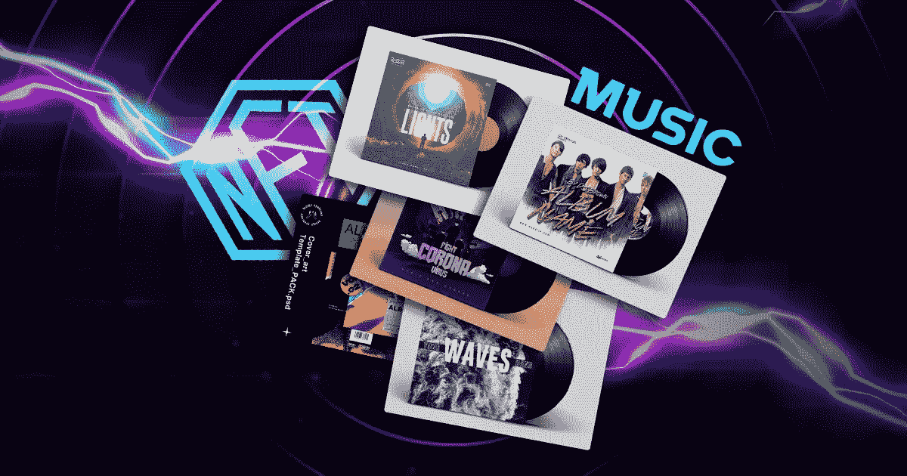

# 顶级 NFT 音乐市场，你可以投资在一个有利可图的投资回报率。

> 原文：<https://medium.com/coinmonks/the-top-nft-music-marketplaces-that-you-could-invest-in-for-a-profitable-roi-bd286cb78839?source=collection_archive---------41----------------------->

音乐是世界的医治者。世界上的每个人都知道音乐的重要性，因为它在人类的生存中起着至关重要的作用。除了人类，动物和植物似乎也在很大程度上喜欢音乐。这就是音乐的荣耀。音乐在现实世界中的重要性不亚于数字世界中的音乐。他们都在自己的世界里占有重要的位置。现在我们决定将两者结合，这已经成为一个杀手组合。在我们进入主题之前，这里有一个关于 NFTs 的片段。

**NFT——快速浏览**

NFT 指的是不可替代的代币。顾名思义，这些令牌是不可替换的，这意味着它们不能交换。没有两个虚拟收藏品是相似的，因此它们具有完全不同的价值。这些代币给人印象最深的就是可以用任何东西做模型。你所需要的只是你的模型的数字表示，你就可以开始了。虽然他们最初是在金融领域起步的，但他们已经扩展到各个领域，如房地产、教育、体育、音乐等等。在前面提到的所有组合中，有 NFTs 和音乐的组合似乎是最受赞赏的。人们涌向这些 NFT 交易场所有多种原因。虚拟代币和音乐让一对情侣比安东尼·布里杰顿和凯特·夏尔马更美。让我们进一步讨论它们。

**NFT &音乐-黑仔组合**

将 NFTs 引入音乐世界是区块链空间中最有想法的事情之一。NFT 音乐市场的出现在很大程度上青睐了全球的音乐家和音乐艺术家。它给了他们所需要的机会和他们应得的承认。你可以将任何格式的音乐制作成不可替代的代币，并在专门为销售和交易音乐作品而设计的交易场所进行交易。互联网的非凡之处在于，当你寻找某样东西时，它会给你一百万种选择。虽然有这么多选择是一件好事，但当你不得不选择最好的市场时，这仍然是令人苦恼的。然而，我们决定通过筛选出镇上最好的 NFT 音乐市场来减轻您的负担。

**镇上最好的 NFT 音乐市场**

**NFT 语气**

在音乐家和艺术家中，NFT 音乐是最好的、最广为人知的 NFT 音乐市场之一。虽然它不是 CMC 中最好的市场，但它给了当今音乐艺术家一个共鸣的环境。尽管这一市场在几年前刚刚出现，但随着时间的推移，它一直在不断发展。它已经成为一个受欢迎的交易场所，几乎每个即将到来的音乐艺术家都知道。它仍有改进的空间，我们可以希望它会随着时间的推移而变得更好。

**俏皮网关**

对于所有的音乐爱好者和音乐制作人来说，这是一个理想的 NFT 音乐市场。如果你希望高效地交易你的音乐作品，并在世界范围内传播你的品牌，没有比 Nifty Gateway 更值得你信赖的市场了。这是一个连接有真正音乐兴趣的人和有优秀音乐品味的人的市场。它帮助艺术家得到他们的艺术应得的认可。它使人们创造更多高质量的音乐，并鼓励艺术家发挥他们的才华。

[**调走**](https://tunego.com/)

如果你想投资符号化音乐，Tune Go 是最好的平台之一。这个平台是为这个目的量身定做的，当用这些术语搜索时，它是最好的。这个音乐市场需要更多的改进，比如添加更多的过滤器和提供音乐相关的服务。我们可以指望这些更新很快上市，因此，投资于这个平台可能非常有益。

**插图空间**

如果你想在增强现实中享受冒险，Illust space 是最好的 NFT 音乐交易场所之一。它给你最好的用户体验，并帮助你轻松地进行你的 NFT 交易。如果你是一个密码世界的新手，这个市场是探索 NFTs 和与 NFT 世界相关的一切的最好地方。它会给你所有你未来在 NFT 努力所需要的曝光率。

**NFT 展厅**

NFT 陈列室是一个独特的 NFT 市场，收集稀有和有价值的数字艺术。它运行在最便宜也是最快的区块链网络 Hive 上。作为一名艺术家和投资者，参与这个音乐市场对你来说是有益的。虽然这个市场只存在了一段时间，但它已经凭借其效率赢得了观众的欢迎和信任。如果你是一名音乐艺术家，正在努力让你的艺术得到应有的认可，那么这个市场是最适合你的。

**总结，**

[NFT 音乐市场发展](https://bit.ly/3rXLqNm)是数字世界的奇迹之一，已经成为全世界艺术家认可和钦佩的主要来源。通过选择最佳的音乐市场进行投资，你可以确保你尊重你的艺术，尊重你作为一个艺术家的身份，不满足于任何低于它应得的东西。

> 加入 Coinmonks [电报频道](https://t.me/coincodecap)和 [Youtube 频道](https://www.youtube.com/c/coinmonks/videos)了解加密交易和投资

# 另外，阅读

*   [如何匿名购买比特币](https://coincodecap.com/buy-bitcoin-anonymously) | [比特币现金钱包](https://coincodecap.com/bitcoin-cash-wallets)
*   [币安 vs FTX](https://coincodecap.com/binance-vs-ftx) | [最佳(SOL)索拉纳钱包](https://coincodecap.com/solana-wallets)
*   [比诺莫评论](https://coincodecap.com/binomo-review) | [斯多葛派 vs 3Commas vs TradeSanta](https://coincodecap.com/stoic-vs-3commas-vs-tradesanta)
*   [Capital.com 评论](https://coincodecap.com/capital-com-review) | [香港的加密借贷平台](https://coincodecap.com/crypto-lending-hong-kong)
*   [如何在 Uniswap 上交换加密？](https://coincodecap.com/swap-crypto-on-uniswap) | [A-Ads 评论](https://coincodecap.com/a-ads-review)