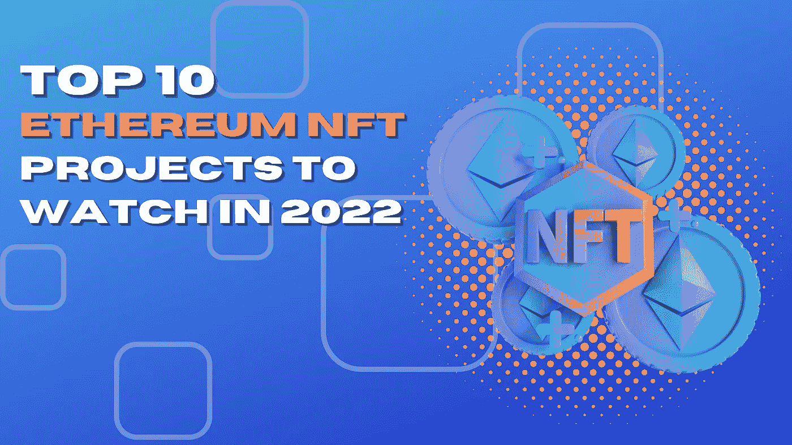

# 2022 年十大以太坊 NFT 项目值得关注

> 原文：<https://medium.com/coinmonks/the-top-ten-ethereum-nft-projects-to-watch-in-2022-4eea02a543e2?source=collection_archive---------38----------------------->

# 这些以太坊 NFT 项目在货币和金融业务领域迈出了巨大的步伐

非金融交易是货币和金融行业的新颠覆者。他们是密码市场中同时改变金钱和工艺的一块。在 NFT 的帮助下，Crypto 爱好者已经理解了 1000 种不同的方式来将资源投入到工艺、音乐和运动中。关于 NFT 的项目，区块链创新被用来介绍一件电脑工艺的独特性和责任，然后通过不同的阶段出售。每一笔交易都记录在区块链上，创造了一个任何人都无法更改的自动化环境。当卡尔达诺、索拉纳和其他区块链逐渐变得家喻户晓时，以太坊同样为自己在非功能性测试领域成为下一个霸主打下了良好的基础。在关于 ETH 2.0 更新延迟的金融支持者理论中，以太坊 NFT 项目正在从这场辩论中抽离考虑。在这篇文章中，我们已经登记了 2022 年你可以继续的顶级以太坊 NFT 项目。

## 无限轴

Axie Infinity 是 NFT 市场上最知名的 NFT 游戏之一，也是一种多产的数字货币。这款游戏于 2018 年推出，在世界各地获得了近 200 万玩家。Axie Infinity 是一个著名的以太坊 NFT 项目，允许玩家进入一个交换战斗游戏，玩家可以准备和开发像 Axie 这样的动物。

## 分散土地

分散的土地是一个虚拟的基于互联网的空间，完全是第三层。该舞台以以太坊区块链为基础，自 2020 年问世以来已经迈出了巨大的步伐。该阶段允许玩家购买包含其内部加密令牌法力的地块。玩家可以购买土地和调查分散的土地，并可以通过精明的协议承担整个舞台的指挥权。

## 密码朋克

CryptoPunks 制作于 2017 年，很可能是最早的，也是最好的以太坊 NFT 项目。这些麻烦制造者中的每一个都是由算法创建的，然而收藏品仅限于 10，000 个朋克。人类朋克是最著名的金融支持者，然而，还有其他不同的物种。

## 被解放的神

《被解放的神性存有》是以太坊 NFT 项目的重要组成部分之一，在过去的一年中取得了巨大的成就。NFT 游戏对希望完成游戏内资源责任的玩家是免费的。《被解放的神圣生物》是一款甲板建造游戏，允许玩家收集、建造和出售卡片。

## 沙盒

沙盒是一个更著名的 NFT 项目，主要以其基于区块链的虚拟世界和电脑游戏而闻名。这是一个本地驱动的虚拟元宇宙游戏，允许制造商在区块链框架上调整资源和游戏。

## NBA 热门

NBA TopShot 是一个商业中心，让 NBA 的爱好者能够交流 NBA 时刻 NFT。NBA 时刻是 NBA 比赛的特色，由视频剪辑组成。NBA TopShot 在 NBA 爱好者中非常知名。NBA TopShots 被评为 2021 年最强大的以太坊 NFT 活动之一，它使人们能够广泛接受和关注 NFTs。

## 无聊猿游艇俱乐部

无聊的猿 NFT 分类是最有名的，而且最有问题的 NFT 项目之一。自从它被送走后，无聊的类人猿身价暴涨，说实话，一部分 NFTs 价值数百万。该组合甚至想出了如何超越加密朋克的价值，震惊了加密和 NFT 地区。

## 杰出的女性

卓越的 NFT 妇女项目是对那些决定相信集体力量并加速社会变革的有影响力的女性的认可。这些 NFT 是瑞秋·温特的形成，一个假定和采取加拿大艺术家。Winter 在风格和表达方面的经验以及对设计配置的参与将这些 NFT 转变为文化和女性解放的理想融合。

## 网络宇宙世界

数字宇宙世界准备在元宇宙留下印记，以促进女性的力量。NFT 项目由 10，000 个符号组成，代表数字英雄对科技行业女性的称呼。这个任务依赖于以太坊，区块链已经制造了几个网络战士。

## 隐猫

CryptoKitties 是另一个著名的以太坊 NFT 项目，在游戏中利用了区块链的创新。这项事业无疑是众所周知的，也是最令人兴奋的以太坊 NFT 项目之一。该游戏包括饲养，收集和监督虚拟猫 NFT。

> 加入 Coinmonks [电报频道](https://t.me/coincodecap)和 [Youtube 频道](https://www.youtube.com/c/coinmonks/videos)了解加密交易和投资

# 另外，阅读

*   [最佳期货交易信号](https://coincodecap.com/futures-trading-signals) | [流动性交易回顾](https://coincodecap.com/liquid-exchange-review)
*   【Huobi 的加密交易信号 | [Swapzone 审查](/coinmonks/swapzone-review-crypto-exchange-data-aggregator-e0ad78e55ed7)
*   最佳[密码交易机器人](https://coincodecap.com/best-crypto-trading-bots) | [购买索拉纳](https://coincodecap.com/buy-solana) | [矩阵导出审查](https://coincodecap.com/matrixport-review)
*   [Coldcard 评论](https://coincodecap.com/coldcard-review) | [BOXtradEX 评论](https://coincodecap.com/boxtradex-review)|[uni swap 指南](https://coincodecap.com/uniswap)
*   [比特币基地评论](/coinmonks/coinbase-review-6ef4e0f56064) | [德里比特评论](/coinmonks/deribit-review-options-fees-apis-and-testnet-2ca16c4bbdb2) | [FTX 评论](/coinmonks/ftx-crypto-exchange-review-53664ac1198f)