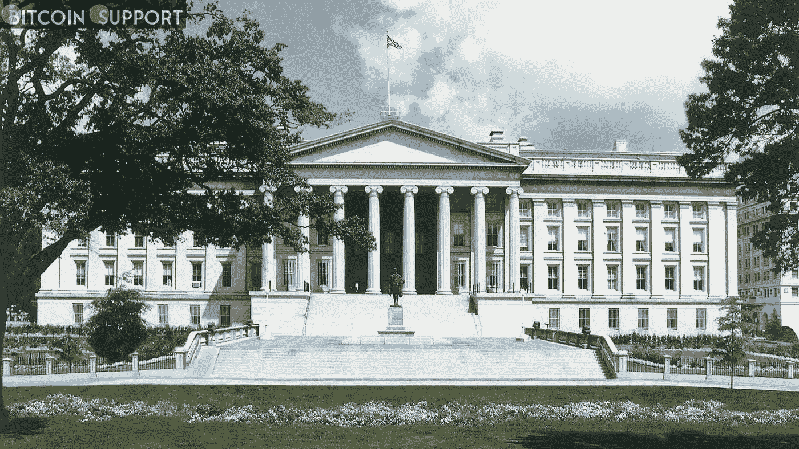

# 财政部将开始一项以密码货币投资为中心的金融教育工作

> 原文：<https://medium.com/coinmonks/the-treasury-department-will-begin-a-financial-education-effort-centred-on-cryptocurrency-81387325cf99?source=collection_archive---------73----------------------->

**Visit our website:-** [**https://bitcoinsupports.com/**](https://bitcoinsupports.com/)

根据财政部官员的说法，更多关于加密资产投资的教育和知识“将是有益的”美国财政部正在开展一项新的活动，以提高人们对投资数字资产风险的认识。

据一位财政部高级官员称，此举正值该资产类别从一个专门行业转变为一种主流投资，可能会吸引知识较少的投资者。

该部门的“金融素养教育委员会”正在编写教学材料，解释加密货币的工作原理以及它与传统资产的区别。根据财政部负责国内金融的副部长 Nellie Liang 的说法，目标人群是那些获得传统金融服务有限的人。她解释道:

**“我们听到越来越多的个人和家庭购买加密资产，我们理解其中一些资产工作方式的复杂性。”**

更多的教育和认识，梁建议，在这方面“会有用”。更好的金融知识和教育显然有益于公众，因为有人批评说，监管机构目前专注于“保护”消费者，导致弱势群体被排除在秘密财富积累的前景之外。

区块链有色人种妇女国家政策网络(National Policy Network of Women of Color in block chain)

**创始人克里夫·梅西多(Cleve Mesidor)表示，“如果他们更多地关注金融知识、技能培训和劳动力培训，这是可以接受的，但他们在很大程度上专注于消费者保护主义。”证券交易委员会是组成新教育部门的 20 个机构之一。监管机构对加密投资风险的担忧可能会因这一举措而减轻，这可能会推动他们保护投资者免受行业欺诈的持续目标。财政部似乎在这个问题上采取了积极的态度，认识到数字资产可以为跨境支付或金融包容性提供进一步的好处。梁继续说道:“我们所要做的就是在不阻止新技术或创新的情况下提高人们的意识。”美国总统乔·拜登预计将于本周发布一项行政命令，概述政府处理加密资产的方法。财政部长珍妮特·耶伦(Janet Yellen)今天意外泄露了该指令的细节，该指令还指示司法部、财政部和其他机构调查生产央行数字货币(CBDC)的法律和经济影响。政府部门并不是唯一参与教育项目的部门。今年 1 月，NBA 最有价值球员勒布朗·詹姆斯(LeBron James)与 Crypto.com 合作，发起了一项教育活动，旨在向他的家乡阿克伦城的学生传授加密货币和区块链技术。今年 2 月，P2P 平台 Paxful 在萨尔瓦多开设了一个新的教育和培训中心“比特币之家”，提供免费的比特币和加密货币教育。去年，领先的密码公司加强了在国会山的游说，显示了教育的重要性。像 Ripple Labs 和比特币基地这样的公司一直在努力向立法者“传授”有关该行业及其支撑技术的知识。

**访问我们的网站:-**[**https://bitcoinsupports.com/**](https://bitcoinsupports.com/)

**免责声明:以上为作者观点，不应视为投资建议。读者应该自己做研究。****