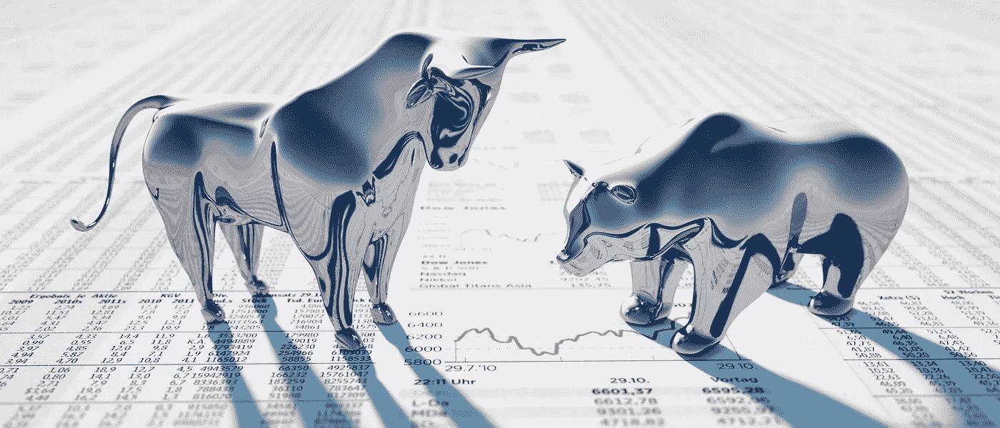

# 趋势是你的朋友，除非它不是

> 原文：<https://medium.com/coinmonks/the-trend-is-your-friend-until-its-not-b62ab8751e6c?source=collection_archive---------68----------------------->

Bull Market vs Bear Market

“牛市”和“熊市”通常被用来描述股票市场的表现——无论是升值还是贬值。在这种背景下，上涨的市场称为牛市，下跌的市场称为熊市。

鉴于加密市场通常是不稳定的，每天都在波动，这些术语用于指较长时期的主要向上或向下运动。同样，市场的变化也是由两个方向的大幅波动(至少 20%)来表示的。

我们将从牛市开始，因为我们喜欢它，它给我们带来利润，让我们更有信心。

**什么是牛市？**

牛市指的是普遍有利的经济条件。这意味着市场正在上升，通常还伴随着对当前上升趋势的积极投资者情绪。

“牛市”一词被认为起源于公牛的战斗方式，即用角向上攻击对手。今天，“看涨”的市场或投资者通常意味着对资产价值持续上涨的乐观态度。

在加密市场，牛市预示着加密货币的牛市阶段。在这里，您将看到加密货币随着普遍有利的经济条件和乐观的投资者寻求最大限度地利用其不断增长的加密投资组合而增值。

简而言之，投资者通过购买证券开始牛市。这也可以通过法定货币来实现，因为牛市通常会提高证券价格。只要供大于求，牛市就会持续下去。过了一段时间，可以说多头累了，市场转移，变成了熊市。

**秘密牛市的特征**

价格持续上涨；

尽管供应疲软，但需求强劲；

增加投资者对市场的信心；

某些项目定价过高；

在主流媒体和社交媒体中插入关于加密货币的讨论；

名人、有影响力的人和以前可能对加密不感兴趣的其他部门对加密货币的普遍兴趣；

在利好消息的情况下，价格出现硬性上涨；

熊市听起来不是很好，但如果你想知道如何在市场不景气的情况下赚钱，请和我们呆在一起。

**什么是熊市？**

熊市被定义为供大于求、信心低迷、价格下跌的一段时间。因此，认为价格会继续下跌的悲观投资者被称为“空头”熊市可能很难交易——尤其是对没有经验的交易者来说。

众所周知，很难预测熊市何时结束，何时达到底部价格——因为反弹通常是一个缓慢而不可预测的过程，会受到许多外部因素的影响，如经济增长、投资者心理以及世界新闻或事件。

但它们也能带来机会。毕竟，如果你的投资策略是长期的，那么在熊市期间买入可以在周期逆转时获得回报。持有短期策略的投资者也可以留意暂时的价格上涨或回调。对于更高级的投资者来说，还有卖空之类的策略，这是一种押注资产价格会下跌的方式。许多加密投资者采用的另一个策略是平均成本。

**隐秘熊市的特征**

在一段持续的时间内降低价格；

供给大于需求；

投资者对市场缺乏信心；

在主流媒体以及社交媒体中不谈论(或负面谈论)加密货币；

经济学家、分析师和传统金融对加密货币普遍不信任；

在好消息的情况下降低高点；

坏消息下的低点。

**你可以从这两种趋势中获利，但问题是如何获利？使用多头或空头头寸。**

这两个术语反映了交易者是否认为加密货币的价值会上升或下降。

加密货币交易者经常使用行业专用的行话，这些行话新人并不完全理解。虽然“多头”和“空头”不是最专业的术语，事实上，它们是交易的核心，但我们将解释这两个概念，特别是对新手来说，由于政府和央行行长支持的积极刺激措施，法定货币贬值，他们可能会涌入加密市场。

多头和空头头寸反映了产生利润所需的价格的两个可能方向。在多头头寸中，加密交易者希望价格从给定点开始上涨。在这种情况下，我们说交易者“做多”，或者购买加密货币。因此，在空头头寸中，加密交易者预计价格会从给定点开始下跌，即交易者“做空”，或出售加密货币。

虽然购买和出售是现货交易所的典型做法，但你可以在不实际购买或出售加密货币的情况下做多或做空加密货币。这在提供期货、期权、差价合约和其他衍生产品的衍生品交易所是可能的。当你交易这些衍生品时，你通过多头和空头头寸获得了加密货币的敞口，但没有“实际”拥有或交易它们。

也就是说，在牛市中，你会看到更多的多头头寸，而不是空头，因为更多的交易者希望从价格上涨中受益。当市场看跌时，空头头寸通常会超过多头头寸。然而，这只是一个观察，而不是遵循的规则。专业交易者和投资者通常在低点买入，在高点卖出，也就是说，当价格从最近的峰值回落时，他们建立多头头寸，当价格测试阻力水平时，他们卖出加密货币。

**关键要点**

永远从未来潜力的角度思考——你对过去无能为力，所以不要再执着于过去。

对一个人成功的销售策略对另一个人可能不适用。

一旦我们拥有了某样东西，我们往往会让贪婪或恐惧等情绪阻碍我们做出正确的判断。

批判性地思考销售很重要；了解你的投资风格，并使用这种策略来保持自律，让你的情绪远离市场。

记住，最重要的是不要成为情绪的牺牲品，如果你在红区就不要卖出，即使他们有“折扣”，也不要把所有的钱都放在 crypto 中。

保持消息灵通，形成一个明确的战略，并遵循它。

**|** [**网站**](https://www.b-successful.com/)**|**[**YouTube**](https://www.youtube.com/channel/UCWrfC_w5wVnrOr8jy0ICoDw)**|**[**推特**](https://twitter.com/BSuccessful_)**|**[**insta gram**](https://www.instagram.com/bsuccessful.crypto/)**|**[**电报**](https://t.me/+NQbP3V_iaKQwMDYy) **|** [**脸书**](https://www.facebook.com/Bsuccesful/?_rdc=2&_rdr)

> 加入 Coinmonks [电报频道](https://t.me/coincodecap)和 [Youtube 频道](https://www.youtube.com/c/coinmonks/videos)了解加密交易和投资

# 另外，阅读

*   [Bookmap 评论](https://coincodecap.com/bookmap-review-2021-best-trading-software) | [美国 5 大最佳加密交易所](https://coincodecap.com/crypto-exchange-usa)
*   最佳加密[硬件钱包](/coinmonks/hardware-wallets-dfa1211730c6) | [Bitbns 评论](/coinmonks/bitbns-review-38256a07e161)
*   [新加坡十大最佳密码交易所](https://coincodecap.com/crypto-exchange-in-singapore) | [收购 AXS](https://coincodecap.com/buy-axs-token)
*   [红狗赌场评论](https://coincodecap.com/red-dog-casino-review) | [Swyftx 评论](https://coincodecap.com/swyftx-review) | [CoinGate 评论](https://coincodecap.com/coingate-review)
*   [投资印度的最佳加密软件](https://coincodecap.com/best-crypto-to-invest-in-india-in-2021)|[WazirX P2P](https://coincodecap.com/wazirx-p2p)|[Hi Dollar Review](https://coincodecap.com/hi-dollar-review)