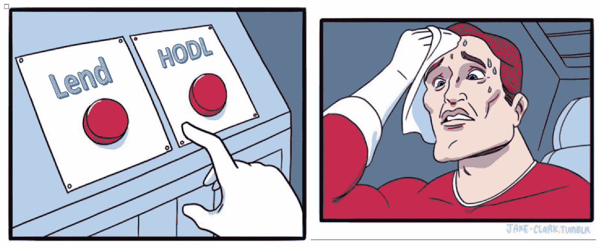
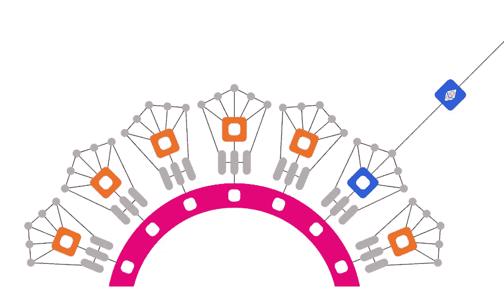

# 波尔卡多大众贷款的真实成本

> 原文：<https://medium.com/coinmonks/the-true-costs-of-polkadot-crowdloans-12daa41a6762?source=collection_archive---------4----------------------->

To crowdloan or not to crowdloan…

对于波尔卡多特( [DOT](https://www.coingecko.com/en/coins/polkadot) )来说，现在是一个非常激动人心的时刻。Parachain slot 拍卖正在进行中，众筹贷款是一种新颖的方式，可以在区块链初创企业的最早期阶段实现民主化。令人难以置信的是，这几乎没有什么名义上的风险，因为你保证能拿回你的点令牌。

> 虽然，这是一个新奇而不可思议的机会。清楚参与众筹贷款的真实成本是明智的。

## 什么是波尔卡多？

Polkadot Parachains

波尔卡多特是一个 L1(可以说是 L0)的区块链，其目标不仅是作为一个“以太坊杀手”找到自己的位置，也是作为一个将“区块链互联网”连接在一起的网络。它由以太坊联合创始人、前 CTO 加文·伍德(Gavin Wood)创立。到目前为止，Polkadot 已经开发出了最具创新性和雄心的区块链网络之一，但由于有如此多的移动部分，包括 parachains、Kusama“金丝雀”网络和 delegated staking，用户体验有点令人生畏，难以理解。

然而，这些不同的创新都在以分散和可信的方式保护和扩展网络方面发挥着重要作用。例如，副链连接到核心中继链，允许多达大约 100 个独立的区块链网络并行处理。反过来，这些都由 Polkadot 网络的核心中继链支持，保护这些网络中的每一个，甚至允许副链之间的跨网络交互。他们极具创新性，你可以在这里阅读更多关于他们的内容[。](https://polkadot.network/blog/the-parachain-advantage-exploring-polkadots-next-generation-model/)

要了解更多关于 Polkadot 的知识，你可以浏览他们的网站和白皮书。为了更快地了解剧情，也值得看看硬币局的视频中的波尔卡多特回顾。该视频对该网络进行了非常简洁和引人入胜的解释。

在本文中，我想特别关注副链，因为副链槽操作者是通过拍卖选择的。

> 正是这种拍卖机制以众筹贷款的形式打开了一个全新的机会世界。

## 什么是波尔卡多特 crowdloans？

使用拍卖机制来选择副链槽操作者。它实际上遵循了一个非常奇特的拍卖过程，称为“[蜡烛拍卖](https://polkadot.network/blog/research-update-the-case-for-candle-auctions/)”，但为了简单起见，你可以假设它会被出价最高的人买走。拍卖获胜者将在 parachain 插槽的整个租赁期(96 周)内锁定他们的 DOT。

参与拍卖的项目可以自己筹集资金，但更有可能的是，他们会通过众筹贷款至少获得一部分资金。Crowdloans 是 Polkadot 中的一种内置机制，允许点持有者将其点“借”给拍卖竞标者。如果他们的投标人获胜，租借的 DOT 将被锁定 96 周，并在租期结束时归还给他们。整个交易在链上安全地完成，并且 Polkadot 网络处理交易，使得众筹贷款参与者永远不必信任或转移 dot 给投标者。

我会重复这一点，因为这可能会拯救一些人从一个骗局。

> 你永远不必转移你的**点**或提供一个钱包密码参与众筹贷款

众筹贷款的参与者不仅仅是出于好心而借出这个点。正如我下面将要谈到的，即使你拿回了你的点，你仍然要为此付出代价。因此，请求众筹贷款的项目需要提供一些回报，以吸引人们贷款给他们。这通常以项目令牌的形式出现。

> 通过这种方式，crowdloans 将一个不可思议的机会民主化。

它允许任何人充当小规模风险资本家，为早期项目提供一点资本，希望项目能够成功，他们得到的回报将会进入 Polkadot 上繁忙的网络。更甜蜜的是，你知道，不管项目做得怎么样，两年后你会拿回你的点。所以在最坏的情况下，感觉就像无损彩票！

## 隐性成本 1:机会成本

Decisions!

名义上来说，这种兴奋的喜悦是合理的。两年后你会拿回你的点。我不会告诉你，有隐藏的费用或一个邪恶的小脚本偷偷吸干你的点分之一便士，就像一些山寨超人恶棍。

相反，我将把你引向一个经济学 101 概念，即所谓的**机会成本**。无论是像投资选择这样的货币决策，还是生活中任何方面的决策，某样东西的真实成本不仅仅是它的标价，还包括当你决定挑选某样东西时，你放弃了哪些选择。

> 你不能鱼与熊掌兼得

例如，如果我现在给你汇 50 美元或者明天汇 100 美元。你现在得到的 50 美元不是免费的，而是以明天得到 100 美元为代价的。这是获得 50 美元的机会成本。

对于众筹贷款的参与者来说，机会成本来自他们可以用他们的 DOT 做的其他事情。也就是说，这是:

1.  钉死他们
2.  交易他们

## 1.定位点:

在分析众筹贷款的价值时，这是最清晰、最简单的机会成本衡量方法。点代币可以用来指定一个验证器并收回利息。你可以在这里粗略估计一下你会从赌注中赚多少钱，但大概是 10.3%。

因此，你应该预期两年后参与任何众筹贷款的回报应该至少超过 DOT 价值的 10 3%。

## 2.交易点:

众筹贷款并不是你获得项目令牌的唯一途径。项目启动后不久，那些向投资者和众筹贷款参与者发行的代币将会进入交易所和指数。事实上，你可能会看到一个小的供应冲击会降低代币的价格，给你一个很好的机会用你的点来交换项目的代币。

当然，这是一个风险更大的游戏，因为你在拿你交易的点冒险，但是如果你在众筹贷款中锁定了你的点，你就会放弃这个机会。如果你参与众筹贷款的目的是接触这些项目，那么你最好直接购买他们的代币。通过这样做，你可以用更少的资金获得更多的项目曝光率。

## 隐性成本 2:流动性不足

You’re locking your funds

众筹的另一个代价是你的网点会被套牢将近两年。在这 96 周期间，你不能出售你的点。我们已经提到了无法将它们换成其他代币，错过了机会。

*   如果你有一个医疗紧急情况，想清算你的 DOT 支付帐单？
*   如果你预计市场会崩溃，你想在崩溃前清算你的点？
*   如果你想重新平衡你的投资组合，因为它目前的表现优于市场呢？

在任何一种情况下，你都不能用这些点符号做任何事情。

> 他们被困在拥挤的贷款中，在接下来的 96 周内，你不得不忘记和他们做任何事情。

因此，失去流动性会带来风险，你应该因为承担了锁定资金的风险而得到补偿。

## 降低流动性风险

我在上面谈到了一个众筹贷款参与者是如何通过锁定他们的域名近两年来承担风险的。然而，有一种创新可以降低这种风险。

Polkadot 在租期(96 周)内锁定任何众筹贷款贡献。直接贡献会使你的点在那个时候缺乏流动性。

然而，如果我签订一份智能合同，接受你的 DOT，并给予你 lcDOT 和众筹贷款贡献者奖励作为回报，会怎么样？96 周后，合同将允许您将您的 lcDOT 转换为 DOT。

从合同的角度来看，所有贡献的点都可以放入众贷。它可以收集和分配奖励，96 周后，它将收到允许赎回的点数。

从参与者的角度来看，收到的 lcDOT 可以在交易所交易为 DOT。因为 lcDOT 是 DOT 在未来某个日期的借据，所以需要折价交易，但至少这种选择是可行的。

此外，您可以使用您的 lcDOT 代币在 DEX 的流动性池中赚取利息。96 周后，你或多或少会确信 lcDOT 将与 DOT 进行 1 对 1 的交易。因此，你可以在等待的时候，在没有太大风险的情况下，经营 lcDOT，赚取一些不错的费用。

> 这个产品已经上市了。

Liquidity through cDOT

一个叫做[平行金融](https://medium.com/u/5c5c7081bf08?source=post_page-----12daa41a6762--------------------------------)的协议就提供了这样一种服务([链接](https://crowdloan.parallel.fi/#/auction/polkadot))。他们甚至通过提供并行代币来增加交易的甜头，与他们一起参与众筹贷款！在参与众筹贷款时，这绝对是一个值得考虑的好选择。

另一种选择是，如果有机会，通过 CEX 进行投资。、[【北海巨妖】](http://kraken.com)和 [Kucoin](https://www.kucoin.com/ucenter/signup?rcode=rJ3TEWH) 就是一些提供这种机会的交易所，可能比直接捐款更具流动性。

那么，为什么要使用直接捐款呢？似乎这种方式给了你一切，甚至更多。然而，直接捐款有一个好处。对于你获得的流动性，要求你提供信任。

在[平行金融](https://medium.com/u/5c5c7081bf08?source=post_page-----12daa41a6762--------------------------------)的案例中，你需要相信智能合约是安全的，并且它们会有资产在其中进行分配。

在像币安这样的 CEX 的情况下，你不拥有对你的密码的直接访问，所以你相信交易所不会冻结或以其他方式拿走你的点，不仅是由于恶意或不称职的行为，也是由于遵守政府监管机构。

对许多人来说，直接区块链互动的不可信、不可审查的性质超过了这些选项提供的好处，但对大多数人来说，流动性的舒适性以及其他潜在的回报使这一选项非常诱人。

## 权衡你的选择

Photo by [Piret Ilver](https://unsplash.com/@saltsup?utm_source=medium&utm_medium=referral) on [Unsplash](https://unsplash.com?utm_source=medium&utm_medium=referral)

对于波尔卡多特区块链的许多项目来说，众筹贷款是一种“占得先机”的极好方式，而且你的 dot 贡献风险最小。虽然你拿回了你的点，但你的贡献不是免费的。

考虑一下你还可以用你的 DOT 做些什么，是作为提名人下注，还是用它们进行其他投资。还要考虑你通过锁定它们 96 周而放弃的流动性。在 crypto 中，这个时间框架会感觉像是亿万年，不管是好是坏，你将被迫 HODL 任何借出的点。

如果你想要更多的流动性，有很多选择，但你需要信任协议或交易所来做，因为他们会有效地接管你的点。这两种选择都有其使用案例，所以如果你打算参与，请权衡哪种风险对你更重要，并相应地采取行动。

*   *使用水货加入众筹贷款，使用我的推荐码:*[*0x 02652 CD 402 af 3940d 31 a5e 904 dfde 9 af 0 c 652 c 5623566918746000358 a2a 3740*](https://crowdloan.parallel.fi/#/auction/polkadot?referral=0x02652cd402af3940d31a5e904dfde9af0c652c5623566918746000358a2a3740)可以支持我并获得 5%的奖金
*   *库币推荐代码:*[*https://www.kucoin.com/ucenter/signup?rcode=rJ3TEWH*](https://www.kucoin.com/ucenter/signup?rcode=rJ3TEWH)
*   *我不是财务顾问，本文中表达的观点不是财务建议。加密货币和智能合约是复杂的工具，具有很高的亏损风险。你应该仔细考虑你是否了解这些工具是如何工作的，你是否能够承担失去你的钱的高风险。我鼓励你在做出任何投资决定之前进行自己的研究，避免投资任何你不完全了解其运作方式和所涉及风险的金融工具。*

> 加入 Coinmonks [电报频道](https://t.me/coincodecap)和 [Youtube 频道](https://www.youtube.com/c/coinmonks/videos)了解加密交易和投资

## 另外，阅读

*   [最佳以太坊钱包](https://blog.coincodecap.com/best-ethereum-wallets) | [电报上的加密货币机器人](https://blog.coincodecap.com/telegram-crypto-bots)
*   [交易杠杆代币的最佳交易所](https://blog.coincodecap.com/leveraged-token-exchanges) | [购买 HTZ 代币](https://blog.coincodecap.com/how-to-buy-htz-token)
*   [5 大最佳社交交易平台](https://blog.coincodecap.com/best-social-trading-platforms) | [瓦济克斯 NFT](https://blog.coincodecap.com/wazirx-nft-india)
*   [10 本最佳加密书籍](https://blog.coincodecap.com/best-crypto-books) | [英国 5 个最佳加密机器人](https://blog.coincodecap.com/uk-trading-bots)
*   [ko only Review](https://blog.coincodecap.com/koinly-review)|[Binaryx Review](https://blog.coincodecap.com/binaryx-review)|[Hodlnaut vs CakeDefi](https://blog.coincodecap.com/hodlnaut-vs-cakedefi-vs-celsius)
*   [比斯勒评论](https://blog.coincodecap.com/bitsler-review)|[WazirX vs coin switch vs coin dcx](https://blog.coincodecap.com/wazirx-vs-coinswitch-vs-coindcx)
*   [赢取注册奖金——10 大最佳加密平台](https://blog.coincodecap.com/earn-sign-up-bonus)
*   [7 大副本交易平台](https://blog.coincodecap.com/copy-trading-platforms) | [BuyCoins 点评](https://blog.coincodecap.com/buycoins-review)
*   [XT.COM 评论](https://blog.coincodecap.com/profittradingapp-for-binance)币安评论 |
*   [SmithBot 评论](https://blog.coincodecap.com/smithbot-review) | [4 款最佳免费开源交易机器人](https://blog.coincodecap.com/free-open-source-trading-bots)
*   [光宗耀祖 vs 比特币基地](https://blog.coincodecap.com/uphold-vs-coinbase) | [坎加交易所评论](https://blog.coincodecap.com/kanga-exchange-review)
*   [比诺莫评论](https://blog.coincodecap.com/binomo-review) | [斯多葛派 vs 3Commas vs TradeSanta](https://blog.coincodecap.com/stoic-vs-3commas-vs-tradesanta)
*   [Capital.com 审查](https://blog.coincodecap.com/capital-com-review) | [港加密借贷平台](https://blog.coincodecap.com/crypto-lending-hong-kong)