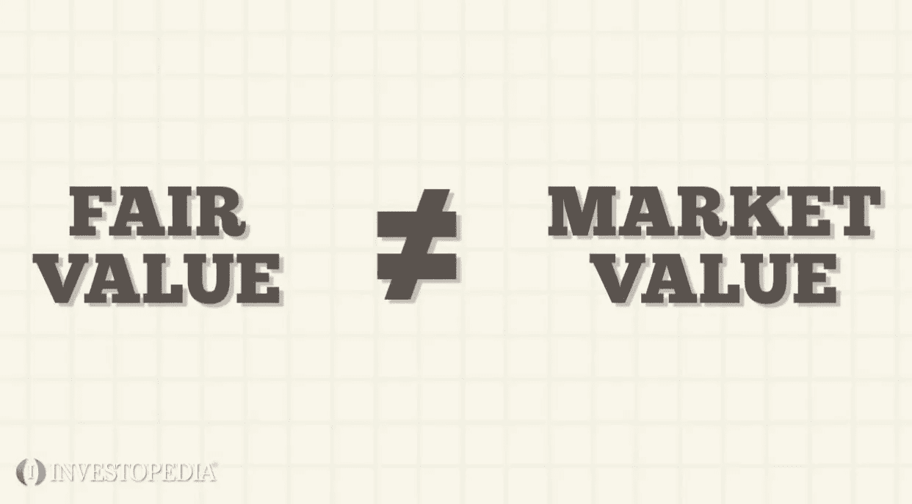

# 比特币的自然价值

> 原文：<https://medium.com/coinmonks/the-true-fair-value-of-bitcoin-f24b962ac3ea?source=collection_archive---------18----------------------->

“最后的交易价格是对公允价值最不准确的衡量。”——纳维德·阿布达里。旧的投资方式已经让位于新的投资方式。

Same same, but different. (a fun saying I came across in Thailand)

**描绘这幅图景**
在今天这个时代，一家公司的股票价值(以及其他资产，如密码)很大程度上是基于其未来的承诺，这一点非常有效。也就是只要有成长。