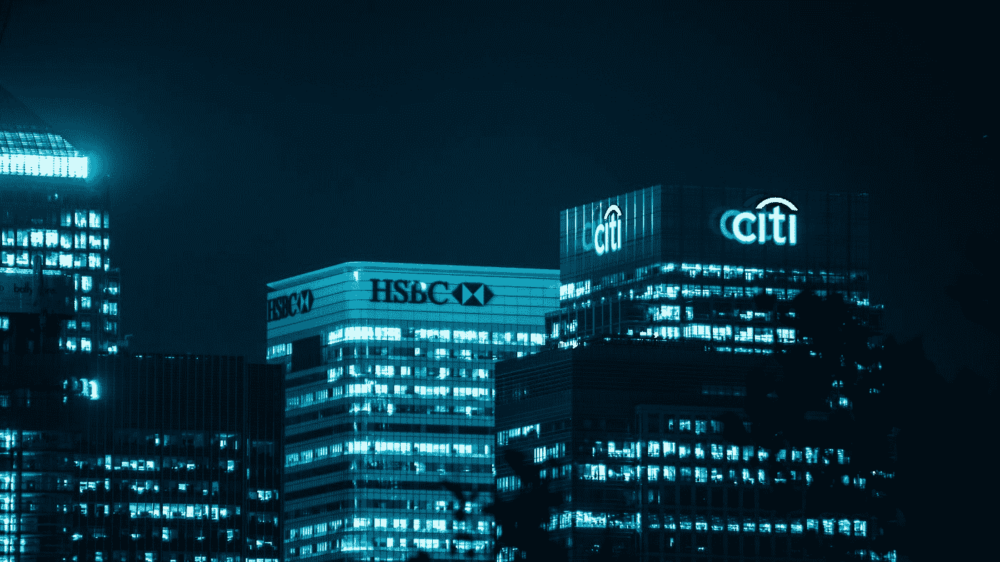
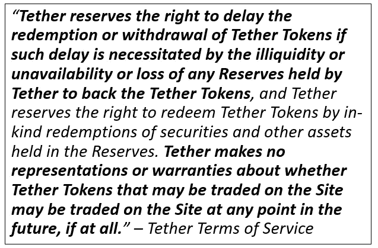

# 稳定粒子的真正不稳定性

> 原文：<https://medium.com/coinmonks/the-true-instability-of-stablecoins-f3429aeae6d6?source=collection_archive---------60----------------------->

## 现代银行挤兑

Photo by [Miquel Parera](https://unsplash.com/@miquel_parera_mila?utm_source=medium&utm_medium=referral) on [Unsplash](https://unsplash.com?utm_source=medium&utm_medium=referral)

加密货币不稳定已经不是什么秘密了。加密货币社区蔑视监管也不是什么秘密。动荡的市场加上缺乏有意义的监管，似乎会导致灾难。加密货币社区并没有忽视这种危险，为了寻求庇护，许多人将他们的信任放在了加密货币的一个特定子集:stablecoins 上。

在高层次上，稳定的货币通过维持可预测的价格来发挥作用，从而消除了波动性带来灾难性损失的可能性。稳定货币使用美元或黄金等基础资产来支撑货币的价值。Tether 是市值最大的稳定币，他们收到的每一美元都有一个单一的 Tether 代币。这个想法是，100，000 美元的系绳将永远是 100，000 美元，因为当你只能从每个系绳令牌中获得 1 美元时，你为什么要支付更多或更少的钱呢？

但是这不是真的。

在绝对最好的情况下，你会拿回大部分，但不会拿回全部价值。只要看看 Tether 自己的收费表，你就会发现，为了从 Tether tokens 中拿回美元，你会损失一些价值。也就是说，如果他们允许你赎回它们的话。

更不用说，你甚至不能从 Tether 中提取低于 100，000 美元的美元。所以，如果你只有可怜的 95000 美元，去踢石头吧。因此，大多数人会通过交换与这些稳定的内容互动。在交易所，价格不与基础资产挂钩，而是由公开市场价格决定。以 99 美分出售系绳或以 1.01 美元购买系绳的情况并不少见。但这是值得的，因为它的*大多是*稳定。对吗？

**不是。**它甚至还不是最稳定的。但比这更重要的是，它不稳定的可能性对日常加密货币用户意味着什么。如果你去任何主要的加密货币交易所，并在他们的法律文件中挖掘，你会发现几乎所有人都使用你存放的法定货币和加密货币来投资，为自己谋利。

事实是，你永远无法从 stablecoins 中收回全部现金价值。此外，你将用来收回甚至一部分现金的交易所已经将其转移到投资中，有时投资于传统的、不稳定的加密货币资产。当您尝试将 stablecoins 转让给菲亚特时，由于订单跟不上，价格会略有下降。对于小额取款来说，这不是问题，但是如果有足够多的人尝试立即取款…

Photo by [Joshua Woroniecki](https://unsplash.com/@joshua_j_woroniecki?utm_source=medium&utm_medium=referral) on [Unsplash](https://unsplash.com?utm_source=medium&utm_medium=referral)

我描述的是银行挤兑。太多的人试图在银行清算自己的资产之前将资产撤出银行。最终没有更多的资产可以提取，人们最终会失去他们所拥有的。这不仅在密码领域是可能的，而且可能性越来越大。稳定的硬币有一个主要用途:避免监管。但不要被骗去认为你通过使用它们来避免波动，或者它们比比特币风险更低。他们不是。

> 加入 Coinmonks [电报频道](https://t.me/coincodecap)和 [Youtube 频道](https://www.youtube.com/c/coinmonks/videos)了解加密交易和投资

# 另外，阅读

*   [OKEx vs KuCoin](https://coincodecap.com/okex-kucoin) | [摄氏替代品](https://coincodecap.com/celsius-alternatives) | [如何购买 VeChain](https://coincodecap.com/buy-vechain)
*   [币安期货交易](https://coincodecap.com/binance-futures-trading)|[3 comas vs Mudrex vs eToro](https://coincodecap.com/mudrex-3commas-etoro)
*   [如何购买 Monero](https://coincodecap.com/buy-monero) | [IDEX 评论](https://coincodecap.com/idex-review) | [BitKan 交易机器人](https://coincodecap.com/bitkan-trading-bot)
*   [CoinDCX 评论](/coinmonks/coindcx-review-8444db3621a2) | [加密保证金交易交易所](https://coincodecap.com/crypto-margin-trading-exchanges)
*   [红狗赌场评论](https://coincodecap.com/red-dog-casino-review) | [Swyftx 评论](https://coincodecap.com/swyftx-review) | [CoinGate 评论](https://coincodecap.com/coingate-review)