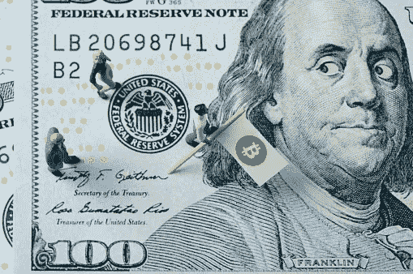
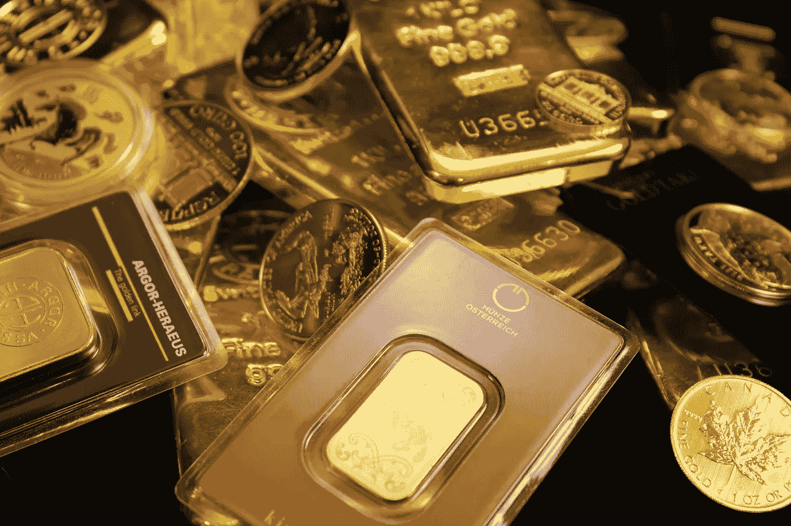
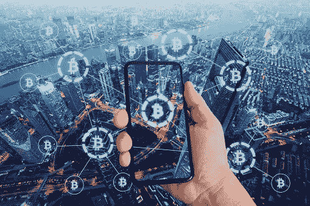
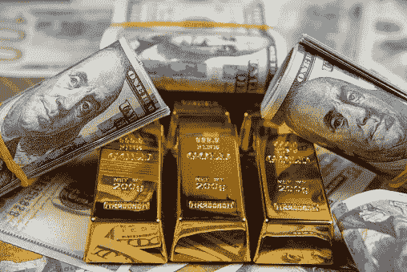

# 比特币的真正价值

> 原文：<https://medium.com/coinmonks/the-true-value-of-bitcoin-23565178410f?source=collection_archive---------10----------------------->

有没有想过所有的宣传是关于什么的？

一个伟大的货币有五个特征。为了理解为什么比特币如此有价值，我将解释为什么我们重视今天使用的货币。

# **让我们从黄金开始**

# **黄金几千年来一直被高度重视。想过为什么吗？因为它几乎具备了一个伟大货币的所有五个特征。**

**整除性**

*   你可以把一块金子分成硬币，以便进行小额交易

**耐用性**

*   黄金可以在许多条件下储存很长时间而不会腐烂，而像香蕉这样的东西，如果你储存它，你很快就会发现它腐烂了。

**可识别性**

*   有很多方法可以验证黄金是否是 100%的黄金

**稀缺性**

*   开采黄金既困难又危险，因为地球上只发现了这么多黄金。
*   谁也不能随意增加供应量**。**

**便携性**

*   没有那么多，因为黄金很重，运输起来不方便、昂贵而且危险。这也是纸币被引入并放上**金本位的原因之一。**

# 纸币过去是由黄金支持的，这意味着你可以去银行把现金换成黄金。

但是不久前的 1971 年，理查德·尼克松总统让我们脱离了金本位制。现在我们的钱被认为是法定货币，意思是它没有任何支持，由政府控制。

在好货币的 5 个特征中，以下是美元下跌的地方:

**整除性**

*   你可以把 100 美元的钞票分成 50 美元的钞票。然后 50 元变成 20 元，20 元变成 10 元，最后变成便士。

**耐久性**

*   在最安全的情况下，钱不会腐烂，你可以把钱存放很长时间。

**可识别性**

*   有多种方法可以验证你的钱是不是真的。

**便携性**

*   货币的运输比黄金更安全、更快捷、更便宜。

**稀缺性**

*   法定货币不存在稀缺性，因为政府可以任意增加供应量，而且你不能用它来兑换像黄金这样的商品。默认情况下，这会影响你的钱的价值。
*   你的曾祖父母甚至你的父母拥有的 10 美元的购买力和我们今天拥有的不一样。如果法定货币具备所有这五个特征，我们将看到购买力随着时间的推移而增加。所以你父母拥有的 10 美元购买力实际上会让你今天比那时得到更多。
*   相反，我们看到不同类型的**通货膨胀**，价格上涨和购买力下降。因此，如果你一直在银行存钱，即使银行付给你利息，这些钱也会随着时间的推移而贬值。
*   举例来说，如果你一直在做一份每小时 10 美元的工作，你仍然需要在**工作整整一个小时**，但是随着时间的推移，10 美元的价值会让你得到更少。所以你花了很少的钱却花了宝贵的时间。这就是为什么**谈判你的薪水**如此重要。

# **比特币具备伟大货币的全部五个特征。**

**整除性**

*   A **satoshi** 是比特币的最小单位。它的价值相当于一个比特币的一亿分之一。但由于比特币的产生方式，它可以被分割成更小的单位，以促进更小的交易。

**耐久性**

*   比特币是一种数字货币，你不必担心它在任何情况下都会贬值

**可识别性**

*   伪造比特币是不可能的，因为每笔交易都会在区块链 T21 进行验证。

**便携性**

*   比特币极其容易在全球范围内运输，又快又便宜。

**稀缺**

*   比特币的供应量有限，只有 2100 万枚比特币，这意味着流通中的比特币将只有 2100 万枚。
*   它不能被创造或毁灭。
*   供给是不会因为别人的意志而改变的。这意味着你的比特币实际上会随着时间的推移而升值，而不是贬值。
*   如果你拥有 10 个比特币，这意味着你拥有世界货币供应中的一部分，这一部分绝对不会被重新创造。
*   比特币是**去中心化**，意味着不需要第三方来进行交易。这是**点对点**与银行免费的方法转移财富。

# **黄金和法定货币**

*   根据不同的情况，它们会从原来的形式开始腐烂或变化
*   伪造黄金和货币是可能的。黄金和其他金属混合在一起欺骗他人，货币被非法印制。
*   货币比黄金更容易运输，但它仍然比比特币更昂贵和耗时，这是一个显而易见的差异。
*   黄金比金钱更稀缺，但自然灾害可能揭示新发现的黄金供应，或者从另一个星球取回黄金，这会降低其当前价值。

# **从来没有一种货币像比特币一样有这么多的安全性、自由性和保障。**

还有其他加密货币，但没有一种像比特币一样具有同样的质量和公认的安全性。

是的，市场现在不稳定，但最终会稳定下来。

比特币的好处远远超出了本次对话的范围。我列出了重要的基本原则，为知识和信息打下坚实的基础。因此，从现在开始，你所做的选择将会对你有益。

即使你看到新闻媒体报道它，一个名人讨论它，你的隔壁邻居抱怨它，最重要的是政府法规和市场下跌！

我要你用事实武装起来，准备战斗！穿越火焰！

## **下一步是什么？**

我鼓励你深入太空！我没有提到比特币影响世界的所有方式。采取下一步行动，看看你能为这个空间做些什么！

## **致我的工程和金融朋友(以及其他人:)**

如果你没有关注过区块链科技或者考虑过？穿上衣服，穿过火焰。我知道这可能会让一些人不知所措，但你不会后悔的。我将制作一个关于“区块链意识”的独立作品

## **来源！**

以下是我用来了解这个空间的资料来源。感谢下面列出的每一个人。我真的很感谢你努力让普通人理解看似困难的话题！

[https://www . investopedia . com/terms/f/Fiat money . ASP #:~:text = Key % 20 takeaways-，Fiat%20money%20i](https://www.investopedia.com/terms/f/fiatmoney.asp#:~:text=Key%20Takeaways-,Fiat%20money%20is%20a%20government%2Dissued%20currency%20that%20is%20not,U.S.%20dollar%2C%20are%20fiat%20currencies)

s % 20a %政府% 2C 发行% 20 货币% 20 美元% 20 非% 20 法定% 20 货币。

[https://www . barrons . com/articles/gold-standard-dollar-dominance-Brett on-Woods-51628890861](https://www.barrons.com/articles/gold-standard-dollar-dominance-bretton-woods-51628890861)

> 加入 Coinmonks [电报频道](https://t.me/coincodecap)和 [Youtube 频道](https://www.youtube.com/c/coinmonks/videos)了解加密交易和投资

## 另外，阅读

*   [如何开始用加密贷款赚取被动收入](https://coincodecap.com/passive-income-crypto-lending)
*   [BigONE 交易所评论](/coinmonks/bigone-exchange-review-64705d85a1d4) | [电网交易机器人](https://coincodecap.com/grid-trading)
*   [氹欞侊贸易评论](https://coincodecap.com/anny-trade-review) | [CoinSpot 评论](https://coincodecap.com/coinspot-review)
*   [新加坡十大最佳加密交易所](https://coincodecap.com/crypto-exchange-in-singapore) | [购买 AXS](https://coincodecap.com/buy-axs-token)
*   [投资印度的最佳加密软件](https://coincodecap.com/best-crypto-to-invest-in-india-in-2021) | [WazirX P2P](https://coincodecap.com/wazirx-p2p)
*   [7 个最佳零费用加密交易平台](https://coincodecap.com/zero-fee-crypto-exchanges)
*   [最佳网上赌场](https://coincodecap.com/best-online-casinos) | [期货交易机器人](/coinmonks/futures-trading-bots-5a282ccee3f5)
*   [分散交易所](https://coincodecap.com/what-are-decentralized-exchanges) | [比特 FIP](https://coincodecap.com/bitbns-fip) | [宾邦评论](https://coincodecap.com/bingbon-review)
*   [用信用卡购买密码的 10 个最佳地点](https://coincodecap.com/buy-crypto-with-credit-card)
*   [加拿大最佳加密交易机器人](https://coincodecap.com/5-best-crypto-trading-bots-in-canada) | [Bybit vs 币安](https://coincodecap.com/bybit-binance-moonxbt)
*   [阿联酋 5 大最佳加密交易所](https://coincodecap.com/best-crypto-exchanges-in-uae) | [SimpleSwap 评论](https://coincodecap.com/simpleswap-review)
*   [购买 Dogecoin 的 7 种最佳方式](https://coincodecap.com/ways-to-buy-dogecoin) | [ZebPay 评论](https://coincodecap.com/zebpay-review)