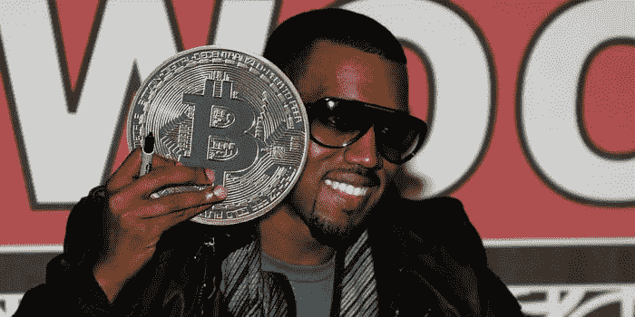

# 比特币的真相

> 原文：<https://medium.com/coinmonks/the-truth-about-bitcoin-99a9f0a169ef?source=collection_archive---------25----------------------->

## 我希望你坐下来听这个(当然你是)

比特币的真相是——我比你聪明。

这就是一切。“哦，你不会为你的秘密创业雇用我吧？我配不上你的书呆子俱乐部，那基本上只是书呆子俱乐部中的书呆子俱乐部，书呆子俱乐部中的书呆子俱乐部？好吧，我会发明我自己的货币。”

现在的生活就是拥有信息优势。事情并不总是这样。(曾经是！但是很久很久很久很久很久以前。

哦，你不知道吗？你当然没有。因为我比你聪明。“我比你聪明”=一个信息优势。就是这样。不要让你的感情受到伤害。永远不要因为不知道而感到尴尬。这仅仅意味着你的生活将变得更加精彩，而那个已经知道这一点的人必须去挖掘更多有趣的事情来保持她的头脑翻腾。

信息。我有，你没有。大多数没有的人，知道自己没有。很多没有的人，假装自己有(川普)。我们这些真正拥有它的人？可悲的是，我们被告知我们在生活中沉默了太久，以至于我们开始相信了。直到我们注意到，“嘿，我实际上对所有重要的事情都是正确的(例如，“比特币是一个聪明的他妈的金字塔计划”是我对听力范围内的任何人的说法，他们不知道我在 2015 年买了 BTC 和“纸上谈兵”[我在华尔街的日子里知道这只是销售人员的废话，“纸上谈兵”是用来给他们的客户提供精神勃起，可悲的是，它蔓延到了社会，较小的说唱歌手一直在使用它，还记得 MTV Cribs 吗？…])

比特币的故事如此荒谬，我是唯一能解释它的人。不开玩笑。请表达你的每一个疑问，以充满爱意的纯真理询问的形式，也就是“伟大的问题”。你提出的每一个伟大的问题都会成为它自己的一篇文章。然后你将成为历史的一部分——有史以来最伟大的软件。谷歌一下。zip 文件形式(存在，但不在中。zip 格式，red bean 2:[https://justine.lol/redbean2/](https://justine.lol/redbean2/)如果你想了解更多，请点击我

哦，但是这些大胆的主张没有人能支持。

嗯，那个—

我们会谈到这一点。最终。

这是第一条真理:

书呆子们使用一个术语“拐点”顶尖书呆子乔克·马尔科姆·格拉德威尔借用了…哦，是的，没有人拥有任何东西，没错，专利天生就是种族主义的*我们会得到所有这些，chilllllllll。*

马尔科姆·格拉德威尔去了*引爆点*。他只是将“拐点”的信息核心“简化”成一个更吸引人的短语，从此他的生活变得超现实。这里有足够多的超现实，我想和你们每一个人分享。

拐点，临界点，哦狗屎点，哦我的上帝。

在这里和我呆在一起，我保证用任何孩子都能理解的语言最终会有回报(这是我们当中最缺乏信息的，这是 M Knight Smamalaman 使用的技术)并且通过这种间接的方法来证明我的观点，所以你需要和我一起走这条路。我会加强信号/措辞，让它更有趣。这是:

人们组成社会。有些人甚至质疑社会是否是“一个东西”(他们的意思是“真实的”)，但敢问一个处于权力地位的成年人如何定义“真实的”，并高兴地看着你看到我们存在的真相。)

拐点没有好坏之分(直到我们选择让它们成为一个或另一个)它们只是强大，通常令人震惊。

我们的社会正处于一个转折点。我们将何去何从取决于我们自己。

比特币总是说，“我们比政府聪明，因为他们只是普通人，而不是被挑选出来的少数信息天才，我们被告知我们来自我们疯狂的(关键词)特权父母，是当今最自私的一代；最伟大的一代之后是最自私的一代，因为我们太讨厌听到最伟大的一代总是谈论他们自己，“你给了你的第一次口交？那没什么，在战争中我被困住了…"废话废话废话。)

经济学混蛋发现最大的神话是资本主义。他们的任务变成了在他们认为“好”的方向上重新演绎部分神话。唯一真正的好就是真相，不管后果如何。这是宇宙的事实，我们将利用它来造福全社会。

但是经济学混蛋、教授、专业人士、年轻的共和党人——他们都在“钱”这个概念的可延展性中看到了机会。当幕后的钱实际上是金子的时候，年轻的书呆子们就很难把钱拿回来。那么，像罗杰·斯通这样聪明的年轻经济学书呆子都做些什么呢？他们说服/催眠/操纵尼克松切断金钱和黄金的联系。他们破坏了我们社会本身最基本的属性。

比特币是为了回应这个疯子混蛋狡猾的迪克的行为。

比特币是个恶作剧。比特币是抢劫。不管我能做出多少真实的陈述，请记住这一点——我们就在你们的眼皮底下从实体经济中拿走了数十亿美元。我们把它放入有限责任公司，然后利用一系列的漏洞，基本上不纳税，是的，因为对冲基金被允许写规则，并确保最新的，最具投机性的，风险大的，有利可图的赌注得到特殊待遇，所以他们保持最富有。

我有一个观点要说，但是如果你有问题就告诉我。

这场革命不会被电视转播。会在推特和媒体上发布。而为首的是我， *Neddy 他妈的布莱*。磨快你的爱情之箭，擦亮你的知识炸弹，这他妈的是战争。

我们来抓你们这些贪婪的笨蛋了。

爱情，

马

> 加入 Coinmonks [电报频道](https://t.me/coincodecap)和 [Youtube 频道](https://www.youtube.com/c/coinmonks/videos)了解加密交易和投资

# 另外，阅读

*   [BlockFi 信用卡](https://coincodecap.com/blockfi-credit-card) | [如何在币安购买比特币](https://coincodecap.com/buy-bitcoin-binance)
*   [火币交易机器人](https://coincodecap.com/huobi-trading-bot) | [如何购买 ADA](https://coincodecap.com/buy-ada-cardano) | [Geco。一次审查](https://coincodecap.com/geco-one-review)
*   [加密副本交易平台](/coinmonks/top-10-crypto-copy-trading-platforms-for-beginners-d0c37c7d698c) | [五大 BlockFi 替代方案](https://coincodecap.com/blockfi-alternatives)
*   [CoinLoan 点评](https://coincodecap.com/coinloan-review)|[Crypto.com 点评](/coinmonks/crypto-com-review-f143dca1f74c) | [火币保证金交易](/coinmonks/huobi-margin-trading-b3b06cdc1519)
*   [Bybit vs 币安](https://coincodecap.com/bybit-binance-moonxbt)|[stealth x 回顾](/coinmonks/stealthex-review-396c67309988) | [Probit 回顾](https://coincodecap.com/probit-review)
*   [顶级付费加密货币和区块链课程](https://coincodecap.com/blockchain-courses)