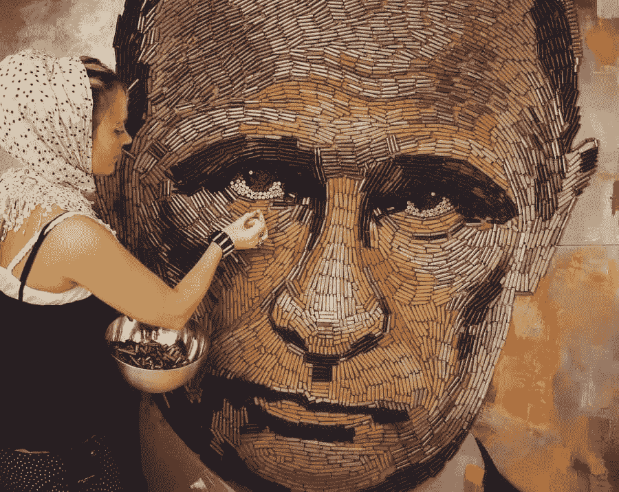
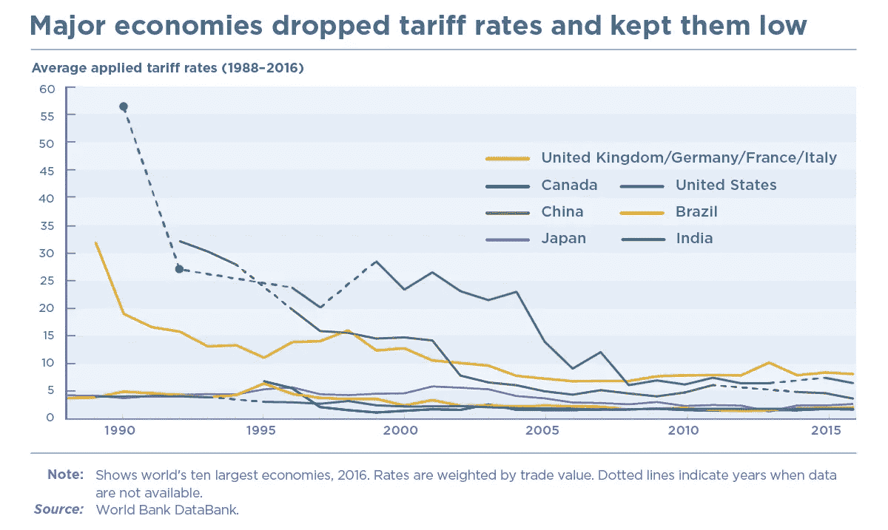
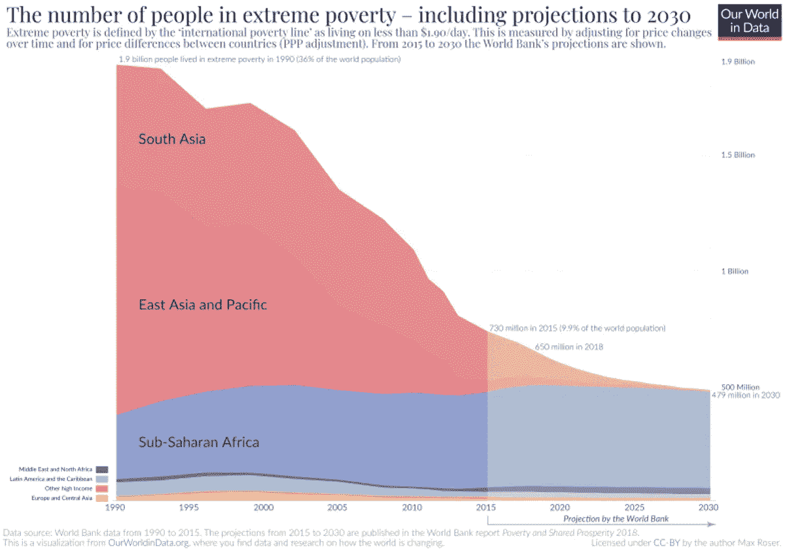
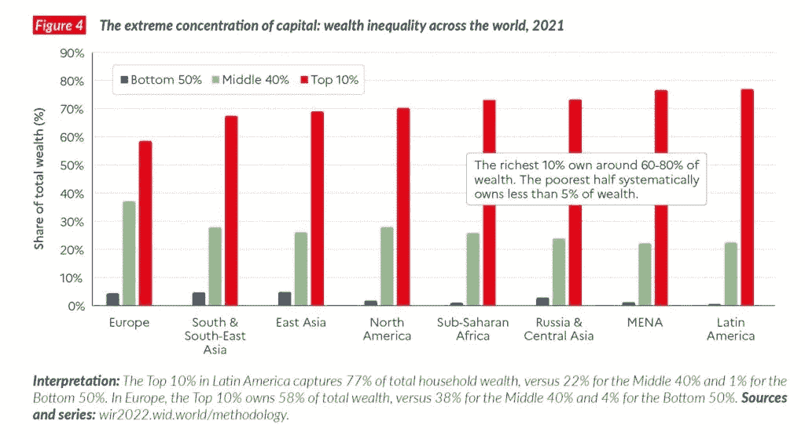
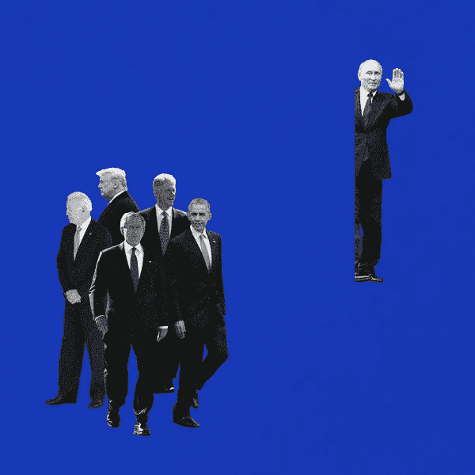
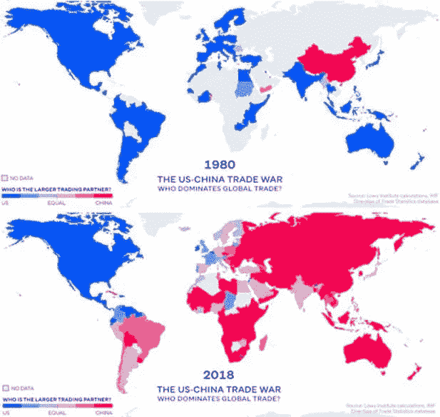
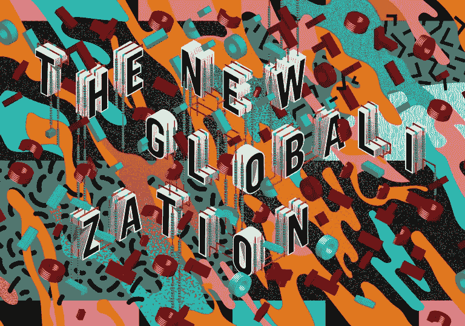
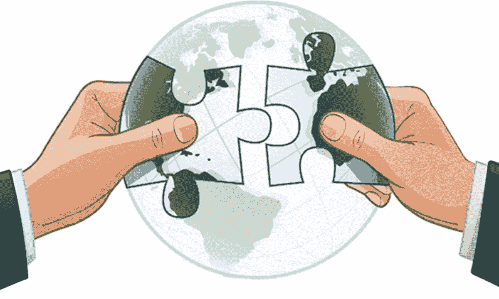

# 全球化的转折点

> 原文：<https://medium.com/coinmonks/the-turning-tide-for-globalization-4da1fc591ea9?source=collection_archive---------36----------------------->

自从我们的大脑能够记录记忆以来，全球化就是我们所有人生活的现实:一代又一代人成长起来，滋养着世界范围内国家、社会和人类之间先进的互联互通的果实。

查看字典，术语“*全球化*”的解释再好不过了:

> "企业或其他组织发展国际影响力或开始在国际范围内运作的过程"。

简而言之，全球化指的是使全球社会成为一个村庄的整体努力。因此，经过几个世纪的技术进步和国际合作的发展，世界比以往任何时候都更加紧密地联系在一起。

但是不可否认的是，我们更加依赖彼此。

这带来了一些令人深感担忧的问题，并因其他因素而加剧，比如目前乌克兰和俄罗斯之间的冲突。

# 全球化:由技术进步、运输和国际合作推动的进程

自从有史以来，由于技术和交通的进步，人类一直在寻找遥远的地方定居、生产和交换商品。

但是直到 19 世纪，全球一体化才开始起步。

继几个世纪的欧洲殖民化和贸易活动之后，第一波全球化浪潮是由轮船、铁路、电报和其他突破推动的，也是由国家间不断增加的经济合作推动的——这通过降低商业各方之间的关税来促进这一进程，如下图所示:

全球化趋势最终放缓，并在第一次世界大战的灾难中崩溃，随后是战后*保护主义*、大萧条**、二战**。****

**在 20 世纪 40 年代中期的第二次世界大战后，美国领导了根据协商的基本规则恢复国际贸易和投资的努力，开始了第二波全球化，这一浪潮仍在继续，尽管受到周期性衰退和越来越多的政治审查的冲击。**

# **全球化的影响**

****

**全球化进程给整个世界带来了巨大的进步，并影响到社会的许多人口阶层，这是不可否认的。**

****流程的积极效果** *可确定为:***

**一些最成功的公司的历史是国有行业私有化的结果，这些行业的目标是通过在国际层面上扩展其价值链来增加消费者需求。这使得这些公司能够接触到更大的*消费者群，*事实上变成了跨国公司，并在全球各个市场扩大了他们的影响范围。**

**更大的市场使公司能够接触到更多的客户，并从做生意的固定成本中获得更高的回报，比如建造工厂或进行研究。科技公司以这种方式利用了他们的创新。**

**全球化鼓励每个国家专注于用最少的资源生产出最好的产品，这就是所谓的比较优势。这一概念提高了生产效率，促进了经济增长，并降低了商品和服务的价格，使其更加实惠，尤其是对低收入家庭而言。**

**竞争:争取更好的质量和品种来自国外的竞争促使公司改进他们的产品，从而有利于最终消费者，享受更好的质量和更有效的产品来满足他/她的需求。
客户服务和“ ***客户为王*** ”的生产方式提高了产品和服务的质量，促使公司保持竞争力，并不断提高标准以在市场中生存。**

****创新人才创造/分享扩大的贸易刺激了技术、创新和思想交流的传播。来自市场领导者的最佳想法更容易传播，也允许受过高等教育和富有的个人在开放的环境中互动——促进知识和信息的传播，导致新的高技能专业人士阶层的发展。****

**接受教育:进步的催化剂
全球化增加了发展中国家接受高等教育的机会，缩小了知识差距，但同时也带来了负面影响，可能会严重威胁这些国家的大学。通过增加进入高等教育机构的机会，它确实给发展中国家带来了更多的积极影响。今天，你可以毫无障碍地寻找世界上最好的教育设施，包括发展中国家。这是由于中学的产出增加，更多的妇女接受高等教育，以及私营部门对毕业生的需求增加。**

**文化的发展我们今天生活的世界是多种文化融合的结果。一种文化的人，如果善于接受，往往会看到他们文化中的缺陷，并选择更正确或更符合时代的文化。社会变得越来越大，因为他们欢迎其他文明和背景的人，并创造了自己的全新文化。烹饪风格、语言和习俗都因全球化而传播开来。电影、音乐风格和其他艺术形式也是如此。**

**全球化倾向于促进开放和信息交流，带来更大的民主和繁荣。媒体报道的增加也引起了世界对侵犯人权行为的关注——改善了人权评价和总体认识。**

****

**尽管我们的生活发生了积极的变化和改善，但全球化也在全球许多国家产生了一些负面影响，尤其是在发达国家:**

1.  ****工作无保障，流离失所&失业率上升** 全球化提供了一把双刃剑*说到工作。简言之，全球化从一个国家拿走工作，然后提供给另一个国家。这是因为制造工作外包给了那些制造成本和工资都低于本国的国家。比贸易更大的因素是节省劳动力的技术，比如自动化机器和人工智能。***
2.  ***对劳动力的剥削全球化导致了对劳动力的剥削:为了保持在市场上的竞争力和降低产品成本，人们不顾安全标准生产廉价商品。***
3.  *****价格波动**
    由于竞争的加剧，发达国家被迫降低产品价格，这是因为像中国这样的其他国家生产商品的成本更低，使得商品比发达国家生产的更便宜。所以，为了让发达国家留住他们的顾客，他们被迫降低商品价格。这对他们来说是一个不利因素，因为它 ***降低了他们国家维持社会福利的能力。******
4.  *****环境破坏**
    全球化导致企业增加生产，以满足全球需求。产量的增加意味着更多的自然资源被使用，而这些资源可能在再生之前就用完了，从而导致对环境的负面影响。这种损害趋向于不可逆转的情况在*发展中国家*进一步恶化，这些国家的环境保护法规不如发达国家严格。这使得一些跨国公司离开他们的国家，在发展中国家建立工厂，以利用他们生产有害环境的产品过程中的这种宽松的监管。***
5.  *****全球不平等程度下降**
    ( *但发达经济体的差距更大——尤其是美国*)***

***全球化有助于缩小世界上最贫穷和最富有人群之间的不平等，自 1990 年以来，生活在极度贫困中的人数减少了一半。***

******

***但是在包括美国在内的许多国家，不平等正在加剧。***

******

***对美国不平等现象日益加剧的一个主要解释是，技术正在减少对某些中低收入工人的需求，而增加对高技能、高收入工人的需求。工资也停滞不前，尽管经济学家仍在争论确切的原因。受全球化影响的国家通过税收和福利制度在不同程度上缓解了不平等。在发达经济体中，美国在动员政府政策减少不平等方面做得最少，而且这一趋势似乎不会很快得到解决。***

# ***战争:不可逆转的变化的强大催化剂***

******

***W *ars* ，自时间开始，扫除信念、计算和预测。如果需要的话，乌克兰战争抹去了全球化的神话。*弗拉基米尔·普京*，面对美国决定将俄国驱逐出**国际货币基金组织*(IMF)*****世界贸易组织 *(WTO)*** ，几乎“*耸耸肩”*以示明确**不感兴趣** *—* ，是一个时代变迁的形象:事实是，被驱逐出全球化的世界并没有吓到沙皇***

******

***也许对于西方来说，已经依靠这一过程来主宰世界，或者更好地说，输出民主和它的生活方式，是时候照照镜子了，因为地球上最大的国家现在已经“从*走向*”。***

***那么问题是:***

> ***“全球化起作用了吗？有用吗？”***

***在经济层面上，它提升了大公司的地位，而不是西方国家的公民。最后一项行动，即拉进中国，为中国自己创造了财富，而非其推动者。***

## ***目标是征服其巨大的市场，相反，是这条龙征服了其他国家的市场。***

******

***甚至竞争已经证明国家资本主义比自由民主国家的资本主义更强大。更重要的是，中国进入全球世界甚至没有迫使它尊重卫生目标(见 ***Covid*** )，也没有提高民主率*(问香港的学生)*。***

***过去几周在俄罗斯发生的事情显示了一个更糟糕的情况:想想大规模的逮捕；对那些告诉国家而不尊重政权指示的人判处 15 年徒刑；阿列克谢·纳瓦尔尼的末日。***

# ***那么全球化是失败的吗？***

******

***全球化并没有起作用，我们来到了关键问题，甚至没有作为维护和平的工具。***

***一个相互依存的世界应该以其他方式解决冲突，当然不是用武器。乌克兰战争是失败的证明。普京不在乎在一个新的叙利亚改造欧洲的心脏，甚至引进圣战分子。此外，依靠全球化，西方被发现毫无准备。尤其是欧洲，它没有一支共同的军队，并且遭受着对一时之敌的能源依赖。如果它没有专注于关系，专注于贸易关系，它会对自己的自主权更加谨慎。***

***事实是，西方的全球化进程只遵循一个原则:**重商主义。*****

# ***是时候创造一个新名词了…***

******

***全球化并没有向新的参与者提出民主和自由的最低要求，但是全球化只关心新市场的开放。***

## ****因此，专制政府采取了，但没有给予。****

***相反，如果他们被孤立，他们的矛盾就会浮出水面:这样，他们反而会吸收西方生活方式的一部分，以安抚他们的公民，但他们否认了他们的权利——助长了社会和政治动荡。***

***上述方面是为什么必须彻底重新考虑全球化的原因:必须引入规则，为那些希望进入国际经济大会的人规定义务，以避免作为一种将民主强加于专制的希望，其结果是不会产生完全相反的结果。***

***随着全球化步伐的不断加快，**领导人和社区将面临新的机遇和挑战**，需要共同协调的应对措施来应对潜在的有害局面，防止出现社会分裂和对政府和机构的信任缺失。***

***归根结底，事实证明，目前的“全球化”进程在真正平等的经济、民主与和平方面没有带来什么。***

> ***“我看到你不能把商业的想法从战争与和平的想法。……[而且]战争往往主要是由不公平的经济竞争引起的。…我信奉的哲学是…不受阻碍的贸易与和平相吻合；高关税，贸易壁垒，不公平的经济竞争，伴随着战争。…[I]如果我们能够实现更自由的贸易流动——从减少歧视和障碍的意义上来说更自由——以便一个国家不会对另一个国家产生致命的嫉妒，所有国家的生活水平都可能提高，从而消除滋生战争的经济不满，我们就有可能实现持久和平。”***
> 
> ******科德尔·赫尔*** *，
> 罗斯福总统任下的国务卿，于* 1948 年在回忆录中写道***

******

> ***第 1 部分结束***

****更新&最新消息和分析—关注我的* ***推特*** *@FilandroMi****

****额外资源:****

*   ***气候变化及其代价:***

*** [## 气候变化的代价

### 从过去几年的气候灾难中走出来，我们都面临着一个至关重要的任务:现在就行动起来，防止气候变暖

mirev89.medium.com](https://mirev89.medium.com/the-cost-of-climate-change-97d6b23163e8) 

*   人类与能源:永恒的关系:

 [## 人类和能源:相互交织的关系

### 探索利用能源——从火到核能和石油，这些能源带来了进步，但是…

medium.com](/coinmonks/mankind-and-energy-an-intertwined-relationship-d29e7602ca51) 

*   现代货币的本质:生活在通货膨胀的现实中:

 [## 所以你认为你了解钱？

### 金融知识 101

medium.com](/the-capital/so-you-think-you-know-money-c03c46265c84) 

*   通货膨胀:

 [## 通货膨胀的幽灵

### 财富的“潜在”敌人——金融知识 101

medium.com](/the-capital/the-spectre-of-inflation-770f9ef8369d) 

*   市场中的杠杆作用:当前通货膨胀的金融系统是如何造成混乱的

 [## 杠杆的触角

### 一只乌贼如何设法困住地球

medium.com](/coinmonks/the-tentacles-of-leverage-10fcea6d662a) 

*   杠杆、信贷控制、经济繁荣和潜在失败的故事:

 [## 恒大:我们会吸取教训吗？

### 一个似乎从未吸取的教训

medium.com](/the-capital/evergrande-will-we-ever-learn-e3a0193fe41c) 

> 加入 Coinmonks [电报频道](https://t.me/coincodecap)和 [Youtube 频道](https://www.youtube.com/c/coinmonks/videos)了解加密交易和投资

# 另外，阅读

*   [Bitsgap 审查](/coinmonks/bitsgap-review-a-crypto-trading-bot-that-makes-easy-money-a5d88a336df2) | [Quadency 审查](/coinmonks/quadency-review-a-crypto-trading-automation-platform-3068eaa374e1) | [Bitbns 审查](/coinmonks/bitbns-review-38256a07e161)
*   [加密复制交易平台](/coinmonks/top-10-crypto-copy-trading-platforms-for-beginners-d0c37c7d698c) | [Coinmama 评论](/coinmonks/coinmama-review-ace5641bde6e)
*   [印度的加密交易所](/coinmonks/bitcoin-exchange-in-india-7f1fe79715c9) | [比特币储蓄账户](/coinmonks/bitcoin-savings-account-e65b13f92451)
*   [OKEx vs KuCoin](https://coincodecap.com/okex-kucoin) | [摄氏替代品](https://coincodecap.com/celsius-alternatives) | [如何购买 VeChain](https://coincodecap.com/buy-vechain)
*   [币安期货交易](https://coincodecap.com/binance-futures-trading)|[3 commas vs Mudrex vs eToro](https://coincodecap.com/mudrex-3commas-etoro)***