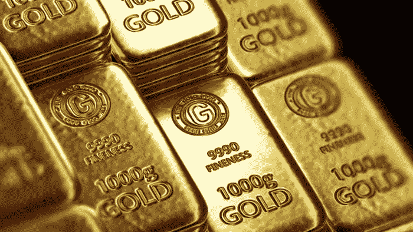
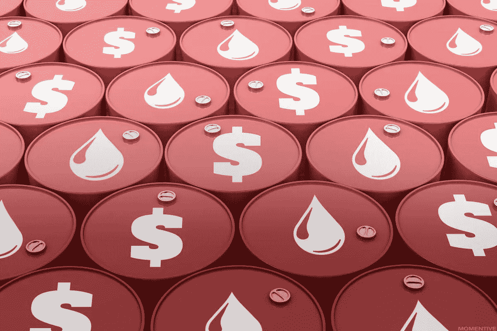
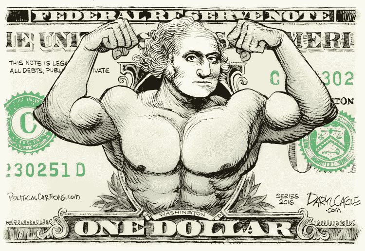
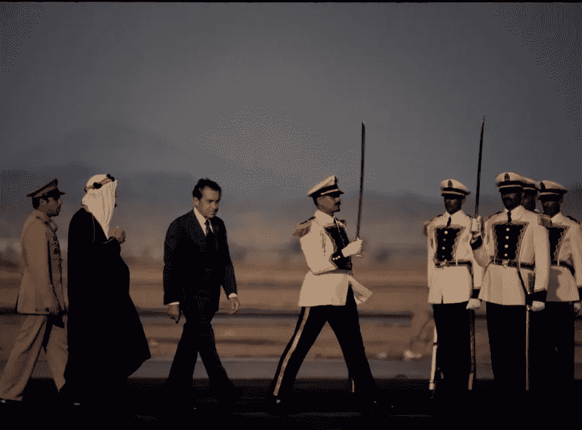
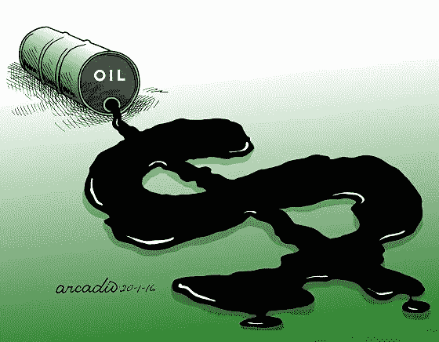
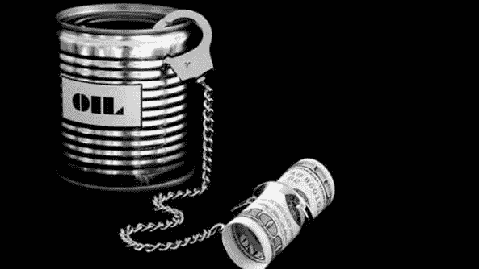
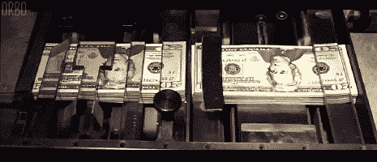
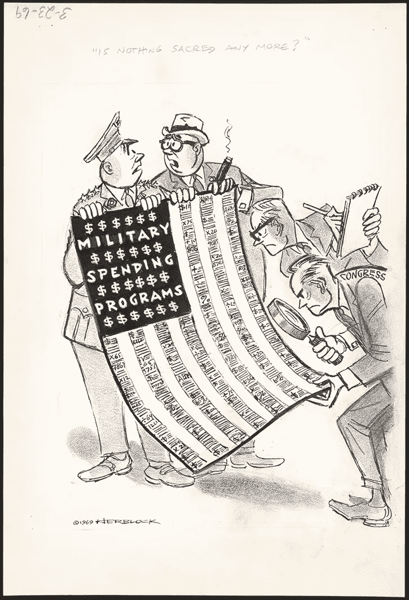
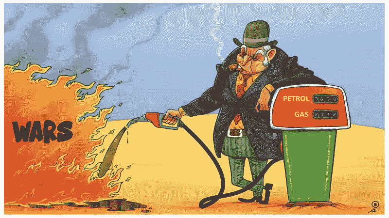

# 美元的故事:进入“石油美元”体系

> 原文：<https://medium.com/coinmonks/the-u-s-dollar-tale-entering-the-petrodollar-system-620c56211825?source=collection_archive---------1----------------------->

## *第二部分介绍*

在上一篇文章中，我们简要介绍了现代石油美元体系的背景内涵，并介绍了一种美元由黄金支持的体系——这是全球领导人在第二次世界大战最后几天通过布雷顿森林会议在 T4 做出的安排。

随着时间的推移，庞大的政府支出变得非常不可持续；这种说法在很大程度上是由所谓的“**福利国家**”的巨大成本推动的:这一政策，特别是美国，采取了“*【无休止的战争】的必要性，以使这一体系得以继续。*

*但正如我们所知，世界各国开始指责美国虚张声势，认为它无力偿还巨额债务。于是**尼克松冲击**正式标志着*布雷顿森林*时代的结束，将世界抛进了经济机制的新篇章:*

*“**石油美元体系**”。*

# *石油美元体系 101*

**

*我们将使用以下语句来定义石油美元:*

> **"* ***石油美元是西方银行里每一笔美元存款，都来自石油销售——石油以美元定价"****

*尽管简单地肯定了石油换美元，但石油美元体系有着深刻的复杂性，这一特征被设计得很好，以防止公众理解其机制。*

> *“美国人民不了解我们的银行和货币体系，这很好，因为如果他们了解，我相信在明天早上之前就会发生一场革命。”*
> 
> *―亨利·福特*

# *石油美元的崛起*

**

*Illustration by Daryl Cagle — [Cagle Cartoons, Inc.](http://www.caglecartoons.com/)*

*接近 20 世纪 70 年代末时，布雷顿森林体系显然已接近尾声；在这种紧张和担忧的气氛中，**亨利·基辛格**——*尼克松总统时期的美国国务卿*——很清楚布雷顿森林协定的崩溃会导致**美元需求的下降**，导致华盛顿全球贸易和影响力霸权的丧失。*

**秘书*与**沙特王室**，*基辛格*举行了多次会议，然后想出了一个*绝妙的主意*:*

## *用美国“支持、支持和干预对沙特的援助以换取他们的油田”的承诺取代金本位制*

**

*President Nixon received by King Faisal bin Abdulaziz Al Saud*

*沙特王室看到这些武器时心里很清楚:他们非常愿意接受武器，而且基本上“T2”保证“T3”庞大的美国军事机器将阻止对沙特王国的任何攻击，特别是来自邻国“T4”以色列的攻击，以色列是沙特王国自 20 世纪 50 年代末以来一直与之交战的敌人。*

 *[## 阿拉伯-以色列战争(消除歧义)-维基百科

### 阿以战争通常是指阿拉伯国家和以色列之间的冲突。

en.wikipedia.org](https://en.wikipedia.org/wiki/Arab%E2%80%93Israeli_War_%28disambiguation%29)* 

*沙特皇室抓住了这个机会，但他们不是傻瓜:*

**自然，他们想知道所有这些美国军事力量将花费多少……**

> *美国到底想要什么来换取他们的武器和军事保护？*

*美国人列出了他们的条款，乍看起来相当简单:*

1.  *沙特人必须同意只用美元为他们所有的石油销售定价(事实上拒绝用除美元以外的其他货币支付)；*
2.  *沙特阿拉伯将会开放其剩余的石油收益投资于美国债券。*

*美国政府出色地执行了一项计划，足以推动他们在未来几十年内进入经济平流层。*

*该协议于 1974 年 6 月 8 日在 T21 正式生效。美国人做了聪明的计算，因为在接下来的几年里，许多其他产油国也想参与这项交易。*

*快进到 1975 年，石油输出国组织的所有产油国都同意用美元来为他们的石油定价，并持有美国政府的债券，以换取美国政府的慷慨出价*

* [## 主页

### 石油输出国组织(石油输出国组织)是一个政府间组织石油需求供应市场…

www.opec.org](https://www.opec.org/opec_web/en/) 

尼克松和基辛格成功地在失败的布雷顿森林体系和新的石油美元体系之间架起了桥梁。全球对美元的人为需求不仅会保持不变，而且还会因全球对石油需求的增加而飙升，因为石油是经济技术发展的卓越商品。

## 如果没有严格的金本位制的约束，美国的货币基础可以以指数速度增长。

毫不奇怪，美国在波斯湾的大部分地区保持着重要的军事存在，包括以下国家:巴林、伊拉克、科威特、阿曼、卡塔尔、沙特阿拉伯、阿拉伯联合酋长国、埃及、以色列、约旦和也门。

> “我在此发现，沙特阿拉伯的防御对美国的防御至关重要”
> ——富兰克林·罗斯福总统

一个新的时代开始了。* 

# *新石油美元体系的好处*

**

*石油美元的举动现在可以被认为是近年来政治记忆中最辉煌的地缘政治和经济战略之一。*

*今天，几乎所有的全球石油交易都以美元结算。*

*当一个国家没有美元盈余时，它必须制定一个获得美元的战略，以便购买石油。*

*获得美元的一种方式是通过 ***外汇市场***——将本国货币兑换成美元。然而，这不是一个可行的长期解决方案，因为它的成本太高:许多欠发达国家和新兴国家的货币很少疲软，也没有竞争力，很难与美元的“力量”相匹配。*

*许多国家转而选择了与美国的出口导向战略:用他们的商品和服务换取美元，以便在市场上购买石油。*

**

*因此，石油美元体系至少给美国带来了三个直接的好处:*

*1)它增加了全球对美元的需求:对美元的需求越多，对生产者越有利。*

*像所有现代发达经济体一样，美国的大部分基础设施都是围绕使用基于石油的能源供应建立的。*

*对生产者来说，主要需求意味着主要收入:现在，随着对石油的需求上升，所有石油都以美元定价，我们可以清楚地看到它的导向:对美元的需求呈指数增长；*

***2)** **它让美国有能力用一种它可以随意印刷的货币购买石油** — *这一点尤为重要*:这与对美元需求的上升密切相关——这种对货币的“人为需求”让美国可以“T25”随意印刷美元，然后用来购买现实世界的资产和服务。*

*由**定律的*供求*和**应用于货币供给增加:*

## *随着时间的推移，货币供应量的增加会导致货币价值下降*

*…一种叫做**膨胀**的现象，在我之前的文章中有更详细的解释:*

* [## 通货膨胀的幽灵

### 财富的“潜在”敌人——金融知识 101

medium.com](/the-capital/the-spectre-of-inflation-770f9ef8369d) 

*关键要点:*

> **——如果你多印了***和* ***的商品量不变*** *在印了货币的关系中，* ***户会有更多的现金*** *和更多的钱* ***花在商品上*** *如果有更多的钱追逐同样数量的商品，企业就会抬高价格”。**** 

*****3。它增加了全球对美国债务证券的需求:**石油美元体系最辉煌的一面是要求产油国将其超额石油利润投入西方银行的美国债务证券。***

***这个系统后来被称为**石油美元回收**，由*亨利·基辛格*创造。***

*** [## 关于石油美元你应该知道什么

### 石油美元是向石油出口国支付的商品销售美元。简单地说，就是…

www.investopedia.com](https://www.investopedia.com/terms/p/petrodollars.asp#toc-petrodollar-recycling) 

通过他们专门使用美元进行石油交易，然后将他们的超额利润存入美国债务证券，石油美元体系允许美国继续疯狂购物，而他们的消费能力几乎没有限制，这是一种 T42 式的无限货币故障。

尽管好处显而易见，但石油美元的回收过程既不寻常又不可持续。它扭曲了他们对政府债务的真实需求，这使得美国政府得以维持人为的低利率，事实上使得国际市场上的所有参与者都对这些人为的低利率“上瘾”。

整个石油支持体系提升了美元的地位，但正如我们所见，也对石油货币的负面影响负有责任。

石油体系导致美元陷入*两难*境地，多年来恶化了这个国家的地位，原因是:

*   在持续扩张的全球经济中，美国需要**运行账户赤字以维持流动性**:停止这些赤字将*减缓全球经济*并带来潜在的毁灭性缺陷，尤其是对不发达国家和新兴经济体而言；
*   持续的赤字可能会导致其他国家降低美元的价值。

这种扭曲已经进入市场，在过去的 40 年里稀释了美元的实际购买力**——一个*实验*，在这个实验中我们看到了疲软和潜在下跌的第一个信号。**

**[https://medium . com/the-capital/the-rise-and-fall-of-the-petro dollar-is-the-international-financial-system-dummy-493 a4 fb8 c 72](/the-capital/the-rise-and-fall-of-the-petrodollar-is-the-international-financial-system-doomed-493a4fb8c726)***** 

# *****外交政策:美国与外国关系的衰退*****

**********

*****这在政治上是一个相当敏感的话题，在我看来，这个话题需要得到适当的解决，以进一步澄清石油美元体系在我们历史上的影响，包括过去、现在和未来。*****

*****鉴于美国对外国的干涉主义，以及维护石油美元体系的潜在动机，我们已经看到了整个地区的社会政治不稳定，最明显的是中东地区，在过去的 60 年里，美国在这个地区的参与是稳定的。*****

***** [## 外交政策:中东-政策圈

### 美国长期以来被称为“不可或缺的国家”或“世界警察”。自从第二次世界大战…

www.thepolicycircle.org](https://www.thepolicycircle.org/brief/foreign-policy-brief-the-middle-east/) 

一系列令人厌倦的冲突，最终导致数百万人死亡，多达 24 人流离失所，被迫迁移。

我们可以看到一种模式，这种能源支持的战争系统是如何不起作用的，它导致了我们现代世界今天面临的大多数问题。

*****

> *****第 2 部分结束*****

******更新&最新消息和分析—关注我的* ***推特*** *@FilandroMi******

******链接至“石油美元的崛起”第一部分:******

***** [## 美元的故事:从开始到统治，以及他的潜在下降

### 第 1 部分-从布雷顿森林到尼克松冲击:货币霸权现在面临最终压力测试。

medium.com](/the-capital/the-u-s-dollar-tale-from-inception-to-domination-and-his-potential-fall-2d5548757260)***** 

*******了解我们的新平台**👉**【https://thecapital.io/】*******

*********[https://twitter.com/thecapital_io](https://twitter.com/thecapital_io)*********

> *********加入 Coinmonks [电报频道](https://t.me/coincodecap)和 [Youtube 频道](https://www.youtube.com/c/coinmonks/videos)了解加密交易和投资*********

# *********另外，阅读*********

*   *********[什么是融资融券交易](https://coincodecap.com/margin-trading) | [美元成本平均法](https://coincodecap.com/dca)*********
*   *********[拥护卡审核](https://coincodecap.com/uphold-card-review) | [信任钱包 vs MetaMask](https://coincodecap.com/trust-wallet-vs-metamask)*********
*   *********[Exness 评测](https://coincodecap.com/exness-review)|[moon xbt Vs bit get Vs Bingbon](https://coincodecap.com/bingbon-vs-bitget-vs-moonxbt)*********
*   *********[如何开始通过加密贷款赚取被动收入](https://coincodecap.com/passive-income-crypto-lending)*********
*   *********[BigONE 交易所评论](/coinmonks/bigone-exchange-review-64705d85a1d4) | [电网交易机器人](https://coincodecap.com/grid-trading)*********