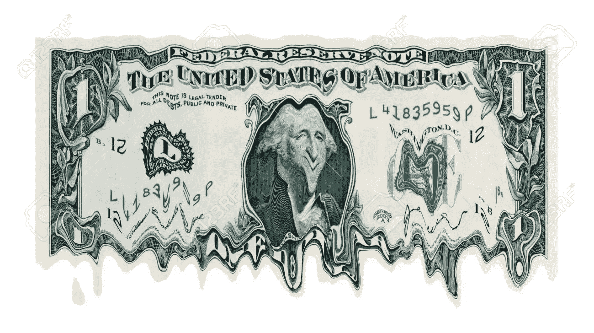
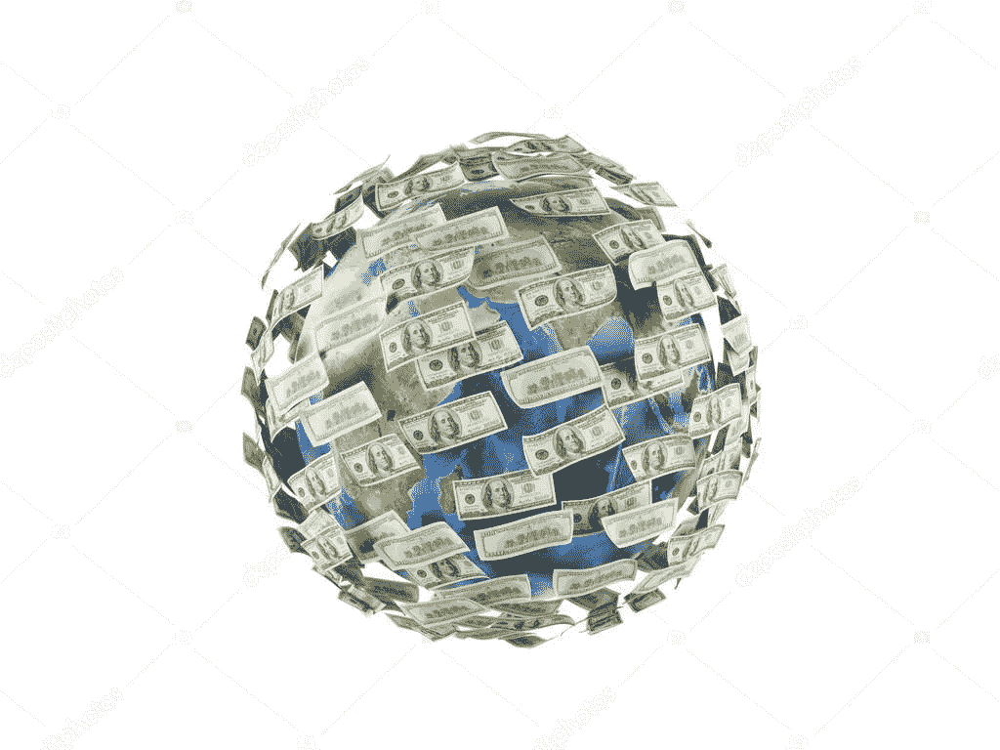
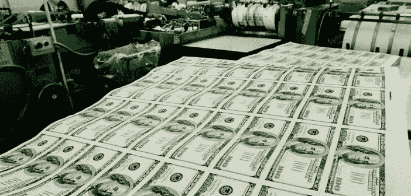

# 美元的故事:从开始到统治，以及他的潜在下降

> 原文：<https://medium.com/coinmonks/the-u-s-dollar-tale-from-inception-to-domination-and-his-potential-fall-2d5548757260?source=collection_archive---------5----------------------->

如果你从未听说过**石油美元体系**，请放心，你并不孤单:这肯定不是一个经常离开华盛顿和华尔街圈子的话题。

尽管它是我们使用的整个美元化金融体系的核心机制，但它很少成为重大新闻头条，即使有，也没有详细讨论，因为公众应该了解它的关键概念和功能。

这远远不止是说，这一体系在过去几十年中激励甚至指导了美国在中东的外交政策，并造成了一连串的副作用，影响到地球上的每一个国家。

在这一系列文章中，我们将阐明这一系统，从它的历史根源和它如何影响我们的社会开始。

# 布雷顿森林体系的失败:越南战争、繁荣和赤字支出

20 世纪的历史与令人难以置信的技术进步相呼应，这些技术进步的特点是铁路的修建、大规模的钢铁生产、机械在制造业中的广泛使用、蒸汽动力的大量使用、电报的广泛使用、石油的使用、电气化的开始以及商品的大规模生产和大型企业的运营。它还与两次大战(1914-1918 年和 1939-1945 年)造成的恐惧和绝望押韵，这两次大战造成了人类几乎从未经历过的悲剧。对于人类生活的一个重要组成部分:经济来说，这也是意义重大的一年。

1944 年 7 月，联合国货币金融会议(更普遍的说法是布雷顿森林会议)在新罕布什尔州布雷顿森林的华盛顿山酒店举行。这次历史性的聚会包括来自 44 个盟国的 730 名代表。

会议的目的是:规范饱受战争摧残的国际经济体系。

在为期三周的会议期间，成立了两个新的国际机构。

其中包括:

*   ***国际复兴开发银行*** (IBRD，后称为**世界银行**)
*   ***国际货币基金组织***(**IMF**)；
*   此外，代表们还介绍了 ***关税与贸易总协定*** (GATT，后被称为**世界贸易组织，或 WTO** 。)

更重要的是，会议上出现的另一个发展是以美元为核心的新的固定汇率制度。

## 实质上，所有全球货币都与美元挂钩。

在这一点上，我们可能会问合法的问题:

> “为什么所有国家都同意本国货币的价值与美元挂钩？”

答案很简单。

美元将与*【挂钩】(*并因此成为**)以固定汇率兑换**黄金****【35】每盎司。这种对黄金的国际可兑换性减轻了对固定汇率制度的担忧，并在各国之间创造了一种金融安全感，使其货币价值与美元挂钩。****

**该系统对采用该系统的国家来说是一种双重选择:**

1.  **美国在 1900 年代初经历了惊人的增长率，并且通过他们在一战和二战中的干预，在盟军的胜利中发挥了关键作用，它确立了其作为一个霸权力量的角色*有能力领导第二次世界大战后的**新的世界秩序——因此，在布雷顿森林体系中，各国基本上依赖于对美国经济和市场力量的**信任**；*****
2.  ***如果一个特定的国家不再对美元感到放心，他们可以很容易地将其持有的美元转换成黄金，并与他们认为合适的任何伙伴进行贸易。***

***在不忽视我们所处的历史时期的情况下，这一安排极大地帮助金融体系恢复了急需的稳定，而这种稳定遭到了战争巨大代价的破坏。***

***因此，到战争结束时，世界上将近 80%的黄金存放在美国的金库里，美元正式成为世界上无可争议的储备货币，由于布雷顿森林体系的安排，美元被认为是和黄金一样安全的。***

***这带来了对美元的巨大需求，随之而来的是由美国中央银行控制和发行的大量美元:这是一个美国难以置信的繁荣时代，增长和扩张超出了想象，并在全球范围内带来了直接和间接的利益。***

***20 世纪 60 年代末，当美国经济面临重大压力时，一切都开始发生变化:赤字开支( *=政府开支，超过收入，通过借贷而不是税收筹集的资金*)，是不可控制的，平行的，*几乎无视现状*，当时在任的总统**林登·约翰逊**，开始实现他的“**伟大社会的计划。*****

** [## 伟大的社会-维基百科

### “伟大社会”是美国民主党总统林登·B .发起的一系列国内项目

en .维基百科. orgg](https://en.wikipedia.org/wiki/Great_Society) 

它是美国的一系列国内项目，主要目标是**彻底消除贫困和种族不公正**。教育、医疗、城市问题、农村贫困和交通方面的巨额支出项目得到了资助——这是一个雄心勃勃的庞大计划，旨在消除“ ***贫困*** ”并彻底改造这个国家及其社会体系。

这个项目的投资一点也不便宜，与越南战争的巨额开支形成了鲜明对比，越南战争见证了美国从 1955 年 12 月 13 日到 1975 年 14 月 15 日的长期冲突，受到了大多数领导人和美国人的严厉谴责。

 [## 最让他们感动的越战照片

### 最让他们感动的越南战争照片是在越南战争肆虐时拍的——大约有二十年的血腥和…

time.com](https://time.com/vietnam-photos/) 

由美国创纪录的赤字开支资助的冲突，导致许多国家质疑美国的经济动机。

## 毕竟，整个全球经济秩序已经变得依赖于一个健康的美国经济。

像日、德、法、T21 这样的国家，虽然已经从二战的破坏中完全恢复过来，但仍然在很大程度上依赖金融稳定的美国经济来维持经济增长。

到 1971 年，随着美国的贸易赤字增加，国内支出飙升，华盛顿被认为的经济稳定受到了全球许多国家的公开挑战。由于美国在国内外都面临着财政压力，外国可以感觉到华盛顿日益严重的经济困难。

根据大多数估计，越南战争的花费超过了 1680 亿美元——相当于今天的 1 万亿美元。

 [## 越南战争如何影响今天的你

### 越南战争是北越对南越发动的军事战役。越南内战开始了…

www.thebalance.com](https://www.thebalance.com/vietnam-war-facts-definition-costs-and-timeline-4154921) 

鉴于美国的全球货币角色，他不断增加的债务，加上一系列糟糕的财政和货币政策导致的其他债务，是一个很大的问题。

尽管价格不菲，但国际经济界最担心的是与美国黄金储备及其债务水平 相关的 ***日益失衡，美国积累了大量债务，事实上无力偿还债权人。***

外国几乎可以预见布雷顿森林协定的终结。

需要指出的重要一点是，美国从未打算(*直接*)成为全球的黄金仓库:相反，美元兑换黄金的目的是为了在美国纸币中产生全球**信任**，因为每一美元都可以兑换成等值的黄金。

各国开始怀疑美国管理自己财政的能力，这种怀疑很快升级，导致美国真的在流失黄金。相当臭名昭著的例子是法国，它称美国虚张声势，并派出一艘战舰，奉命保护并带回法国的黄金储备。

1971 年 8 月 5 日，布雷顿森林体系不复存在:*纽约人*一觉醒来，看到停泊在纽约港的法国战舰要求运送黄金，而在华盛顿，主管总统**理查德·m·尼克松**正式“ ***关闭黄金之窗***”——这一举动被称为“**尼克松休克**”。

尼克松在向全国发表讲话时引用了他的话:

> “我已指示财政部长采取必要行动，保护美元免受投机者的冲击。我已指示国务卿康诺利暂时停止将美元兑换成黄金或任何其他储备资产……除非其数额和条件符合货币稳定和美国的最佳利益”。

The “Nixon Shock” — August 5th, 1971

一个让全世界都感到困惑的举动。

正是在这一举动之后，美元正式放弃了金本位制，被宣布为纯粹的法定货币:

## 一种货币，其价值来自其赞助国政府，通过法令发行和接受，完全基于对政府的“信任”。

通过关闭黄金窗口，华府不仅影响了美国的经济政策，也影响了全球经济政策。在布雷顿森林体系的国际金本位制下，所有的货币都是从美元的价值中衍生出来的。

美元的价值来自其黄金储备的固定价格。但是当美元的价值脱离黄金时，它就变成了经济学家所说的浮动货币。

> 所谓“浮动”是指货币不依附于任何外部事物，也不从任何外部事物中获取价值。

## 简单地说，“浮动”货币是一种价值不固定的货币。

 [## 了解与美元挂钩的最高汇率

### 货币汇率是一个国家经济的重要组成部分。汇率是…的价值

www.investopedia.com](https://www.investopedia.com/articles/forex/061015/top-exchange-rates-pegged-us-dollar.asp#:~:text=There%20are%20two%20types%20of,or%20pegged%20to%20another%20currency) 

## 像任何商品一样，美元会受到市场供求力量的影响。

当美元成为一种“T0”浮动货币时，世界上其他先前与美元挂钩的货币也突然变成了“T2”浮动货币——将整个国家的经济暴露在投机游戏中，这可能会带来灾难性的后果。

在这个浮动货币的新时代，美国的中央银行美联储终于摆脱了金本位制的束缚。

## 现在，美元可以随意印刷，而不用担心没有足够的黄金储备来支持新货币的生产。

尽管这种新发现的货币自由将减轻美国黄金储备的压力，但还有其他担忧:

*   **对美元的需求:**随着美元不能更好地兑换成黄金，*它的需求会下降吗？世界会转向另一种标准导致美国失去霸权吗？*
*   **美国奢侈的消费习惯:**在金本位制下，外国很乐意持有美国债务证券，因为它们是以黄金支持的美元计价的，但*现在呢，这是由任何有形的东西支持的，对美国的信任开始崩溃？*

需要一个迅速的解决方案，而美国不愿意失去他们的权力地位。

> 第 1 部分结束

*更新&最新消息和分析——关注我* ***推特*** *@FilandroMi*

**查看我们的新平台**👉**[**https://thecapital.io/**](https://thecapital.io/)**

**[https://twitter.com/thecapital_io](https://twitter.com/thecapital_io)**

> **加入 Coinmonks [电报频道](https://t.me/coincodecap)和 [Youtube 频道](https://www.youtube.com/c/coinmonks/videos)了解加密交易和投资**

# **另外，阅读**

*   **[最佳加密交换平台](https://coincodecap.com/best-crypto-swap-platforms) | [最佳加密交易所](https://coincodecap.com/crypto-exchange)**
*   **[购买比特币印度](/coinmonks/buy-bitcoin-in-india-feb50ddfef94) | [Pionex 评论](/coinmonks/pionex-review-exchange-with-crypto-trading-bot-1e459d0191ea) | [加密交易机器人](/coinmonks/crypto-trading-bot-c2ffce8acb2a)**
*   **[n rave 零点回顾](/coinmonks/ngrave-zero-review-c465cf8307fc) | [Phemex 回顾](/coinmonks/phemex-review-4cfba0b49e28) | [PrimeXBT 回顾](/coinmonks/primexbt-review-88e0815be858)**
*   **最佳[区块链分析](https://bitquery.io/blog/best-blockchain-analysis-tools-and-software)工具| [赚比特币](/coinmonks/earn-bitcoin-6e8bd3c592d9)**
*   **[Cloudbet 赌场评论](https://coincodecap.com/cloudbet-casino-review) | [点火赌场评论](https://coincodecap.com/ignition-casino-review)****