# 美元故事:石油、军事实力和债务螺旋

> 原文：<https://medium.com/coinmonks/the-u-s-dollar-tale-oil-military-might-the-debt-spiral-dc575a4b6e50?source=collection_archive---------22----------------------->

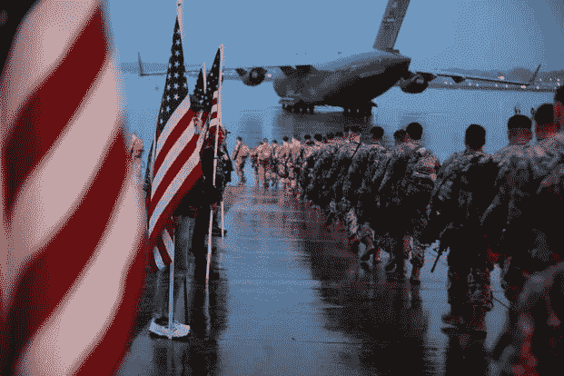

正如我们在以前的文章中了解到的，1973 年*尼克松总统*关闭黄金之窗震惊了整个世界，而这只是美国在国内和国际棋盘上领导的多年无节制支出政策的冰山一角。**

*用**石油**支撑美元，美国见证了对他的货币不可思议的需求，巩固了他作为全球储备货币的地位，给美国带来了巨大的利益。*

## *当我们看到这种制度的后果与其他国家的财富相比时，这种富裕和繁荣受到了严格的审查。*

*在本系列的最后一章中，我们将深入探讨历史，以及它是如何证明美国对外国的干预政策，无论是外交上的*还是军事上的*有时都被证明是那些国家不稳定和无法量化的损害的燃料，最明显的是在中东**和**——自 20 世纪下半叶以来就酝酿着社会和政治动荡的火药桶**。*****

# *1973 年:波斯湾紧张局势的爆发*

*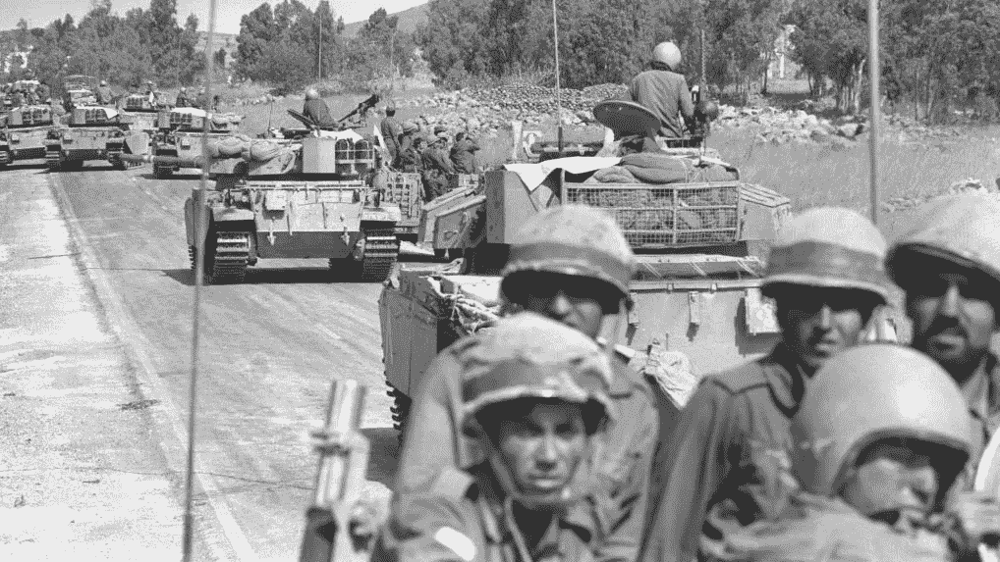*

*1973 年标志着中东历史和美国对该地区外交政策的一个重要日期:一场战争的爆发，以色列人称之为赎罪日战争，阿拉伯人称之为十月战争，这是一场全面的冲突，紧张局势在那年的 6 个月前就已经升级了。*

*1967 年****以色列**对**埃及****约旦**和**叙利亚**发动了 ***六月战争*** ，导致*以色列*占领了历史遗留的**巴勒斯坦***埃及西奈沙漠*和***

****在大约六天的时间里，以色列军队给三个阿拉伯国家的军队带来了巨大的挫败，并占领了三个半小时的领土。****

****所有这一切都发生在幕后，向阿拉伯国家提供武器的苏联和支持以色列的冷战政治影响着这场战争，自 1962 年古巴导弹危机以来，这两大阵营第一次走到了军事冲突的边缘。****

****六年前，埃及和叙利亚【叙利亚】决定发起双线协同进攻，以夺回他们在 1967 年失去的领土:一个根据 1973 年 1 月签订的秘密协议建立的共同阵线，将两个阿拉伯国家的军队统一在一个指挥下。****

****为了让以色列人措手不及，埃及人和叙利亚人决定对赎罪日发动袭击，这一天是一年中唯一没有广播和电视的日子，商店关门，交通也停止，作为宗教仪式的一部分。****

****这个假期适逢 1973 年 10 月 6 日星期六，下午两点刚过，埃及军队和叙利亚军队带着先进的苏联武器对以色列发起了两线攻势:****

*   *****埃及*军队南渡**苏伊士运河**，宣称胜利拿下了 ***巴列夫防线*** ，运河东岸的一系列防御工事；
    -当*叙利亚*在北部前线，越过“**紫线**”*(1967 年停火线)*并设法占领赫尔蒙山顶上的一个关键战略点。****

****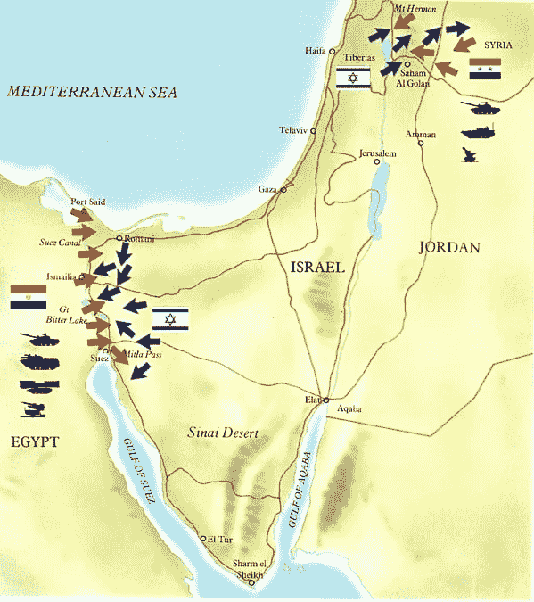****

****尽管伤亡和损失如此惨重，以色列还是调动了几个装甲师，将叙利亚逼退，推进到距离大马士革不到 35 公里的地方，并在 10 月 16 日——就在战争开始后 10 天——成功突破了埃及和叙利亚的防线，到达了开罗郊区附近****

****尽管以色列在军事上取得了进展，但是阿拉伯联军进行了顽强的抵抗，导致战斗陷入僵局。****

# ****武器油****

****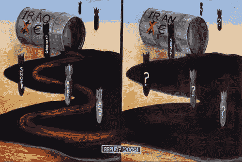****

****他把*的阿拉伯人*逼得走投无路，决定使用不同的策略——**石油**。
在**石油输出国组织(石油输出国组织)**的领导下，产油国决定 ***将其石油产量减少 5%***——承诺此后每月保持减产，直到*以色列*部队完全撤出 1967 年*6 月*战争期间占领的所有*阿拉伯*领土，并恢复*巴勒斯坦*人民的合法权利。****

****这一举动可以被视为“*核选择*”，事实上引发了一场重大的**石油危机**——这在世界各地引发了冲击波，并导致“*黑金*的价格飙升。****

****美国也未能幸免于应对这一举动的后果:他们被迫实施禁运，停止了对该国的石油供应。****

****石油产量和供应量的减少导致了世界范围内的价格上涨，导致美国重新评估其对战争的支持。****

# ****“第一次石油危机”与保护重要供应****

****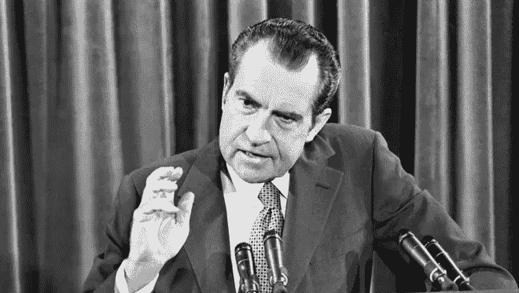****

****President Nixon in 1973****

****在接下来的 1973 年*的**【石油冲击】之后，总统 *Richard Nixon* 警告美国公民,“美国军事干预以保护该地区至关重要的石油供应”的可能性很大。这次讲话标志着美国首次正式承诺在中东部署军队，明确原因是保护美国的石油利益。*******

******在 1973 年*石油禁运后，随着*美国*社会动荡*的展开，并目睹油价上涨近 **300%，**从每桶**3**美元(19 美元/立方米)到 3 月全球每桶近**12**美元(75 美元/立方米)********

*******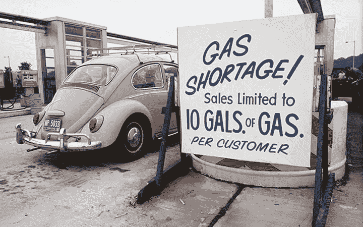*******

*******在这种深刻的*动荡的气氛中，1980 年 3 月 1 日，*新政府——由总统 ***吉米·克瑞特*** 领导——宣布成立**快速部署联合特遣部队(RDJTF)**——旨在维持*海湾*的地区稳定，保护美国的利益。特遣部队随后*演变为*一支独立的部队，被称为**美国中央司令部(USCENTCOM)** ，负责*中东*和*中亚地区*——在 *1983* 。*********

*****这一预防性举措导致了美国在西亚各地狂热地建立军事基地，这一过程可以被视为美国军事力量对宝贵的黑金的支持。*****

# *****911:回荡在中东的战鼓*****

*****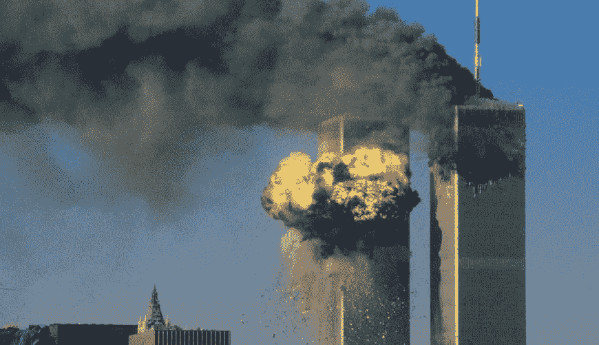*****

*****2001 年 9 月 11 日，美国与中东的关系将永远改变。*****

*****继纽约市、华盛顿特区发生数千人丧生的悲惨、可怕事件后。， ***尚克斯维尔******宾夕法尼亚*** &一架*美国航空公司的 77 号航班*撞上了 ***五角大楼***——国防部长**唐纳德·拉姆斯菲尔德**开始命令他的手下制定对伊拉克进行打击的计划，其领导人**萨达姆·侯赛因**——被怀疑利用恐怖组织**策划了这次袭击*******

*****2001 年 9 月 12 日**，在没有任何不利于**伊拉克**的证据的情况下，国防部长拉姆斯菲尔德向总统**乔治·w·布什**提出，伊拉克应该是“*反恐战争第一回合的主要目标*”布什和他的其他顾问，包括国防部副部长保罗·沃尔福威茨，强烈支持将伊拉克纳入他们的攻击计划。*******

*****在布什总统和英国首相托尼·布莱尔 的一次会议之后，立即进攻伊拉克的计划被制定出来——导致了 2001 年 10 月 7 日 [**“持久自由”行动**](https://en.wikipedia.org/wiki/Operation_Enduring_Freedom#:~:text=Operation%20Enduring%20Freedom%20(OEF)%20was,Taliban%20had%20begun%20in%20Afghanistan.) 和美国军队在阿富汗山区的部署**。*******

*******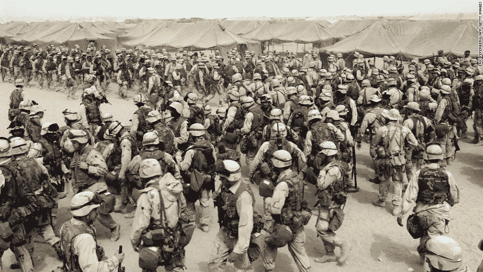*******

*******U.S. soldiers deployment in Afghanistan during operation “Enduring Freedom”*******

> *******“伊拉克仍然是……中东石油流向国际市场的不稳定因素。萨达姆·侯赛因也表现出威胁使用石油武器和利用自己的出口计划来操纵石油市场的意愿。这将展示他的个人权力，提升他作为泛阿拉伯领导人的形象……并迫使其他人解除对他政权的经济制裁。美国应该立即对伊拉克进行政策评估，包括军事、能源、经济和政治/外交评估。然后，美国应该与欧洲和亚洲的关键盟友以及中东的关键国家制定一项综合战略，重申对伊拉克政策的目标，并恢复关键盟友的团结联盟。”*******

*******这是一场大规模战争的开始，在 2020-2021 年正式撤军之前，美国一直是该地区的积极参与者。*******

# *******萨达姆和石油欧元的威胁*******

*******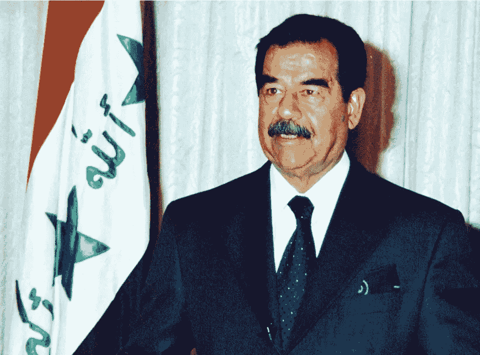*******

*******一个可以被视为触发美国对伊反应的举动是 2000 年 9 月的一次会议上出现的所谓讨论，在那次会议上，萨达姆指示他的政府内阁以欧元交易石油出口；当他在 2000 年 10 月决定不再使用美元时，这一举措很快就被正式化了——使用 1995 年克林顿总统的政府创造的坡道，如联合国石油换食品计划。*******

******* [## 石油换食品计划-维基百科

### 联合国于 1995 年(根据联合国安全理事会第 986 号决议)设立的石油换粮食计划(OIP)…

en.wikipedia.org](https://en.wikipedia.org/wiki/Oil-for-Food_Programme) 

**萨达姆**还将伊拉克的***100 亿美元*** 储备基金 ***从美元兑换成欧元***；尽管从总体上看，这一进步并不具有非常重大的经济意义，但对美国来说，它代表了对使用美元作为交易货币的直接挑战。

到 2002 年*，萨达姆已经完全转变为石油欧元——本质上是抛售美元，但真正的转折点是萨达姆决定**增加向非美国石油公司发放石油合同的数量**——最明显的是:*

*   *法国石油巨头道达尔公司赢得了 34 亿美元的 Bin Umar 项目和伊拉克南部 Majnoon 大油田的开发权；*
*   *中国 **CNPC *【中国石油天然气集团】*****CNOOC*****【中国海洋石油总公司】*****中石化**与巴格达签订石油合同，争夺该国最大的油田，170 亿桶的超级巨头鲁迈拉油田；*
*   *俄罗斯 **ROSFNET** 、 **LUKOIL** 和 **GAZPROM** ，在纳杰夫和穆萨纳省 8000 平方公里的土地上拥有特许权；*
*   *以及其他主要石油巨头，如皇家壳牌石油公司、荷兰皇家壳牌石油公司、马来西亚国家石油公司、马来西亚国家石油公司和马来西亚国家石油公司。*

**这应该让我们更广泛地了解* ***地区内利益*** *的大小。**

*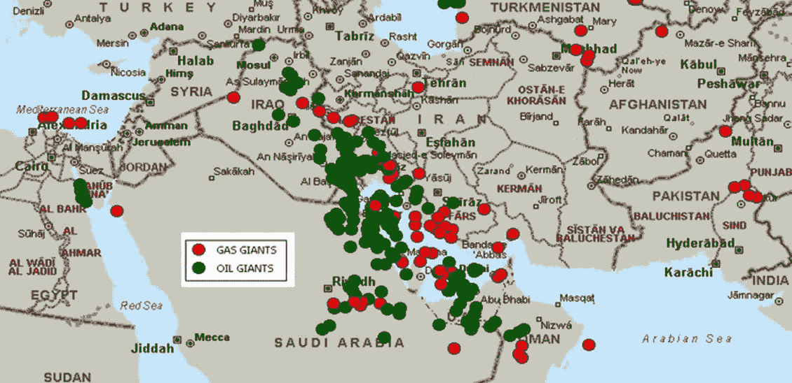*

*不过，俄罗斯提出了一个令人信服的理由:尽管石油可能被视为莫斯科在伊拉克利益的主要驱动力，但另一个需要考虑的重要因素是金融方面——同时不要忘记事实发生的历史时期:冷战时代。*

*两伊战争期间，巴格达因苏联时期的武器销售欠莫斯科 70-80 亿美元，更重要的是，俄罗斯甚至在石油期货合同中获得了巨额资金。*

> **作* ***萨梅尔·谢哈塔****——当代阿拉伯研究*中心*的一位*中东*专家在*华盛顿*的一次采访中谈到这一情况时说:**
> 
> *“俄罗斯、中国、法国在伊拉克石油工业中拥有最大的利益。一旦萨达姆下台，一切都变得无效，没有任何法律权威来执行这些要求。”*

*如果解除对伊拉克的制裁，俄罗斯和法国、中国将会在未来的石油合同中获利数十亿美元。*

*2005 年*通过的*伊拉克宪法*建议石油归所有伊拉克人所有，但是并没有明确规定其财富如何分配。为了决定资金将如何分配，2007 年*起草了*国家油气法*。然而，各种草案仍然没有解决产油和非产油地区之间的争端，九年后该法律仍在等待议会批准。***

在所有这一切的中间，石油工业继续在一个复杂的框架中运作，对宪法和法律的不同解释可以追溯到 2003 年之前。随着国际公司通过一系列许可协议进入巴士拉和基尔库克周围已开发的油田，产量有所增加。

我们在这里可以清楚地看到一种模式——这种描述显然与华盛顿支持的叙述相冲突，因为这些陈述清楚地反映了:

> “美国觊觎伊拉克油田的想法是一种错误的印象。我非常渴望和平。那是我所渴望的。和伊拉克人民的自由。我不喜欢一个为了让独裁者在位而通过酷刑和谋杀来压迫人民的制度。这让我深感不安。因此，伊拉克人民必须清楚地听到这一点，这个国家从来没有任何征服任何人的意图。”
> 
> *(美国总统布什)*

尽管华盛顿的精英们坚决否认他们的意图绝非单纯，但没过多久就出现了反对者。反战示威充斥了几乎每个美国城镇的公共广场。

但是后来真正引人注目的是*高层个人*的直言不讳的承认，比如**将军约翰·阿比扎伊德**，他在伊战期间是美军司令部的前指挥官，在 2007 年 10 月斯坦福大学举行的一次题为“*招致灾难:为石油、水和一个健康的星球而战*”的圆桌讨论会上说:

> “当然(伊拉克战争)是关于石油的，我们不能否认这一点。”

前 ***美国大使*** ，**约翰波顿**在 2011 年*10 月 22 日*福克斯新闻频道的一次采访中公开承认，美国在**中东**打的多场战争都是为了确保石油供应。谈到美国与中东的冲突，博尔顿说:

> “关键的石油和天然气产区，我们打了这么多仗，试图保护我们的经济免受失去供应或只能以非常高的价格获得供应的不利影响。”

## 政府的立场响亮而明确:伊拉克战争与石油无关。******* 

# ****伊拉克战争的后果与美国对阿富汗的干预****

****布什政府承诺，战争和推翻萨达姆将为伊拉克人提供更好、更稳定的生活，而奥巴马总统在 2011 年底表示，美国将留下一个“*主权、稳定和自立的伊拉克*****

## ****然而，伊拉克目前的状况似乎否定了这些说法曾经拥有的任何确定感和希望，而且这种情况并不孤单。****

******阿富汗**代表了公开宣布的 ***反恐战争*** ”的另一个基石——一个关于 20 年*占领的故事，以美军于 2021 年 8 月 30 日**提前撤军而告终。*******

*******这种干预再次以“**民主精神”的名义进行，虽然从人道主义的角度来看，这种干预是有道理的，但它再次引起了人们对美国介入已经成问题的和动荡的地区的真正利益的担忧。*********

*******从地理角度来看，阿富汗具有重要的战略意义，因为它位于亚洲和西方之间的十字路口，同时也是一个被新兴经济体包围的国家，拥有巨大的石油储量。*******

## *******石油是与美元价值挂钩的主要商品。*******

*******接下来的事件就不用说了:基地组织**好战极端主义网络的崛起，一个陷入恐怖、践踏人权、无数死亡和社会经济厄运的比以往任何时候都更加不稳定的地区。*********

# *********21 世纪货币的缩影:美国债务*********

**********伊拉克*和*阿富汗*战争都与相关的基础商品——主要是**石油**——及其作为世界储备货币*的霸权地位而与美元挂钩的角色深深交织在一起。**********

*******然而，在该地区灾难性的、付出生命代价的战争之后，一个新的严酷的事实出现了:石油的确是支撑美元的主要商品，但它的整个军事部门也是如此——每当美国的利益受到质疑或损害时，这是华盛顿管理和解决其争端的强大力量。*******

*******这是一种强大的威慑力量，即使对更勇敢的挑战者来说，也会促使他们在卷入与华盛顿的争端之前三思。*******

*******这个“ ***军事力量*** 的神话伴随着 ***法定货币体系*** 的创立——继 1971 年*放弃*金本位*之后——创造了一种新的资产“形式”，是货币体系信任和稳定的体现:********

## ******美国国债，简单来说就是债务。******

******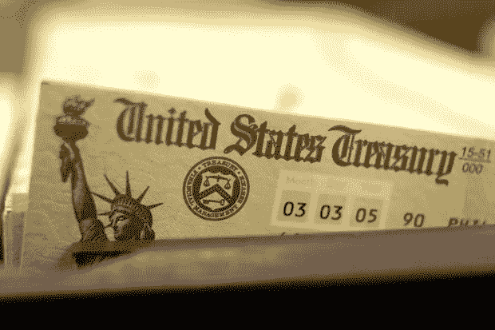******

********美国国债(简称“国库券”)**由联邦政府发行，过去(*和现在对许多人来说仍然是*)被认为是投资者可以进行的最安全的投资之一，因为**所有国债都有美国政府的“充分信任和信用”及其微调经济的能力作为支持。********

******联邦政府向消费者和投资者提供固定收益证券来资助其运营，包括:******

*   ********国库券(T-Bonds)** ，长期债券，通常期限在 20 至 30 年之间；******
*   ********国库券**，类似于国库券但期限较短，包括两年、三年、五年、七年和十年；******
*   ********短期国库券**，期限最短，发行期限分别为 4 周、8 周、13 周、26 周和 52 周，具有不同于国债和国库券的特殊特征。******

********国债**是*简而言之*、**债务工具**，其中投资者**借给美国政府**购买债券的金额。作为回报，投资者将获得利息或回报率。当债券到期时(*或到期日*)，投资者获得债券的面值。******

******整个系统基于对管理机构和国家系统核心机构的绝对、坚定的信任，我们可以看到为什么它会呈现出一些流动:******

## ******毕竟，政治阶层是否展示了他作为社会舵手的能力，解决社会问题并明智地管理资源，以促进和巩固整个国家的繁荣？******

******不管这个问题是政治的*、人文的*、哲学的、还是经济的*中的哪一个，我们可能会以一个两极化的答案结束，不可否认的是，在社会的眼中**信任**已经深深地*侵蚀*和*严重地* **质疑**。*******

******但是让我们回到主题*；我们已经确定**债务工具**向承诺在一段时间内偿还资本的实体提供资本，在本例中为 ***美国政府********

******但是******

## *****当我们描述一个实体——尽管它声称自己是“独立的”——为了“服务公众”的利益而运作，并有权随意印刷货币时，会发生什么？*****

*****答案是**通胀压力**与 ***实际购买力的逐步侵蚀*** 。*****

*****美国每年的财政赤字都超过了 T21 财政部的收入——自建国以来几乎每年都是如此。自第二次世界大战以来的那段时期是考察现代债务水平的良好起点，在此期间，美国崛起为全球超级大国。战争期间的国防开支导致了前所未有的借款，1946 年债务飙升至国内生产总值(GDP)的 100%以上。*****

*****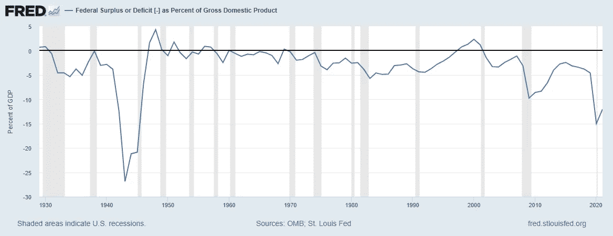*****

*****但是，再一次，**美国债务**——寄托于对他的政府的盲目信任，随后由**美国军事力量**和**在我们现代社会进化基础上的关键商品**的价格支持。*****

## *****一个不稳定的体系，它在经济中一路前行，并深刻地塑造了我们现代历史的最后 50 年。*****

# *****结束语*****

********石油/美元*** 的叙事塑造了过去半个世纪的历史，其深远的影响将对当代人和未来的一些人产生影响。*****

*****美国这个特权国家能够从石油美元体系中获益的程度是不可否认的，并且在推动和巩固美国在全球棋盘上的领导地位方面发挥了核心作用。*****

## *****一种由美元需求衍生出来的霸权。然而，这种对美元的需求并不真实。纯属人为。*****

> ******博士****Bulent Gukay****基尔大学*是这样说的:*******
> 
> *****“这种美元在石油贸易中充当全球储备货币的体系‘人为地’保持了对美元的高需求。这使得美国能够以近乎零的价格印刷美元，为增加的军费开支和消费者进口支出提供资金。可以印刷的美元数量没有理论上的限制。只要美国没有真正的挑战者，而且其他国家对美元有信心，这个体系就能发挥作用”*****

*****主要发达经济体实施的无差别政策，加上领导层对资源的严重管理不善和令人质疑的行动，造就了一个**货币巨兽**，它最终将**在自己的重压下**崩溃，**在没有有效替代方案的情况下，** **拖垮整个金融体系**。*****

*****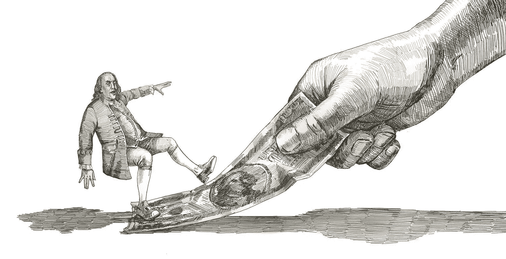*****

******更新&最新新闻和分析—关注我的* ***推特*** *@FilandroMi******

> *****来源和额外资源:*****

*   *****1973 年石油危机:
    [https://en.wikipedia.org/wiki/1973_oil_crisis](https://en.wikipedia.org/wiki/1973_oil_crisis)*****
*   *****快速开发部队:
    [https://en . Wikipedia . org/wiki/Rapid _ Deployment _ Joint _ Task _ Force](https://en.wikipedia.org/wiki/Rapid_Deployment_Joint_Task_Force)*****
*   *****美国中央司令部:[https://en.wikipedia.org/wiki/United_States_Central_Command](https://en.wikipedia.org/wiki/United_States_Central_Command)*****
*   *****入侵伊拉克背后的石油利益？
    [https://www . the guardian . com/environment/earth-insight/2014/mar/20/伊拉克-战争-石油-资源-能源-高峰-稀缺-经济](https://www.theguardian.com/environment/earth-insight/2014/mar/20/iraq-war-oil-resources-energy-peak-scarcity-economy)*****
*   *****俄法争夺伊拉克石油储备:
    [https://www.theguardian.com/world/2002/oct/06/russia.oil](https://www.theguardian.com/world/2002/oct/06/russia.oil)*****
*   *****美国入侵伊拉克背后的真正原因——w·克拉克:
    [https://www . CSE . UNSW . edu . au/~ Norman/current affairs/deepernew . html](https://www.cse.unsw.edu.au/~norman/CurrentAffairs/DeeperNew.html)*****
*   *****龙在伊拉克的影响力:石油巨头和雄心勃勃的合作计划的开始:
    [https://www . tandfonline . com/doi/pdf/10.1080/19370679 . 15 . 2023256](https://www.tandfonline.com/doi/pdf/10.1080/19370679.2015.12023256)*****
*   *****鲁迈拉油田—简介:
    [https://www . nsenergybusiness . com/projects/ru maila-Oil-field/](https://www.nsenergybusiness.com/projects/rumaila-oil-field/)*****
*   *****在伊拉克经营的国际石油公司:
    [https://www . Iraq-business news . com/list-of-international-Oil-companies-in-Iraq/](https://www.iraq-businessnews.com/list-of-international-oil-companies-in-iraq/)*****
*   *****俄罗斯在中东的军售:
    [https://www . Washington institute . org/policy-analysis/Russian-arms-sales-Middle-East](https://www.washingtoninstitute.org/policy-analysis/russian-arms-sales-middle-east)*****
*   *****地缘政治叙事和控制中东地区的目标:自然资源进入全球市场的十字路口
    *(泄露的机密文件)*:
    [https://www . the guardian . com/world/us-embassy-cables-documents/175722](https://www.theguardian.com/world/us-embassy-cables-documents/175722)*****
*   *****将债务购买为商品的戏剧性趋势:[https://www . Forbes . com/sites/Forbes tech Council/2020/08/03/百万借款人将债务购买为商品并计算其成本/？sh=7ac756e34089](https://www.forbes.com/sites/forbestechcouncil/2020/08/03/millions-of-borrowers-are-purchasing-debt-as-a-commodity---and-its-costing-them/?sh=7ac756e34089)*****
*   *****美国和他的开支问题:
    [https://www.cfr.org/backgrounder/national-debt-dilemma](https://www.cfr.org/backgrounder/national-debt-dilemma)*****

> *****加入 Coinmonks [电报频道](https://t.me/coincodecap)和 [Youtube 频道](https://www.youtube.com/c/coinmonks/videos)了解加密交易和投资*****

# *****另外，阅读*****

*   *****[币安 vs FTX](https://coincodecap.com/binance-vs-ftx) | [最佳(索尔)索拉纳钱包](https://coincodecap.com/solana-wallets)*****
*   *****[比诺莫评论](https://coincodecap.com/binomo-review) | [斯多葛派 vs 3Commas vs TradeSanta](https://coincodecap.com/stoic-vs-3commas-vs-tradesanta)*****
*   *****[Capital.com 审查](https://coincodecap.com/capital-com-review) | [港加密借贷平台](https://coincodecap.com/crypto-lending-hong-kong)*****
*   *****[如何在 Uniswap 上交换加密？](https://coincodecap.com/swap-crypto-on-uniswap) | [A-Ads 审核](https://coincodecap.com/a-ads-review)*****
*   *****[WazirX vs coin dcx vs bit bns](/coinmonks/wazirx-vs-coindcx-vs-bitbns-149f4f19a2f1)|[block fi vs coin loan vs Nexo](/coinmonks/blockfi-vs-coinloan-vs-nexo-cb624635230d)*****