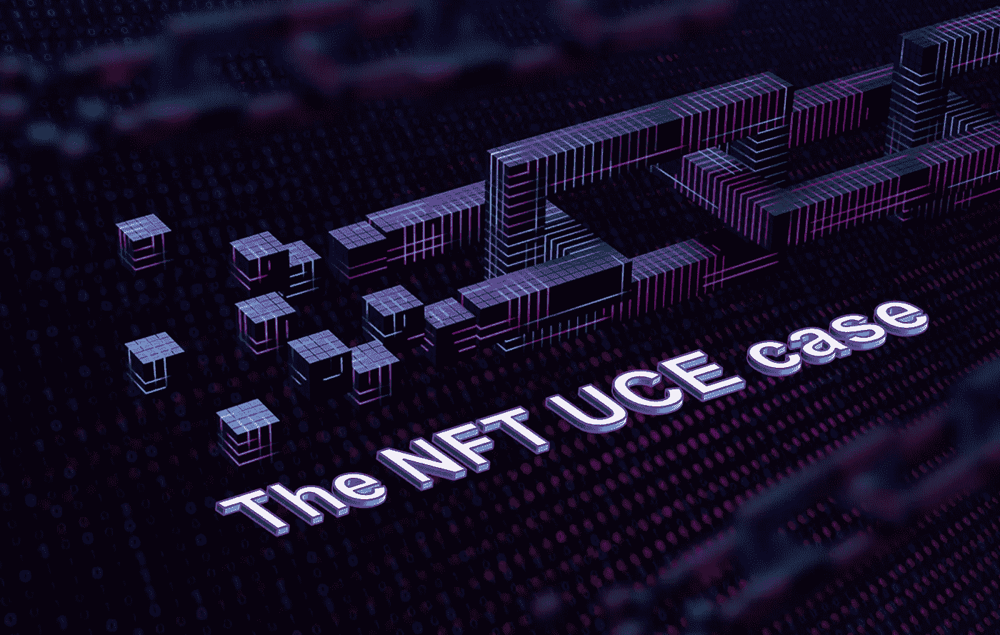

# 非正规金融服务的 UCE 案例

> 原文：<https://medium.com/coinmonks/the-uce-case-for-nfts-3711b56e784e?source=collection_archive---------32----------------------->

Source: [https://proprt.io](https://propr.io) — Property Simplified

# 我有一个 NFT 的想法…我想？

好了，你终于理解了 NFT 和它们的作用。你认为你有一个 NFT 的想法。

但是你怎么知道你的想法是否值得追求和投入资源呢？

我们将概述一个简单的框架，帮助你筛选你的想法和你遇到的任何 NFT 项目。但在我们这样做之前，有必要回顾一下最近的历史。

# 网络平行

早期的 dot.com 泡沫和当前的 web3 阶段之间的相似之处是不可否认的。

在 90 年代后期，企业盲目地在他们的名字后面加上一个 dot.com，并看到他们的股票飞速上涨。然而，只有背后有现实世界效用的企业才能在 dot.com 生存下来并繁荣发展。这些是通过技术解决现实世界问题的企业和由现实世界的资产或服务支持的企业。

历史的确似乎与今天围绕 web3 的一个非常相似的故事押韵。

除了当前加密更正和 jpeg-monkey 炒作的媒体头条，企业主们正在试图找出 web3 和令牌化模型如何让他们的企业和客户受益。

我怀疑这个问题的答案也将与历史押韵……因为当我们接近这种技术的主流采用时，在他们的 web3 平台背后有真实世界资产或服务的项目将生存并繁荣。

# 了解 NFTs

web3 的关键发展之一是 NFTs。本质上，NFT 是一种分配和验证资产(现实世界和数字资产)数字所有权的简单方法。关于非功能性金融工具是什么以及它们能做什么，已经写了很多，然而，就其核心而言，非功能性金融工具是一个分配资产所有权的数字指针。

**NFT =唯一资产所有权**

# NFT·UCE 的案子…

我们认为以下框架是分析和考虑 NFT 项目和想法的坚实基础。你考虑的任何项目都应该有 **U** 独特的内容，有参与的 **C** 社区和 **E** 过剩的需求。

**U — U** 独特的内容

物理项目或数字内容必须是唯一的，这就是 NFT 的“NF”的含义(不可替代)。这个概念虽然不言自明，但也容易被误解。如果为 NFT 开发考虑的产品或服务以前没有被创造过，或者你是唯一一个以特定方式工作的人，那么它可能被认为是独特的。

相比之下，猴子的 jpeg 图片并不独特。是的，我们可以争辩说，原创者是独一无二的，jpegs 可以通过微小的改变而变得与众不同。但另一方面，通过无数的小变化，它们可以用这些 jpegs 图像的无限版本来创建。这些微小的变化并不能以一种有意义的方式证明它们是“独特的”。

艺术家往往是独一无二的。有了受追捧的创意内容和愿意花时间与他们在一起的支持者大军，与艺术家在一起的时间可能是“独一无二的”,因此被考虑用于 NFT 创作。这就引出了第二个组成部分，社区。

**C—C**community

如果你有一个社区或团体的积极支持者，那么你就有了成功实施 NFT 的第二个关键因素。社区是 web3 的本质。

令牌化允许对 web3 生态系统(社区)中的所有用户进行奖励。粉丝是用户，创作者是用户，开发者是用户。每个人都为了共同和自私的结果而相互合作，最终服务于社区。通过匿名点对点交易，区块链和 web3 为整个社区提供了一个简化的流程。

**E — E** 过度需求

这里重点强调的是**过剩**。如果你在 NFT 框架启动后听到蟋蟀的叫声，那么实施这个框架就毫无意义。你正在考虑的 NFT 框架的基础资产必须有很高的需求。

智能合同使 NFTs 具有一个独特的功能，允许将版税返还给原始创作者。因此，过度需求创造了一个资产交易者的有机市场，为创造者提供了收入流。每次资产转手，最初的创造者都会得到报酬。

让我们看看这个框架是如何应用于像 [PROPRT](https://proprt.io) NFTs 这样的真实项目的:

# **UCE 支持非关税壁垒的案例**

[PROPRT.io](https://proprt.io) 是一个创新平台，它转变了部分房地产投资的理念，并将所有权地块转化为 NFT，收入和资本收益与基础现实资产挂钩。

这是 UCE 的例子:

**唯一—** 现实世界中的每一个唯一属性，都被划分为唯一属性 NFT。

**社区—** 有一个庞大的房地产投资者社区，他们正在寻找更高效(即摩擦更少)的房地产投资方式，而不是将现金存入银行。

**过度需求—** 部分房产因其便利性而溢价交易。每处房产都有严格的选择标准，以确保供不应求。PROPRT NFTs 通过扩展抓住了这种过度需求。

# **非功能性金融机构将继续存在**

一旦我们接受了 NFT 不仅仅是无聊的猴子和右击另存为 jpegs 文件，我们就可以开始考虑这项技术在现实世界中的实现了。

现在出现了展示 NFT 技术的优势和真实 UCE 案例的项目。

参与 web3 和区块链的发展是一个激动人心的时刻。底层技术正以令人眼花缭乱的速度发展。房地产投资者现在有了这种技术的独特实现方式，这将为其他企业考虑有效实现 NFTs 开辟道路。

在 [**proprt.io**](https://proprt.io) 以低于您想象的价格获得一份独一无二的不动产

关注我们关于 **[** [**推特**](https://twitter.com/Proprt_io) **] [** [**脸书**](https://www.facebook.com/web3property/) **] [** [**不和**](https://discord.gg/MgCe6Gzk2W)**][**[**insta gram**](https://www.instagram.com/proprt.io/)**][**[**Linkedin**](http://linkedin.com/in/frankteunissenproprt)

> **加入 Coinmonks [电报频道](https://t.me/coincodecap)和 [Youtube 频道](https://www.youtube.com/c/coinmonks/videos)了解加密交易和投资**

# **另外，阅读**

*   **[西班牙 5 大最佳文案交易平台](https://coincodecap.com/copy-trading-spain)**
*   **[Pionex 双重投资](https://coincodecap.com/pionex-dual-investment) | [AdvCash 审查](https://coincodecap.com/advcash-review) | [支持审查](https://coincodecap.com/uphold-review)**
*   **[面向开发者的 8 个最佳加密货币 API](https://coincodecap.com/best-cryptocurrency-apis)**
*   **[7 个最佳零费用加密交易平台](https://coincodecap.com/zero-fee-crypto-exchanges)**
*   **[最佳网上赌场](https://coincodecap.com/best-online-casinos) | [期货交易机器人](/coinmonks/futures-trading-bots-5a282ccee3f5)**
*   **[分散交易所](https://coincodecap.com/what-are-decentralized-exchanges) | [比特 FIP](https://coincodecap.com/bitbns-fip)**
*   **[用信用卡购买密码的 10 个最佳地点](https://coincodecap.com/buy-crypto-with-credit-card)**