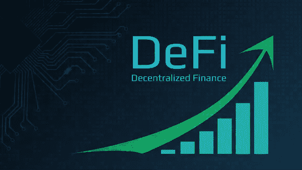
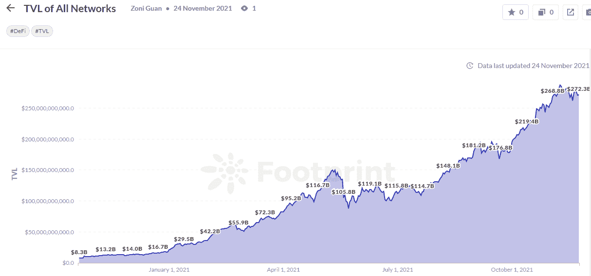
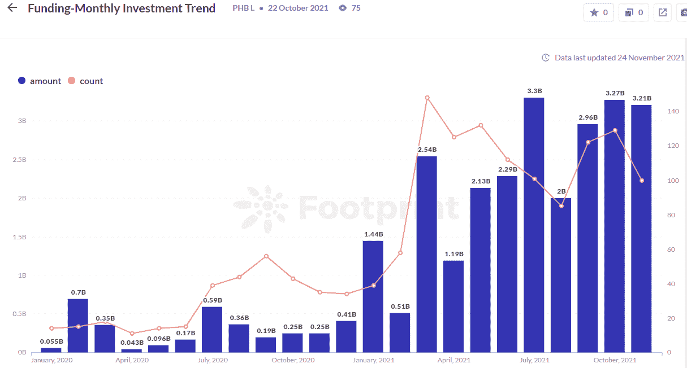
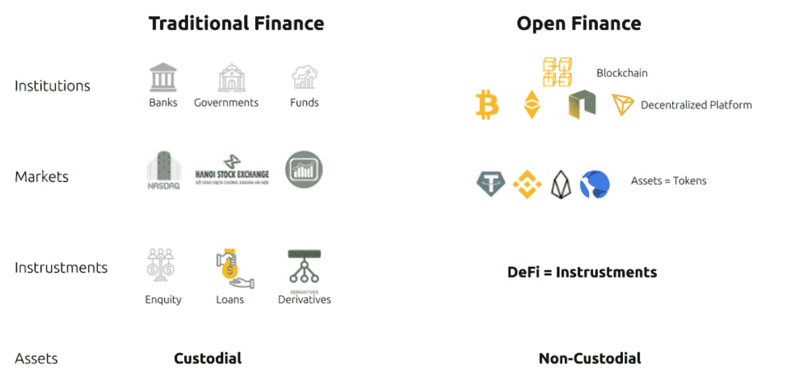
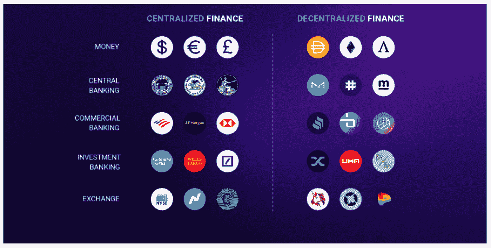
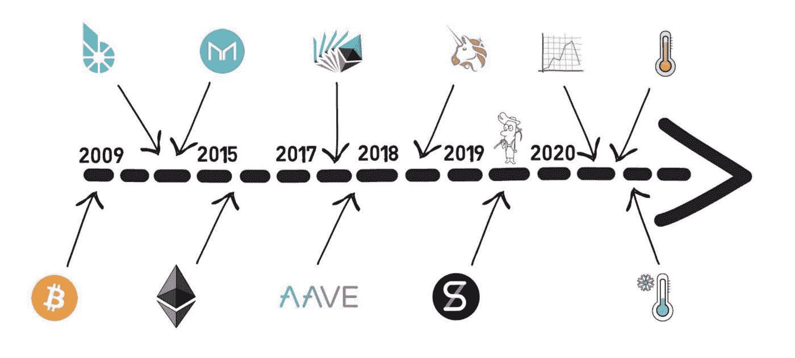
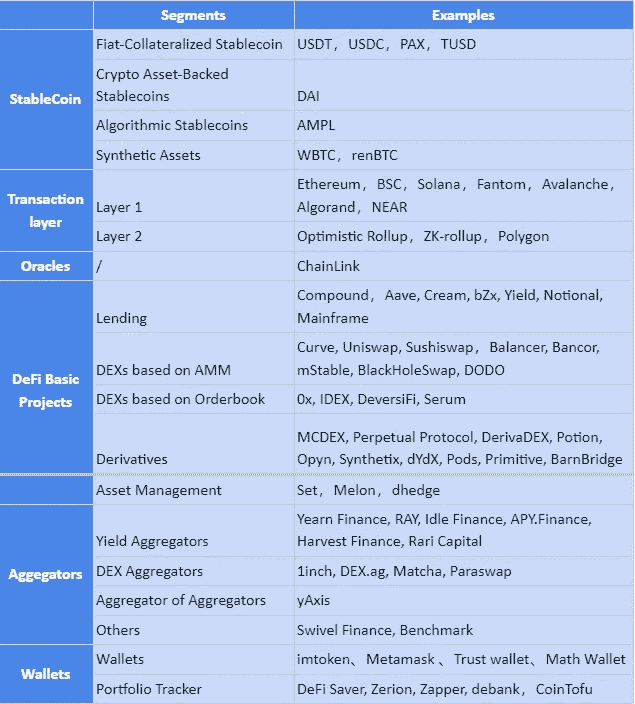

# 投资 DeFi 的终极入门指南——投资 DeFi 你需要知道的一切

> 原文：<https://medium.com/coinmonks/the-ultimate-beginners-guide-to-defi-all-you-need-to-know-to-invest-in-defi-357666d24d80?source=collection_archive---------12----------------------->

自 2019 年以来，DeFi 一直是区块链空间的热门话题。毫无疑问，DeFi 已经成为密码界的重量级人物。

根据足迹分析，截至 2021 年 11 月 23 日，DeFi 的 TVL 为 2744 亿美元，而一年前仅为 130 亿美元。

*足迹解析:* [*DeFi TVL 跨所有网络*](https://www.footprint.network/guest/chart/tvl-of-all-networks-fp-f5e4540e-244c-4753-9a1b-deec47cd0296?channel=u-DBc983) *过去一年增长了 20 倍*

DeFi 的快速发展和增长让所有参与区块链空间的人欢欣鼓舞，产生了大量的投资机构。截至发稿日，自 2021 年以来的累计融资额总计 248 亿美元，相比 2020 年的 34 亿美元，增长了 626%。

*足迹分析:*[*2021 年月度资助金额趋势*](https://www.footprint.network/guest/dashboard/fundraising-dashboard-fp-07fc83bf-b438-4ca6-973d-d608e76e4818?channel=u-DBc983)

那么这种被称为 DeFi 的强大野兽是什么呢？

## **什么是 DeFi？**

DeFi 是分散金融的缩写，也称为开放金融。随着区块链的快速发展，其应用场景正在丰富，其中金融是最有前景的行业。它实际上是指用于建立开放金融系统的去中心化协议，旨在让世界上任何人都可以参与，不受时间和地点的限制。

## **CeFi vs DeFi**

简而言之，DeFI 是将传统金融复制到区块链网络中。与传统金融不同的是，它通过区块链实现去中心化，用智能合约取代传统金融中的特权机构，用户可以以更低的成本和更高的效率享受金融服务。如下图，开放金融的各种服务在传统金融中都能找到。

*Traditional vs Open Finance*

DeFi 作为庞大的加密世界中不可或缺的一部分，以一种由大众而非中央实体控制的方式，提供许多类似于传统金融世界的主流金融服务。

*Comparison between CeFi & DeFi*

## **DeFi 的历史**

虽然比特币自 2009 年推出以来为点对点支付服务奠定了基础，但 2015 年 7 月 30 日推出的以太坊最大限度地发挥了区块链在金融领域的潜力，并鼓励新的创业公司和项目的推出，以形成一个去中心化金融的生态系统。

MakerDao 协议的上线是区块链领域金融应用的一个转折点——它允许用户用他们的钱做更多的事情，而不仅仅是在两个地址之间转账。MakerDao 是一个基于以太坊的协议，允许用户使用数字资产作为抵押品来获得 DAI——maker Dao 发行的稳定硬币，与美元价值 1:1 挂钩——为建立一个新的、开放的、无许可的 DeFi 生态系统提供了第一片乐高。

自那以后，其他智能合约纷纷上线，创造了一个日益活跃和互联互通的生态系统。

2018 年 9 月发布的 Compound 为借款人提供了一个超额抵押贷款的市场，而贷款人则从借款人支付的利息中获得收入。其流动性挖掘创新也引发了 2020 年的 DeFi 爆炸，被称为 DeFi 之夏。

Uniswap 于 2018 年 11 月推出，是以太坊上的一个去中心化交换(DEX)平台，提供了一个便捷的交易机制，允许用户在以太坊上交换各种令牌。

*History of DeFi*

从那时起，各种各样的 DeFi 应用出现了，从最基本的贷款到更复杂的合成资产、支付、保险。一个丰富的、不断发展的、去中心化的金融生态系统已经形成。

## **DeFi 的 6 个扇区**

1.  **稳定:**DeFi 生态系统的基础
2.  **事务层**
    随着 DeFi 的发展，区块链的性能问题越来越突出，尤其是以太坊。所以在交易层面，很多区块链都在积极探索解决方案，第一层为区块链的性能提升，第二层为性能提升。以太坊。
3.  **Oracle**:
    Oracle 为各种 Dapp/协议提供价格信息，是连接链上和链下世界的桥梁。
4.  **DeFi 基础项目** :
    Stablecoin、事务层和 Oracles 是构成 DeFi 生态系统中基础设施的部分，通过这些部分可以构建各种分散的应用程序。其中，DeFi 基础项目可分为 DEX、lending、衍生品等几个类别。
5.  **聚合者**
    借贷平台以及不同 dex 之间利差的存在刺激了聚合者的形成。它们根据不同平台之间的利差进行高低转换，从而增加投资者的回报。
6.  **钱包**
    它是 DeFi 生态系统最重要的组成部分之一，被认为是 DeFi 投资者使用各种 Dapps 的浏览器。

## **DeFi 知识的组成**

**- DeFi 基础知识**

*   DeFi 生态系统
*   DeFi 扇区
*   顶级 DeFi 项目

**-Defi 项目信息**

*   生态系统和类型
*   代币和经济学
*   与竞争对手的功能比较
*   排名和数字

**-行业更新**

*   筹款新闻
*   新 DeFi 项目
*   攻击新闻
*   报告和书籍

## **如何获得 DeFi 项目的信息？**

有这么多 DeFi 项目，我们如何更好更快地了解它们？可以从以下两个方面入手。

**- DeFi 信息**

*   [DeFiLlama](https://defillama.com/home) :跨链数据，项目类别
*   [Debank](https://debank.com/projects) :跨链数据，项目类别，发放日期
*   [足迹分析](https://www.footprint.network/):跨链数据、行业&项目仪表盘、可视化平台

**-行业报告&书籍**

*   ensys: [2021 年第三季度](https://consensys.net/reports/web3-report-q3-2021/#DeFi-Economy)

**-书籍**

*   [如何定义](https://landing.coingecko.com/how-to-defi/)
*   掌握 DeFi

**总结**

本文简要介绍了什么是 DeFi，以及它的一些基本生态系统和理解这些项目的方法。

接下来，我们将分享更多关于如何参与 DeFi 投资的信息，以及不同的 DeFi 项目有哪些不同的特点。欢迎大家订阅，交流。让我们一起定义吧！

> 加入 Coinmonks [电报频道](https://t.me/coincodecap)和 [Youtube 频道](https://www.youtube.com/c/coinmonks/videos)了解加密交易和投资

## 另外，阅读

*   最佳[区块链分析](https://bitquery.io/blog/best-blockchain-analysis-tools-and-software)工具| [赚比特币](/coinmonks/earn-bitcoin-6e8bd3c592d9)
*   [加密套利](/coinmonks/crypto-arbitrage-guide-how-to-make-money-as-a-beginner-62bfe5c868f6)指南| [如何做空比特币](/coinmonks/how-to-short-bitcoin-568a2d0b4ae5)
*   [比特币基地 vs 瓦济克斯](https://blog.coincodecap.com/coinbase-vs-wazirx) | [比特鲁点评](https://blog.coincodecap.com/bitrue-review) | [波洛涅克斯 vs 比特克斯](https://blog.coincodecap.com/poloniex-vs-bittrex)
*   [德国最佳加密交易所](https://blog.coincodecap.com/crypto-exchanges-in-germany) | [Arbitrum:第二层解决方案](https://blog.coincodecap.com/arbitrum)
*   [币安交易机器人](/coinmonks/binance-trading-bots-d0d57bb62c4c) | [OKEx 评论](/coinmonks/okex-review-6b369304110f) | [Atani 评论](https://blog.coincodecap.com/atani-review)
*   [最佳加密交易信号电报](/coinmonks/best-crypto-signals-telegram-5785cdbc4b2b) | [MoonXBT 评论](/coinmonks/moonxbt-review-6e4ab26d037)
*   如何在 Bitbns 上购买柴犬(SHIB)币？ | [买弗洛基](https://blog.coincodecap.com/buy-floki-inu-token)
*   [CoinFLEX 评论](https://blog.coincodecap.com/coinflex-review) | [AEX 交易所评论](https://blog.coincodecap.com/aex-exchange-review) | [UPbit 评论](https://blog.coincodecap.com/upbit-review)
*   [十大最佳加密货币博客](https://blog.coincodecap.com/best-cryptocurrency-blogs) | [YouHodler 评论](https://blog.coincodecap.com/youhodler-review)
*   [AscendEx 保证金交易](https://blog.coincodecap.com/ascendex-margin-trading) | [Bitfinex 赌注](https://blog.coincodecap.com/bitfinex-staking)
*   [最好的卡达诺钱包](https://blog.coincodecap.com/best-cardano-wallets) | [Bingbon 副本交易](https://blog.coincodecap.com/bingbon-copy-trading)
*   [印度最佳 P2P 加密交易所](https://blog.coincodecap.com/p2p-crypto-exchanges-in-india) | [柴犬钱包](https://blog.coincodecap.com/baby-shiba-inu-wallets)