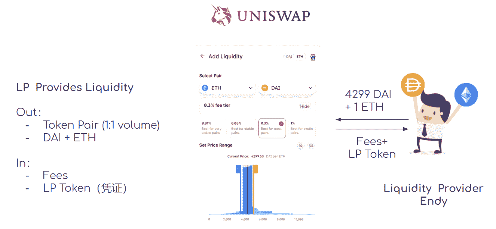

# DeFi 的最终初学者指南——如何通过产量农业用密码赚钱

> 原文：<https://medium.com/coinmonks/the-ultimate-beginners-guide-to-defi-how-to-make-money-with-crypto-by-yield-farming-b37cc212cbca?source=collection_archive---------11----------------------->

DeFi 世界正在快速扩张，随着全球金融系统继续向数字化转型，DeFi 具有非常大的增长潜力，吸引了全球 300 多万投资者的关注。因此，有必要了解资产、市场、投资方法等。

*足迹分析法-* [*TVL 通过协议*](https://www.footprint.network/guest/chart/tvl-by-protocols-latest-day-fp-73a2d3c2-a9b1-4c6f-b598-fd63f10bf3f0?channel=u-DBc983)

我们在上一篇文章中已经介绍了 DeFi 的基础知识。这一次我们将深入探讨:

1.  3 个主要的 DeFi 投资类别；
2.  投资者如何通过参与 DeFi 投资获得被动收益；
3.  DeFi 项目的当前风险；和
4.  评估 DeFi 项目的 7 个视角

# 加密货币的两种投资方式

参照加密货币的投资类型，可以分为法定型和代币型。

**基于菲亚特的投资**

*   加密货币(也称为代币)被视为股票，那么 CEX 或 DEX 就是股票交易所。
*   投资者 Alex 可以在 CEX 或 DEX 上买卖加密货币，高卖低买赚取差价，获得收益，称为“投机”。
*   在这种情况下，Alex 关心的只是加密货币的价格变化，使用 ROI(投资回报率)作为评估指标。

*来源:zoni@Footprint.network*

**基于令牌(或产量农业)**

*   当投资者长期看好某些加密货币时，最简单的投资策略是“持有”它们；而更聪明的策略是通过创造更多的被动收入来更好地利用它们。
*   例如，投资者 Alex 可以将加密货币存入借贷平台 Compound 或收益率聚合器 Idle 以获得利息收入。
*   在这种情况下，投资者 Alex 关心的只是加密货币数量的增长和通过产量农业赚取的 APY。

*来源:zoni@Footprint.network*

我们将通过介绍 3 个主要的 DeFi 投资类别来进一步讨论高产农业，这 3 个类别是:AMM DEX、Ledning 和产量聚合器。

# DEX:以 Uniswap 为例

Uniswap 建立在以太坊之上，作为分散式交易所，支持该网络上的所有加密货币。与传统的订单交换不同，它使用 AMM(自动做市商)算法，允许用户以更高的效率交换各种 ERC-20 令牌。

在 Uniswap 的 AMM 模型中，流动性提供者(缩写为 LP)需要创建一个流动性池，供交易者交换所需的代币。

包括两种情况。

对于交易者来说，他们互换。

假设 1 ETH 等于 2220 DAI，交易者 Alex 想用他的 DAI 换 ETH。他需要支付 2220 DAI 加交易费(为便于理解，本文所有场景忽略气费)才能获得 1 ETH。

*来源:zoni@Footprint.network*

**对有限合伙人来说，他们提供流动性。**

Endy 作为 LP 需要向流动性池提供一对两个等值的令牌(如 DAI+ETH)。作为回报，他将从交易活动中获得一部分交易费用。他还将获得一个 LP 令牌，这是提供流动性的凭证，代表他在整个流动性池中的份额。

*来源:zoni@Footprint.network*

它是如何实现自动定价的？这让我们想到 uni swap AMM 机制背后的“持续产品做市商”模式。这个模型的公式是:x*y=k，其中 x 和 y 代表各自的流动性，k 是常数。

*来源:zoni@Footprint.network*

值得注意的是，模型并不是线性变化的。事实上，订单的相对量越大，x 和 y 之间不平衡的幅度就越大。也就是说，大订单的价格相对于小订单呈指数增长，导致滑动价差越来越大。

*图:Uniswap 价格变化曲线*

在提供流动性的过程中，有限合伙人需要意识到非永久性损失。

**什么是非永久性损失？**这里有一个例子。

假设 Endy 持有 2000 DAI 和 1 ETH (1 ETH= 2000 DAI)，他有 2 个选择。

选项 1:作为有限合伙人

*   提供 2000DAI + 1 ETH 以形成流动性池的令牌对
*   当价格变化:ETH = 4000DAI(在 DEX 之外)时，套利者会以 Uniswap(更便宜)买入 ETH，以更高的价格卖给其他 DEX
*   这将导致池中 ETH 的数量减少，ETH 的价格增加，直到等于 4000DAI。(套利机会消失)
*   至此，恩迪的 LP 令牌价值 2828 戴+ 0.71 ETH，相当于持有 5657 戴。

选项 2:拿着它们

*   当 ETH 价格变为 4000DAI 时，恩迪的资产相当于持有 6000DAI。

在相同条件下，“选项 1 提供流动性”比“选项 2 仅保持流动性”少 343 DAI，即减少 5.72%。这种损失叫做非永久性损失。当 ETH 恢复 2000 DAI，这种非永久性的损失就会消失。

# 贷款:以复利为例

在 DeFi 的借贷平台中，投资者在池中提供一个加密资产来赚取利息；如果这笔存款被抵押，投资者就可以借用另一笔加密资产。目前，DeFi 的贷款平台通常使用“超额抵押”，即借款人在违约时提供价值超过实际贷款的资产。

举例。

1.  投资者 Alex 与戴一起，他不想出售，所以他把它放入资金池，作为贷款人借给有需要的人，从而赚取利息
2.  Bob 知道在 DAI 有一个很好的投资机会，但他不想出售他拥有的 ETH，所以他用 ETH 作为抵押向 DAI 借款并支付利息。
3.  在这个过程中，Alex 和 Bob 都获得了 COMP 平台令牌，这就是我们所说的流动性挖掘。

*来源:zoni@Footprint.network*

# 收益聚合器:闲置和渴望

如今，DeFi 项目正在各地涌现。投资者可能面临以下问题:

1.  太多不同利率的平台:如何选择最好的？
2.  利率总是在变化，价格也是如此:
3.  借款人可能会意外清盘，怎么办？
4.  贷款人可能需要不断改变协议以获得更好的利率，从而导致高额的汽油费
5.  投资者不可能 24 小时盯着市场。

DeFi 的收益聚合器可以以某种方式解决上述问题，其中特定资产的价值提供了一个复杂的投资策略，该策略结合了贷款、抵押和交易，以实现利润最大化。

*   空闲:

这是一个基于以太坊的协议，允许用户通过投资单一资产获得最佳利益。目前支持 Maker、Compound、dYdX、Aave、Fulcrum 等协议的金融服务。使用 IDLE 存款时，您将收到一个复杂的 APY，由您存款的代币的 APR、平台代币 Idle 和 COMP 组成。

*   渴望:

它也是以太坊上的一个协议，主要目标是为存放的代币产生最高的回报。它以程序化资产管理为特色，以部署最佳策略。

以 ETH 金库为例。

1.  投资者将 ETH 存入 ETH 金库，ETH 金库将 ETH 存入 MakerDao，作为借入 stablecoin DAI 的抵押。
2.  借入的 DAI 被存入 Curve Finance 的流动性池，以基本 apy 的形式接收 LP 代币作为回报和交易费用。LP 令牌可以被押入曲线的 CRV 标尺，以赚取 CRV 奖励。
3.  挣得的 CRV 随后被转换成 ETH，并将再次存入 ETH 金库。如此循环，直到投资者退出。
4.  投资者最终获得 ETH 结算的利息，并支付一定数额的管理费。

*来源:Finematics*

# DeFi 项目的风险

投资机会的多样性和持续增长使 DeFi 成为一项有吸引力和有利可图的投资。然而，与任何投资一样，DeFi 投资也有风险。

**智能合约:被黑(即使有审计)**

*   单一智能合同
*   基于多智能契约的协议

**协议风险**

*   骗子:提供高 APY 的协议令牌+稳定币池
*   威尔士倾销代币导致价格为零

**代币价格的波动**

*   借款:很容易被清算
*   LP:减值损失

**操作风险**

*   钱包风险:种子短语、私钥被盗的风险
*   DeFi 授权:取消对一个未使用的协议的授权&不要把所有鸡蛋放在一个篮子里

# 如何评估 DeFi 项目

投资者必须*做好自己的研究(* DYOR *)* 投资前，从以下 6 个方面入手:

1.  要问的基本问题:

*   哪种型号，在什么区块链上，审计过没有？
*   上线时，TVL、24H 用户的排名
*   是否在 coingecko、CMC 上？

2.著名发明家的筹款历史

3.项目介绍(官网+公众文章+ Github)

*   商业模式、竞争对手、差异化特征
*   有负面消息吗？考虑到媒体的中立性，关注太好的报道
*   经济模型(团队的代币分配:15%-20%以内是可接受的)
*   GitHub 的代码提交频率

4.关注价格趋势

*   短时间内暴涨？泵送的高概率
*   鲸鱼倾倒导致大量掉落的风险

5.关注极高的 APY

*   骗子吸引投资者的方法
*   小心翼翼地尝试，但要在崩溃前快跑

6.社区的活动

*   用户提问:投资者的素质
*   管理响应的态度和有效性

DeFi 为投资者提供了一个更方便的选择，作为传统投资的替代品。随着越来越多的投资者、机构、资本和开发商的进入，一个更加开放、透明和节约的金融体系有望形成。

> 加入 Coinmonks [电报频道](https://t.me/coincodecap)和 [Youtube 频道](https://www.youtube.com/c/coinmonks/videos)了解加密交易和投资

## 另外，阅读

*   [折叠 App 审核](https://blog.coincodecap.com/fold-app-review) | [Kucoin 交易机器人](/coinmonks/kucoin-trading-bot-automate-your-trades-8cf0ca2138e0) | [Probit 审核](https://blog.coincodecap.com/probit-review)
*   [如何匿名购买比特币](https://blog.coincodecap.com/buy-bitcoin-anonymously) | [比特币现金钱包](https://blog.coincodecap.com/bitcoin-cash-wallets)
*   [币安 vs FTX](https://blog.coincodecap.com/binance-vs-ftx) | [最佳(索尔)索拉纳钱包](https://blog.coincodecap.com/solana-wallets)
*   [比诺莫评论](https://blog.coincodecap.com/binomo-review) | [斯多葛派 vs 3Commas vs TradeSanta](https://blog.coincodecap.com/stoic-vs-3commas-vs-tradesanta)
*   [阿联酋 5 家最佳密码交易所](https://blog.coincodecap.com/best-crypto-exchanges-in-uae) | [简单掉期回顾](https://blog.coincodecap.com/simpleswap-review)
*   [7 种最佳购买方式 dog econ](https://blog.coincodecap.com/ways-to-buy-dogecoin)|[zepay Review](https://blog.coincodecap.com/zebpay-review)
*   [最佳期货交易信号](https://blog.coincodecap.com/futures-trading-signals) | [流动性交易回顾](https://blog.coincodecap.com/liquid-exchange-review)
*   [ng ave ZERO Review](/coinmonks/ngrave-zero-review-c465cf8307fc)|[phe MEX Review](/coinmonks/phemex-review-4cfba0b49e28)|[primex Bt Review](/coinmonks/primexbt-review-88e0815be858)
*   最佳[区块链分析](https://bitquery.io/blog/best-blockchain-analysis-tools-and-software)工具| [赚比特币](/coinmonks/earn-bitcoin-6e8bd3c592d9)
*   [密码套利](/coinmonks/crypto-arbitrage-guide-how-to-make-money-as-a-beginner-62bfe5c868f6)指导| [如何做空比特币](/coinmonks/how-to-short-bitcoin-568a2d0b4ae5)
*   [比特币基地 vs WazirX](https://blog.coincodecap.com/coinbase-vs-wazirx)|[Bitrue Review](https://blog.coincodecap.com/bitrue-review)|[Poloniex vs Bittrex](https://blog.coincodecap.com/poloniex-vs-bittrex)
*   [德国最佳加密交换机](https://blog.coincodecap.com/crypto-exchanges-in-germany) | [仲裁:第 2 层解决方案](https://blog.coincodecap.com/arbitrum)