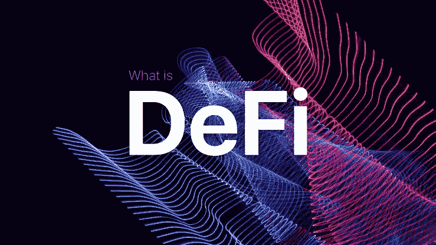
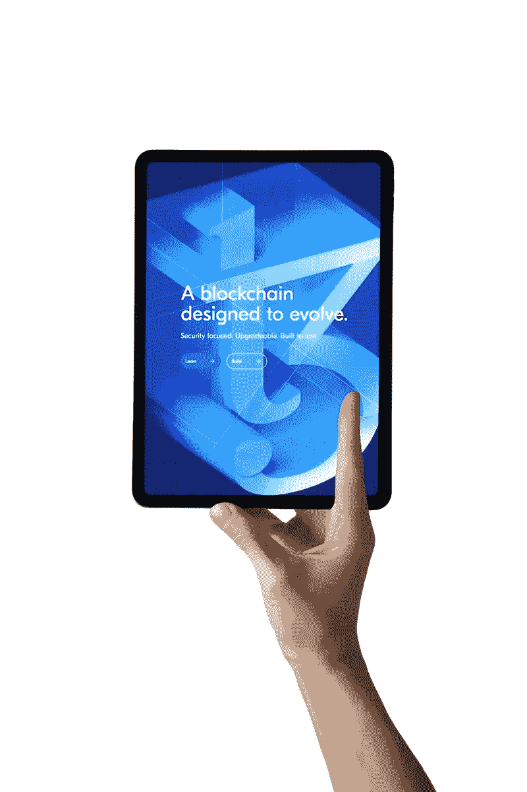
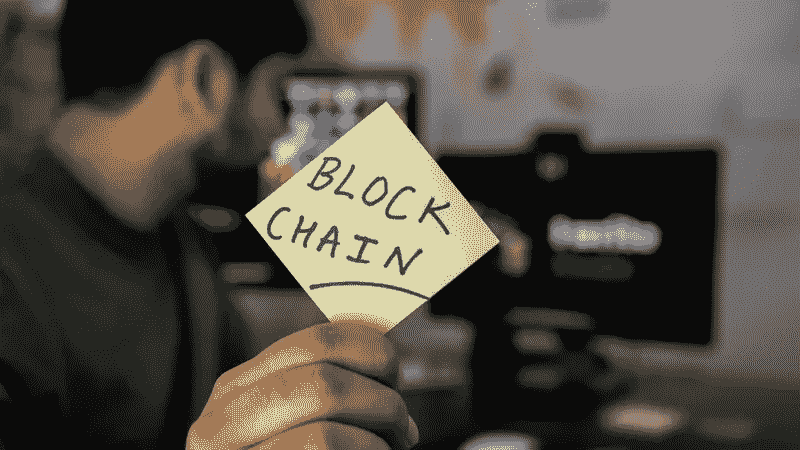

# DeFi 终极指南(第 1 部分)

> 原文：<https://medium.com/coinmonks/the-ultimate-guide-to-defi-part-1-636698ae7dfd?source=collection_archive---------36----------------------->

随着整个加密市场的下滑，所有加密货币的价格都很低，许多投资者现在正在 Defi 世界寻找机会，在那里他们押注代币以获利。

虽然进入 Defi 世界令人兴奋，但理解起来也很复杂。对于 Defi，需要了解的内容很多。

如果你了解 Defi 的工作原理，它可能是在熊市中最容易获利的方法。

但如果你在不了解 Defi 如何运作的情况下就开始投资，很容易就会迷茫，做出轻率的投资决定。

开始 Defi 之旅的最终方式是了解它是如何工作的，以及它是关于什么的。

因此，在这篇文章中，我们将评估在您开始 Defi 之旅之前您需要了解的基础知识。

## 什么是 Defi(去中心化金融)？

分散金融指的是在区块链网络上创建的金融应用生态系统。它也可以指旨在为金融服务建立一个免许可和透明的生态系统的趋势。

Defi 是一个生态系统，用户可以完全控制他们的资产，也可以通过分散的点对点(P2P)应用程序(DApps)进行交互，而无需中央机构。

Defi 的优势之一是提供便捷的金融服务，并提供独特的金融市场和产品。

## Defi 有什么优势？

传统金融依赖银行和法院分别充当中介和仲裁人。

*   Defi 应用程序不需要中介。该准则决定了可能出现的争议的解决方案，并允许用户随时保留对其资金的控制权。
*   自动化代码降低了与提供和使用这些产品相关的成本，并使财务系统更加顺畅。
*   数据被记录在区块链上，并分布在数千个节点上，使得服务的潜在故障成为不可能的尝试。
*   开放的生态系统为可能无法获得任何金融服务的个人提供了机会。
*   低收入个人也可以从更广泛的金融服务中获利，因为他们不需要支付任何中介费用。

## Defi 的潜在使用案例有哪些？

## 1.借贷

Defi 生态系统提供开放、分散的借贷服务，与传统借贷系统相比具有许多优势。

它们包括即时交易处理、无信用检查和抵押数字资产的能力。因为贷款服务是建立在公共区块链上的，这使得所需的信任最小化并提供了安全性。

区块链的借贷市场降低了金融风险，使借贷更便宜、更快捷，并能为更多的人所利用。

## 2.货币银行服务

货币银行服务是 Defi 的一个明显的用例，包括稳定的债券发行、抵押贷款和保险。

随着区块链产业的发展，stablecoins(与现实世界的资产相关联的加密资产，可以轻松地进行数字转移)的创造已经成为人们关注的焦点。

由于加密货币的价格有时会波动，分散的稳定货币现已被用作数字货币，不受任何中央机构的发行和控制。

由于传统系统涉及许多中介机构，购买抵押贷款既昂贵又耗时。

然而，智能合同降低了贷款和法律服务的成本。它还消除了对中介的需要，并允许风险在参与者之间分散，这可能导致相同服务质量的较低回报。

## 3.分散的市场

最突出的 Defi 应用是分散交换(DEX)。该平台允许用户交易数字资产，而不需要可信的交易所持有他们的资金。

交易是通过智能合约在用户的钱包之间直接完成的。这些交易所被称为自动做市商(AMMs)，使用流动性池来实现交易，而不需要直接的交易对手来完成交易。

Uniswap 和 Pancake Swap 是众所周知的例子，因为它们需要较少的交易费用和较低的维护费用。

区块链技术还可以用来分配传统金融工具的所有权。

这些应用程序将通过消除托管人和单点故障以分散的方式运行。

例如，安全令牌发行平台可以为发行者提供工具和资源，以在区块链上发行具有可定制参数的令牌化证券。

其他项目可以创造衍生品、合成资产、分散预测市场等等。

## 4.产量优化

Defi DApps 用于自动化和优化赌注、奖励池和其他计息产品的收益构成。有时产量优化也被称为产量农业。

例如，你可能会从比特币挖矿、委托美元蛋糕或提供流动性中获得定期回报。一份聪明的合约会拿走你的回报，买入更多的基础资产，并进行再投资。

通过这个过程，你的利息是复合的，往往会大大增加你的回报。尽管可以手动完成，但使用智能合同可以节省时间，因为天然气费用由收益优化智能合同的所有成员分摊。

## 结论:

如果你读到这里，说明你喜欢这个内容。你可以给它 50 次掌声来表示感谢👏。 [*关注我*](/@Bukz_dwriter) *在这里你会第一个看到我的下一次更新。*

> 加入 Coinmonks [电报频道](https://t.me/coincodecap)和 [Youtube 频道](https://www.youtube.com/c/coinmonks/videos)了解加密交易和投资

# 另外，阅读

*   [分散交易所](https://coincodecap.com/what-are-decentralized-exchanges) | [比特恩斯 FIP](https://coincodecap.com/bitbns-fip) | [宾邦评论](https://coincodecap.com/bingbon-review)
*   [用信用卡购买密码的 10 个最佳地点](https://coincodecap.com/buy-crypto-with-credit-card)
*   [加拿大最佳加密交易机器人](https://coincodecap.com/5-best-crypto-trading-bots-in-canada) | [Bybit vs 币安](https://coincodecap.com/bybit-binance-moonxbt)
*   [阿联酋 5 大最佳加密交易所](https://coincodecap.com/best-crypto-exchanges-in-uae) | [SimpleSwap 评论](https://coincodecap.com/simpleswap-review)
*   购买 Dogecoin 的 7 种最佳方式 | [ZebPay 评论](https://coincodecap.com/zebpay-review)
*   [最佳期货交易信号](https://coincodecap.com/futures-trading-signals) | [流动性交易所评论](https://coincodecap.com/liquid-exchange-review)