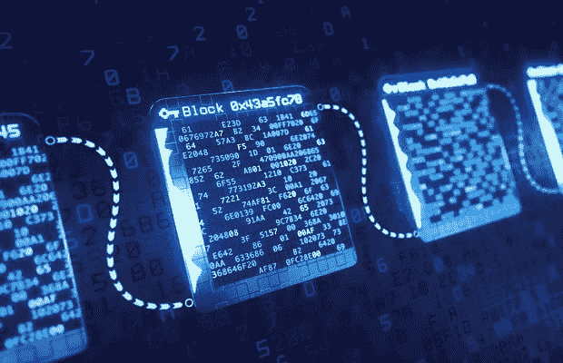
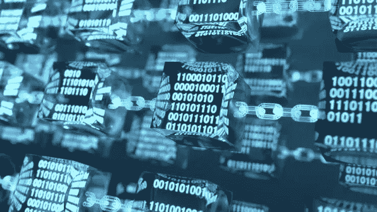
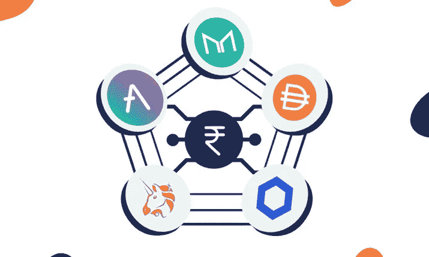

# DeFi 终极指南(第二部分)

> 原文：<https://medium.com/coinmonks/the-ultimate-guide-to-defi-part-2-b47edf9d9fb1?source=collection_archive---------53----------------------->

我们聚集在这里的原因是当前的金融体系已经过时了。查理·施雷姆

新手很难区分智能合约的优点和缺点。

讨论智能合同在 Defi 中的作用、Defi 的缺点以及 Defi 面临的挑战将会很有帮助。

## **智能合约在 Defi 中扮演的角色:**

智能合同使用计算机代码，而传统系统使用法律术语来阐明合同双方之间的关系条款。

智能合同以自动化的方式执行计算机代码，这使得许多必须人工监督的业务流程能够可靠地执行和自动化。

智能合同更快、更容易，并降低了双方的风险。另一方面，我们需要承认计算机代码容易出错和易受攻击。

值得注意的是，存储在智能合同中的价值和机密信息面临风险。

## Defi 面临的挑战是:

**1。性能差:**区块链自然比集中式系统慢，这会影响构建在其上的应用程序。Defi 应用程序的开发者需要相应地优化他们的产品。

**2。用户错误的高风险:**这对于许多人来说是一个不利的方面，因为 Defi 应用程序将责任从中介转移到了用户身上。当产品部署在区块链上时，开发将用户错误风险降至最低的产品是一个重大挑战。

**3。用户体验差:**使用 Defi 应用程序需要用户付出额外的努力。Defi 应用程序需要提供实质性的帮助，这将激励用户轮流从传统系统成为全球金融系统的核心要素。

## Defi 的风险:

即使 Defi 世界提供了诱人的利润，也有你需要知道的风险。

*   交易对手风险:请注意，当您参与某种贷款或加密贷款时，交易对手有可能不会偿还债务。
*   监管风险:如果你投资了一个智能合约，而该合约后来由于监管问题而被关闭，你可能会失去你的资金。因为有些项目的合法性很难确定。
*   令牌风险:您持有的资产具有不同的风险级别，这取决于它们的流动性、可信度、令牌智能合约的安全性以及相关的项目开发商。由于 Defi 有许多市值较小的代币，代币风险可能特别高。
*   软件风险:代码漏洞可能会破坏您所投资的智能合约的安全性。如果您连接到 Defi DApps 并授予他们某些权限，您的钱包也可能受到威胁。
*   永久损失:如果您投资于流动性池，偏离您输入的价格比率将导致您在提款时损失一些您存入的代币。

## 您可以在哪里找到 Defi 项目:

除了以太坊，现在有许多区块链拥有健康的 Defi 生态系统。几乎任何具有智能合同潜力的网络都可以托管 Defi DApps。BNB 智能链是一个受欢迎的选择，因为是 Fantom，Solana，Polkadot，和雪崩。

寻找项目和 Defi 协议需要一些研究。在线论坛和网站可以帮助你了解新的机会。但是，您必须非常小心地对待您找到的任何信息。

注意:一定要核实你读到或听到的任何项目的安全性。

## 访问 Defi 项目需要什么:

*   **一个兼容的钱包:**像 MetaMask 和 Trust Wallet 这样的钱包就能完成这项工作。保管钱包(不拥有私钥的钱包)可能不允许您连接 DApps。
*   **加密货币:**你可能需要资产的组合。例如，使用 BNB 智能链上的任何 DApp 都需要 BNB 支付您的汽油费。以太坊将需要以太(ETH)。如果你想投资流动资金池并手动下注，你需要一对等值的代币。

## 结论:

如果你读到这里，说明你喜欢这个内容。你可以给它 50 次掌声来表示感谢👏。 [*跟我来*](/@Bukz_dwriter) *在这里你会第一个看到我下一次更新的 Defi 终极指南。*

> 加入 Coinmonks [电报频道](https://t.me/coincodecap)和 [Youtube 频道](https://www.youtube.com/c/coinmonks/videos)了解加密交易和投资

# 另外，阅读

*   [如何在 FTX 交易所交易期货](https://coincodecap.com/ftx-futures-trading) | [OKEx vs 币安](https://coincodecap.com/okex-vs-binance)
*   [OKEx vs KuCoin](https://coincodecap.com/okex-kucoin) | [摄氏替代品](https://coincodecap.com/celsius-alternatives) | [如何购买 VeChain](https://coincodecap.com/buy-vechain)
*   [ProfitFarmers 回顾](https://coincodecap.com/profitfarmers-review) | [如何使用 Cornix Trading Bot](https://coincodecap.com/cornix-trading-bot)
*   [如何匿名购买比特币](https://coincodecap.com/buy-bitcoin-anonymously) | [比特币现金钱包](https://coincodecap.com/bitcoin-cash-wallets)
*   [瓦济里克斯 NFT 评论](https://coincodecap.com/wazirx-nft-review)|[Bitsgap vs Pionex](https://coincodecap.com/bitsgap-vs-pionex)|[Tangem 评论](https://coincodecap.com/tangem-wallet-review)
*   [如何使用 Solidity 在以太坊上创建 DApp？](https://coincodecap.com/create-a-dapp-on-ethereum-using-solidity)