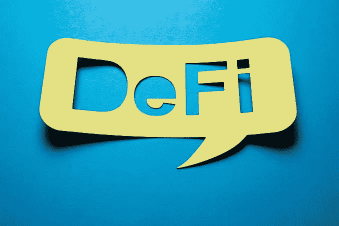
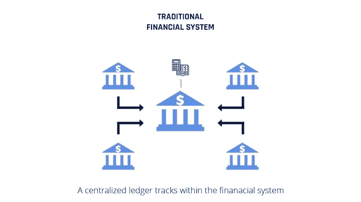
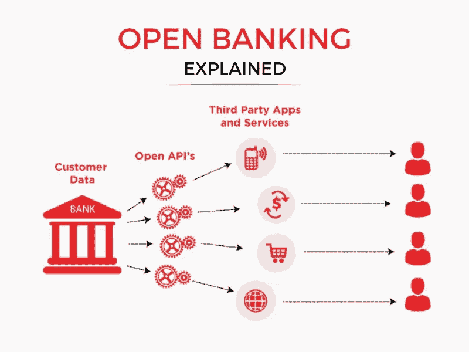

# DeFi 终极指南(第三部分)

> 原文：<https://medium.com/coinmonks/the-ultimate-guide-to-defi-part-3-dbd1720c6db1?source=collection_archive---------39----------------------->

尽管 Defi 是一个吸引人的想法，但重要的是要知道，并不是所有的事情都能通过权力下放得到改善。

在创建开放金融产品的有价值的基础之前，有必要确定区块链特征的最普遍的用例。

我在本文中解释了 Defi 与其他金融系统的不同之处。

## **传统金融与 Defi(分散金融)**

由于任何人都可以通过创建一个钱包来开始使用 Defi 服务，只要他们有一些加密货币可以投资，而不需要身份验证，因此可以说可访问性是 Defi 和传统金融之间的唯一区别。与传统的金融系统不同，传统的金融系统需要“了解你的客户”( KYC)支票。

Defi 和传统金融的区别在于，Defi 为没有银行账户的人提供了更好的金融包容性。

此外，Defi 还提供传统金融无法提供的各种服务。Defi 的服务之一是能够创造利用多个平台的尖端产品，并让消费者开发各种方法。

## Defi(分散财务)与 Cefi(集中财务)

很高兴知道，即使在加密领域，也不是所有的金融服务都是分散的。

例如，如果你选择通过像 Gate.io 和币安这样的集中交易所进行投资，你经常会把你的代币的安全性让给他们。在这种情况下，这意味着你需要信任你的资金集中的组织。

然而，他们提供的大部分服务是相似的，并且可能使用你自己可以访问的相同的 Defi 平台来执行。

CeFi 帮助你在处理你的 Defi 资产的常规复杂性中导航，它也可能提供一些关于你的基金的保证。

尽管如此，CeFi 的危险性仍然不亚于 Defi。你的需求和愿望会让一切都与众不同。放弃您在 CeFi 的部分控制权，为您提供更强的安全性，并解除您管理资金和交易的责任。

## Defi 与开放式银行有何不同？

我将从定义什么是开放银行开始关注这一点；

开放银行:是什么？

它是一个银行系统，利用开放的应用程序编程接口(API)使第三方开发者能够在传统金融机构内建立对金融数据和服务的安全访问。

从根本上说，它让金融机构转向新产品和服务。

Defi 旨在创建一个独立于现有基础设施的独特金融系统。

例如，在开放银行业务中，可以在一个应用程序中访问所有传统工具的管理，该应用程序可以稳定地提取来自不同银行和金融机构的数据。

与此同时，Defi 也可以允许管理新的金融工具和其他处理手段。

## 结论:

Defi 专注于开发独立于传统和政治机构的可靠金融服务，这将使进入更开放的金融系统成为可能。此外，它还可以阻止全球歧视、金融监控和事先审查。

如果 Defi 成功，权力可能会从中央机构转移到个人和开源社区手中。

然而，Defi 改造金融系统的能力将完全取决于它被广泛采用的程度。

如果你读到这里，说明你喜欢这个内容。你可以给它 50 次掌声来表示感谢👏。 [*关注*](/@Bukz_dwriter) *我这里你会第一个看到我的下一次更新。*

> 加入 Coinmonks [电报频道](https://t.me/coincodecap)和 [Youtube 频道](https://www.youtube.com/c/coinmonks/videos)了解加密交易和投资

# 另外，阅读

*   [如何匿名购买比特币](https://coincodecap.com/buy-bitcoin-anonymously) | [比特币现金钱包](https://coincodecap.com/bitcoin-cash-wallets)
*   [币安 vs FTX](https://coincodecap.com/binance-vs-ftx) | [最佳(SOL)索拉纳钱包](https://coincodecap.com/solana-wallets)
*   [比诺莫评论](https://coincodecap.com/binomo-review) | [斯多葛派 vs 3Commas vs TradeSanta](https://coincodecap.com/stoic-vs-3commas-vs-tradesanta)
*   [Capital.com 评论](https://coincodecap.com/capital-com-review) | [香港的加密借贷平台](https://coincodecap.com/crypto-lending-hong-kong)
*   如何在 Uniswap 上交换加密？ | [A-Ads 评论](https://coincodecap.com/a-ads-review)
*   [WazirX vs coin dcx vs bit bns](/coinmonks/wazirx-vs-coindcx-vs-bitbns-149f4f19a2f1)|[block fi vs coin loan vs Nexo](/coinmonks/blockfi-vs-coinloan-vs-nexo-cb624635230d)
*   [本地比特币审核](/coinmonks/localbitcoins-review-6cc001c6ed56) | [加密货币储蓄账户](https://coincodecap.com/cryptocurrency-savings-accounts)